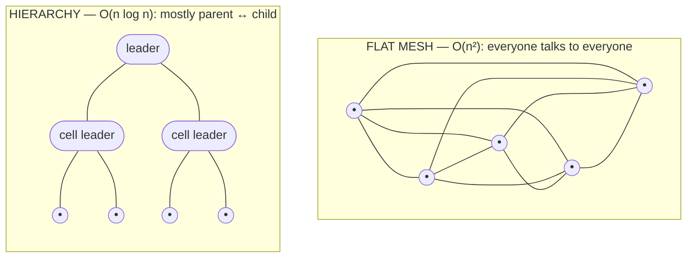
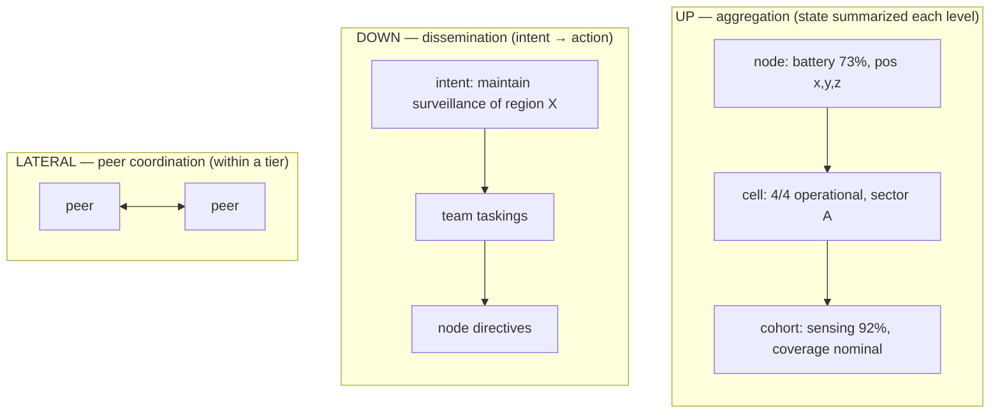

# Module 1·5 — The Big Idea: Why Peat Exists

**Goal:** understand the *argument* for Peat before the architecture. This module distills the
[Peat whitepaper](../peat/docs/whitepaper/) (`peat/docs/whitepaper/`, chapters 01–09) — the "why"
that everything else serves. Read it right after Start Here and before the architecture overview.

> **What this module is, and what it is not.** This page is a faithful summary of a *positioning and
> vision* document. The whitepaper makes an argument and reports laboratory results; it is not a
> record of shipped code. So that you never confuse the two, every capability below carries an
> explicit status label, and the performance figures are tagged for where they actually come from.

**Status labels, used on every claim in this module**

| Label | Meaning |
|---|---|
| **Shipped** | In code today, tested. You can read it in the source. |
| **In-flight** | Has an open issue, PR, or epic; partially built. |
| **Proposed** | An ADR exists in `Proposed` status; no implementation yet. |
| **Speculative** | Design discussed for teaching or in the whitepaper; not even an ADR-complete proposal, and nowhere in any repo. |
| **Thesis** | A positioning argument the whitepaper makes — a claim about the world or the market, not a software feature. |
| **Analytical** | A figure derived from a formula (e.g. counting connections), not a runtime measurement. |
| **Lab** | A number from a single-machine simulation or a small test rig, not a field deployment. |

> **Read order note.** This is numbered "1·5" because it sits between Start Here (Module 0) and the
> Architecture Overview (Module 1). If you only read one page to understand *what problem Peat
> solves*, read this one. Each idea below ends with a pointer to where it's implemented — or to the
> open issue that tracks the gap.

---

## 1. The scaling crisis — a 20-node ceiling the whitepaper calls *math, not technology*

The whitepaper opens with a striking claim **[Thesis]**: distributed multi-agent systems — autonomous
vehicles, industrial IoT, robot swarms, emergency response — consistently *plateau at roughly 20
nodes*. Demos with 10–15 work; operational deployments above ~20 get partitioned into independent
zones with no cross-zone coordination.

Read this as the paper's rhetorical premise, not a measured Peat result. The whitepaper asserts it
verbatim (`peat/docs/whitepaper/01-executive-summary.md`, `02-scaling-crisis.md`) but cites no
external study, and Peat's own largest *code-side* test rig is a 7-node failover lab
(`peat-mesh` CHANGELOG rc.37). It is a useful frame for the rest of the argument; treat the "20" as
illustrative.

The mechanism the whitepaper blames is real and worth internalizing: **O(n²) message complexity**. In
a full mesh, every node syncs with every other node, so the number of pairwise links grows as the
square of the node count.

| Nodes | Pairwise links (≈ n²) | Network impact |
|-------|------------------------|----------------|
| 10 | 100 | manageable |
| 20 | 400 | heavy load |
| 50 | 2,500 | saturation begins |
| 100 | 10,000 | network collapse |
| 1,000 | 1,000,000 | physically impossible |

**[Analytical]** These are illustrative upper bounds — `n(n-1)` ordered pairs ≈ n² — matching the
whitepaper's framing (`02-scaling-crisis.md:44`), not traffic measured on a Peat deployment.

The paper's blunt conclusion **[Thesis]**: better algorithms optimize *within* the constraint, they
do not escape it; more bandwidth shifts the wall without removing it. Compression shrinks message
*size*, not *count*; doubling bandwidth buys only about 1.4× (√2) more nodes before saturation,
because the load scales with n². If the barrier is architectural, the fix has to be architectural too.

> **Where this lands in the code.** The entire purpose of `peat-protocol`'s `hierarchy` module
> (Module 2 §2.4) and `peat-mesh`'s aggregation/routing (Module 3) is to avoid ever paying the full
> O(n²) cost. The hierarchy that does this is **Shipped**; how far it has been *scaled* is covered
> honestly in §7.

## 2. The standards paradox — the missing layer

Plenty of interoperability standards already exist, and they work:

- **Messaging / middleware:** MQTT, AMQP, DDS, gRPC, REST, ROS2.
- **Device / protocol:** Modbus, OPC-UA, STANAG 4586/4817, Matter, Thread, CAN/J1939.
- **Data formats:** JSON, Protobuf, CBOR, CoT (Cursor-on-Target), SensorThings.

The whitepaper's argument **[Thesis]**: every one of these moves *messages*, but none of them provide
*coordination*. Each assumes the coordinating logic "happens somewhere else — in your application."
None offer hierarchical aggregation of state, dynamic formation of coordinating groups, authority
delegation, or emergent capability composition as a protocol-level primitive.

```
Application: domain logic
─────────────────────────────────────────────
??? COORDINATION: hierarchical orchestration ???   ← the missing layer the whitepaper says Peat fills
─────────────────────────────────────────────
Messaging: MQTT, DDS, gRPC, ROS2
Device control: Modbus, CAN, proprietary APIs
Network: TCP/IP, UDP, BLE, LoRa
```

Legend: each row is a layer of the stack; the bracketed middle row is the coordination layer the
whitepaper argues no open standard currently occupies. The lower rows list real, widely-deployed
standards; the gap is the claim under examination.

The paper's framing **[Thesis]**: the hole is not in the standards we have — it is a layer that does
not exist as an open standard. In its absence, proprietary fleet/coordination platforms fill it,
creating lock-in and an O(N²) sprawl of one-off integration adapters across N incompatible approaches.

> **Where this lands in the code.** Peat positions *as* that coordination layer — `peat-protocol`
> (Module 2). The CoT/TAK bridge (Module 5's `peat-transport`, `src/tak/`, ADRs 020/028/029) is
> **Shipped**, and it shows Peat *bridging* existing standards rather than replacing them: a CoT
> consumer keeps speaking Cursor-on-Target while Peat carries the coordination underneath.

## 3. The hierarchy insight — the reframe

The conventional view treats hierarchy as bureaucratic overhead. The whitepaper's central reframe
**[Thesis]**: hierarchy is evolved communication optimization. Ant colonies coordinate millions;
human institutions coordinate thousands across continents — without central servers, reliable
networks, or global consensus. A team leader who tracks three group summaries instead of 24
individual states is doing this because information-processing capacity (cognitive *or* network)
cannot handle the alternative. In that sense, hierarchy *is* compression.

- **Mesh:** O(n²) — every node talks to every node.
- **Hierarchy:** O(n log n) — every node talks mainly to its parent and children.



*Same five-to-seven nodes, far fewer links once they organize into tiers. The shape is the
argument; the exact link counts are **[Analytical]**, not benchmarked (see the caution below). The
routing rule that **enforces** the tiered shape is **Shipped** (`peat-mesh/src/routing/router.rs:246,362-433,487-533`).*

**[Analytical]** This complexity comparison is structurally sound and is the design rationale for the
whole system, but it is a formula, not a benchmark — `peat`'s ground-truth model is explicit that
O(n log n) is "structurally supported … a design/analytical claim, not a runtime benchmark."

A word of caution on the headline connection counts, because a skeptical reader will check them. The
whitepaper offers two different models that disagree by roughly 10×:

- A loose depth-4 analytic model: for 1,000 nodes, mesh ≈ **500,000** connections vs hierarchy ≈
  **4,000** (`04-hierarchy-insight.md:21-22`).
- A tighter connection table the ground-truth model trusts: full mesh ≈ **9,120** vs hierarchical ≈
  **384** at scale (`05-technical-architecture.md`, whitepaper:291-293).

Both live in the same paper. Use the **9,120 vs 384** table as the defensible figure and treat the
500,000-vs-4,000 pair as the looser back-of-envelope version. The *direction* — orders of magnitude
fewer connections under hierarchy — is the durable point; the exact numbers depend on which model you
pick.

### The three information flows

This is the model to memorize, and it maps directly onto shipped routing code (Module 6):

1. **Upward — aggregation.** Raw state is summarized at each level. *"Battery 73%, pos (x,y,z)"* →
   *"4/4 nodes operational, sector A"* → *"sensing capability 92%, coverage nominal."* Each level
   gets exactly the granularity it needs.
2. **Downward — dissemination.** Intent is translated into action at each level. *"Maintain
   surveillance of region X"* → team taskings → node directives. **Higher levels say *what*; lower
   levels decide *how*.** This is Peat's framing of *autonomy under human authority*: a parent sets
   intent and constraints; the child chooses the method within them.
3. **Lateral — coordination.** Peers sync within a level (boundary handoffs, deconfliction) without
   involving the hierarchy.

The routing rule that *enforces* this is **Shipped**: cell leaders route upward, and non-leaders
cannot route cross-cell or reach the zone (`peat-mesh/src/routing/router.rs:246,362-433,487-533`). So the
up/down/lateral model is not just a diagram — the same-cell-or-leader-mediated constraint is checked
in code.



*The model to memorize. UP summarizes, DOWN translates intent into action (higher levels say **what**,
lower levels decide **how** — autonomy under human authority), LATERAL is peer sync within a tier. All
**Shipped**, and the routing rule that enforces it (cell leaders route upward; non-leaders cannot
route cross-cell) is real code (`peat-mesh/src/routing/router.rs:246,362-433,487-533`).*

> **Where this lands in the code.** Module 2 §2.4 (hierarchy / aggregation / routing) and Module 6
> Trace C (up / down / lateral). The §2.4 routing-validity snippet is the place to confirm the
> same-cell / leader-mediated rule.

## 4. Capability composition & emergence

The hierarchy does not only aggregate *status* — the design intends it to compose *capabilities*.
Nodes advertise what they can do; cells combine those into capabilities no single node has.

| Individual capabilities | Emergent cell capability |
|-------------------------|--------------------------|
| Sensor + Compute | Edge AI processing |
| Multiple sensors | Wide-area observation |
| Sensor + Actuator | Sense-and-act loop |
| Relay nodes | Extended range coverage |
| Heterogeneous sensors | Multi-spectral fusion |

The whitepaper's framing is that a coordinator should *task by requirement, not by node*: *"I need
continuous observation of sector X"* → the system allocates appropriate nodes and reallocates when
one fails. The requirement persists; the implementation adapts.

**Status — In-flight / partly shipped.** A `composition` engine is part of `peat-protocol`'s public
API (`peat-protocol/src/lib.rs`), so the building block exists. But the ground-truth audit finds **no
code or test evidence that the automatic reallocate-on-failure loop is implemented end to end**, and
`peat-protocol` is at `0.9.0-rc.28` (work in progress). Treat composition as present-but-WIP: the
capability vocabulary is real; the self-healing "requirement outlives the node" behavior is design
intent until a code path and test confirm it.

> Note on capability vocabulary, so you don't memorize a wrong list: the schema's `CapabilityType`
> enum is `UNSPECIFIED, SENSOR, COMPUTE, COMMUNICATION, MOBILITY, PAYLOAD, EMERGENT`
> (`peat-schema/proto/capability.proto`). There is **no `Weapon` type** — weapons fall under
> `PAYLOAD`.

> **Where this lands in the code.** `peat-protocol`'s `composition` module — additive / emergent /
> redundant / constraint rules (Module 2 §2.3).

## 5. Human-machine authority — *autonomy under human authority*

Peat's framing keeps humans in the loop by placing them **within** the hierarchy at the appropriate
level — not above it, not beside it. Three ideas:

- **Configurable authority boundaries.** Each level defines what executes autonomously versus what
  requires human approval. Routine operations proceed; significant decisions escalate. A
  mission-critical capability requires human approval at formation (the `CellCoordinator` gate,
  readiness ≥ 0.7) — **Shipped** as the formation check, with the broader authorization model still
  In-flight (see below).
- **Graceful degradation.** When connectivity drops, a node operates within its *last-known*
  authority until reconnection or timeout — the offline-first posture (§6) makes this possible.
- **Trust as data.** The whitepaper proposes that authority be carried as *replicated state*, so that
  delegation and revocation propagate through the hierarchy like any other document.

**Status of "trust as data" — Proposed / design intent, not shipped.** Today the code has an RBAC
`Role` enum and an `AuthorityLevel` ladder (below), but there is **no shipped CRDT-replicated
authority-delegation document**. The authorization model is explicitly deferred — `peat#941`
("authorization model deferred pending Layer-1 device identity") is open. So delegation-as-replicated-
state is a goal with an open dependency, not a working mechanism. Do not present it as built.

### Three distinct authority/role axes — keep them separate

A reader who greps the code will find three different ladders. They are not the same thing, and
conflating them is a common mistake:

| Axis | What it is | Values (as shipped) | Where |
|---|---|---|---|
| **RBAC `Role`** | Access control | `Leader, Member, Observer, Commander, Admin` (5) | `peat-protocol/src/security/authorization.rs:50-64` |
| **`CellRole`** | Capability role within a cell | `Leader, Sensor, Compute, Relay, Strike, Support, Follower` (7) | `peat-protocol/src/models/role.rs:14-29` |
| **`AuthorityLevel`** | Human-machine teaming ladder | `UNSPECIFIED, OBSERVER, ADVISOR, SUPERVISOR, COMMANDER` (5) | `peat-schema/proto/node.proto:61-67` |

Two cautions the audit surfaced: the peat README's Layer-3 text wrongly lists the RBAC roles as
"Observer, Member, Operator, Leader, Supervisor" — `Operator` and `Supervisor` are **not** in the
enum (a known doc bug, fast-win fix). And `CellRole` does include a `Support` variant — earlier
curriculum copy that denied one was wrong (it is the sixth of the seven, `role.rs:14-29`).

The whitepaper's six-level authority model is a *fourth* vocabulary — and it is whitepaper-only, not
in code:

```
Level 0 (Root):      strategic decisions, all delegations
Level 1 (Cluster):   inter-formation coordination
Level 2 (Formation): mission assignment, resource allocation
Level 3 (Group):     tactical coordination, local autonomy
Level 4 (Team):      task execution, peer coordination
Level 5 (Node):      autonomous operation within constraints
```

Legend: indentation = depth; Level 0 is the root, Level 5 the leaf. **[Speculative for code purposes]**
— this Root/Cluster/Formation/Group/Team/Node ladder appears in the whitepaper and glossary
(`04-hierarchy-insight.md:119-123`, `12-glossary.md`) but matches no enum in the source. Do not expect
to find `Root` or `Cluster` as code identifiers.

> **Vocabulary heads-up — the hierarchy rename is mid-flight; do not memorize a clean answer.** The
> whitepaper's level *names* are the oldest vocabulary. The intended target vocabulary is
> **ADR-066**, which maps the five tiers to **Platform / Cell / Cohort / Federation / Coalition**
> (Platform as the base unit, then Squad→Cell, Platoon→Cohort, Company→Federation, Battalion→Coalition).
> Two things a skeptical reader will catch immediately:
>
> 1. **ADR-066 is Status: Proposed**, not "the current code." So is ADR-068, which debates the
>    base-unit name.
> 2. **The rename is only partially landed, and the workspace currently mixes vocabularies.** The
>    shipped `HierarchyLevel` enums in `peat-mesh` (`src/beacon/types.rs:56-67`) and `peat-protocol`
>    (`src/security/authorization.rs:331-343`) name the leaf **`Node`, not `Platform`**, with the
>    upper four tiers already on `Cell / Cohort / Federation / Coalition`. Meanwhile `peat-btle`
>    still uses fully legacy `Platform / Squad / Platoon / Company` (`src/lib.rs:495-525`), while
>    `peat-schema`'s proto has already been renamed to `CellSummary / CohortSummary /
>    FederationSummary / CoalitionSummary` with no `SquadSummary` / `squad_id` left
>    (`peat-schema/proto/hierarchy.proto:24,71,72,122,172`).
>
> Epics **#904** (workspace-wide military→abstract rename), **#968** (converge the base unit on
> `Node`, ADR-068), and **#970** (ADR-068 follow-ups) track this churn. Net for a new reader: if you
> grep `HierarchyLevel` today you will find `Node` at the leaf in the core crates and legacy military
> terms in `peat-btle` — both are "right" for where the rename currently stands.
> **Status: In-flight (ADR-066 / ADR-068 Proposed).**

> **Where this lands in the code.** `peat-protocol`'s `security` (authorization) and `command`
> (down-flow with ACK / timeout / conflict) — Module 2 §2.7 and Module 6 Trace C. The command
> down-flow plumbing is real; targeted delivery to a specific node or role is **In-flight**
> (ADR-046, epic #853), and there is **no `command_log` CRDT** — commands today are ordinary JSON
> documents in a `commands` collection (`peat-node/proto/sidecar.proto:342-373`).

## 6. CRDTs instead of consensus — the strongest shipped story

Why not Paxos, Raft, or two-phase commit? Because **consensus requires majority availability** — it
blocks until quorum. In DIL networks (Disconnected, Intermittent, Limited) partitions are the *norm*,
not the exception, so a consensus system would stall constantly.

| Approach | Partition behavior | Suitable for |
|----------|--------------------|--------------|
| Consensus (Paxos / Raft / 2PC) | blocks until quorum | always-connected only |
| CRDTs | proceeds locally, merges later | partition-tolerant |

Peat assumes partitions: nodes operate autonomously while disconnected and merge deterministically on
reconnect. This is **Shipped and it is the most defensible part of the system**. The mechanism:
**Automerge** documents (a single CRDT family — RGA lists, observed-remove maps) synced over Iroh
QUIC, reconciled by **negentropy** set reconciliation (`peat-mesh/src/storage/negentropy_sync.rs`,
`automerge_sync.rs`; ADR-040, issue #435). When two partitions heal, Automerge merges by its own
deterministic rules — last-writer-wins per map key by Lamport timestamp, RGA ordering for lists — so
there is no special reconciliation code and no split-brain stall.

Leader election fits the same partition-tolerant philosophy: it is **deterministic, with no consensus
round** (**Shipped**, and a claim worth highlighting because it is easy to get wrong). Each node
independently computes the same ordering from observed beacons; the highest-scoring node becomes
leader, with a node-id tiebreak. There is no Raft, no Paxos, no voting. (Two distinct deterministic
scoring functions exist — a mesh-layer score and a cell-formation score — covered in Module 2b; do
not assume a single global formula.)

> **Terminology note.** The whitepaper says **DIL** (Disconnected, Intermittent, Limited); the README
> and code often say **DDIL**, the same idea with **Denied** added (adversarial denial of comms). The
> defense audience will use DDIL.

> **Where this lands in the code.** `sync` (Module 2 §2.5) and `peat-mesh` storage / negentropy
> (Module 3 §3.4). Negentropy claims O(log n) reconciliation rounds — an algorithmic property of the
> scheme (arxiv 2012.00472), **not** a Peat benchmark.

## 7. The numbers — validation & claims, with sources

These figures get quoted, so it is worth knowing exactly where each one comes from. The honest
summary: Peat's strongest results are real but *laboratory* results, and the headline percentages are
roundings of softer measured numbers.

- **Bandwidth reduction.** The exec summary says ~95–99% (`01-executive-summary.md`); the §4.2
  validation table says 93–99% (`05-technical-architecture.md`, `10c-appendix-bc.md`). The module
  surfaces both honestly — but note **[Lab]**: the *experiments* whitepaper actually measures **79%**
  replication-op reduction, **60–95%** differential-sync reduction, and a **"95%+"** hierarchical
  target. So the 93–99% / 95–99% headline is a rounded marketing figure over those softer measured
  numbers, not a single value measured on a wire. None of these percentages is asserted in the
  shipping code itself.
- **Where the reduction comes from.** Aggregation, not compression: summaries propagate upward,
  details stay local, and only CRDT deltas move between levels. This is consistent with Automerge
  differential sync (**Shipped**).
- **Validation phases [Lab].** Phase 1 (2-node) <1 s latency, 100% consistency · Phase 2 (12-node)
  26 s full convergence · Phase 3 (24-node) 54 s convergence, 6.1 s mean · Phase 4 a **single-machine
  simulation to ~1,000 nodes** (`05-technical-architecture.md`, `10c-appendix-bc.md`). The "1,000+
  node" figure is a single-machine simulation ceiling — the harness hits a **1,023-node hard limit**
  (Linux bridge) — **not a field-proven, multi-machine result**. Open epics **#724/#725/#726/#727**
  still target 900 / 1.2K / 10K. So 1,000 is the current ceiling, not a number that has been exceeded
  in the field.
- **Maturity: TRL 4–5** (laboratory validated, integration demonstrated) — `05-technical-architecture.md`,
  `08-path-forward.md`. This is the right posture to quote to a skeptical evaluator: lab-validated,
  not yet operationally deployed at scale.

> A note on the FIPS posture, because it matters for this audience and the whitepaper predates the
> change: the **shipped** crypto uses FIPS-*approved* algorithms — AES-256-GCM, ECDH P-256, Ed25519,
> HKDF-SHA-256, HMAC-SHA-256, SHA-256 (the code migrated off ChaCha20/X25519 in peat-mesh rc.12). The
> nuance an auditor will press on: those run in pure-Rust crates that are **not yet CMVP-validated
> modules**, so "FIPS-approved algorithms" is accurate but "FIPS 140-3 validated" is not — closing
> that last gap means routing key operations through a CMVP-validated module, which is what the
> KMS/Vault HSM backends on the gateway provide. Older READMEs and some ADRs still advertise ChaCha20;
> that is stale documentation, queued for amendment, not shipped behavior. (Full detail in Module 9.)

## 8. The open-architecture imperative — the TCP/IP lesson

The whitepaper's closing argument **[Thesis]**: infrastructure wins by enabling, not capturing.
TCP/IP became universal because it was nobody's proprietary advantage — open protocols create
ecosystems, proprietary ones create dependencies. Peat positions as coordination *substrate*, not
product:

- **Apache 2.0** (permissive, with patent grant) — no per-unit licensing, deploy at any scale.
- **IETF RFC-style spec.** The draft exists on disk: `peat/spec/draft-peat-protocol-00.md` (an IRTF
  DINRG-style draft alongside the per-layer working specs in `peat/docs/spec/`). The per-layer specs
  are all **Draft (2025-01-07)** except 005-security, amended 2026-05-18 to the FIPS-clean cipher
  suite. Note that some spec values lag the code (e.g. device-id width, role names); the operating
  rule throughout this curriculum is *code over specs*.
- **Reference implementation** in Rust — working code, not just documents.

The argument: the coordination layer *will* be filled; the open question is whether by open
infrastructure that enables an ecosystem or by proprietary solutions that fragment it.

## 9. Why now, and the path forward

**Why now [Thesis].** The whitepaper argues four forces converge — autonomous-systems deployment at
scale, edge-AI maturation (AI can now *coordinate*, not just perceive), the reality that ubiquitous
connectivity never arrived, and rising multi-organization coordination needs. A standardization race
is on, and every proprietary adoption raises switching costs. The paper's line: systems designed in
2025–2026 will coordinate agents for decades.

**Path forward — three integration depths** (useful when scoping any adoption). The depths are a
useful frame; the LOC/latency estimates that sometimes accompany them are author estimates, not
measured, so they are omitted here.

- **Shallow:** protocol adapters/bridges; Peat coordinates the outputs of existing systems. Lowest
  risk.
- **Medium:** existing platforms advertise capabilities and participate natively; gradual migration.
- **Deep:** native integration via `peat-ffi` (the UniFFI/JNI binding, **Shipped**; rc.27 added a
  non-blocking `connect_peer_nowait` so a UI thread doesn't freeze for the full dial, peat#995, and
  rc.28 added a resilience layer for mobile clients — a persistent peer roster, a per-peer reconnect
  supervisor with exponential backoff, and origin-tagged change events, peat#1000; see Module 6) for
  app embedding, or `peat-lite` for constrained embedded nodes. One clarification so you scope this
  correctly: **`peat-lite` is the embedded *building block* — a codec plus a small set of bounded
  CRDTs (`LwwRegister`, `GCounter`) — not a turnkey coordination stack.** It has no transport and no
  sync engine of its own, so a deep integration on a constrained device still needs a transport
  underneath it (the firmware UDP bridge, or peat-btle). "Deep = peat-lite" is the *data-model* tier,
  not a drop-in mesh.

> **Note on scope and claims.** The whitepaper is a positioning and vision document. Treat its market
> and standardization claims as the project's thesis — the case its authors make — and its
> performance numbers as lab validation. The code modules in this track are where you verify how much
> is built today versus roadmap. When the code, an ADR, the specs, the READMEs, and this whitepaper
> disagree, **the code wins**.

---

## How this maps to the rest of the track

| Whitepaper idea | Status | Where it lives in the code modules |
|-----------------|--------|-------------------------------------|
| O(n²) → O(n log n), hierarchy | Shipped (scale = Lab) | Module 2 §2.4 (hierarchy), Module 3 (routing/aggregation) |
| Three information flows | Shipped | Module 6 Trace C; routing rule `peat-mesh/src/routing/router.rs` |
| Capability composition / emergence | In-flight (WIP) | Module 2 §2.3 (composition engine) |
| Human-machine authority | Shipped (formation gate); model In-flight (#941) | Module 2 §2.7 (security), §2.4 (command) |
| "Trust as data" replicated authority | Proposed / design intent (#941) | Module 2 §2.7 |
| CRDTs vs consensus, partition tolerance | Shipped | Module 2 §2.5, Module 3 §3.4 |
| Negentropy reconciliation | Shipped (ADR-040 / #435) | Module 3 §3.4 |
| Deterministic leader election | Shipped | Module 2b |
| Targeted command delivery / `command_log` | In-flight (ADR-046 / #853) / Speculative | Module 2 §2.7 |
| CoT/TAK bridging the existing standards | Shipped | Module 2 §2.8, Module 5 (`peat-transport`) |
| Open posture (Apache 2.0, IETF draft) | Shipped (draft on disk) | Module 7 (`peat/spec/`, governance) |

## Try it

1. Read the whitepaper chapters in order: `peat/docs/whitepaper/01-executive-summary.md` through
   `09-conclusion.md`. They are short and build a single argument — read them as one essay, and keep
   the status labels above in mind: the whitepaper makes the case, the code modules show what is
   built.
2. The whitepaper has a build system (`make html` / `make pdf` / `make docx` in
   `peat/docs/whitepaper/`). If you want the polished PDF, that is how it is produced.
3. As you read each chapter, find the matching code module from the table above and connect the claim
   to its status — Shipped, In-flight, Proposed, or Thesis.

## Checkpoint

- Why does the whitepaper call the 20-node ceiling "math, not technology," and what does
  O(n²) → O(n log n) buy at 1,000 nodes — and which connection figure (500,000/4,000 or 9,120/384)
  is the defensible one?
- What is the "missing layer," and how is *coordination* different from *control*?
- Name the three information flows and which direction each carries. Which one is *autonomy under
  human authority*?
- Explain why consensus protocols are a poor fit for DIL/DDIL networks, and name the two shipped
  mechanisms Peat uses instead (Automerge + negentropy).
- Of "trust as data," capability auto-reallocation, the `command_log` CRDT, and the ADR-066
  hierarchy vocabulary — which are Shipped, and which are not yet?

---

Next: [Module 1 — Architecture Overview »](01-architecture-overview.md)
