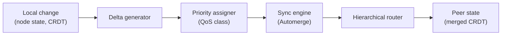

# Module 1 — Architecture Overview

**Goal:** understand the shape of Peat before touching any code — the layering, the eight
repositories, and (most importantly) how they depend on one another.

> **How to read the status labels.** Throughout this curriculum every capability carries one
> of four labels so you always know what is real:
> **Shipped** (in code, tested) · **In-flight** (open issue/PR/epic) · **Proposed** (an ADR in
> `Proposed` status, no implementation) · **Speculative** (a design used for teaching, not yet
> in any repo). This module is mostly about how the code is *organized*, so most of its claims
> are **Shipped**; the few exceptions are labeled inline.

---

## 1.1 The problem Peat solves

Tactical and edge environments are *heterogeneous*. A dismounted operator carries a phone
running a CoT consumer (a Cursor-on-Target client). Sensors run on ESP32-class microcontrollers
with on the order of 256 KB of RAM. AI inference runs on edge servers. Robots carry embedded
computers. These systems speak different protocols, use different radios, and often cannot reach
each other directly. The network is frequently **degraded, disrupted, intermittent, or limited
(DDIL)** — there may be no Wi-Fi, no cell, no satellite.

Peat gives all of them a common coordination layer. Four properties are worth pinning down
precisely, because each carries a different maturity:

- **Any device can join** — servers, phones, ESP32 sensors, single-board computers, AI
  platforms; each contributes what it can. **(Shipped)**
- **Several transports are supported.** The shipped transports are QUIC/Iroh (the default),
  BLE mesh (`peat-btle`, opt-in `bluetooth` feature), a peat-lite UDP bridge to embedded nodes
  (opt-in `lite-bridge` feature), HTTP/REST, and a TAK/CoT TCP bridge. **(All Shipped.)** What
  is *not* yet shipped is running all of them **simultaneously with automatic PACE-style
  failover** — that is a README roadmap item (**Proposed**). Note also that low-level "UDP" is
  not itself a peer transport: `UdpBypassChannel` is a send/receive primitive, not a
  `MeshTransport` (`peat-mesh/src/transport/bypass.rs:930`, ADR-042).
- **Works disconnected.** State is CRDT-based, using Automerge documents synchronized over Iroh
  QUIC. There is no central server in the data path, and the mesh keeps operating through
  network partitions (`peat-mesh` `automerge-backend`; partition detection and autonomous
  operation in `peat-mesh/src/topology/`). **(Shipped — and the strongest part of the story.)**
- **Scales by hierarchy.** Aggregating state up a tree (rather than flooding a full mesh) is
  what lets the same protocol serve a handful of nodes or a much larger force. The largest
  validation to date is a **single-machine simulation up to ~1,000 nodes** (a 1023-node hard
  cap, using a Linux bridge), *not* a field deployment; multi-hundred-to-10K field/scale
  validation is **In-flight** (epics #724–#727). Treat "1,000+ node" as a simulation ceiling,
  not a measured field result.

One framing to carry forward: Peat is built for **autonomy under human authority**. Nodes
coordinate and act on their own when cut off, but anything that issues a command or tasks a
platform sits behind an authority model (covered in Modules 2 and 2b). Keep that distinction in
mind whenever you see "tasking" later in the track.

## 1.2 The three phases (the runtime mental model)

Almost everything Peat does happens in three phases, and the code is organized around them —
you will find a `Discovery` (Phase 1), `Cell` (Phase 2), and `Hierarchy` (Phase 3) module
in `peat-protocol`. **(Shipped.)**

1. **Discovery** — nodes find each other (mDNS, BLE advertisements, static configuration,
   Kubernetes EndpointSlice, or geographic clustering). *A phone discovers a nearby sensor; a
   server discovers edge nodes.* Discovery lives in `peat_mesh::discovery` (the former
   `peat-discovery` crate was retired under peat#919).
2. **Cell Formation** — discovered nodes form **cells** based on capability. A cell might be an
   operator's phone, two sensors, and a ground vehicle. Each node advertises what it can do; the
   cell composes those capabilities and elects a leader. The election is **deterministic** — no
   Raft/Paxos voting; each node independently computes the same ordering from observed beacons
   (covered in Module 2b).
3. **Coordination (Hierarchy)** — cells self-organize into a tree for efficient state sharing. A
   sensor reading flows up to its cell leader, aggregates with other cells, and reaches the
   command post — without flooding the network. Commands flow back down, gated by authority.

A **cell** is a grouping of nodes, and it is the fundamental unit of *formation* — but it is not
the bottom of the tree. The leaf tier below a cell is the individual **node**. Cells elect
leaders, form parent/child relationships up the hierarchy, and keep operating autonomously when
cut off from higher echelons. The full tier vocabulary is the subject of the next paragraph,
and it comes with a caveat.

> **Hierarchy vocabulary — read this carefully; it is the most common thing a reviewer catches.**
> ADR-066 proposes an abstract tier vocabulary —
> **Platform → Cell → Cohort → Federation → Coalition** (replacing the legacy military terms
> Squad/Platoon/Company/Battalion). **ADR-066 is `Proposed`, and the rename is mid-flight**
> (epics #904, #968, #970). The reality in the code today is mixed:
>
> - `peat-mesh` and `peat-protocol` use **`Node`** as the leaf tier, with the upper four matching
>   ADR-066: `HierarchyLevel { Node, Cell, Cohort, Federation, Coalition }`
>   (`peat-mesh/src/beacon/types.rs:56-67`; `peat-protocol/src/security/authorization.rs:331-343`).
> - `peat-btle` still uses the **fully legacy** `Platform/Squad/Platoon/Company`
>   (`peat-btle/src/lib.rs:495-525`).
> - `peat-schema`'s `.proto` files have been renamed off the legacy military terms: they now ship
>   `CellSummary`/`CohortSummary`/`FederationSummary`/`CoalitionSummary` — no `SquadSummary` or
>   `squad_id` (`peat/peat-schema/proto/hierarchy.proto:24,71,72,122,172`).
>
> So if you `grep HierarchyLevel`, you will find **`Node`** as the leaf in the core crates — not
> `Platform`. ADR-068 separately proposes settling the base-unit name on `Node` (#968/#970).
> Treat "Platform/Cell/Cohort/Federation/Coalition" as the *proposed* target vocabulary, not the
> canonical current enum. **(In-flight.)**

## 1.3 The architecture, through two lenses

There is **no single official "layer count"** for Peat. The repo documents the architecture two
complementary ways. Recognizing that these are two *lenses* on one system — not a contradiction —
saves a lot of early confusion.

### Lens A — the crate/packaging layering (5 layers)

Source: `peat/docs/ARCHITECTURE.md` (dated 2025-01-07). This organizes the system by **which
crate owns what**, bottom-up. **(Shipped — this matches the member-crate roles in the workspace.)**

```
┌───────────────────────────────────────────────────────────────┐
│ APPLICATION   TAK/CoT bridge · edge inference · your app       │
├───────────────────────────────────────────────────────────────┤
│ BINDING       peat-ffi  (Kotlin/Swift via UniFFI + JNI)        │
├───────────────────────────────────────────────────────────────┤
│ TRANSPORT     peat-mesh (QUIC/Iroh, discovery, topology)       │
│               peat-transport (HTTP/REST + TAK/CoT TCP)          │
│               peat-btle (BLE mesh)   peat-lite (MCU UDP)        │
├───────────────────────────────────────────────────────────────┤
│ PROTOCOL      peat-protocol — DocumentStore · Security · etc.   │
├───────────────────────────────────────────────────────────────┤
│ SCHEMA        peat-schema  (Protobuf wire definitions)         │
└───────────────────────────────────────────────────────────────┘
```

> **Diagram legend.** Each box is a layer; the crate(s) named inside it own that layer.
> Lower layers are foundational (the Schema layer has no Peat dependencies); higher layers build
> on lower ones. This is a *packaging* view — it does **not** show which crate compiles against
> which (for that, see the literal dependency graph in §1.5).

- **Schema** (`peat-schema`) — the wire format (Protobuf). No Peat dependencies; the foundation.
- **Protocol** (`peat-protocol`) — the SDK core you program against (CRDT sync, auth, cells,
  hierarchy, QoS).
- **Transport** — `peat-mesh` (P2P QUIC/Iroh), `peat-transport` (HTTP/REST + TAK/CoT TCP),
  `peat-btle` (BLE), `peat-lite` (MCU UDP).
- **Binding** (`peat-ffi`) — Kotlin/Swift bindings for mobile.
- **Application** — the TAK/CoT bridge, edge ML, simulators, your apps.

The **whitepaper** (`peat/docs/whitepaper/05-technical-architecture.md` §4.3) presents this same
5-layer model, numbered bottom-up (Layer 1 Schema → Layer 5 Application) — so the whitepaper and
`ARCHITECTURE.md` are two expressions of **Lens A**. One small editorial inconsistency not to
trip on: the whitepaper files `peat-lite` under the *Binding* layer while `ARCHITECTURE.md` files
it under *Transport*. It is the same crate; the layer label is an editorial choice.

### Lens B — the runtime data-flow stack (4 layers)

Source: `peat/docs/guides/developer/DEVELOPER_GUIDE.md` §3.1 (the most complete practical
onboarding doc in the repo). This organizes the system by **how a change flows at runtime** —
verified against the guide's diagram. **(Shipped layering; the guide is a snapshot, so cross-check
specifics against code — see the caveat below.)**

```
┌─────────────────────────────────────────────────────────────┐
│ APPLICATION         peat-sim · peat-transport · peat-inference│
├─────────────────────────────────────────────────────────────┤
│ PROTOCOL            peat-protocol                            │
│   Discovery(P1) → Cell(P2) → Hierarchy(P3) · Composition     │
│   Security · Policy · QoS · Command                          │
├─────────────────────────────────────────────────────────────┤
│ STORAGE ABSTRACTION   Automerge + Iroh backend (pure OSS)    │
├─────────────────────────────────────────────────────────────┤
│ NETWORK             P2P Mesh (Iroh QUIC)                     │
└─────────────────────────────────────────────────────────────┘
```

> **Diagram legend.** Boxes are runtime layers, top (closest to your application) to bottom
> (closest to the wire). The arrows inside the Protocol layer (P1→P2→P3) are the three phases
> from §1.2. The **Storage Abstraction** layer is the pluggable CRDT backend that sits between
> protocol logic and the raw network.

This view collapses binding/transport/schema and foregrounds the **storage abstraction** (the
pluggable CRDT backend). Once you are writing code, that is often the more useful mental model,
because it is the path a local change actually takes (see Module 6).

The developer guide (§3.2) also draws the **runtime data flow** for a single local change. This
diagram is verified against the guide; one stage carries a maturity caveat noted below.



> **Diagram legend.** Left to right is the lifecycle of one change: it becomes a delta, gets a
> QoS priority, is reconciled by the Automerge sync engine, is routed up/down the hierarchy, and
> merges into peer state. **Maturity note:** the QoS *classes* and ordering are **Shipped** (five
> classes, Critical=1…Bulk=5, `peat-protocol/src/qos/mod.rs`), and Automerge sync is **Shipped**;
> but cross-class **enforcement** (wire-level preemption, a guaranteed "<5 s" Priority-1 latency)
> is a target, not yet asserted in code — **In-flight**. Read "Priority assigner" as "orders by
> class," not "guarantees a latency."

> **Which lens should you hold in your head?** Use **Lens B** as your working model — it matches
> the code's runtime flow. Use **Lens A** when reasoning about *crates and packaging* (what
> depends on what, what to add to `Cargo.toml`). They answer different questions; they do not
> conflict.

> **Heads-up on dependency direction.** Both diagrams draw "transport/network" below or beside
> "protocol," but in today's code the **crate dependency** runs from the facade *downward*:
> `peat-protocol` pulls in `peat-mesh`. The diagrams show responsibilities; §1.5 is the literal
> truth of what compiles against what.

> **Name trivia worth knowing.** Peat is a name, not an acronym — don't read the letters as
> initials. The project's *former* name was **HIVE**, a backronym for "Hierarchical Intelligence
> for Versatile Entities" (DEVELOPER_GUIDE.md:46). That legacy name is still all over the history:
> ADR-049 is "HIVE mesh extraction"; peat-lite's ADR-001 is "hive-lite-primitives." Peat is the
> current name for the same project.

## 1.4 The eight repositories (what is in this folder)

The system spans **eight repositories**. The six core library/control-plane repos below are joined
by two client/bridge repos brought under tracking in 2026-06: `peat-flutter` (the Flutter/Dart
client binding over `peat-ffi`) and `peat-sapient` (the SAPIENT sensor-standard bridge, a
first-class accepted integration under ADR-070). **(All Shipped; ADR-070 SAPIENT bridge is
Accepted.)**

| Repo / dir | One-liner | Language | Key crate(s) |
|------------|-----------|----------|--------------|
| `peat/` | Umbrella workspace: SDK facade + schema + adapters + examples + spec | Rust | `peat-protocol`, `peat-schema`, `peat-transport`, `peat-persistence`, `peat-ffi` |
| `peat-mesh/` | Networking layer: QUIC/Iroh P2P, Automerge CRDT sync, discovery, topology | Rust | `peat-mesh` (+ `peat-mesh-node` demo binary) |
| `peat-btle/` | BLE mesh transport for phones, watches, sensors, MCUs | Rust (+ Kotlin/Swift) | `peat-btle` |
| `peat-lite/` | `no_std` CRDT primitives + wire protocol for ~256 KB microcontrollers | Rust (`no_std`) | `peat-lite` |
| `peat-gateway/` | Enterprise **control plane**: multi-tenant enrollment, CDC, identity federation — **not a mesh node and not in the data path** | Rust + SvelteKit | `peat-gateway` |
| `peat-node/` | Deployable **node sidecar**: embeds peat-mesh + peat-protocol and exposes them over a single gRPC / Connect / gRPC-Web port (Iroh QUIC only — no BLE) | Rust | `peat-node` |
| `peat-flutter/` | Flutter/Dart **client binding** over `peat-ffi` (hand-maintained UniFFI bindings) | Dart + Rust | `peat-flutter` (binds `peat-ffi`) |
| `peat-sapient/` | **SAPIENT sensor-standard bridge** into Peat via `peat-schema` (ADR-070, Accepted) | Rust | `peat-sapient` |

A framing that matters for a skeptical reader: **`peat-gateway` is a control plane, not a node.**
It implements zero mesh transports, does not sync CRDTs, and does not sit in the peer-to-peer
path; it *observes and manages* (enrollment, change-data-capture, envelope encryption,
identity federation). The **deployable node** that actually carries traffic is **`peat-node`**.
We separate the two here so the distinction is clear from the start; the details are in Modules
5 and 8.

Inside `peat/` the most important sub-crates are:

- **`peat-protocol`** — the SDK facade. *This is where you start as an app developer.* It
  re-exports `peat_mesh` and `peat_schema`, so a consumer depends on `peat-protocol` alone.
- **`peat-schema`** — Protobuf wire types (`.proto` files under `peat/peat-schema/proto/`).
- **`peat-transport`** — HTTP/REST server (Axum) + the **TAK/CoT TCP bridge** (`src/tak/`).
- **`peat-persistence`** — storage adapters (e.g. beacon persistence) and an external store
  server.
- **`peat-ffi`** — UniFFI + JNI bindings for Android/iOS.
- **`peat/examples/`** — runnable examples: `quickstart`, the TAK/CoT bridge, an Android demo,
  an iOS demo, an M5Stack/ESP32 demo, etc.
- **`peat/spec/`** — an IETF-style protocol draft (`draft-peat-protocol-00.md`) and `.proto`
  specs.
- **`peat/docs/adr/`** — **79 Architecture Decision Records** (counted: `ls peat/docs/adr/*.md` =
  79; 75 numbered ADRs + 4 reference docs — ADR-073 "peer-ejection Rayfish review" is the newest,
  Proposed).
  These are gold for understanding *why*. Note that many are still in `Proposed` status — triage
  epic #695 tracks "triage 22 Proposed ADRs before public release," so an ADR existing does not
  mean the decision shipped.

> **A note on trusting docs.** Across this codebase the **code is ahead of the docs** in several
> places (the FIPS crypto swap, the hierarchy enum) and behind them in others. The operating rule
> for the whole track is **code > current ADRs > specs/guides/READMEs**. When two disagree, the
> manifests and source win.

## 1.5 The dependency graph (the literal truth)

This is what the `Cargo.toml` files actually declare. Arrows mean "depends on." **(Shipped —
verified against the manifests.)**

```
                    peat-gateway ───────────────┐
                  (control plane)               │
                                                 ▼
   peat-transport ──┐                       peat-mesh ◀── peat-persistence
   (HTTP/REST·TAK)  │                    (P2P, QUIC/Iroh,        │
                    ▼                     Automerge CRDT)         │
   peat-ffi ───▶ peat-protocol ──────────────┤                  │
  (mobile)       (SDK FACADE)                 │  (optional)      │
                    │   │                     ├──▶ peat-btle ──┐ │
                    │   └──── re-exports ──────┤   (BLE mesh)   │ │
                    │        peat-mesh +       └──▶ peat-lite ◀─┘ │
                    ▼        peat-schema           (no_std MCU)   │
              peat-schema ◀──────────────────────────────────────┘
              (Protobuf, foundation — no Peat deps)
```

> **Diagram legend.** Boxes are crates. A solid arrow is a required dependency; the
> "re-exports" arrow marks the facade re-export. `peat-node` (the sidecar) is not drawn here
> because it lives in its own repo and depends on `peat-mesh` + `peat-protocol` as an external
> consumer would.

Concretely, verified from the manifests:

- `peat-schema` → *(nothing)* — the foundation.
- `peat-protocol` → `peat-schema`, `peat-mesh`, and `peat-btle` *(optional, `bluetooth`
  feature)*. Its `lib.rs` does `pub use peat_mesh;` and `pub use peat_schema;` — that is the
  facade (`peat-protocol/src/lib.rs:105-106`).
- `peat-transport` → `peat-schema`, `peat-protocol`, `peat-mesh` *(optional)*.
- `peat-persistence` → `peat-schema`, `peat-protocol`, `peat-mesh`.
- `peat-ffi` → `peat-protocol`, `peat-mesh` *(optional)*, `peat-btle` *(optional, per platform)*.
- `peat-mesh` → `peat-lite` *(optional, `lite-bridge`)*, `peat-btle` *(optional, `bluetooth`)*.
- `peat-btle` → `peat-lite` *(optional, `peat-lite-frame` feature)*; it does **not** depend on
  `peat-mesh`.
- `peat-lite` → *(nothing Peat)* — `no_std`, standalone, only `heapless`.
- `peat-gateway` → `peat-mesh` (an exact `=`-pin, with features `automerge-backend` + `broker`).
  The pin was frozen at `=0.9.0-rc.1` for months but a Dependabot bump (peat-gateway#144) moved it
  to `=0.9.0-rc.40`, so the gateway now lags the ecosystem (rc.45) by ~5 RCs (Module 5 §5.6).

Rendered as a diagram (solid = required dependency, dashed = optional feature):

```mermaid
flowchart TD
    GW["peat-gateway<br/>(control plane)"] -->|exact =-pin, rc.40 (~5 rc behind)| M
    T["peat-transport<br/>(HTTP/REST · TAK/CoT)"] --> P
    FFI["peat-ffi<br/>(Kotlin / Swift)"] --> P
    PER["peat-persistence"] --> P
    P["peat-protocol<br/><b>SDK facade</b><br/>re-exports mesh + schema"] --> S["peat-schema<br/>(Protobuf — foundation)"]
    P --> M["peat-mesh<br/>(Iroh QUIC · Automerge)"]
    M -.->|bluetooth · optional| B["peat-btle<br/>(BLE mesh)"]
    M -.->|lite-bridge · optional| L["peat-lite<br/>(no_std MCU — leaf)"]
    B -.->|peat-lite-frame · optional| L
```

> **Diagram legend.** Solid arrow = a required dependency declared in `Cargo.toml`; dashed arrow
> = an optional dependency gated behind a Cargo feature (the feature name is on the arrow). The
> bold box is the SDK facade you program against.

### Why the arrows changed direction (history worth knowing)

The architecture started with `peat-mesh` *inside* `peat-protocol` as a transport module. Over a
series of ADRs (notably **ADR-049 "HIVE mesh extraction"** and **peat-mesh's repo-local ADR-0002
"peat-mesh extraction"**) the networking layer was **extracted into its own repo** so it could be
versioned and published independently. After extraction, `peat-protocol` became a thin **facade**
that depends on and re-exports `peat-mesh`. That is why:

- The old `peat/docs/ARCHITECTURE.md` (2025-01-07) still draws `peat-mesh → peat-protocol`.
- The current README and the `Cargo.toml` files show `peat-protocol → peat-mesh`.

When the two disagree, **trust the manifests.** "Docs lag the code" is a recurring situation in
this project, and spotting it is part of the job.

### A second subtlety: the version-pinning dance

Because `peat-mesh` and `peat-btle` are separate published crates, the `peat` workspace pins
their versions carefully. Open `peat/Cargo.toml` and you will find a long, heavily commented
floor-version history (a succession of release-candidate floors; the floor now sits at
`peat-mesh >=0.9.0-rc.45` and the audited HEAD is the workspace bump to `0.9.0-rc.29`) explaining a
cargo **cycle-detection** problem that arose when `peat-btle` and `peat-mesh` each optionally
depended on the other. As of rc.29 (peat#1016) the workspace also **dropped its `[patch.crates-io]`
git pin on `peat-mesh`** and now consumes the published registry crate directly — the floor was
raised to rc.45 so the released crate carries `fetch_blob_from_peer` (Module 3 §3.4b), which the
new peat-ffi blob surface calls.

The fix (**ADR-059 Amendment 4, Slice 4.b**) **broke the back-edge**: `peat-btle` no longer
depends on `peat-mesh`. Instead, `peat-mesh`'s `bluetooth` feature implements the cross-transport
bridge on top of codec primitives that `peat-btle` exposes. You do not need to memorize this, but
knowing it exists will save confusion the first time a build fails on a version mismatch. (Note:
ADR-059 itself is still `Proposed`; the bridging *codec* ships, and the Amendment-4 cycle-break is
tracked by peat#828.)

## 1.6 The modularity model (read this twice)

This is the single most important architectural property to internalize, and it is easy to miss.
**(Shipped — verified from the manifests.)**

> **`peat-lite` and `peat-btle` are standalone leaf crates. The rest of Peat depends on *them*;
> they depend on *nothing* in Peat.** Dependencies flow *down into* the edge crates, never *out
> of* them.

Concretely, from the manifests:

- **`peat-lite` is a pure leaf** — it has **no Peat dependencies at all** (its only runtime
  dependency is `heapless`). It is a self-contained `no_std` CRDT library.
- **`peat-btle` is almost a leaf** — its only Peat dependency is an **optional** `peat-lite`
  (the `peat-lite-frame` feature). It does **not** depend on `peat-mesh`, `peat-protocol`, or
  `peat-schema`.
- **The "core" reaches outward to consume them, optionally:** `peat-mesh` pulls in `peat-btle`
  (`bluetooth`) and `peat-lite` (`lite-bridge`); `peat-protocol` and `peat-ffi` pull in
  `peat-btle` per platform. None of that coupling runs the other way.

```
        peat-protocol / peat-ffi / peat-mesh   ← the "core" stack
                        │  (optional features point DOWN)
                        ▼
                   peat-btle      ← standalone BLE transport; only optional dep is peat-lite
                        │  (optional)
                        ▼
                   peat-lite      ← pure leaf: zero Peat deps, no_std, reusable anywhere
```

> **Diagram legend.** Top to bottom is the dependency direction: the core stack at the top
> optionally depends *down* on the edge crates; the edge crates depend on nothing above them.
> Every Peat arrow into `peat-btle` or `peat-lite` is `optional = true`.

**Why this modularity matters:**

1. **Independent reuse.** Carrying no upward dependencies, `peat-lite` and `peat-btle` can be
   adopted *on their own* by projects that do not want the whole Peat stack — someone who needs
   only a tiny `no_std` CRDT library, or only a cross-platform BLE-mesh transport. The value of
   each edge crate is not locked behind adopting `peat-protocol`.
2. **Independent versioning and publishing.** Each is its own crate, released on its own cadence
   (peat-mesh at rc.45, peat-btle at 0.4.0, peat-lite at 0.2.5 — distinct version lines). The
   embedded/mobile crates additionally publish Android artifacts to Maven Central (a
   `publish-maven` workflow exists in `peat-btle`).
3. **Reaches targets the core cannot.** `peat-lite` compiles for bare-metal microcontrollers and
   `peat-btle` for mobile/embedded platforms (including ESP32/NimBLE, Android, and Apple)
   *precisely because* they do not drag in the heavier core. If they depended upward, they could
   not build for those targets.
4. **It keeps the graph acyclic.** The cycle described in §1.5 appeared the moment an edge crate
   pointed back *up* at `peat-mesh`. Keeping the edge crates as leaves (ADR-059 Amendment 4) is
   the structural rule that prevents that class of problem.

The mental model is **"core depends on edge, edge depends on nothing"** — a stable-dependencies,
leaf-reusability design. When you read `Cargo.toml`s, notice that every Peat arrow into
`peat-btle` or `peat-lite` is marked `optional = true`. That keyword is the modularity model in
one word.

---

## Try it

1. **Read the developer guide.**
   `peat/docs/guides/developer/DEVELOPER_GUIDE.md` is the strongest single onboarding doc in the
   repo — getting-started toolchain, the runtime architecture (Lens B, §3.1–3.2), core concepts,
   a crate reference, testing, and "Extending Peat." This learning track is a guided path
   *through* it and the code; the guide is your companion, but remember it is a snapshot — verify
   specifics against the source.
2. Open `peat/docs/ARCHITECTURE.md`, find the "Crate Dependency Graph," compare it to §1.5, and
   spot the inverted arrow yourself.
3. Run `grep -rn "pub use peat_mesh" peat/peat-protocol/src/lib.rs` — that single line is the
   whole "facade" idea.
4. Run `ls peat/docs/adr/*.md | wc -l` to see the ADR count for yourself (79 at the audited
   HEAD), then skim the file names. You do not need to read them yet; notice how many decisions
   are recorded, and that many are still `Proposed`.

## Checkpoint

- The repo documents the architecture two ways — name the two lenses (and how many layers each
  has) and say which question each answers.
- What are the three runtime phases, in order? Which phase elects a leader, and is that election
  consensus-based or deterministic?
- Which single crate does an application developer add to `Cargo.toml`, and what does it
  re-export?
- Which crate is the foundation with no Peat dependencies?
- Why does the dependency graph contradict the old architecture diagram?
- Which two crates are standalone *leaves*, and which direction do dependencies flow relative to
  them? Give two reasons that modularity matters.
- Which repo is the **control plane** (not a node, not in the data path), and which repo is the
  **deployable node**?
- What is the leaf-tier name in the shipped `HierarchyLevel` enum today, and what does ADR-066
  propose to call it?

---

Next: [Module 2 — The SDK Facade: `peat-protocol` »](02-peat-protocol.md)
