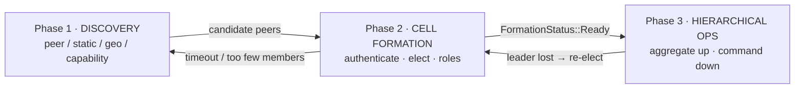
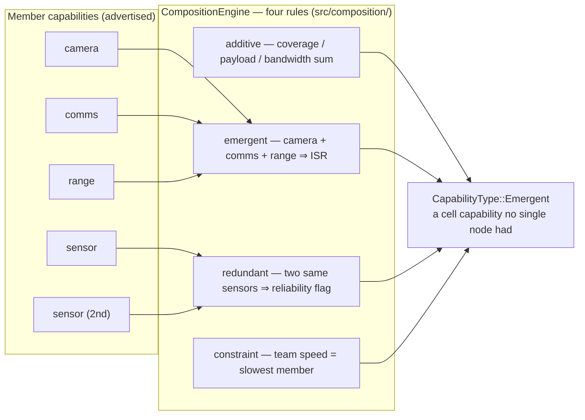

# Module 2 — The SDK Facade: `peat-protocol`

**Goal:** understand the crate you actually program against. This is the biggest, richest
module — take your time. Repo path: [`peat/peat-protocol/`](../peat/peat-protocol/).

> **Mental model:** `peat-protocol` is a *facade*. It owns the high-level concepts — cells,
> hierarchy, security, QoS, the three phases — and re-exports the lower layers (`peat-mesh`,
> `peat-schema`) so a consumer depends on **one crate**.

> **Status labels used throughout this module.** Every capability is tagged so you always know
> what is real:
> **Shipped** (in code, tested) · **In-flight** (open issue/PR/epic) · **Proposed** (an ADR in
> `Proposed` status, no implementation) · **Speculative** (a teaching model, not in any repo).
> The single most useful habit when reading Peat docs: when code, an ADR, a README, or this
> curriculum disagree, **the code wins.** Several Peat READMEs and specs lag the code (crypto,
> role names, version numbers), so this module cites `path:line` and flags every place a doc and
> the code diverge.

Audited at `peat` HEAD `a1ce620` (workspace `0.9.0-rc.31`), `peat-mesh` rc.49 (`fa5c403`).
Citations below point at the working-tree source.

---

## 2.1 The entry point

Open [`peat/peat-protocol/src/lib.rs`](../peat/peat-protocol/src/lib.rs). Two things matter most.

**The facade re-exports** (around line 105):

```rust
// Facade re-exports: a consumer depends on peat-protocol alone.
pub use peat_mesh;     // P2P plumbing: transport, topology, CRDT sync
pub use peat_schema;   // wire types (Protobuf)
```

**The module map** (the public surface). Each `pub mod` is a subsystem; the ones in **bold** are
the ones to learn first. All of these are **Shipped** unless noted:

| Module | What it does |
|--------|--------------|
| **`cell`** | Phase 2: cell formation, leader election, capability aggregation |
| **`hierarchy`** | Phase 3: tier coordination, state aggregation, flow control, routing rules |
| **`discovery`** | Phase 1: domain-level node discovery strategies (peer, geographic, directed, capability query) |
| **`security`** | Device authentication, formation keys, membership certificates, user auth/RBAC |
| **`sync`** | Data-sync abstraction (traits) + the Automerge backend |
| **`qos`** | Quality-of-Service framework: 5-class priority, TTL, eviction, bandwidth (ADR-019) |
| `command` | Bidirectional command coordination (down the hierarchy), conflict resolution, ACK timeouts |
| `composition` | Capability composition engine: additive / emergent / redundant / constraint rules |
| `cot` | Cursor-on-Target translation (TAK interop), MIL-STD-2525 symbols (ADR-020, ADR-028) |
| `event` | Event routing & aggregation with priority queues (ADR-027) |
| `distribution` | AI model distribution: deployment directives, manifests (ADR-012, ADR-026) |
| `mesh_integration` | Adapters bridging generic `peat-mesh` interfaces to Peat domain types |
| `policy` | Generic conflict-resolution engine (`Conflictable` trait, LWW / highest-attribute) |
| `storage` | Document store + Automerge backend re-exports (`AutomergeBackend`, capability traits) |
| `credentials` | Credential handling used by the security layer |
| `transport`, `network` | **Re-export shims** over `peat_mesh::transport` / `peat_mesh::network` |
| `geohash` | Vendored geohash algorithm (supply-chain audit; deterministic geo-encoding) |
| `traits` | Core abstractions: `Platform`, `CapabilityProvider`, `MessageRouter`, `PhaseTransition` |
| `models` | Domain data models: `Capability`, `Node`, `Cell`, `Zone`, `Operator`, `Domain` |

The `transport` and `network` modules are thin `pub use peat_mesh::…` shims — the real transport
and crypto code lives in `peat-mesh` (Module 3). Treat `peat-protocol` as the domain layer over
that plumbing.

> **The shim list grew (rc.43).** `storage/file_distribution.rs` and `storage/model_distribution.rs`
> are now thin re-exports too — `pub use peat_mesh::storage::…::*` — the blob/file-transfer
> implementation **relocated into `peat-mesh`** (peat#992), which is "the canonical iroh consumer;
> transport-specific impl belongs there, not in the protocol/spec layer." So when you grep for
> `IrohFileDistribution` or `DistributionScope`, the source now lives in `peat-mesh/src/storage/`.
> The same commit landed the **ADR-071 interest-driven-convergence seam** (a `NeedEvaluator` trait,
> a `collection` field on the distribution document, opt-in via `with_need_evaluator`) — **Proposed**
> as a model, with the additive seam present but inert by default. Module 3 §3.4b walks it.
> A follow-on, **ADR-072 (Proposed): synced-folder lifecycle & file-handling policy**, builds on
> that same distribution document — adding a publisher-declared lifecycle/handling policy (deletion,
> idempotent re-drop, version ordering) on the sender-owned metadata half. No code yet; the
> shipped piece is the v1 unidirectional inbox/outbox layout in `peat-node` (Module 8).

> **A facade gotcha worth knowing (rc.27, peat#995).** After the ADR-062 relocation moved
> `IrohTransport` endpoint construction into `peat-mesh`, `peat-protocol`'s `relay-n0-hosted` opt-in
> was left an orphaned no-op — enabling it had no effect on the relay posture. rc.27 wired the
> feature to forward (`peat-protocol/Cargo.toml:123` → `peat-mesh/relay-n0-hosted`), and added the
> same passthrough on `peat-ffi` (`peat-ffi/Cargo.toml:109`) plus a non-blocking
> `connect_peer_nowait` FFI entry point — so toggling the relay at the facade flips the underlying
> endpoint again. Still **off by default** (tactical/edge builds must not phone home through n0).

A few constants in `lib.rs` set the defaults of the system (all **Shipped**, verbatim from
`lib.rs:112,115,118`):

```rust
pub const DEFAULT_CELL_SIZE: usize = 5;            // nominal cell size
pub const DEFAULT_DISCOVERY_TIMEOUT_SECS: u64 = 60;
pub const DEFAULT_HIERARCHY_DEPTH: usize = 4;      // (node -> cell -> zone -> network)
```

> **Vocabulary caveat (read this once, it recurs everywhere).** That last comment is copied
> verbatim from the source, and it uses **legacy** tier names — "zone", "network". The hierarchy
> enum the code actually ships does **not** use those words; see §2.7. Peat is mid-rename from
> military vocabulary to an abstract one, and the workspace currently mixes both. Whenever you see
> "zone" or "squad/platoon/company" in a comment, treat it as legacy and check the enum.

**"Hello world" shape.** The architecture doc shows an idealized `peat_protocol::prelude::*` import:

```rust
// Illustrative only — see the accuracy note below.
use peat_protocol::prelude::*;
let store = DocumentStore::new(Config::default()).await?;
let mut tracks = store.subscribe("tracks").await?;
```

> **Accuracy note (Speculative snippet).** There is **no `prelude` module** in the current code
> (grep clean in `lib.rs`) — that snippet is aspirational. The *real* imports are explicit module
> paths. Here is what the runnable example actually uses
> ([`peat/examples/quickstart/src/`](../peat/examples/quickstart/)):
>
> ```rust
> use peat_mesh::discovery::{DiscoveryStrategy as MeshDiscoveryStrategy, MdnsDiscovery};
> use peat_protocol::network::{EndpointId, IrohTransport, PeerInfo};
> use peat_protocol::storage::{AutomergeBackend, AutomergeStore};
> use peat_protocol::storage::capabilities::{CrdtCapable, SyncCapable, TypedCollection};
> ```
>
> When in doubt, open the example and copy its imports. Start with `peat/examples/quickstart/`
> once you have read this module.

---

## The three phases as a flow



**Legend.** Boxes are protocol phases. Solid arrows are forward transitions on the labeled
condition; the two arrows back to earlier phases are the recovery paths (a lost leader re-runs
formation; a formation that times out or has too few members falls back to discovery). This
three-phase staging is **Shipped** — the diagram is the teaching scaffold; the transitions map to
real re-election triggers in `peat-mesh` (`hierarchy/maintenance.rs:227/252/312`).

## 2.2 Phase 1 — Discovery (`src/discovery/`)

Nodes have to find each other before anything else happens. The `discovery` module offers several
*strategies* (all **Shipped**):

- `peer.rs` — Automerge + Iroh peer discovery.
- `geographic.rs` / `geo.rs` — geographic clustering (`GeoCoordinate`, `OperationalBox`).
- `directed.rs` — static peer lists.
- `capability_query.rs` — "find me nodes that can do X."
- `coordinator.rs` — ties the strategies together.

Discovered nodes sit in a candidate pool for up to `DEFAULT_DISCOVERY_TIMEOUT_SECS` (60 s), then
transition into cell formation. The *actual radio/transport-level* discovery (mDNS sockets,
Kubernetes EndpointSlice, static peering) lives one layer down in `peat-mesh` — see Module 3.
(The standalone `peat-discovery` crate was retired under peat#919; transport discovery now lives
in `peat_mesh::discovery`.) `peat-protocol`'s discovery answers the domain-level question of *who
should I form a cell with*, not how the radio finds them.

---

## 2.3 Phase 2 — Cells & leader election (`src/cell/`)

This is the conceptual heart of Peat. **For the full code-level walkthrough — the formation
authentication handshake, the election state machine with its exact defaults, role assignment, the
readiness check, and partition-merge semantics — see [Module 2·5](02b-formation-and-leadership.md).**
The essentials are below; the deep dive is there. Key files (**Shipped**):

- `leader_election.rs` — deterministic, capability-weighted election.
- `coordinator.rs` — detects when a cell is "formed" and gates phase transitions.
- `capability_aggregation.rs` / `aggregation.rs` — merge member capabilities.
- `messaging.rs` — reliable intra-cell pub/sub (`CellMessageBus`, ACK/NACK, retransmission).
- `election_policy.rs` — election strategy configuration.

### Leader election is deterministic (Shipped)

This is the design decision most worth understanding, because it is what lets Peat survive a
network partition without stalling. There is **no Raft, no Paxos, no vote-counting round.** Every
node computes the *same* score for every candidate from that candidate's advertised capabilities,
so all nodes independently arrive at the same ordering and the same winner (ties broken
lexicographically by node id). A partitioned group can elect a leader locally with no quorum, and
when two partitions heal, the surviving leader resolves deterministically by the same rule.

The domain-layer weighting reflects mission priorities:

```rust
// peat/peat-protocol/src/cell/leader_election.rs  (~line 101)
// Weights: compute(30%), comm(25%), sensors(20%), power(15%), reliability(10%)
let total = (compute * 0.30)        // inference / processing power
          + (communication * 0.25)  // bandwidth, link diversity
          + (sensors * 0.20)        // sensor diversity
          + (power * 0.15)          // battery
          + (reliability * 0.10);   // historical uptime
```

> **One algorithm name, two scoring functions.** These weights are the **cell-formation** election
> in `peat-protocol` (the domain layer, matching spec-004). The lower **mesh layer** runs its own
> deterministic election with a *different* formula — a weighted mix of mobility, free CPU, free
> memory, and battery (`peat-mesh/src/hierarchy/dynamic_strategy.rs`). Both are deterministic and
> consensus-free; they are not the same numbers. If you grep `dynamic_strategy.rs` you will not
> find the 0.30/0.25/… weights — that is expected, not a bug. Know which layer you are reading.

### A cell is "ready" only when criteria are met (Shipped)

`CellCoordinator::check_formation_complete()` validates: minimum cell size, a leader is elected,
all members have roles, required capability coverage (e.g. Communication + Sensor present),
a readiness score ≥ 0.7, and — for mission-critical formations — **human approval**. Until then the
cell sits in `Forming` or `AwaitingApproval`; only when every gate passes does it move to `Ready`
and Phase 3 (`src/cell/coordinator.rs:14,53,77,97,140-144`).

> **Autonomy under human authority.** That human-approval gate is not incidental. A formation that
> would run a mission-critical capability without a human in the loop is held in
> `AwaitingApproval` rather than allowed to proceed autonomously (`coordinator.rs:22,38-39`). Peat
> places the human *within* the hierarchy at the level where the decision belongs; the machine
> acts autonomously only inside the authority it has been granted. This framing recurs in §2.7.

### Emergent capabilities (`src/composition/`) (Shipped)

A founding idea: a cell can do more than the sum of its members. The `CompositionEngine` runs four
kinds of rule, and each is a real module in `src/composition/`:

- **additive** (`additive.rs`) — coverage areas, payload capacity, and communication bandwidth sum.
- **emergent** (`emergent.rs`) — camera + comms + range compose into an ISR
  (intelligence / surveillance / reconnaissance) capability that no single node had on its own.
- **redundant** (`redundant.rs`) — two of the same sensor produce a reliability flag.
- **constraint** (`constraint.rs`) — team speed equals the slowest member.

A composed capability is emitted with `CapabilityType::Emergent` (`composition/engine.rs:151`), so
"Emergent" is both a rule kind and the type of the synthesized result.



*Shipped (`src/composition/`; the synthesized result is emitted as `CapabilityType::Emergent`,
`composition/engine.rs:151`). "Emergent" is both one of the four rule kinds and the type of the
composed capability.*

### Capability types (Shipped)

A node advertises **capabilities**, and each type composes differently. The capability enum itself
is defined in the schema (`peat-schema/proto/capability.proto:11-18`):

| `CapabilityType` | Composes by |
|------------|-------------|
| `Sensor` | additive (ranges combine) |
| `Compute` | additive (compute sums) |
| `Communication` | aggregated (best/summed wins) |
| `Mobility` | constraint (slowest wins) |
| `Payload` | additive |
| `Emergent` | the *output* of composition, not advertised directly |

> **Correction (the doc previously listed a `Weapon` type — there is none).** The enum is
> `Unspecified, Sensor, Compute, Communication, Mobility, Payload, Emergent`. Weapons are not a
> distinct capability type — the proto comment for `PAYLOAD` reads "Payload/weapon capabilities,"
> so a weapon is a `Payload`. There is no seventh `Weapon` row.

### Cell roles (Shipped)

Within a formed cell, members take **roles** from the `CellRole` enum
(`src/models/role.rs:14-28`): `Leader` (one per cell — coordinates and aggregates upward), plus
zero-or-more `Sensor`, `Compute`, `Relay`, `Strike`, `Support`, and `Follower` (7 variants total).
`Leader` is elected, not assigned; the other six are the `assignable_roles()`. The formation
completeness check above verifies role and capability coverage.

> **Do not confuse three different "role/authority" axes** — this trips up readers and is covered
> in full in §2.7: `CellRole` (this capability axis, 6 assignable + Leader), the RBAC `Role`
> (`Leader/Member/Observer/Commander/Admin`), and the human-machine `AuthorityLevel`
> (`Observer/Advisor/Supervisor/Commander`). They are separate enums in separate files.

---

## 2.4 Phase 3 — Hierarchy (`src/hierarchy/`)

Once cells exist they self-organize into tiers and share state efficiently. Files (**Shipped**):

- `aggregation_coordinator.rs` — `HierarchicalAggregator`: create a cell summary once, update it
  many times via deltas.
- `state_aggregation.rs` — roll cell summaries up into cohort/federation summaries.
- `router.rs` + `routing_table.rs` — `HierarchicalRouter` enforces *who may message whom*.
- `flow_control.rs` — bandwidth permits per routing level (IntraCell, CellToZone, …).
- `deltas.rs` — `CellDelta`, `CohortDelta`, `FederationDelta`, `CoalitionDelta` (these delta names
  already use the newer tier vocabulary; see §2.7).
- `storage_trait.rs` — `SummaryStorage`, the backend-agnostic storage interface.

### The routing rule that defines the topology (Shipped)

```rust
// peat/peat-protocol/src/hierarchy/router.rs  (is_route_valid, ~line 101)
// Same cell → always allowed.
if from_cell == to_cell { return true; }
// Cross-cell direct messaging → rejected.
//   (You must route up through your cell leader instead.)
return false;
```

That single rule is what keeps the mesh from degenerating into an everyone-talks-to-everyone flood.
Cell leaders route upward; a non-leader cannot message another cell directly or reach the tier
above it (`router.rs:90-91,140`). State flows **up** (node → cell → cohort → federation →
coalition, aggregating at each tier); commands flow **down**; peers handle handoffs
**horizontally**.

This upward-aggregation pattern is also why Peat's connection count scales sub-quadratically: a
node syncs with its cell, not with every node in the deployment. The whitepaper models this as
roughly O(n log n) connections versus O(n²) for a full mesh (e.g. ~384 vs ~9,120 links at one
sizing) — that is an **analytical/design claim from the whitepaper's connection-count model, not a
runtime benchmark.** Treat the specific ratio as illustrative, not measured.

### Aggregation is backend-agnostic (Shipped)

```rust
// peat/peat-protocol/src/hierarchy/aggregation_coordinator.rs  (~line 61)
pub struct HierarchicalAggregator {
    storage: Arc<dyn SummaryStorage>,   // backend-agnostic: Automerge, or a mock for tests
}
```

The whole subsystem is written against a `trait`, not a concrete database. This "traits over
implementations" pattern shows up everywhere in Peat — get comfortable with it.

---

## 2.5 State & sync (`src/sync/`)

Peat state is a set of **CRDT documents** grouped into named **collections** (e.g. `"tracks"`,
`"missions"`). CRDTs (Conflict-free Replicated Data Types) merge automatically, so every node
converges to the same state without a coordinator — and operations succeed locally first, syncing
when connectivity returns (offline-first). This offline-first convergence is **Shipped** and is the
backbone of Peat's disconnected-operation story.

> **What the CRDT engine actually is (Shipped).** `peat-protocol` stores everything as **Automerge
> documents** — a single CRDT family that internally provides observed-remove maps and RGA
> sequences for lists/text. It does **not** expose a menu of discrete typed CRDTs (G-Set, OR-Set,
> PN-Counter, LWW-Map) that you pick per collection. That typed-primitive menu belongs to the
> embedded `peat-lite` tier (Module 4), not to `peat-protocol`. Keep the two mental models
> separate: here, "which CRDT?" has one answer — Automerge.

The `sync` module defines the abstraction and an Automerge implementation:

- Traits (re-exported from `peat-mesh`): `DocumentStore`, `PeerDiscovery`, `SyncEngine`,
  `DataSyncBackend`.
- `automerge.rs` — `AutomergeBackend`: documents indexed by `collection:id`, per-peer sync state,
  observer channels for change notifications, and **tombstones** (ADR-034) for conflict-free
  deletion ordered by a Lamport counter.

```rust
// peat/peat-protocol/src/sync/automerge.rs  (~line 49)
pub struct AutomergeBackend {
    documents: Arc<Mutex<HashMap<String, Automerge>>>,        // collection:id → CRDT doc
    sync_states: Arc<Mutex<HashMap<String, sync::State>>>,    // peer:document → sync state
    observers: Arc<Mutex<Vec<mpsc::UnboundedSender<ChangeEvent>>>>,
    tombstones: Arc<Mutex<HashMap<String, Tombstone>>>,       // ADR-034 deletions
    lamport_counter: Arc<AtomicU64>,                          // deterministic ordering
    // ...
}
```

The *actual wire sync* happens in `peat-mesh` (Module 3): **negentropy set reconciliation**
(`peat-mesh/src/storage/negentropy_sync.rs`, ADR-040 / issue #435) over the Automerge sync protocol
on Iroh QUIC streams, with redb persistence. This is the **Shipped** anti-entropy mechanism. It is
worth being precise about, because the constrained-networking track (and the design note)
*describe* version-vector "reading logs", snapshot-since-T, hierarchical digests, and IBLT
difference-sketches — **none of those is implemented.** They are **Speculative** teaching designs
for a future satellite/LoRa link. What ships is negentropy over QUIC, which assumes an interactive
multi-round-trip channel.

### Conceptual CRDT mapping (Speculative / teaching aid)

The mapping below is a useful *design-intent* lens for thinking about what kind of merge each piece
of data wants — but it is **not how `peat-protocol` is implemented.** At runtime every one of these
becomes an Automerge document; the named primitives (G-Set, OR-Set, LWW-Register, PN-Counter,
LWW-Map) are not selected per collection here. (Some of these primitive *names* do exist as real
types in `peat-lite` — `LwwRegister`, `GCounter` — and even there `PnCounter` is firmware-only and
`OrSet` is only a reserved wire byte with no struct. See Module 4.)

| Data | If you were choosing a primitive… | Why |
|------|------|-----|
| Node capabilities | G-Set (grow-only set) | capabilities only get added |
| Cell membership | OR-Set | members can both join and leave |
| Leader identity | LWW-Register | latest elected leader wins |
| Node position | LWW-Register | latest position is truth |
| Fuel / resources | PN-Counter | can go up *and* down |
| Message history | G-Set | append-only |
| Configuration | LWW-Map | latest value wins per key |

> **Backend note (Shipped, with one historical flag).** The storage layer is written against a
> trait so backends are swappable, but **only one ships today: Automerge + Iroh** (100% open
> source). An earlier Ditto-SDK backend was **removed** from the workspace; ADR-011 documents that
> choice (and is itself formally `Proposed`, a case of the code being ahead of its ADR). If you see
> "Ditto" in older docs, treat it as historical.

---

## 2.6 Quality of Service (`src/qos/`)

Bandwidth in the field is scarce, so Peat classifies every piece of data into one of five priority
classes and lets the system order high-priority traffic ahead of low-priority traffic. The five
classes and their configured targets are verbatim from `src/qos/mod.rs:41-45` (ADR-019):

| Class | Priority | Latency target | Bandwidth share | Example |
|-------|----------|----------------|-----------------|---------|
| P1 Critical | highest | ~500 ms | 40% | contact reports |
| P2 High | | ~5 s | 30% | mission imagery |
| P3 Normal | | ~60 s | 20% | health status |
| P4 Low | | ~300 s | 8% | routine telemetry |
| P5 Bulk | lowest | no limit | 2% | archival |

> **Bandwidth-share caveat — the table column is a doc-comment, not the shipped allocator.** Those
> 40/30/20/8/2 percentages come from the doc-comment table in `peat-protocol/src/qos/mod.rs:41-45`.
> The *shipped* `BandwidthAllocation` in `peat-mesh/src/qos/bandwidth.rs:250-300` actually allocates
> a **guaranteed + burst** pair per class — P1 20% guaranteed / 80% burst (preemption enabled),
> P2 30% / 60% (preemptive), P3 20% / 40%, P4 15% / 30%, P5 5% / 20% (last three non-preemptive).
> So the single-number share in the table and the two-number guaranteed/burst split in code do not
> match; cite the bandwidth.rs values when an allocation is what's being discussed.

> **Shipped (framework) / In-flight (enforcement) — read this carefully.** The numbers above are
> **configured policy targets** (`QoSRegistry::default_military()`), not measured or enforced
> end-to-end SLAs. The framework ships: five classes, bandwidth allocation, TTL, eviction, and
> garbage collection (oldest/lowest-QoS evicted first, `qos/eviction.rs`,
> `qos/garbage_collection.rs`), and at the node layer relay fanout is *ordered* by class. But
> **cross-class wire-level preemption is not enforced in v1** — a Critical bundle does not pause an
> in-flight Bulk transfer — and the "P1 < 500 ms / < 5 s end-to-end" figures are targets, not a
> guarantee. QoS enforcement is **In-flight** (peat-node QoS fanout ships; preemption tracked
> separately). Frame this to a customer as "prioritizes and orders," not "guarantees latency."

**Naming a collection to get its QoS — the `fleet/*` prefix classifier (peat-mesh rc.47, peat-mesh#293) [Shipped].**
Until now a collection got its QoS/sync/deletion behaviour only if it matched a hard-coded native name
(`commands`, `cells`, `beacons`, `node-positions`, …). rc.47 adds a fallthrough classifier so a
*fleet* collection named `fleet/{id}/{kind}` is classified purely from its `{kind}` segment — no code
change needed to onboard a new fleet or UAS. The mapping is verbatim across four dimensions
(`peat-mesh/src/qos/{mod,sync_mode,deletion}.rs`):

| `fleet/…/{kind}` | QoS class | Sync mode | Deletion policy | Propagation |
|---|---|---|---|---|
| `command` | P1 Critical | FullHistory | SoftDelete | Down-only |
| `ack` | P2 High | FullHistory | SoftDelete | Bidirectional |
| `products` | P2 High | FullHistory | Tombstone (24 h) | Bidirectional |
| `task-state` | P3 Normal | LatestOnly | ImplicitTTL (1 h) | Bidirectional |
| `heartbeat` | P3 Normal | LatestOnly | ImplicitTTL (1 h) | Bidirectional |
| `position` | P4 Low | LatestOnly | ImplicitTTL (1 h) | Bidirectional |
| *unknown / non-`fleet/` / wrong segment count* | P5 Bulk | FullHistory | SoftDelete | Bidirectional |

> **Don't conflate this with the storage write-policy prefix.** The `fleet/*` classifier keys on
> **slash**-delimited names (`fleet/id/kind`). The separate per-collection *write policy* that tunes
> the coalescing window and compaction threshold (Module 3, rc.46–rc.47 storage work) keys on the
> **colon**-delimited prefix (`telemetry:sensor-1` → `telemetry`). They are orthogonal mechanisms
> over two different key schemes — no code links them.

---

## 2.7 Security (`src/security/`)

Layered, and partly delegated to `peat-mesh` for the low-level primitives. All of the following are
**Shipped** unless tagged otherwise:

- **Device identity** — Ed25519 keypairs; challenge-response authentication (`authenticator.rs`,
  `device_id.rs`). The crypto `DeviceId` is the **first 16 bytes** of SHA-256 over the Ed25519
  verifying key (`peat-mesh/src/security/device_id.rs`) — note it is 16 bytes, not the 32 the older
  specs claim, and it is one of *several* identity schemes across the stack (the embedded tiers use
  shorter `u32` ids). Do not assume "one identity derivation everywhere."
- **Formation keys** — a pre-shared secret that gates which nodes may even connect
  (`formation_key.rs`). Admission is an HKDF-derived `FormationKey` plus an **HMAC-SHA-256**
  challenge/response handshake over a dedicated ALPN (`peat/formation-auth/1`, 30 s timeout,
  constant-time compare via `subtle`). The key never crosses the wire. Walked through step-by-step
  in **Module 2·5 §2·5.4**.
- **Membership certificates** — tactical trust with hierarchy levels (`membership.rs`, ADR-048,
  **Proposed**).
- **User auth & RBAC** — `user_auth.rs`, `authorization.rs`. The RBAC `Role` enum is
  `Leader, Member, Observer, Commander, Admin` (5 roles, `authorization.rs:50-64`).

> **README trap — the RBAC roles are *not* "Operator/Supervisor".** The peat README lists the RBAC
> roles as "Observer, Member, Operator, Leader, Supervisor." That is wrong against the code:
> `Operator` and `Supervisor` are **not** in the `Role` enum. The confusion comes from a *different*
> enum — the `AuthorityLevel` ladder below, which does have a `Supervisor`. The full RBAC
> authorization model is also **deferred** pending Layer-1 device identity (peat#941, In-flight),
> so treat permission enforcement as partial.

- **Encryption (Shipped, FIPS-approved algorithms).** **AES-256-GCM** AEAD with **ECDH P-256** key
  agreement, **HKDF-SHA-256** key derivation, **HMAC-SHA-256** for formation auth, **SHA-256**
  hashing, **Ed25519** signatures. The TLS provider is **`aws-lc-rs`**, not `ring`. These are all
  FIPS-approved primitives.

> **The crypto correction that matters most for this audience.** The code has **already migrated
> off** ChaCha20-Poly1305 + X25519 to AES-256-GCM + ECDH-P256 (peat-mesh rc.12, dated 2026-05-18,
> recorded in ADR-060 §5 and `encryption.rs`). The **READMEs and several pre-FIPS ADRs still
> advertise ChaCha20/X25519 — those docs are stale; the code is clean.** If you see ChaCha20 in a
> Peat README, it is a documentation lag, not shipped behavior. (The one place a ChaCha20 reference
> is *forward-looking* rather than stale is **ADR-052 (peat-lora), which is Proposed** and would
> introduce a real FIPS conflict if implemented as written — flagged for amendment before any LoRa
> work.)
>
> **What is NOT done (honest caveats):**
> - **Algorithm choice is FIPS-approved; the modules are not CMVP-validated.** The `aes-gcm` and
>   `p256` crates are pure-Rust RustCrypto implementations — FIPS-approved algorithms, but not
>   certified cryptographic modules. A real FIPS 140-3 boundary requires a CMVP-validated module
>   behind the KMS/Vault HSM-backed path (in `peat-gateway`); that is where the FIPS-140 boundary
>   lives, not in the BLE layer. Tell an auditor "FIPS-approved algorithms," never "FIPS 140-3 validated."
> - **Only P-256 is in code.** Any "P-256/P-384" claim is unsupported — there is no P-384.
> - **MLS (RFC 9420) is documented but not implemented.** The README's Layer-4 ciphersuite claim
>   (`MLS_128_DHKEMP256_AES128GCM_SHA256_P256`) has no backing code (no `openmls`/`mls-rs` anywhere).
>   MLS is **Proposed (ADR-044)**, which itself still carries pre-FIPS ChaCha20 text. Group-key
>   rotation today is leader-distribution, not MLS forward secrecy.

The generic crypto types (`DeviceKeypair`, `EncryptionKeypair`, `FormationKey`) actually live in
`peat-mesh::security` and are re-exported; `peat-protocol` adds the Peat-specific policy layer on top
(its `security/*` modules are thin `pub use peat_mesh::security::…` shims).

### Human-machine authority — "trust as data"

Peat keeps humans in the loop by placing them **within** the hierarchy at the right level. Three
properties to recognize when reading `security` + `command`:

- **Configurable authority boundaries (Shipped at the formation gate).** Each level defines what
  runs autonomously versus what needs approval — the mission-critical human-approval gate in §2.3
  is exactly this mechanism.
- **Graceful degradation (Shipped, by design).** A disconnected node operates within its
  *last-known* authority until reconnect or timeout. This is what makes offline-first safe, not just
  possible — a node never silently escalates its own authority while partitioned.
- **Trust as data (design intent — partly Proposed).** The aspiration is that authority is
  replicated CRDT state, so delegation and revocation propagate through the hierarchy like any other
  document. Membership certificates exist (`membership.rs`), but ADR-048 is **Proposed** and the
  authorization model is **deferred** (peat#941). Replicated-revocation-propagation is **not a
  verified shipped path** — present it as the design direction, not a current guarantee.

> **The authority ladder — use the real enum.** Older framing (including the whitepaper) describes a
> six-level "Root → Cluster → Formation → Group → Team → Node" authority model. That naming is
> **not in the code.** The actual enum is `AuthorityLevel` in `peat-schema/proto/node.proto:61-67`:
>
> | `AuthorityLevel` | Meaning |
> |---|---|
> | `Unspecified` | not set |
> | `Observer` | can observe only |
> | `Advisor` | can provide advice |
> | `Supervisor` | can approve / reject actions |
> | `Commander` | full command authority |
>
> This is a **five-value ladder** (four meaningful levels), not the six-level whitepaper model. Cite
> the whitepaper model as older framing if you use it; do not assert a clean 1:1 mapping that the
> code does not have.

### Hierarchy vocabulary — what the enum actually says (In-flight rename)

The leaf-tier enum the code ships is `peat_mesh::beacon::HierarchyLevel`
(`peat-mesh/src/beacon/types.rs:56-67`), and the `peat-protocol` authorization layer mirrors it
(`authorization.rs:331-343`):

```rust
pub enum HierarchyLevel {
    Node = 0,        // a single mesh participant (vehicle, soldier, sensor)
    Cell = 1,        // smallest aggregate (typically 4-13 nodes)
    Cohort = 2,      // aggregate of cells (typically 2-4)
    Federation = 3,  // aggregate of cohorts
    Coalition = 4,   // top tier, aggregating federations
}
```

> **Correction (this doc previously called "Platform/Cell/Cohort/Federation/Coalition" the
> *canonical current* enum — it is not).** Two things are wrong with that:
> 1. The shipped enum's leaf is **`Node`, not `Platform`**, in both peat-mesh and peat-protocol.
> 2. **ADR-066 (the abstract-vocabulary proposal) is `Proposed`, not canonical.**
>
> The rename is **In-flight and the workspace mixes vocabularies**: `peat-btle` still ships the
> fully-legacy `Platform/Squad/Platoon/Company`, while `peat-schema`'s proto has **already been
> renamed** to `CellSummary` / `CohortSummary` / `FederationSummary` / `CoalitionSummary` with no
> `Squad`/`squad_id` left. The base-unit name itself (`Platform` vs `Node`) is still being decided in ADR-068.
> The churn is tracked by epics **#904** (military → abstract rename), **#968** / **#970** (converge
> the base unit on `Node`). Do not present any single vocabulary as settled. The sizing comments
> (Cell 4–13 nodes, Cohort 2–4 cells) are **design intent in doc comments, not enforced limits.**

See **Module 2·5** for the full authoritative table and the formation-authentication handshake that
gates membership.

---

## 2.8 Talking to the outside world: CoT / TAK (`src/cot/`)

Peat bridges to existing tactical systems rather than replacing them. The `cot` module translates
Peat domain messages (e.g. `TrackUpdate`, `CapabilityAdvertisement`) into **Cursor-on-Target** XML
with MIL-STD-2525 military symbols, plus a custom `<_peat_>` detail extension. That XML is what any
**CoT/TAK consumer** ingests. The CoT *translation* layer stays in `peat-protocol/src/cot/`
(ADR-020/028/029), but the HTTP/socket plumbing for an actual CoT/TAK bridge — which used to sit
at `peat-transport/src/tak/` — was **removed from `peat-transport` at rc.31** (peat#1015, `492fb54`)
and now lives entirely in the standalone [`peat-tak`](https://github.com/defenseunicorns/peat-tak)
repo (the runnable example moved there first, peat#1020, then the transport itself). The TAK/CoT TCP
bridge is **Shipped** (TLS via `tokio-rustls`). `peat-tak` is a published crate consumed by the
SAPIENT bridge binary at `=0.0.3` (`peat-sapient/peat-sapient-bridge/Cargo.toml:22`; Module 7).

> CoT and TAK are protocol/ecosystem names and are fine to use. Per the curriculum's house rule,
> generic protocol prose names the *consumer* ("a CoT/TAK consumer"), not specific client products.

---

## Putting it together — what each phase touches

```
Phase 1 Discovery   → src/discovery/        (who's out there?)
Phase 2 Cells       → src/cell/ + composition/   (form a team, elect a leader, compose capabilities)
Phase 3 Hierarchy   → src/hierarchy/ + command/ + event/   (aggregate up, command down)
Always-on          → src/sync/ (state), src/qos/ (priorities), src/security/ (trust)
Interop            → src/cot/ (TAK), src/distribution/ (AI models)
```

## Try it

1. Open `lib.rs` and read the doc comment at the top — it states the facade idea in the authors'
   own words. Note the legacy "zone → network" comment on `DEFAULT_HIERARCHY_DEPTH` and check it
   against the `HierarchyLevel` enum (§2.7).
2. Read `cell/leader_election.rs` top to bottom. It is self-contained and shows the
   "everyone-computes-the-same-answer" idea clearly. Confirm the 0.30/0.25/… weights at ~line 101.
3. Trace one routing decision: open `hierarchy/router.rs`, find `is_route_valid` (~line 101), and
   convince yourself why cross-cell direct messages are rejected.
4. Build and run [`peat/examples/quickstart/`](../peat/examples/quickstart/).

## Checkpoint

- Why can leader election be decided locally without a vote-counting round — and which *two* layers
  run deterministic elections with *different* weights?
- What is the difference between a *collection* and a *document*, and what single CRDT family does
  `peat-protocol` actually store everything in?
- Name the five QoS classes and one example of each — and say which parts are enforced versus
  configured.
- Where does the *generic* crypto live versus the Peat-specific *policy*, and which crypto claims in
  the README are stale?
- What is the difference between `CellRole`, the RBAC `Role`, and `AuthorityLevel`?
- What does the `cot` module produce, and who consumes it?

---

Next: [Module 3 — The Network Layer: `peat-mesh` »](03-peat-mesh.md)
