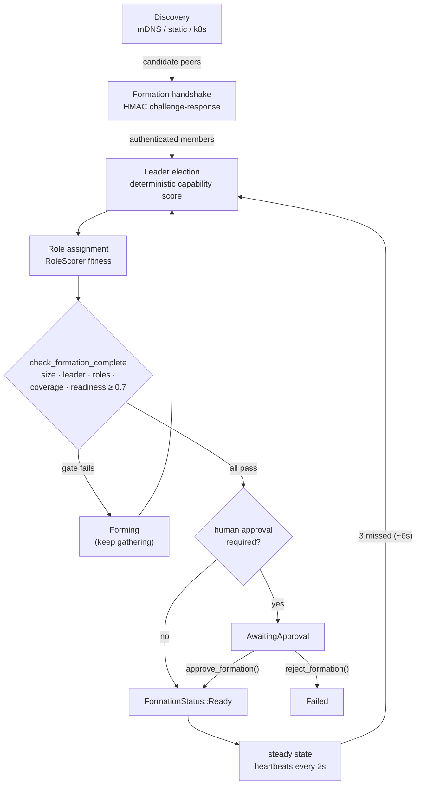
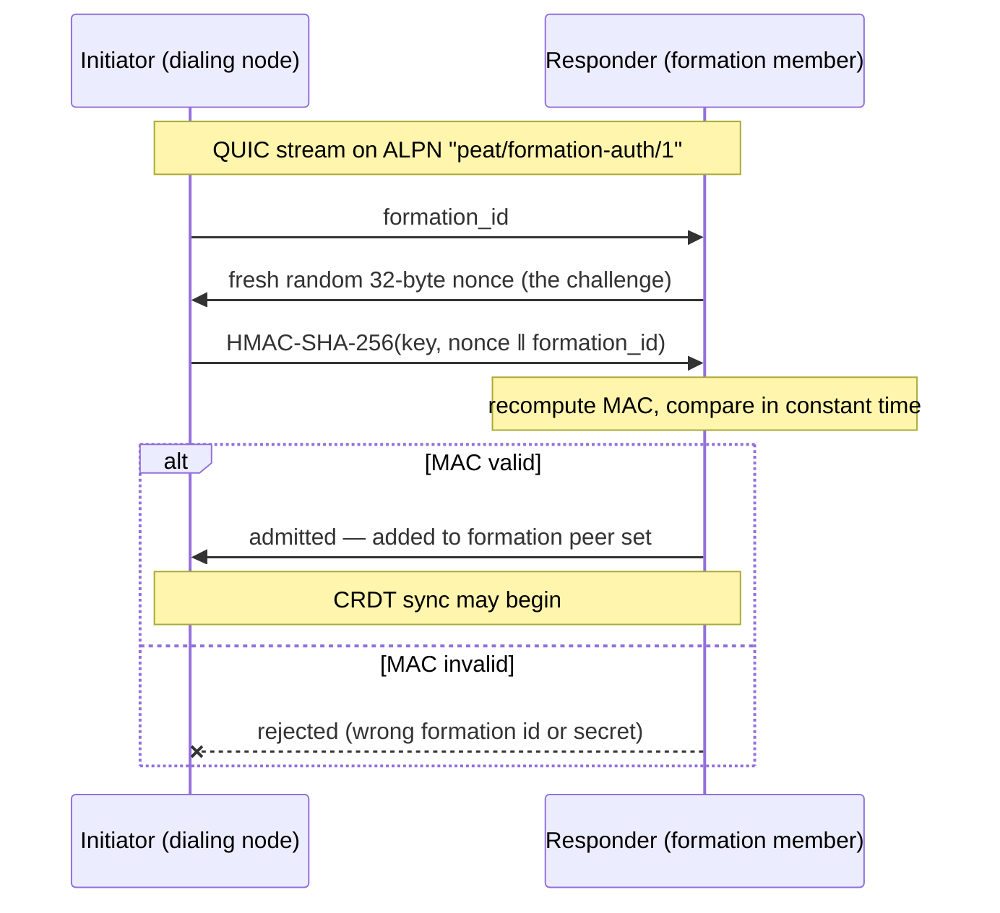
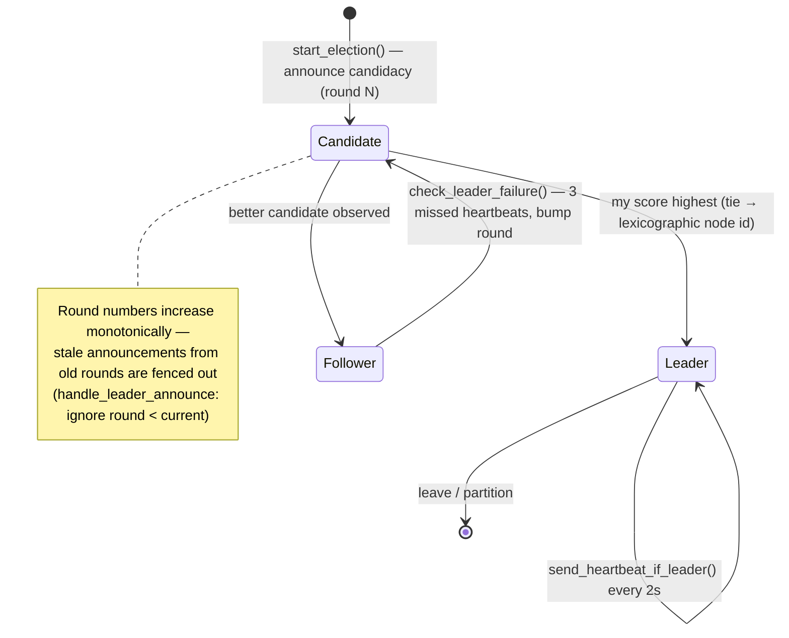

# Module 2·5 — Forming a Cell & Electing Leaders

**Goal:** a precise, code-level walkthrough of how independent nodes discover each other,
authenticate into a **formation**, elect a leader, take roles, confirm readiness, and recover when
the leader is lost. This is the deep-dive companion to Module 2 §2.2–2.4, mirroring the repo's own
guide [`peat/docs/guides/developer/FORMATION_AND_LEADERSHIP.md`](../peat/docs/guides/developer/FORMATION_AND_LEADERSHIP.md)
and the normative spec [`peat/docs/spec/004-coordination.md`](../peat/docs/spec/004-coordination.md).

> **A note on labels.** Every capability below is tagged **Shipped** (in code, tested),
> **In-flight** (open issue/PR/epic), **Proposed** (an ADR exists with no implementation), or
> **Speculative** (a teaching design that exists nowhere yet). The operating rule throughout PEAT's
> material is **code over docs**: where a README, a spec, or an ADR disagrees with the source, the
> source wins, and this module cites `path:line` so you can check. Almost everything in formation and
> leader election is **Shipped** — this is one of the most complete subsystems in PEAT.

> **Why a whole module on this?** Formation plus leader election is the single most important runtime
> behavior in PEAT, and it is the part newcomers most often misread. Two ideas trip people up:
> membership is not the same thing as reachability, and the election reaches a single answer without
> any consensus round. The repo gives this its own guide; so do we.

---

## 2·5.1 Vocabulary — the hierarchy enum, and why it is mid-rename

State aggregates upward through a fixed set of tiers. The enum that peat-mesh ships **today** is
`peat_mesh::beacon::HierarchyLevel` (`peat-mesh/src/beacon/types.rs:55-67`):

| Tier | `HierarchyLevel` value | Meaning | Design-intent sizing |
|------|------------------------|---------|----------------------|
| Node | `Node` (0) | a single mesh participant — vehicle, sensor, handset, container | — |
| Cell | `Cell` (1) | smallest aggregation; **one leader + N members** | 4–13 nodes |
| Cohort | `Cohort` (2) | a set of cells sharing a mission, role, region, or time window | 2–4 cells |
| Federation | `Federation` (3) | an alliance of cohorts coordinating without central authority | 2–4 cohorts |
| Coalition | `Coalition` (4) | top tier; an alliance of federations | large-scale span |

The sizing ranges are doc-comment **design intent** (`beacon/types.rs:50-54`), not enforced
invariants — nothing in the code rejects a 20-node cell.

> **The leaf tier is `Node`, not `Platform`.** A skeptical reader will grep `HierarchyLevel` and find
> `Node = 0`. Some design notes and an in-progress ADR use `Platform` for the leaf; the shipped enum
> does not. Trust the enum.

> **⚠️ Vocabulary drift — you WILL see several names for the same idea.** The abstract
> Cell/Cohort/Federation/Coalition vocabulary comes from **ADR-066, which is `Status: Proposed`**
> (`peat/docs/adr/066-abstract-hierarchy-vocabulary.md:3`) and has only **partially landed**. The
> rename is **In-flight** across the workspace (epics #904 workspace-wide rename, #968/#970 converging
> the base-unit name per ADR-068, also Proposed). Concretely, at the audited commits:
> - **peat-mesh** and **peat-protocol** ship `Node / Cell / Cohort / Federation / Coalition`
>   (`beacon/types.rs:56-67`; `peat-protocol/src/security/authorization.rs`).
> - **peat-btle** still ships the **legacy military** enum `Platform / Squad / Platoon / Company`
>   (`peat-btle/src/lib.rs`) — it does not track ADR-066 yet.
> - **peat-schema** protobuf message *types* are already on the new vocabulary
>   (`CellSummary`/`CohortSummary`/`FederationSummary`, see §2·5.10), but some legacy *function* names
>   (`update_squad_summary`, etc.) survive as call sites the rename has not reached
>   (ADR-066 notes this explicitly).
> - The **whitepaper** and older drafts use **Node / Team / Group / Formation / Cluster / Root**.
>
> They all describe the same hierarchical idea. Use Cell/Cohort/Federation/Coalition in new
> peat-mesh / peat-protocol code. Formation and leader election happen at the **cell** tier — that is
> our focus here.

The formation/leadership primitives live in `peat-protocol::cell` and `peat-protocol::models`. The
public re-exports (`peat-protocol/src/cell/mod.rs:13-16`) are: **Shipped**.

```rust
use peat_protocol::cell::{
    CellCoordinator, FormationStatus, LeaderElectionManager, LeadershipScore,
    CellMessageBus, MessagePriority, RoutingContext,
};
use peat_protocol::models::{CellRole, RoleScorer};
use peat_protocol::models::cell::{CellState, CellStateExt, CellConfig, CellConfigExt};
```

`CellState` and `CellConfig` are protobuf types from `peat_schema` (`peat_schema::cell::v1`);
`CellStateExt` / `CellConfigExt` are extension traits in `peat-protocol` that add the CRDT operations
and constructors (`peat-protocol/src/models/cell/mod.rs:12,56`).

---

## 2·5.2 The lifecycle: discover → form → elect → assign → confirm

```
node (Node) ──discovery──▶ candidate peers ──formation handshake──▶ member of formation
              mDNS/static/k8s                  HMAC challenge/resp
       │
       ├─ leader election (capability score + lexicographic tie-break) ──▶ leader_id set on Cell
       ├─ role assignment (RoleScorer fitness) ──▶ members take Sensor/Compute/Relay/…
       └─ CellCoordinator: size + leader + roles + coverage + readiness (+ optional human approval)
                                       │
                                       ▼  FormationStatus
                                  Ready ──▶ (heartbeats) ──leader lost──▶ re-election
```

Five steps, then a steady state maintained by heartbeats with automatic re-election on leader loss.
All five steps are **Shipped**. The same lifecycle with its decision gates:



> **Legend.** Rectangles are states/actions; the diamond `check_formation_complete` is the single
> readiness gate (§2·5.7); the `human approval` diamond fires only when a present capability requires
> oversight. Arrows are transitions, labeled with the event that triggers them. The `2s` / `~6s`
> timings are the shipped defaults (`leader_election.rs:239-240`).

---

## 2·5.3 Step 1 — Discovery (candidates only) · **Shipped**

Discovery (`peat_mesh::discovery`) yields **candidate addresses** — it does **not** grant
membership. Strategies: `MdnsDiscovery` (zero-config LAN), static peer lists, and Kubernetes
EndpointSlices (all **Shipped**; discovery now lives in `peat_mesh::discovery` after `peat-discovery`
was retired under peat#919). A `DiscoveryEvent::PeerFound` becomes a *formation-authenticated*
connection only after the handshake below. This separation is exactly the membership-≠-reachability
point: being able to reach a peer says nothing about whether it belongs in your formation.

## 2·5.4 Step 2 — Formation & authentication (the handshake) · **Shipped**

**Membership is proven by a shared formation key, never by mere reachability.** This is the security
crux of the whole system.

`FormationKey` (`peat_mesh::security::FormationKey`) is derived from the `formation_id` and a 32-byte
shared secret via **HKDF-SHA-256** — salt = `formation_id`, IKM = the shared secret, info =
`b"peat-protocol-v1-formation"` (`peat-mesh/src/security/formation_key.rs:69-83`). HKDF-SHA-256 is a
FIPS-approved KDF (SP 800-56C / 800-108). Mixing the `formation_id` into the salt means two formations
that happen to share a base secret still derive **different** keys.

```rust
use peat_mesh::security::FormationKey;
let key = FormationKey::from_base64(formation_id, base64_shared_key)?;  // from operator creds
// or: FormationKey::new(formation_id, &shared_secret_32);
```

> **Crypto posture (FIPS).** Everything in this module uses FIPS-approved primitives only:
> **HKDF-SHA-256** (key derivation), **HMAC-SHA-256** (the handshake MAC), **SHA-256** (hashing),
> **Ed25519** (identity), **AES-256-GCM** (transport AEAD). There is **no ChaCha20** anywhere on the
> formation/leadership path — grep confirms it. One honesty caveat applies ecosystem-wide: these are
> FIPS-*approved algorithms* running in pure-Rust crates that are **not themselves CMVP-validated
> modules**; a true FIPS 140-3 boundary requires the KMS/HSM path in peat-gateway, and the
> software-module migration to `aws-lc-rs` is **In-flight** (peat-btle#75). The governing decision is
> **ADR-060, which is `Status: Proposed`** even though its §5 cryptographic choices are already
> implemented in code (`peat/docs/adr/060-encryption-tiers.md:3`).

The handshake runs over a dedicated ALPN **before any state is exchanged**
(`peat-protocol/src/network/formation_handshake.rs`, ALPN `b"peat/formation-auth/1"` at `:49`,
30-second timeout at `:58` — raised from 5 s under issue #373 for large hierarchical formations):

1. Initiator opens a stream on the handshake ALPN and sends its `formation_id`.
2. Responder replies with a fresh random **32-byte nonce** (the challenge).
3. Initiator returns `HMAC-SHA-256(key, nonce ‖ formation_id)`
   (`formation_key.rs:147,162` — `respond_to_challenge` → `compute_response`).
4. Responder recomputes the same MAC and compares in **constant time** (`subtle::ConstantTimeEq`,
   `formation_key.rs:152-157`). Match ⇒ admitted; mismatch ⇒ rejected.

As a sequence diagram:



> **Legend.** Solid arrows are messages sent; the dashed arrow (`--x`) is a rejection. The `alt`
> block shows the two outcomes of the constant-time verify. The formation key itself **never crosses
> the wire** — only the per-handshake MAC does.

Because the nonce is fresh per handshake and the `formation_id` is mixed into the MAC, the exchange
is **non-replayable**, and a node in a different formation (different id or secret) is rejected. Only
after success is the peer added to the formation's peer set and allowed to sync.

> Most applications get this for free: standing up `peat_mesh::AutomergeBackend` with a `FormationKey`
> performs the handshake on each connection. Call `perform_initiator_handshake` /
> `perform_responder_handshake` directly only when building a custom transport (`formation_handshake.rs:74,186`).

Once authenticated, a node is recorded in the cell document. `CellState` is the cell's data model;
its constructor takes a `CellConfig` (which carries `max_size` / `min_size`), and `add_member` is the
OR-Set add operation (`models/cell/mod.rs:24,173`):

```rust
use peat_protocol::models::cell::{CellState, CellStateExt, CellConfig, CellConfigExt};
let mut cell = CellState::new(CellConfig::new(/* max_size */ 13));
cell.add_member("node-a".to_string());   // returns true if newly added (false if full or dup)
```

## 2·5.5 Step 3 — Leader election (deterministic, no consensus) · **Shipped**

`LeadershipScore::from_capabilities` reduces a node's capabilities to one weighted score. These
weights are the real, tested values in `peat-protocol/src/cell/leader_election.rs:100-106`:

```rust
let score = LeadershipScore::from_capabilities(&capabilities);
// total = compute·0.30 + communication·0.25 + sensors·0.20 + power·0.15 + reliability·0.10
```

(In the current model, `power` and `reliability` default to `1.0` because there is no power/reliability
capability type yet, and each `Sensor` capability adds 0.25 up to a 1.0 cap — `leader_election.rs:84-98`.)

> **Two different scoring functions live in two different layers — do not merge them.** The
> compute/comm/sensors/power/reliability weights above are the **peat-protocol cell-formation**
> election (matches spec-004). The **peat-mesh runtime** layer has its *own* deterministic role
> selection, `DynamicHierarchyStrategy::determine_role`, which scores on a **different** basis —
> mobility, (1 − CPU%), (1 − memory%), battery%, with multipliers for `can_parent` and parent
> priority (`peat-mesh/src/hierarchy/dynamic_strategy.rs`). Both are deterministic and vote-free, but
> if you verify the cell-formation weights against `dynamic_strategy.rs` you will find different
> inputs — you are looking at the wrong layer. This module covers the peat-protocol cell layer.

Ties break by **lexicographic node id**, so every node independently computes the *same* winner
without exchanging votes — that is what makes it split-brain safe
(`leader_election.rs:118-129`, with tests at `:520-549`):

```rust
let winner_is_me =
    my_score.compare(&their_score, my_id, their_id) == std::cmp::Ordering::Greater;
```

`LeaderElectionManager` runs the state machine (`Candidate → Leader | Follower`) over the
`CellMessageBus` (`leader_election.rs:192-242`):

```rust
let election = LeaderElectionManager::new(cell_id, my_node_id, bus, my_capabilities);
election.start_election()?;                 // announce candidacy (round 1)
election.process_election_message(&msg)?;   // handle LeaderAnnounce / Heartbeat
election.get_state();  election.get_leader();  election.get_round();
```

> **Honest caveat about the message path.** The manager *does* exchange `LeaderAnnounce` and
> `Heartbeat` messages over the bus and tracks monotonic round numbers — so the state machine below
> is real. But in the current code, the convergence comparison inside `handle_leader_announce` is a
> documented **simplification**: it follows the higher node id rather than comparing the actual
> leadership scores carried in the message (`leader_election.rs:340-345`, comment: "In a production
> system, we'd compare actual scores received in messages"). The `LeadershipScore::compare` function
> with the full weights *is* the intended comparator and is unit-tested; wiring the score into the
> announce message is the remaining gap. Treat score-driven convergence over messages as **In-flight**
> and node-id convergence as what ships today.

Defaults, straight from the constructor (`leader_election.rs:238-240`): **election timeout 5 s**,
**heartbeat interval 2 s**, **3 missed heartbeats tolerated** (so ~6 s to detect a failed leader).

The election state machine:



> **Legend.** States are `Candidate` / `Leader` / `Follower`; `[*]` is the entry/exit pseudo-state.
> Transition labels name the method that drives them. The note explains round fencing
> (`leader_election.rs:308-311`).

> **The spec adds a human-in-the-loop dimension** (`004-coordination.md` §5). The full leadership
> score can be a *hybrid* of the technical score above and an **authority score** built from human
> operator rank, authority level, and cognitive load. The policy is a real, shipped enum —
> `LeadershipPolicy` (`peat-protocol/src/cell/election_policy.rs:134-146`): `RankDominant` /
> `TechnicalDominant` / `Hybrid { authority_weight, technical_weight }` / `Contextual`. The default is
> `Hybrid { 0.6, 0.4 }` and, by default, autonomous (operator-less) nodes are **not** eligible to lead
> (`allow_autonomous_leaders: false`, `election_policy.rs:26-38`) — **autonomy under human authority**
> is the shipped default posture, not an add-on. The spec's tie-break order is human authority rank →
> longer cell-membership duration → higher device id (`004-coordination.md` §5.4). The operator
> `AuthorityLevel` ladder it draws on is `UNSPECIFIED / OBSERVER / ADVISOR / SUPERVISOR / COMMANDER`
> (`peat-schema/proto/node.proto:61-67`).

## 2·5.6 Step 4 — Role assignment (everything except Leader) · **Shipped**

The **Leader is elected**; every *other* role is **assigned** by fitness scoring. `CellRole` has
**seven** variants (`peat-protocol/src/models/role.rs:14-29`, with `assignable_roles()` excluding
`Leader` at `:33-42`):

| Role | Assigned? | Purpose | Required capability |
|------|-----------|---------|---------------------|
| `Leader` | elected | coordinates the cell | Communication |
| `Sensor` | assigned | detection / reconnaissance | Sensor |
| `Compute` | assigned | processes data, runs analysis | Compute |
| `Relay` | assigned | extends network range | Communication |
| `Strike` | assigned | engages targets (effectors) | **Payload** |
| `Support` | assigned | logistics / medical / maintenance | (none) |
| `Follower` | assigned (default) | general member | (none) |

The required-capability column is from `CellRole::required_capabilities()` (`role.rs:60-70`). Note
`Strike` requires `CapabilityType::Payload` — there is **no separate `Weapon` capability type**;
weapons are modeled under `Payload`. `RoleScorer` scores a node against a role from its capabilities,
its human operator's MOS (if bound), and its health (`role.rs:136-185`):

```rust
if let Some((role, fitness)) = RoleScorer::best_role_for_node(&node_config, &node_state) {
    tracing::info!(?role, fitness, "assigned role");
}
```

Required capabilities are **blocking** — a missing required capability returns `None`, disqualifying
the node from that role (`role.rs:146-155`).

> The spec also defines a `Deputy` — the second-highest leadership score, used for fast failover
> (the deputy detects the leader's heartbeat timeout and initiates an emergency election,
> `004-coordination.md:754,885`). `Deputy` is **spec-defined** (it is *not* a `CellRole` enum
> variant), so treat it as the coordination spec's design rather than a shipped `CellRole`.

## 2·5.7 Step 5 — Confirming the formation · **Shipped**

A cell is not "ready" just because a leader exists. `CellCoordinator::check_formation_complete()` is
the single gate, checking the criteria **in this order** (`peat-protocol/src/cell/coordinator.rs:97-168`,
with defaults set in `new()` at `:66-87`):

1. **Minimum size** — default 3 (`min_size`). Below it ⇒ `Failed`.
2. **A confirmed leader** (`leader_id` is `Some`). Missing ⇒ keep `Forming` (not a failure).
3. **Every member has an assigned role.** Any unassigned ⇒ keep `Forming`.
4. **Required capability coverage** — default `Communication` + `Sensor` present across the cell.
   Missing ⇒ `Failed`.
5. **Readiness ≥ threshold** — default `min_readiness = 0.7`. Below it ⇒ `Failed`.
6. **Human approval**, *if* any present capability requires oversight
   (`needs_human_approval`, `:174-179`).

The result is a `FormationStatus` (`coordinator.rs:33-44`):

```rust
match &coordinator.status {
    FormationStatus::Forming          => { /* still gathering members/roles */ }
    FormationStatus::AwaitingApproval => { coordinator.approve_formation()?; /* or reject_formation(reason) */ }
    FormationStatus::Ready            => { /* operational; may aggregate upward */ }
    FormationStatus::Failed(reason)   => { tracing::warn!(%reason, "formation failed"); }
}
// can_transition_to_hierarchical() == matches!(status, Ready)   // coordinator.rs:233-235
```

> **Autonomy under human authority — shipped, not aspirational.** Gate 6 is the contract: if any
> oversight-required capability is present (for example a `Payload`-bearing node whose bound operator
> has only `Observer` authority), the formation halts at `AwaitingApproval` until a human calls
> `approve_formation()` — it cannot reach `Ready` on its own (`coordinator.rs:149-155`, test
> `test_formation_awaiting_approval` at `:480`). A machine never crosses into the operational state
> for a mission-critical capability without an explicit human decision.

## 2·5.8 Failover, re-election & partitions · **Shipped**

The leader proves liveness with heartbeats; followers re-elect when the heartbeats stop
(`leader_election.rs:364-407`):

```rust
election.send_heartbeat_if_leader()?;        // leader side, every ~2s
if election.check_leader_failure()? {
    // 3 missed (~6s): reset to Candidate, clear leader, bump round, re-announce
}
```

Re-election reuses the same deterministic scoring, so the cell converges on the next-best node —
again without a vote. **Round numbers** increase monotonically (`trigger_reelection` at `:386-407`),
so late announcements from a prior round are ignored (`handle_leader_announce` at `:308-311`).
**Under partition**, each side elects locally — liveness is favored over global agreement, so there
is no quorum stall and no split-brain hang. On heal, the two sides reconcile deterministically
through CRDT merge (next section). Partition detection and autonomous operation are **Shipped** in
`peat-mesh/src/topology/`.

## 2·5.9 State, sync & conflict resolution · **Shipped**

Membership and leadership are not RPC state — they are fields of the `CellState` document, and the
type carries **typed CRDT merge semantics** so concurrent edits converge. `CellStateExt::merge`
implements the per-field rules directly (`peat-protocol/src/models/cell/mod.rs:250-274`, with the
field roles documented at `:1-6` and `:69-114`):

| Field | CRDT type | Merge rule (as implemented) |
|-------|-----------|------------------------------|
| `members` | OR-Set | union — concurrently-added members are kept (`:251-256`) |
| `capabilities` | G-Set | union by capability id — grow-only (`:258-263`) |
| `leader_id`, `cohort_id` | LWW-Register | the value from the newer `timestamp` wins (`:265-273`) |

```rust
cell.set_leader("node-a".to_string()).expect("leader must be a current member"); // coordinator.rs path; mod.rs:202
cell.remove_member("node-a");   // OR-Set remove; also clears leader_id if it was the leader (mod.rs:188)
cell.merge(&other_replica);     // OR-Set / G-Set / LWW per field
```

> **The nuance worth getting right.** `CellState` and `CellConfig` are **protobuf** types
> (`peat_schema::cell::v1`); the proto even labels the fields "G-Set: grow-only" and
> "OR-Set" in comments (`peat-schema/proto/cell.proto`). The OR-Set/LWW/G-Set logic lives in the
> `CellStateExt::merge` extension trait — it is **hand-rolled typed-CRDT merge over the protobuf
> struct**, not Automerge's internal CRDT machinery. When a `CellState` rides the mesh, the storage
> layer encodes the protobuf to bytes and the **Automerge backend** stores and syncs those bytes
> (`peat-mesh/src/storage/traits.rs`, `CellState::encode`/`decode`); the field-level convergence you
> see here is `CellStateExt::merge`, applied on the model. So both statements are true and at
> different layers: the *document type* has typed-CRDT merge rules; the *transport* is Automerge over
> Iroh QUIC. Earlier material that said "synced through the Automerge backend, with these per-field
> CRDT types" conflated the two — the per-field types are the model's own merge, the Automerge backend
> is the wire. (For contrast: the typed `LwwRegister` / `GCounter` / `OrSet` *wire structs* you may
> have seen referenced elsewhere are the embedded-tier CRDTs in peat-lite and peat-btle — a different
> codebase from `CellStateExt`. peat-lite's `OrSet` is in fact only a reserved wire byte with no
> struct implementation.)

Because `leader_id` is LWW (newer timestamp wins), two partitions that elected different leaders
converge to one deterministically on merge — no special reconciliation code path. The `set_leader`
guard also enforces that a leader must be a current member (`mod.rs:202-209`), and removing the
leader clears `leader_id` (`mod.rs:192-195`).

## 2·5.10 Scaling above the cell · **Shipped (aggregation); roll-up data flow shipped**

Cells do not talk to every node in a federation — they **aggregate**. A cell leader publishes a
`CellSummary`; a cohort coordinator reduces many `CellSummary`s into a `CohortSummary`; that rolls up
to `FederationSummary` and on to the coalition level. These message types are real and on the **new**
vocabulary (`peat-schema/proto/hierarchy.proto:24,72,122` — `CellSummary` / `CohortSummary` /
`FederationSummary`; `CohortSummary` is documented as reducing N `CellSummary` messages to one).

- **Each tier elects/assigns its own coordinator** — a cohort coordinator is *not* a cell leader.
  Leaders route upward; non-leaders cannot cross-cell or reach the zone
  (`peat-mesh/src/hierarchy/router.rs`).
- **Summaries sync cheaply** under the `LatestOnly` CRDT compaction mode (only the newest summary
  matters), as opposed to `FullHistory` (peat-mesh CRDT compaction modes).
- **Commands flow down, state flows up.** Message priority **escalates on the way up**: a
  `RoutingContext::CellToZone` hop bumps `Low→Normal→High→Critical`, while intra-cell and downward
  (`ZoneToCell`) hops keep priority unchanged (`peat-protocol/src/cell/messaging.rs:106-119`,
  `MessagePriority::escalate`). This per-hop escalation is distinct from the per-collection QoS class
  a message carries end-to-end (see Module 6); the two are separate mechanisms.

For *how* nodes are grouped into tiers (static / dynamic / hybrid), see **ADR-024
(`Status: Accepted (Implementation Complete)`, `peat/docs/adr/024-flexible-hierarchy-strategies.md`)**
— one of the few Accepted ADRs in this area. The strategies `Static / Dynamic / Hybrid` ship in
`peat-mesh/src/hierarchy/`.

---

## API quick reference

All paths verified at the audited commits. Status: **Shipped** unless noted.

| Concern | Type / fn | File · evidence |
|---------|-----------|-----------------|
| Formation key | `peat_mesh::security::FormationKey` (`new`, `from_base64`, `respond_to_challenge`, `verify_response`) | `peat-mesh/src/security/formation_key.rs:63,85,147,152` |
| Handshake | `network::formation_handshake::{FORMATION_HANDSHAKE_ALPN, perform_initiator_handshake, perform_responder_handshake}` | `peat-protocol/src/network/formation_handshake.rs:49,74,186` |
| Leadership score | `cell::LeadershipScore::{from_capabilities, compare}` (weights 0.30/0.25/0.20/0.15/0.10) | `peat-protocol/src/cell/leader_election.rs:80,119` |
| Election state machine | `cell::LeaderElectionManager` (`Candidate→Leader\|Follower`, rounds, heartbeats) | `peat-protocol/src/cell/leader_election.rs:192` |
| Election policy (human-in-loop) | `cell::election_policy::{LeadershipPolicy, ElectionPolicyConfig, ElectionContext}` | `peat-protocol/src/cell/election_policy.rs:134,13,177` |
| Formation completion | `cell::CellCoordinator`, `cell::FormationStatus` (gates: size 3, comm+sensor, readiness 0.7, oversight) | `peat-protocol/src/cell/coordinator.rs:47,33,66` |
| Tier-boundary priority | `cell::messaging::{MessagePriority, RoutingContext}` (`escalate`) | `peat-protocol/src/cell/messaging.rs:43,62,106` |
| Roles | `models::CellRole` (7 variants), `models::RoleScorer` | `peat-protocol/src/models/role.rs:14,125` |
| Cell document | `models::cell::{CellState, CellStateExt, CellConfig, CellConfigExt}` (OR-Set / LWW / G-Set merge) | `peat-protocol/src/models/cell/mod.rs:12,56,250` |
| Hierarchy levels | `peat_mesh::beacon::HierarchyLevel` (**leaf is `Node`, not `Platform`**) | `peat-mesh/src/beacon/types.rs:55-67` |

## Try it

1. Read [`FORMATION_AND_LEADERSHIP.md`](../peat/docs/guides/developer/FORMATION_AND_LEADERSHIP.md)
   and the normative [`docs/spec/004-coordination.md`](../peat/docs/spec/004-coordination.md). Treat
   both as secondary to the source — where they disagree with code, the code wins.
2. In `peat-protocol/src/cell/leader_election.rs`, confirm the score weights (`from_capabilities`,
   `:100-106`) and the `compare` tie-break by node id (`:118-129`). Notice the documented
   simplification in `handle_leader_announce` (`:340-345`) — score-over-message convergence is
   In-flight.
3. In `peat-protocol/src/network/formation_handshake.rs`, find `FORMATION_HANDSHAKE_ALPN` (`:49`) and
   trace the 4-step challenge/response; confirm the MAC input `nonce ‖ formation_id` in
   `formation_key.rs:162`.
4. In `peat-mesh/src/beacon/types.rs`, confirm the leaf enum value is `Node = 0` — then grep
   `peat-btle/src/lib.rs` to see the legacy `Platform/Squad/Platoon/Company` enum still in flight.

## Checkpoint

- Why is membership "not the same as reachability," and what exactly proves membership?
- Walk the 4-step handshake. What is the MAC computed over, and why is it non-replayable?
- Why does deterministic scoring make leader election split-brain safe? What converges the message
  path today, and what is still In-flight?
- Which role is elected vs. assigned? How many `CellRole` variants are there, and what does `Strike`
  require? What is the spec's `Deputy` for?
- List the six gates in `check_formation_complete`, in order. Which one enforces
  autonomy-under-human-authority?
- After a partition heals, how do two different `leader_id`s reconcile, and why is no special code
  needed? At which layer do the OR-Set/LWW/G-Set rules actually run?

---

Next: [Module 3 — The Network Layer: `peat-mesh` »](03-peat-mesh.md)
