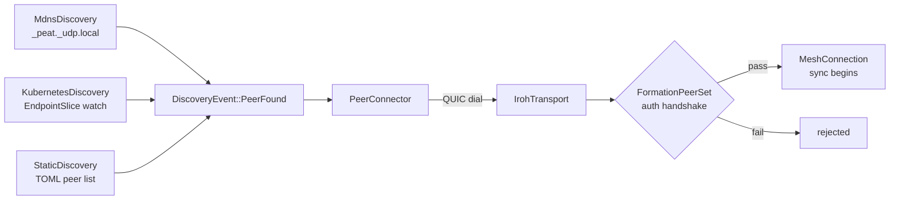
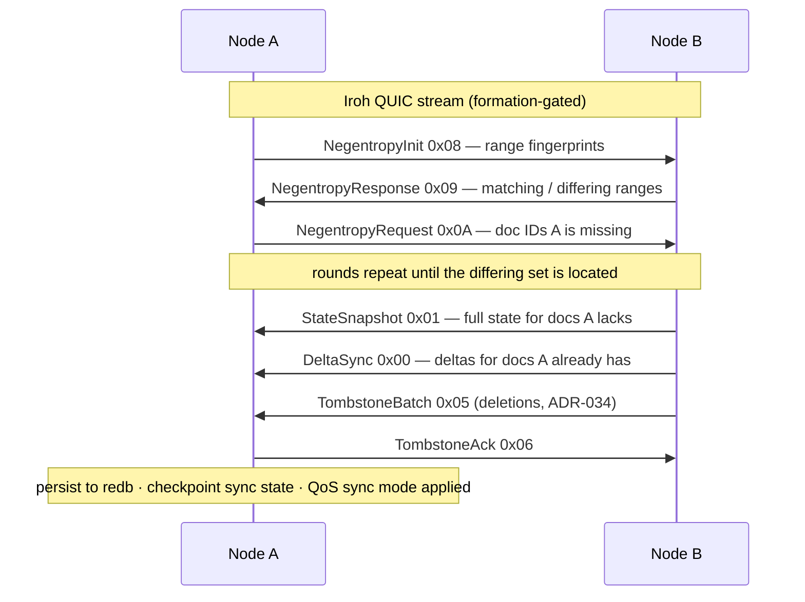
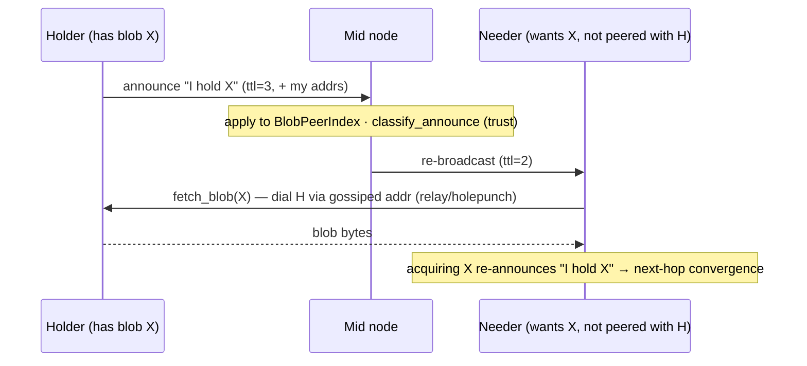
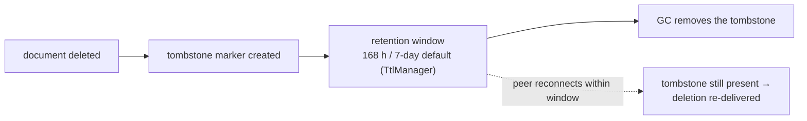

# Module 3 — The Network Layer: `peat-mesh`

**Goal:** understand how bytes actually move between nodes. `peat-mesh` is the peer-to-peer
networking library: pluggable transports, Automerge CRDT sync over QUIC, peer discovery, and
topology formation. Repo path: [`peat-mesh/`](../peat-mesh/). Audited against
`peat-mesh@71fc3d5` (`0.9.0-rc.43`).

> **How to read the labels.** Every capability below carries one of four tags so you always know
> what is real:
> **[Shipped]** — in code, tested · **[In-flight]** — open issue/PR/epic ·
> **[Proposed]** — an ADR exists but no implementation · **[Speculative]** — a teaching design
> not in any repo. When the code and an ADR or README disagree, the code wins, and the citation
> says so.

> **Mental model.** If `peat-protocol` is the "what" (cells, hierarchy, policy), `peat-mesh` is
> the "how" (connections, sync messages, persistence). `peat-protocol` re-exports `peat-mesh`, so
> an application developer rarely calls it directly — but everything they do bottoms out here.

---

## 3.1 Two entry points **[Shipped]**

### (a) As a library — builder or direct constructor

You can assemble a `PeatMesh` two ways, both real in
[`peat-mesh/src/mesh.rs`](../peat-mesh/src/mesh.rs). The fluent **builder**
(`PeatMeshBuilder`, `mesh.rs:576-710`) reads cleanly:

```rust
use std::sync::Arc;
use peat_mesh::{MeshConfig, PeatMeshBuilder};

let mesh = PeatMeshBuilder::new(MeshConfig::default())
    .with_transport(iroh_transport)     // Arc<dyn MeshTransport>
    .with_hierarchy(hierarchy_strategy)  // Arc<dyn HierarchyStrategy>
    .with_discovery(discovery_strategy)  // Box<dyn DiscoveryStrategy>
    .build();
mesh.start()?;
```

If you prefer to construct first and inject later, `PeatMesh::new(config)` (`mesh.rs:190`) plus
the `set_transport` / `set_hierarchy` / `set_discovery` injectors (`mesh.rs:349-434`) do the same
job. Either form ends at `mesh.start()` (`mesh.rs:224`).

`MeshConfig` ([`src/config.rs:114-130`](../peat-mesh/src/config.rs)) composes the sub-configs:
`topology`, `discovery`, `security`, `iroh`, `compaction`, and an optional `transport_manager`.
Each subsystem is optional and injected before `.build()`.

### (b) As a binary — `peat-mesh-node`

[`peat-mesh/src/bin/peat-mesh-node.rs`](../peat-mesh/src/bin/peat-mesh-node.rs) (requires
`--features node`) is an all-in-one reference node, and reading it top to bottom is the single
best way to see how the pieces wire together. **[Shipped]** — but note this is a *reference/demo*
binary; the production deployable node is **peat-node**, a separate gRPC sidecar covered in
Module 5. The binary:

1. Reads env vars (`PEAT_FORMATION_SECRET`, Iroh bind port, `PEAT_DISCOVERY`, `PEAT_BROKER_PORT`).
2. Builds a `FormationKey` from `PEAT_FORMATION_SECRET` and derives the Iroh secret key from the
   same secret via **HKDF-SHA-256** (`bin/peat-mesh-node.rs:87-104`; ADR-062, peat#918). HKDF-SHA-256
   is FIPS-approved (SP 800-56C/800-108).
3. Picks a discovery strategy from `PEAT_DISCOVERY` — `KubernetesDiscovery` or `MdnsDiscovery`
   (the binary defaults to `"kubernetes"`, `bin:53`; choose `mdns` for LAN demos).
4. Builds an Iroh endpoint gated by a `FormationPeerSet` (only formation members may connect).
5. Opens the `AutomergeStore` (backed by **redb**, `Cargo.toml:152`) plus TTL/GC/eviction services.
6. Starts the `AutomergeSyncCoordinator` + `SyncChannelManager` to drive CRDT sync.
7. Builds the mesh and calls `mesh.start()`.
8. Spawns a `PeerConnector` to dial discovered peers (`src/peer_connector.rs`).
9. Launches an Axum **broker** HTTP/WS server for introspection (feature `broker`).
10. Waits for SIGTERM/SIGINT and shuts everything down cleanly (`bin:692-701`).

---

## 3.2 Source layout (the modules that matter) **[Shipped]**

Every type below was confirmed present at the audited HEAD.

| Module | Central types | Responsibility |
|--------|---------------|----------------|
| `transport/` | `MeshTransport`, `MeshConnection`, `NodeId`, `PeerEvent`, `Translator`, `TransportManager` | Pluggable transport backends (Iroh QUIC, peat-lite UDP, BLE) + cross-transport bridging |
| `storage/` | `AutomergeStore`, `AutomergeSyncCoordinator`, `NegentropySync`, `SyncChannelManager`, `TtlManager`, `IrohFileDistribution`, `BlobAnnounce` | CRDT persistence (redb + Automerge), the sync protocol, negentropy set reconciliation, TTL/GC, **blob/file distribution + provider gossip** (relocated here from `peat-protocol` per peat#992 — see §3.4b) |
| `discovery/` | `DiscoveryStrategy`, `PeerInfo`, `DiscoveryEvent` | mDNS, Kubernetes, static-config, hybrid peer discovery |
| `topology/` | `TopologyManager`, `TopologyBuilder`, `PeerSelector`, `PartitionDetector` | Hierarchy/leader formation from beacon metrics; partition detection; autonomous mode |
| `routing/` | `MeshRouter`, `SelectiveRouter`, `DataPacket`, `DataDirection` | Upward telemetry aggregation vs. downward command dissemination (anti-flood) |
| `security/` | `DeviceKeypair`, `DeviceId`, `EncryptionKeypair`, `FormationKey`, `MeshCertificate`, `MeshGenesis`, `CertificateStore` | Ed25519 identity, P-256/AES-GCM encryption, formation-key auth, certificate-based enrollment |
| `beacon/` | `GeographicBeacon`, `BeaconBroadcaster`, `BeaconObserver`, `BeaconJanitor` | Geographic beaconing for proximity-based topology |
| `qos/` | `QoSClass`, `SyncMode`, `BandwidthAllocation`, `EvictionController` | 5-level priority, sync-mode override, bandwidth allocation, eviction/GC |
| `broker/` | `Broker`, `BrokerConfig`, `MeshBrokerState`, `MeshEvent` | Axum HTTP/WS facade for mesh introspection + OTA (feature `broker`) |
| `network/` | `IrohTransport` | Iroh QUIC endpoint wrapper, local mDNS discovery, peer state |
| `sync/` | `DocumentStore`, `SyncEngine`, `DataSyncBackend` | The abstract sync traits (`sync/traits.rs`) that `peat-protocol` re-exports |
| `hierarchy/` | `HierarchyStrategy`, `NodeRole`, `HierarchyLevel` | Static / dynamic (election) / hybrid hierarchy assignment |

**Two notes a skeptical reader will check.**

- **`security/` does not use X.509.** Enrollment is built on `MeshCertificate`
  (`security/certificate.rs:118`): a compact, Ed25519-signed wire format
  (`[subject_pubkey:32][mesh_id][node_id][tier:1][permissions:1][issued_at:8][expires_at:8][issuer_pubkey:32][signature:64]`,
  148 B minimum) — *not* an X.509 certificate. The mesh ships `MeshCertificate`, `CertificateStore`,
  `MeshGenesis`, and a `StaticEnrollmentService` (`bin:426`). Broader membership-certificate
  enrollment is **[In-flight]** as epic peat#592.
- **`HierarchyLevel`'s leaf tier is `Node`, not `Platform`.** ADR-066 (abstract hierarchy
  vocabulary) intends a `Platform/Cell/Cohort/Federation/Coalition` ladder, but ADR-066 is
  **[Proposed]** and the rename is mid-flight: the shipped enum is
  `{ Node, Cell, Cohort, Federation, Coalition }` (`beacon/types.rs`). If you grep `HierarchyLevel`
  you will see `Node`. The `Node → Platform` rename is tracked by peat#904 / peat#968.

---

## 3.3 Key data flow #1 — discovery → connection **[Shipped]**

```
DiscoveryStrategy::start()
   ├─ MdnsDiscovery       → broadcasts _peat._udp.local on the LAN
   ├─ KubernetesDiscovery → watches the EndpointSlice API
   └─ StaticDiscovery     → loads a TOML peer list
            │  emits DiscoveryEvent::PeerFound(PeerInfo { node_id, addresses, relay_url })
            ▼
PeerConnector  (subscribes to the event stream)
            │  on PeerFound:
            ▼
IrohTransport::connect(peer)  → QUIC dial → MeshConnection
            │
            ▼
FormationPeerSet gate  → TLS 1.3 + formation-key auth (only formation members admitted)
```

Files: `discovery/mdns.rs`, `discovery/kubernetes.rs`, `peer_connector.rs`,
`network/iroh_transport.rs`.



The formation gate is an HMAC-SHA-256 challenge-response over ALPN `peat/formation-auth/1`: the
pre-shared formation key is proven without ever crossing the wire (constant-time compare). The
handshake itself lives in `peat-protocol`; Module 2b covers it in detail.

---

## 3.4 Key data flow #2 — CRDT sync (Automerge + negentropy) **[Shipped]**

This is the crown jewel. When two nodes connect, they reconcile their document sets, then exchange
deltas, persisting as they go. The wire protocol is a one-byte-tagged message type
([`src/storage/automerge_sync.rs:92-110`](../peat-mesh/src/storage/automerge_sync.rs)):

```rust
#[repr(u8)]
pub enum SyncMessageType {
    DeltaSync          = 0x00,  // standard Automerge sync protocol
    StateSnapshot      = 0x01,  // full doc.save() bytes (LatestOnly mode)
    WindowedHistory    = 0x02,  // bounded history (Phase 2)
    Tombstone          = 0x04,  // single deletion (ADR-034)
    TombstoneBatch     = 0x05,  // batched deletions (ADR-034)
    TombstoneAck       = 0x06,
    SyncBatch          = 0x07,  // multiple docs in one message
    NegentropyInit     = 0x08,  // set reconciliation, ADR-040 / issue #435
    NegentropyResponse = 0x09,
    NegentropyRequest  = 0x0A,
}
```

The enum, the byte values, and the `ADR-034` / `ADR-040 #435` annotations all match the source
verbatim. (ADR-040 is the repo-local ADR whose on-disk title is *"Nostr protocol lessons"*;
negentropy is the applied lesson. Note: ADR-034 is referenced in code comments here but is not in
the umbrella ADR index — treat the citation as the code's own.)

**Why negentropy?** Without it, deciding *which* documents differ between two peers can cost work
proportional to the number of documents. **Negentropy** is a set-reconciliation protocol that
locates the differing set by exchanging range fingerprints, so two nodes figure out which document
IDs differ before sending any heavy data (ADR-040, issue #435; `negentropy = 0.5`). PEAT's
negentropy module advertises *O(log n) rounds* with stateless sessions over 32-byte SHA-256
document IDs — **this is the algorithm's analytical bound (citing arxiv 2012.00472), not an
independently benchmarked PEAT measurement.** After reconciliation, only the genuinely-missing docs
and deltas are sent.

The flow per peer connection:

```
1. Accept Iroh stream (QUIC)
2. Negentropy: exchange fingerprints → learn which doc IDs differ      (0x08/0x09/0x0A)
3. Delta sync: send full state for missing docs, deltas for known docs (0x00/0x01)
4. Backpressure: a sized semaphore bounds in-flight frames per peer
5. Persist to redb (AutomergeStore); checkpoint sync state
6. Apply QoS sync mode: LatestOnly (compact), FullHistory, or Windowed
```

(Step 4: the channel layer uses a *sized semaphore* to bound buffered frame bytes — large frames
mean fewer concurrent permits — `storage/sync_channel.rs:208`. It is frame-byte backpressure, not
a per-peer token bucket.)

Files: `storage/automerge_sync.rs` (coordinator), `storage/automerge_store.rs` (redb persistence),
`storage/negentropy_sync.rs` (reconciliation), `storage/sync_channel.rs` (per-peer channels),
`qos/sync_mode.rs`.

The full exchange as a sequence diagram (message-type bytes from the enum above):



### Transitive gossip — how hub-and-spoke meshes converge **[Shipped]**

One behavior surprises people and is worth knowing early. In current peat-mesh, when a node
receives a remote change it can **re-push that document to every connected peer except the
source**. This *transitive gossip* is what lets a hub-and-spoke topology converge: if `bravo` and
`charlie` are each wired only to `alpha`, they still see each other's state because `alpha` relays
it. The mechanism is real and documented in the source — receive paths call
`AutomergeStore::put_with_origin` with `ChangeOrigin::Remote(peer_id)`, and an origin-tagged
`gossip_tx` lets a gossip-aware consumer forward the doc onward while the legacy push channel stays
silent to avoid a ping-pong loop (`storage/automerge_store.rs:529-541`, `automerge_sync.rs:905-925`).

**Provenance correction.** Earlier drafts attributed this behavior to "ADR-061" and a
"DEVELOPER_GUIDE §6.4.1." **Neither exists** — peat-mesh's ADR index runs 0001-0013 with no 061,
and there is no DEVELOPER_GUIDE in the repo. The real tracking references are the field report
**peat#891** and the architectural-fix issue **peat#907**. Cite those.

**The operational catch — and what is actually load-bearing.** Transitive fan-out plus the
per-peer sync handshake overhead can add up on constrained links, so a fully-connected mesh over a
low-bandwidth radio is the wrong topology. The practical levers are: lower the application write
rate (batch telemetry), or choose a partial topology (designate a hub, drop leaf-to-leaf edges). A
future release may add runtime topology detection to suppress redundant relay automatically.

> **[Speculative]** Some prior material presented a precise "bandwidth envelope" table — e.g.
> *"stays within ~20% baseline if N ≤ 4 at 2 Hz on a ≥256 kbps LAN, or N = 3 only on a 30 kbps
> BLE-class link."* **None of those numbers (20%, 256 kbps, 30 kbps, N = 3/4/7, the 2 Hz / 0.5 Hz
> write rates) is sourced to code, an ADR, or a benchmark.** They are illustrative engineering
> intuition, not a contract. Treat the *shape* of the trade-off as real and the specific figures as
> unverified until someone measures them. There is likewise no confirmed `max_connections = 7`
> default in `config.rs`.

### Why sync *cadence* — not raw bandwidth — can be the real limit **[Proposed: ADR-063]**

A subtlety that trips up performance debugging: under a sustained stream of small writes on a
high-latency link, delivery can plateau well below the link's raw capacity. The cause is not
bandwidth but the **sync-round cadence**. The Automerge sync coordinator advances roughly one round
at a time per peer, and today each round tends to open a fresh QUIC stream, write, and close. On a
high-RTT link that round overhead — not the pipe width — sets the ceiling, so a backlog of small
writes can form that a short post-burst window never fully clears. Bulk transfers, which stream
continuously, barely notice the same shaped link; that contrast is the tell that round overhead,
not capacity, is the bottleneck.

**ADR-063 ("Persistent Multiplexed Sync Streams") is [Proposed]** (peat#935 / peat-mesh#175; the
rc.26 dependency floor cites it). It proposes keeping a long-lived multiplexed stream open per peer
instead of one-stream-per-message. The one-stream-per-message characterization and any specific
"rounds per second" figure are the proposal's framing and analytical reasoning, **not measured PEAT
results** — treat them as the motivation for the proposal. The durable lesson, true before any fix
lands: on a degraded, high-latency link, latency and write cadence — not just throughput — shape how
fast a mesh converges.

---

## 3.4b Blob distribution & provider gossip **[Shipped]**

CRDT sync moves *documents*. Large opaque payloads — an AI model, a file, an attachment — move as
**blobs** over iroh's content-addressed blob protocol, coordinated by a small distribution layer
that **relocated into `peat-mesh` at rc.43** (peat#992): `peat-mesh` is the canonical iroh consumer,
so the transport-specific implementation belongs here rather than in the `peat-protocol` facade,
which now re-exports it. The entry point is `IrohFileDistribution`
(`peat-mesh/src/storage/file_distribution.rs`): a sender publishes a **distribution document**
(blob hash + metadata) into an Automerge collection; that document syncs mesh-wide like any other
doc; a receive watcher on each node fetches the referenced blob.

**Who receives it — targeting today (Shipped).** A sender chooses a `DistributionScope`
(`file_distribution.rs:98`). Be precise about what is wired versus stubbed, because the enum
advertises more than it does:

| Scope | What it does today |
|-------|--------------------|
| `AllNodes` (default) | resolves to this node's `known_peers()` — the peers it has directly dialed |
| `Nodes { node_ids }` | the requested ids, **filtered to `known_peers()`** |
| `Formation { formation_id }` | **not implemented** — logs a `warn!` and falls back to all `known_peers()` |
| `Capable { min_gpu_gb, cpu_arch, min_storage_mb }` | **not implemented** — same `warn!` + fallback |

So targeting is `known_peers`-bound: a node that is interested but reachable only transitively is
not reached, and `Formation`/`Capable` are reserved-but-stubbed (`resolve_targets`, `:873`).

**Provider gossip — multi-hop "who holds blob X" [Shipped].** New at rc.43 (peat-mesh#262, slice 1/3 of
multi-hop blob delivery, peat-node#170): a dedicated ALPN, **`peat/blob-announce/1`**
(`storage/blob_announce.rs`), gossips holdings into the `BlobPeerIndex` that `fetch_blob` already
consults — so a node can locate and dial a holder it is **not** directly peered with (relay /
holepunch permitting). It rides its own ALPN rather than a new `SyncMessageType` on purpose: the
Automerge sync decoder hard-errors on an unknown message-type tag, so a new tag would break sync
against any older node mid-rollout, whereas an unknown ALPN simply never opens the stream
(graceful degradation to today's direct-peer behavior). Announcements are **TTL-bounded**
(`DEFAULT_ANNOUNCE_TTL = 3` relay hops) and acquiring a blob **re-announces** the new holding, so
holdings converge epidemically without deep flooding. Inbound announces are trust-classified
(`classify_announce`: first-party vs relayed vs forged-origin) to block provider/address poisoning.



**Interest-driven convergence — the ADR-071 seam [Proposed; seam Shipped-but-inert].** rc.43 also
lands the additive Phase-1 seam for **ADR-071 (Proposed): subscription-based convergence**. The
idea: stop enumerating recipients and let each receiver decide *locally* whether it needs the data.
In code today that is a `NeedEvaluator` trait with one implementation, `CollectionSubscriptionNeed`,
plus a `collection: Option<String>` field on the distribution document and an opt-in
`with_need_evaluator(...)` builder — `should_deliver(is_directed_target, needed_by_interest)`
delivers when a node is either an explicit `target_nodes` recipient **or** needs the blob by
interest. It is **inert by default**: no evaluator is attached unless a consumer opts in, and the
publish path still writes `collection: None` (a `TODO` notes the plumbing is a follow-on), so
distributions reach receivers via `target_nodes` exactly as before. Provider gossip supplies the
"who has it" half this model needs; version-gap and capability inputs are ADR-071 Phases 2–3.
Treat interest-driven convergence as **Proposed** and `target_nodes` directed delivery as what ships.

A companion proposal, **ADR-072 (Proposed): synced-folder lifecycle & file-handling policy**, sits
on top of the same distribution document. It answers the questions the file-drop surface leaves open —
what a deletion means, what re-dropping identical (checksum-confirmed) content means, and who owns
versioning — via a *publisher-declared* lifecycle/handling policy carried on the sender-owned metadata
half (so a state change like a retraction is a contention-free Automerge field update). v1 is
explicitly **unidirectional** (a watched root is either an outbox or an inbox; no conflict
management). No code yet — the only shipped piece is `peat-node`'s v1 inbox/outbox layout (Module 8).

---

## 3.5 Key data flow #3 — the pluggable transport abstraction **[Shipped]**

Everything that moves bytes implements one trait. ([`src/transport/mod.rs`](../peat-mesh/src/transport/mod.rs).)

```rust
#[derive(Debug, Clone, PartialEq, Eq, Hash)]
pub struct NodeId(String);   // transport identity: a String newtype, not a hash

#[derive(Debug, Clone, Copy, PartialEq, Eq)]
pub enum ConnectionState {
    Healthy,   // connection is healthy
    Degraded,  // high latency / loss
    Suspect,   // missed heartbeats
    Dead,      // confirmed closed
}
```

A note on identity, because adjacent modules describe it differently and a reader will grep:
peat-mesh's `transport::NodeId` is the `String` newtype above — *not* a hash. The crypto identity
is a separate type, `security::DeviceId = SHA-256(Ed25519 verifying-key)[..16]` (the **first 16
bytes**, 128 bits — `security/device_id.rs:33`), surfaced to the transport layer via
`From<DeviceId> for NodeId`. So "the NodeId is a SHA-256 of the public key" is a common but
incorrect simplification: the *crypto* identity is a truncated SHA-256; the *transport* identity is
a string.

The `ConnectionState` variants are exactly as shown, but the prior draft's precise thresholds
(*"RTT < 100 ms, 0% loss"*, *"loss > 5%"*, *"2+ heartbeats"*) are **not in the code** — the source
only says "high latency/loss" and "missed heartbeats" (`transport/mod.rs:292-300`). Do not quote
those numbers as constants.

Three implementations plug into the same interface — and **only these three are real
`MeshTransport` impls**:

1. **Iroh QUIC** **[Shipped]** (`transport/iroh_mesh.rs`) — the default. Wraps `iroh::Endpoint`.
   **By default it uses no relay servers** (tactical builds must not phone home through third-party
   infrastructure); the opt-in `relay-n0-hosted` feature enables n0's hosted relay pool for NAT
   traversal. A runtime toggle, `relay_policy_builder(enable_n0_relay)`, was added in rc.42
   (`network/iroh_transport.rs:279`); disabling the relay-default outright is tracked by peat#833.
2. **peat-lite UDP bridge** **[Shipped, opt-in: feature `lite-bridge`]** (`transport/lite.rs`) —
   bridges embedded, non-QUIC devices (ESP32-class); supports OTA firmware push (`lite_ota.rs`,
   ADR-047).
3. **Bluetooth LE** **[Shipped, opt-in: feature `bluetooth`]** (`transport/btle.rs`) — integrates
   `peat-btle`.

> **What is NOT a shipped transport.** `TransportType` is an *eight-category taxonomy*
> (`Quic, BluetoothClassic, BluetoothLE, WifiDirect, LoRa, TacticalRadio, Satellite, Custom(u32)`),
> not an inventory. **`Satellite` (peat-sbd, ADR-051) and `LoRa` (peat-lora, ADR-052) are
> [Proposed] only** — no crate, no module; the `LoRa`/`Satellite` variants resolve to "no transport
> registered" (`transport/manager.rs:1317`). `WifiDirect` likewise has no backing impl. Multi-transport
> PACE failover is README "Phase-2 Planned" = **[Proposed]**, not shipped. *(Note: ADR-052's draft
> specifies ChaCha20-Poly1305, which conflicts with PEAT's FIPS-only rule and must be changed to an
> approved cipher before any LoRa code lands — see §3.6.)*

**Cross-transport document bridging** goes through a `Translator` trait
(`transport/translator.rs`) with a shipped `BleTranslator`: a document arriving over BLE can be
re-encoded and forwarded over QUIC and vice-versa. The trait and codec **[Shipped]** under the
`bluetooth` feature; **ADR-059 itself is [Proposed]**. (In peat-btle 0.4.0 the bridging impl moved
*into* peat-mesh, dropping peat-btle's back-edge dependency; the cycle-break is tracked by peat#828.)

---

## 3.6 Feature flags (read these before you build) **[Shipped]**

| Feature | Default | Gates |
|---------|---------|-------|
| `automerge-backend` | **on** | Automerge CRDT storage + Iroh sync + redb (the whole `storage/` stack) |
| `bluetooth` | off | BLE transport via `peat-btle` |
| `broker` | off | Axum HTTP/WS introspection server (`broker/`) |
| `kubernetes` | off | K8s `EndpointSlice` discovery (pulls `kube` + `rustls`) |
| `lite-bridge` | off | UDP bridge for peat-lite devices |
| `node` | off | All-in-one: `automerge-backend` + `broker` + `kubernetes` + `lite-bridge` (+ build deps); required by the `peat-mesh-node` binary |
| `relay-n0-hosted` | **off** | Opt-in to n0's hosted Iroh relay pool + DNS/pkarr discovery (off by default for tactical no-phone-home) |

The `node` composition and the `kubernetes → rustls` dependency are confirmed in `Cargo.toml`
(`:185-186`). PEAT's `rustls` is backed by `aws-lc-rs`, which carries the FIPS-approved crypto
provider (next paragraph).

**Crypto / FIPS posture (ADR-060):** the code has already migrated to **FIPS-approved primitives** —
`aes-gcm` (AES-256-GCM, SP 800-38D), `p256` (ECDH on NIST P-256, SP 800-56A), Ed25519 signatures,
HKDF-SHA-256, HMAC-SHA-256 — and `rustls` is backed by **`aws-lc-rs`, not `ring`** (`ring` is not
FIPS-validated). This swap (off the legacy ChaCha20-Poly1305 + X25519) landed in rc.12, dated
2026-05-18 (ADR-060 §5). **Several READMEs still advertise ChaCha20/X25519 — those docs are stale;
the code is clean.**

> **Honest FIPS caveat.** "FIPS-approved primitives" is *not* the same as "FIPS-validated module."
> The `aes-gcm`/`p256` crates are pure-Rust RustCrypto implementations — correct algorithms, but
> **not a CMVP-certified cryptographic module.** For a genuine FIPS 140 boundary, the validated path
> is the KMS/Vault HSM backends on the gateway side; migrating the local crypto to `aws-lc-rs` is
> **[In-flight]** (peat-btle#75). P-384 is not in the code (only P-256). The ARM-without-crypto-extensions
> performance envelope is **unbenchmarked** (peat-mesh#126). Do not tell a customer "FIPS 140-3
> validated."

---

## 3.7 Code snippet to study — the sync coordinator's own diagram **[Shipped]**

The top of [`src/storage/automerge_sync.rs`](../peat-mesh/src/storage/automerge_sync.rs) sketches
the underlying Automerge handshake; it is the clearest one-screen explanation in the repo:

```text
// peat-mesh/src/storage/automerge_sync.rs (module doc)
Node A                          Node B
  ├─ Document updated             │
  ├─ generate_sync_message() ────→│
  │                               ├─ receive_sync_message()
  │                               ├─ apply changes
  │                               ├─ generate_sync_message()
  │←────────────────────────────┤
  ├─ receive_sync_message()       │
  ├─ apply changes                │
  ├─ Synced! ✅                   ├─ Synced! ✅
```

This implements the Automerge sync protocol (paper: https://arxiv.org/abs/2012.00472) over Iroh
peer-to-peer connections. The negentropy layer in §3.4 sits *in front of* this handshake to first
narrow down which documents need syncing at all.

---

## 3.8 Where this fits — a worked example **[Shipped backbone]**

To make the layer concrete, consider a disaster-response team operating in a comms-denied building
and reconnecting to the wider mesh on egress (one of the curriculum's five reference use cases):

- While partitioned, each node commits Automerge changes **locally first** (offline-first);
  partition detection and autonomous operation are shipped (`topology/`).
- The team forms a `Cell` and elects a `Leader` by **deterministic capability scoring — no quorum,
  so no split-brain stall.** Two independently-elected leaders converge deterministically when the
  partition heals: the surviving `leader_id` resolves by Automerge's last-writer semantics, with no
  special reconciliation code.
- On reconnect, QUIC re-establishes, **negentropy reconciles the document sets**, and only the
  genuinely-missing deltas transfer — not the full history (unless the collection is in
  `FullHistory` sync mode).

This offline-first reconcile-on-reconnect path is the strongest shipped story in PEAT. The one
caveat lives at the embedded edge: **peat-btle reconnect re-delivery of pending CRDT state is
[In-flight] (peat-btle#73)**, so the BLE leg may not re-deliver everything queued during a long
outage; the QUIC/peat-node path is the robust one. Tombstone retention (168 h / 7-day default)
governs what survives a long offline window — tracked by peat-node#136 (*not* the misattributed
"#857", which is actually ADR-046 Phase-4 selectors).



*The QUIC/peat-node path is **[Shipped]**: a deletion leaves a tombstone that is retained ~7 days
(peat-node#136) so a peer offline **shorter** than the window still learns of it on reconnect; a peer
offline longer can miss it — which is why retention must exceed the slowest expected outage. The
peat-btle reconnect re-delivery of pending state is **[In-flight]** (peat-btle#73).*

---

## Try it

1. Read `src/bin/peat-mesh-node.rs` end-to-end. It is long but it is the assembly manual.
2. Open `src/transport/mod.rs` and find the transport trait + `ConnectionState`. Note that the
   variants exist but the *thresholds* are descriptive, not encoded constants.
3. In `src/storage/automerge_sync.rs`, find the `SyncMessageType` enum and match each variant to a
   step in §3.4.
4. Run the bundled examples: [`basic_mesh`](../peat-mesh/examples/basic_mesh.rs),
   [`document_sync`](../peat-mesh/examples/document_sync.rs),
   [`broker_service`](../peat-mesh/examples/broker_service.rs).

## Checkpoint

- What do the builder and the `new` + `set_*` injector forms each buy you over a giant constructor?
- Why run negentropy *before* exchanging Automerge deltas?
- What is the default relay behavior, and why is it off for tactical builds?
- Which feature flag does the `peat-mesh-node` binary require, and what does it pull in?
- Where is data actually persisted to disk, and which crate provides the store?
- Which two transports in the `TransportType` taxonomy are only **[Proposed]** today?

---

Next: [Module 4 — The Edge: `peat-btle` & `peat-lite` »](04-peat-btle-and-lite.md)
