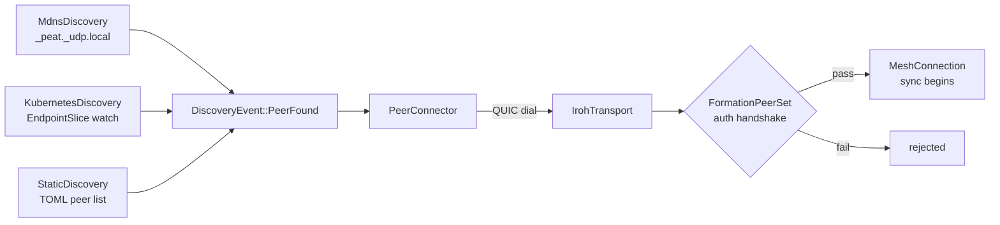
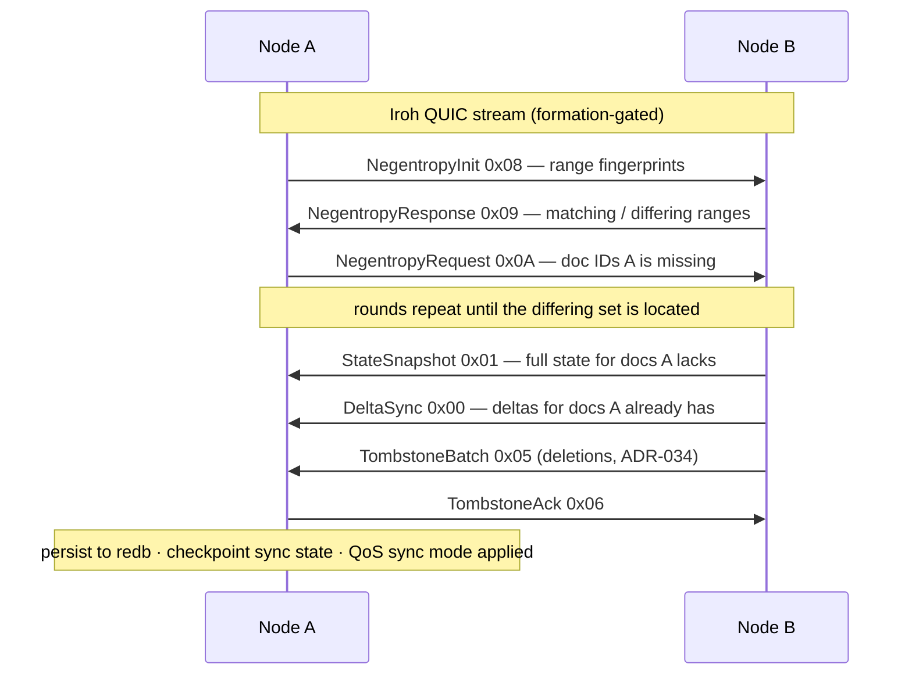
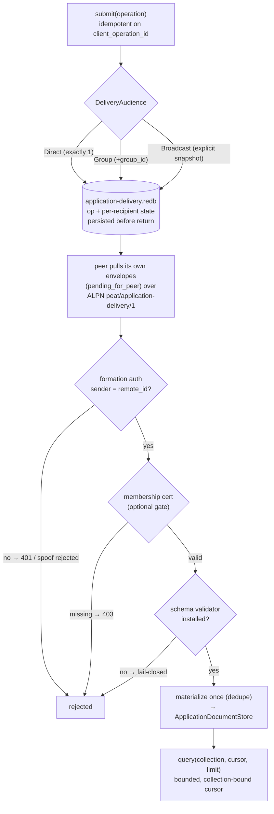
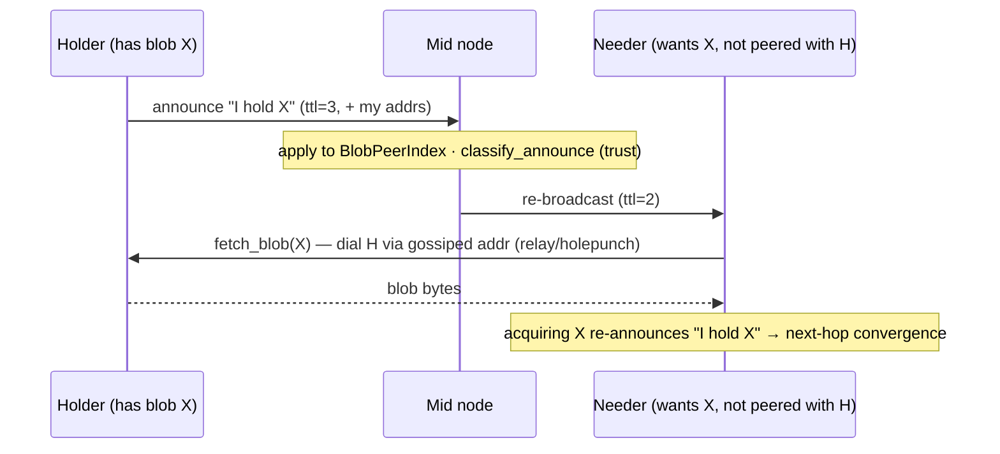
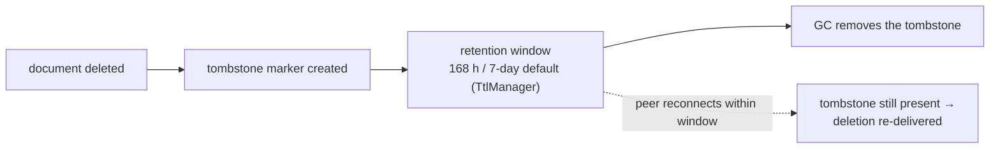

# Module 3 — The Network Layer: `peat-mesh`

**Goal:** understand how bytes actually move between nodes. `peat-mesh` is the peer-to-peer
networking library: pluggable transports, Automerge CRDT sync over QUIC, peer discovery, and
topology formation. Repo path: [`peat-mesh/`](../peat-mesh/). Audited against
`peat-mesh@0ad275c` (`0.9.0-rc.66`).

> **iroh reached 1.0 (rc.46, peat-mesh#276) [Shipped].** The QUIC transport that underpins the whole
> mesh left the release-candidate train: `iroh` is now pinned to the **stable `1.0.2`** line
> (`iroh-blobs 0.103.0`, `iroh-mdns-address-lookup 0.4.0`), replacing the old `=1.0.0-rc.1` exact pins
> (`Cargo.toml:136,142,143`). The bump was wire- and API-compatible — "zero API breakage" — so no
> curriculum protocol fact changes, but the maturity signal is real: earlier drafts that call iroh a
> pre-1.0 release candidate are now stale. `peat-node` and `peat-cli` moved onto the same `1.0.2`
> stable line in lockstep (iroh's process-global crypto/ALPN registries require one iroh version
> across a workspace). The provider stays `tls-aws-lc-rs` (ring deliberately excluded for FIPS).

> **How to read the labels.** Every capability below carries one of four tags so you always know
> what is real:
> **[Shipped]** — in code, tested · **[In-flight]** — open issue/PR/epic ·
> **[Proposed]** — an ADR exists but no implementation · **[Speculative]** — a teaching design
> not in any repo. When the code and an ADR or README disagree, the code wins, and the citation
> says so.

> **Mental model.** If `peat-protocol` is the "what" (cells, hierarchy, policy), `peat-mesh` is
> the "how" (connections, sync messages, persistence). `peat-protocol` re-exports `peat-mesh`, so
> an application developer rarely calls it directly — but everything they do bottoms out here.

---

## 3.1 Two entry points **[Shipped]**

### (a) As a library — builder or direct constructor

You can assemble a `PeatMesh` two ways, both real in
[`peat-mesh/src/mesh.rs`](../peat-mesh/src/mesh.rs). The fluent **builder**
(`PeatMeshBuilder`, `mesh.rs:576-710`) reads cleanly:

```rust
use std::sync::Arc;
use peat_mesh::{MeshConfig, PeatMeshBuilder};

let mesh = PeatMeshBuilder::new(MeshConfig::default())
    .with_transport(iroh_transport)     // Arc<dyn MeshTransport>
    .with_hierarchy(hierarchy_strategy)  // Arc<dyn HierarchyStrategy>
    .with_discovery(discovery_strategy)  // Box<dyn DiscoveryStrategy>
    .build();
mesh.start()?;
```

If you prefer to construct first and inject later, `PeatMesh::new(config)` (`mesh.rs:190`) plus
the `set_transport` / `set_hierarchy` / `set_discovery` injectors (`mesh.rs:349-434`) do the same
job. Either form ends at `mesh.start()` (`mesh.rs:224`).

`MeshConfig` ([`src/config.rs:114-130`](../peat-mesh/src/config.rs)) composes the sub-configs:
`topology`, `discovery`, `security`, `iroh`, `compaction`, and an optional `transport_manager`.
Each subsystem is optional and injected before `.build()`.

### (b) As a binary — `peat-mesh-node`

[`peat-mesh/src/bin/peat-mesh-node.rs`](../peat-mesh/src/bin/peat-mesh-node.rs) (requires
`--features node`) is an all-in-one reference node, and reading it top to bottom is the single
best way to see how the pieces wire together. **[Shipped]** — but note this is a *reference/demo*
binary; the production deployable node is **peat-node**, a separate gRPC sidecar covered in
Module 5. The binary:

1. Reads env vars (`PEAT_FORMATION_SECRET`, Iroh bind port, `PEAT_DISCOVERY`, `PEAT_BROKER_PORT`).
2. Builds a `FormationKey` from `PEAT_FORMATION_SECRET` and derives the Iroh secret key from the
   same secret via **HKDF-SHA-256** (`bin/peat-mesh-node.rs:87-104`; ADR-062, peat#918). HKDF-SHA-256
   is FIPS-approved (SP 800-56C/800-108).
3. Picks a discovery strategy from `PEAT_DISCOVERY` — `KubernetesDiscovery` or `MdnsDiscovery`
   (the binary defaults to `"kubernetes"`, `bin:53`; choose `mdns` for LAN demos).
4. Builds an Iroh endpoint gated by a `FormationPeerSet` (only formation members may connect).
5. Opens the `AutomergeStore` (backed by **redb**, `Cargo.toml:152`) plus TTL/GC/eviction services.
6. Starts the `AutomergeSyncCoordinator` + `SyncChannelManager` to drive CRDT sync.
7. Builds the mesh and calls `mesh.start()`.
8. Spawns a `PeerConnector` to dial discovered peers (`src/peer_connector.rs`).
9. Launches an Axum **broker** HTTP/WS server for introspection (feature `broker`).
10. Waits for SIGTERM/SIGINT and shuts everything down cleanly (`bin:692-701`).

---

## 3.2 Source layout (the modules that matter) **[Shipped]**

Every type below was confirmed present at the audited HEAD.

| Module | Central types | Responsibility |
|--------|---------------|----------------|
| `transport/` | `MeshTransport`, `MeshConnection`, `NodeId`, `PeerEvent`, `Translator`, `TransportManager` | Pluggable transport backends (Iroh QUIC, peat-lite UDP, BLE) + cross-transport bridging |
| `storage/` | `AutomergeStore`, `AutomergeSyncCoordinator`, `NegentropySync`, `SyncChannelManager`, `TtlManager`, `IrohFileDistribution`, `BlobAnnounce` | CRDT persistence (redb + Automerge), the sync protocol, negentropy set reconciliation, TTL/GC, **blob/file distribution + provider gossip** (relocated here from `peat-protocol` per peat#992 — see §3.4b) |
| `discovery/` | `DiscoveryStrategy`, `PeerInfo`, `DiscoveryEvent` | mDNS, Kubernetes, static-config, hybrid peer discovery |
| `topology/` | `TopologyManager`, `TopologyBuilder`, `PeerSelector`, `PartitionDetector` | Hierarchy/leader formation from beacon metrics; partition detection; autonomous mode |
| `routing/` | `MeshRouter`, `SelectiveRouter`, `DataPacket`, `DataDirection` | Upward telemetry aggregation vs. downward command dissemination (anti-flood) |
| `security/` | `DeviceKeypair`, `DeviceId`, `EncryptionKeypair`, `FormationKey`, `MeshCertificate`, `MeshGenesis`, `CertificateStore` | Ed25519 identity, P-256/AES-GCM encryption, formation-key auth, certificate-based enrollment |
| `beacon/` | `GeographicBeacon`, `BeaconBroadcaster`, `BeaconObserver`, `BeaconJanitor` | Geographic beaconing for proximity-based topology |
| `qos/` | `QoSClass`, `SyncMode`, `BandwidthAllocation`, `EvictionController` | 5-level priority, sync-mode override, bandwidth allocation, eviction/GC |
| `broker/` | `Broker`, `BrokerConfig`, `MeshBrokerState`, `MeshEvent` | Axum HTTP/WS facade for mesh introspection + OTA (feature `broker`) |
| `network/` | `IrohTransport` | Iroh QUIC endpoint wrapper, local mDNS discovery, peer state |
| `sync/` | `DocumentStore`, `SyncEngine`, `DataSyncBackend` | The abstract sync traits (`sync/traits.rs`) that `peat-protocol` re-exports |
| `hierarchy/` | `HierarchyStrategy`, `NodeRole`, `HierarchyLevel` | Static / dynamic (election) / hybrid hierarchy assignment |

**Two notes a skeptical reader will check.**

- **`security/` does not use X.509.** Enrollment is built on `MeshCertificate`
  (`security/certificate.rs:111-116`): a compact, Ed25519-signed wire format
  (`[subject_pubkey:32][mesh_id_len:1][mesh_id:N][node_id_len:1][node_id:M][tier:1][permissions:1][issued_at:8][expires_at:8][issuer_pubkey:32][signature:64]`,
  148 B minimum with empty mesh_id/node_id) — *not* an X.509 certificate. The mesh ships `MeshCertificate`, `CertificateStore`,
  `MeshGenesis`, and a `StaticEnrollmentService` (`bin:426`). Broader membership-certificate
  enrollment is **[In-flight]** as epic peat#592.
- **`HierarchyLevel`'s leaf tier is `Node`, not `Platform`.** ADR-066 (abstract hierarchy
  vocabulary) intends a `Platform/Cell/Cohort/Federation/Coalition` ladder, but ADR-066 is
  **[Proposed]** and the rename is mid-flight: the shipped enum is
  `{ Node, Cell, Cohort, Federation, Coalition }` (`beacon/types.rs`). If you grep `HierarchyLevel`
  you will see `Node`. The `Node → Platform` rename is tracked by peat#904 / peat#968.

---

## 3.3 Key data flow #1 — discovery → connection **[Shipped]**

```
DiscoveryStrategy::start()
   ├─ MdnsDiscovery       → broadcasts _peat._udp.local on the LAN
   ├─ KubernetesDiscovery → watches the EndpointSlice API
   └─ StaticDiscovery     → loads a TOML peer list
            │  emits DiscoveryEvent::PeerFound(PeerInfo { node_id, addresses, relay_url })
            ▼
PeerConnector  (subscribes to the event stream)
            │  on PeerFound:
            ▼
IrohTransport::connect(peer)  → QUIC dial → MeshConnection
            │
            ▼
FormationPeerSet gate  → TLS 1.3 + formation-key auth (only formation members admitted)
```

Files: `discovery/mdns.rs`, `discovery/kubernetes.rs`, `peer_connector.rs`,
`network/iroh_transport.rs`.


```mermaid
%% Legend: rounded box = discovery source · rectangle = pipeline stage ·
%% diamond = auth gate · "QUIC dial" = transport action
flowchart LR
    M["MdnsDiscovery<br/>_peat._udp.local"] --> E["DiscoveryEvent::PeerFound"]
    K["KubernetesDiscovery<br/>EndpointSlice watch"] --> E
    S["StaticDiscovery<br/>TOML peer list"] --> E
    E --> P["PeerConnector"]
    P -->|"QUIC dial"| T["IrohTransport"]
    T --> G{"FormationPeerSet<br/>auth handshake"}
    G -->|"pass"| C["MeshConnection<br/>sync begins"]
    G -->|"fail"| R["rejected"]
```

The formation gate is an HMAC-SHA-256 challenge-response over ALPN `peat/formation-auth/1`: the
pre-shared formation key is proven without ever crossing the wire (constant-time compare). The
handshake itself lives in `peat-protocol`; Module 2b covers it in detail.

> **Android mDNS interop (c863d16, peat-mesh#266) [Shipped].** On Android, iroh's own
> `MdnsAddressLookup` browse never fires, so a peer could advertise but never *discover*. The
> transport now owns a long-lived **peat-controlled `_peat._udp` browse that mirrors the
> advertiser** (`from_formation_with_discovery_at_addr`, `network/iroh_transport.rs`): it
> advertises a *concrete* address plus a `formation_id` TXT record for parity with node
> advertisements, browses the same service, and self-filters its own advertisement out of the
> event stream. Peers still reconstruct each other's `EndpointId` from `(formation_secret,
> node_id)` via `derive_iroh_node_secret` — `HKDF-SHA-256(salt=None, ikm=formation_secret,
> info="iroh:"+node_id)`, the same FIPS-approved derivation `peat-node` uses (ADR-049) — so the
> formation key still gates who is admitted. No new transport or wire format: this is a discovery
> path that makes LAN peering work on Android without any n0 phone-home.
>
> **Discovered peers are now dialed, sanitised, and durable (b410d7c, rc.44–rc.45) [Shipped].**
> peat-mesh#266 made browse *fire*; the rc.44–rc.45 follow-ups (peat-mesh#268) make its output
> actually usable. The advertiser now publishes the **dialable hex `EndpointId`** rather than the
> formation `node_id` (`network/iroh_transport.rs:836`) so a browsing peer can dial back — the
> case that matters when the local node is behind NAT and can only be peer-initiated. Discovered
> `PeerInfo` is bridged into a **dialable** `PeerInfo` (`network/peer_info.rs:108`) and connected via
> `connect_peer`; loopback and link-local addresses (IPv4, and IPv6 `fe80::/10`) are dropped from the
> dialable set (`is_routable_addr`, `network/peer_info.rs:73`); and the browse loop runs under a
> **supervised `tokio::spawn` loop** with capped backoff (500 ms → 10 s, `discovery/mdns.rs`) that
> re-issues `browse()` rather than dying permanently on an mdns-sd encoder panic — the bug that used
> to freeze the Android peer count at 0. On the client side, `peat-ffi` threads a nullable
> `bindAddress` through the `createNodeJni` / `createNodeWithConfigJni` JNI entry points and derives
> the iroh identity from the formation key when present (peat#1006, `peat-ffi/src/lib.rs:9061`,
> `:1859` — **breaking JNI arity**: Android callers must add `bindAddress: String?`), and the
> peat-controlled `_peat._udp` browse consumer that dials discovered peers (with a 10 s
> reconnect-watchdog re-dial) lives in `peat-protocol/src/sync/automerge.rs:2682` (peat#1007).

---

## 3.4 Key data flow #2 — CRDT sync (Automerge + negentropy) **[Shipped]**

This is the crown jewel. When two nodes connect, they reconcile their document sets, then exchange
deltas, persisting as they go. The wire protocol is a one-byte-tagged message type
([`src/storage/automerge_sync.rs:92-110`](../peat-mesh/src/storage/automerge_sync.rs)):

```rust
#[repr(u8)]
pub enum SyncMessageType {
    DeltaSync          = 0x00,  // standard Automerge sync protocol
    StateSnapshot      = 0x01,  // full doc.save() bytes (LatestOnly mode)
    WindowedHistory    = 0x02,  // windowed-history sync (Phase 2)
    Tombstone          = 0x04,  // single deletion (ADR-034)
    TombstoneBatch     = 0x05,  // batched deletions (ADR-034)
    TombstoneAck       = 0x06,
    SyncBatch          = 0x07,  // multiple docs in one message
    NegentropyInit     = 0x08,  // set reconciliation, ADR-040 / issue #435
    NegentropyResponse = 0x09,
    NegentropyRequest  = 0x0A,
}
```

The enum, the byte values, and the `ADR-034` / `ADR-040 #435` annotations all match the source
verbatim. (ADR-040 is the repo-local ADR whose on-disk title is *"Nostr protocol lessons"*;
negentropy is the applied lesson. Note: ADR-034 is referenced in code comments here but is not in
the umbrella ADR index — treat the citation as the code's own.) These ten bytes are the **whole** sync
wire: the newer application planes (application-delivery, reconstructible-history transfer,
blob-announce) each ride their **own dedicated ALPN**, so they add capability without adding a
`SyncMessageType` tag — the enum has been byte-stable across rc.63→rc.66.

**Why negentropy?** Without it, deciding *which* documents differ between two peers can cost work
proportional to the number of documents. **Negentropy** is a set-reconciliation protocol that
locates the differing set by exchanging range fingerprints, so two nodes figure out which document
IDs differ before sending any heavy data (ADR-040, issue #435; `negentropy = 0.5`). Peat's
negentropy module advertises *O(log n) rounds* with stateless sessions over 32-byte SHA-256
document IDs — **this is the algorithm's analytical bound (citing arxiv 2012.00472), not an
independently benchmarked Peat measurement.** After reconciliation, only the genuinely-missing docs
and deltas are sent.

The flow per peer connection:

```
1. Accept Iroh stream (QUIC)
2. Negentropy: exchange fingerprints → learn which doc IDs differ      (0x08/0x09/0x0A)
3. Delta sync: send full state for missing docs, deltas for known docs (0x00/0x01)
4. Backpressure: a sized semaphore bounds in-flight frames per peer
5. Persist to redb (AutomergeStore); checkpoint sync state
6. Apply QoS sync mode: LatestOnly (compact), FullHistory, or Windowed
```

(Step 4: the channel layer uses a *sized semaphore* to bound buffered frame bytes — large frames
mean fewer concurrent permits — `storage/sync_channel.rs:208`. It is frame-byte backpressure, not
a per-peer token bucket.)

Files: `storage/automerge_sync.rs` (coordinator), `storage/automerge_store.rs` (redb persistence),
`storage/negentropy_sync.rs` (reconciliation), `storage/sync_channel.rs` (per-peer channels),
`qos/sync_mode.rs`.

The full exchange as a sequence diagram (message-type bytes from the enum above):


```mermaid
%% Legend: 0x.. = SyncMessageType wire byte · solid arrow = QUIC stream message ·
%% Note = local action, not a wire message
sequenceDiagram
    participant A as Node A
    participant B as Node B
    Note over A,B: Iroh QUIC stream (formation-gated)
    A->>B: NegentropyInit 0x08 — range fingerprints
    B->>A: NegentropyResponse 0x09 — matching / differing ranges
    A->>B: NegentropyRequest 0x0A — doc IDs A is missing
    Note over A,B: rounds repeat until the differing set is located
    B->>A: StateSnapshot 0x01 — full state for docs A lacks
    B->>A: DeltaSync 0x00 — deltas for docs A already has
    B->>A: TombstoneBatch 0x05 (deletions, ADR-034)
    A->>B: TombstoneAck 0x06
    Note over A: persist to redb · checkpoint sync state · QoS sync mode applied
```

### Transitive gossip — how hub-and-spoke meshes converge **[Shipped]**

One behavior surprises people and is worth knowing early. In current peat-mesh, when a node
receives a remote change it can **re-push that document to every connected peer except the
source**. This *transitive gossip* is what lets a hub-and-spoke topology converge: if `bravo` and
`charlie` are each wired only to `alpha`, they still see each other's state because `alpha` relays
it. The mechanism is real and documented in the source — receive paths call
`AutomergeStore::put_with_origin` with `ChangeOrigin::Remote(peer_id)`, and an origin-tagged
`gossip_tx` lets a gossip-aware consumer forward the doc onward while the legacy push channel stays
silent to avoid a ping-pong loop (`storage/automerge_store.rs:479` for `put_with_origin`, `:608` for the
origin-tagged `gossip_tx.send`; the receive path that calls it is `automerge_sync.rs:933-948` in `put_received`).

**Provenance correction.** Earlier drafts attributed this behavior to "ADR-061" and a
"DEVELOPER_GUIDE §6.4.1." **Neither exists** — peat-mesh's ADR index runs 0001-0013 with no 061,
and there is no DEVELOPER_GUIDE in the repo. The real tracking references are the field report
**peat#891** and the architectural-fix issue **peat#907**. Cite those.

**The operational catch — and what is actually load-bearing.** Transitive fan-out plus the
per-peer sync handshake overhead can add up on constrained links, so a fully-connected mesh over a
low-bandwidth radio is the wrong topology. The practical levers are: lower the application write
rate (batch telemetry), or choose a partial topology (designate a hub, drop leaf-to-leaf edges). A
future release may add runtime topology detection to suppress redundant relay automatically.

> **[Speculative]** Some prior material presented a precise "bandwidth envelope" table — e.g.
> *"stays within ~20% baseline if N ≤ 4 at 2 Hz on a ≥256 kbps LAN, or N = 3 only on a 30 kbps
> BLE-class link."* **None of those numbers (20%, 256 kbps, 30 kbps, N = 3/4/7, the 2 Hz / 0.5 Hz
> write rates) is sourced to code, an ADR, or a benchmark.** They are illustrative engineering
> intuition, not a contract. Treat the *shape* of the trade-off as real and the specific figures as
> unverified until someone measures them. There is likewise no confirmed `max_connections = 7`
> default in `config.rs`.

### Why sync *cadence* — not raw bandwidth — can be the real limit **[Proposed: ADR-063]**

A subtlety that trips up performance debugging: under a sustained stream of small writes on a
high-latency link, delivery can plateau well below the link's raw capacity. The cause is not
bandwidth but the **sync-round cadence**. The Automerge sync coordinator advances roughly one round
at a time per peer, and today each round tends to open a fresh QUIC stream, write, and close. On a
high-RTT link that round overhead — not the pipe width — sets the ceiling, so a backlog of small
writes can form that a short post-burst window never fully clears. Bulk transfers, which stream
continuously, barely notice the same shaped link; that contrast is the tell that round overhead,
not capacity, is the bottleneck.

**ADR-063 ("Persistent Multiplexed Sync Streams") is [Proposed]** (peat#935 / peat-mesh#175; the
rc.26 dependency floor cites it). It proposes keeping a long-lived multiplexed stream open per peer
instead of one-stream-per-message. The one-stream-per-message characterization and any specific
"rounds per second" figure are the proposal's framing and analytical reasoning, **not measured Peat
results** — treat them as the motivation for the proposal. The durable lesson, true before any fix
lands: on a degraded, high-latency link, latency and write cadence — not just throughput — shape how
fast a mesh converges.

### Keeping the store small: write coalescing, adaptive compaction, bounded memory (rc.46–rc.50) **[Shipped]**

A run of `AutomergeStore` work landed to stop a long-lived node's redb file and RSS from growing
without bound under high-frequency writes (the trigger was a field report of a 14.9 MB uncompacted
store and saturated tokio workers from hours of heartbeat churn — peat-flutter#22). Four levers,
all in `storage/automerge_store.rs`:

- **Write coalescing [Shipped, default-on].** Repeated `put`s to the same key inside a short cooldown
  (`DEFAULT_WRITE_COOLDOWN = 200 ms`, `:85`) defer the redb persist; only the in-memory doc + cache
  update, and a background task drains deferred writes on a 200 ms cadence (`start_write_coalescing`,
  `:2000`). In-memory stores set the cooldown to zero (persistence is a no-op there), and it can be
  disabled per-store or per-collection. **Per-collection write policy [Shipped, peat-mesh#282]:** a
  registered `WritePolicy` (`:116`) overrides the cooldown and the compaction threshold for a collection,
  keyed on the **colon-delimited prefix** of a key — the segment before the first `:` (`collection_prefix()`,
  `:2258`, so `telemetry:sensor-1` resolves to `telemetry`). Note this colon-prefix scheme is a *different*
  key convention from the slash-delimited `fleet/{id}/{kind}` QoS classifier (Module 2 §2.6) — orthogonal
  mechanisms, no code link.
- **Adaptive compaction [Shipped as of the rc.47-era wire-in, peat-mesh#296/#297].** A per-key change
  counter (`DEFAULT_COMPACTION_THRESHOLD = 50`, `:91`) triggers `compact(key)` — a `fork()` that drops
  Automerge history — for high-churn documents. Worth being precise: the routine existed and was
  unit-tested since peat-mesh#280 but was **only ever called from `#[cfg(test)]`** until peat-mesh#296
  spawned it from `AutomergeBackend::start_sync` on a 30 s interval (`sync/automerge_backend.rs`). So
  it is genuinely live only from that wire-in, not from the earlier commit.
- **Byte-bounded LRU cache [Shipped].** `ByteBoundedCache` (`:299`) evicts least-recently-used docs
  once a heap budget is exceeded (`DEFAULT_CACHE_BYTE_BUDGET = 4 MiB` estimated heap, `:136`; evicted
  docs reload from the mmap'd redb). Remote-origin (sync-received) puts weight the change counter 10×
  vs 1× for local writes, so a doc under heavy inbound sync hits the compaction threshold sooner.
- **Bounded RSS on the sync receive path [Shipped, peat-mesh#289].** The debug `doc.save()` in
  `receive_sync_message` is now gated behind `DEBUG` tracing, and the dirty-buffer force-flush cap
  dropped to `MAX_DIRTY_ENTRIES = 16` (`:487`).
- **On-disk file vacuum [Shipped as of rc.49, peat-mesh#300/#301].** The four levers above shrink a
  *document's* serialized bytes and cap *memory*, but redb reuses freed pages internally and **never
  shrinks the file on disk by itself** — over a long session (new docs, tombstoned keys, repeatedly
  rewritten docs) the file's high-water mark only ever grows. `redb::Database::compact()` — a
  file-level vacuum, distinct from `AutomergeStore`'s per-document `compact()` — was never being
  called; rc.49 now invokes it so the `automerge.redb` file itself can shrink. The trigger was a
  physical-device observation during peat-flutter#22: `automerge.redb` grew to **14.5 MB in ~90 min**
  of normal use while the separate `kv-*.automerge` docs stayed bytes-to-KB.
- **Bounded LatestOnly history [Shipped as of rc.50, peat-mesh#314].** A collection registered as
  `LatestOnly` (Module 2 §2.6 QoS) only ever needs its newest value, but its Automerge doc still
  accumulated the full change history. rc.50 makes the store the invariant boundary: a `LatestOnly`
  write is **rebased to a single-snapshot document** before it reaches the cache or redb, and a
  persisted doc that predates the bound is migrated on read (`is_latest_only_key` / `is_latest_snapshot`,
  `storage/automerge_store.rs:463-464,866-954`). Divergent bounded snapshots are preserved so a
  coalescing flush in flight cannot resurrect an older version — closing a path where a read could fall
  back to a stale persisted value under sustained load (the rc.53/rc.54 sync-recovery fixes below).

> The RSS figures in the commit history (≈930 MB before → <60 MB steady-state, OpTree expansion
> "250–300×") and the 14.5 MB redb high-water observation are field-profile numbers, **not
> benchmarked here** — treat them as motivation, not a guarantee. History note: peat-mesh#296/#299/#295
> landed *after* the tagged rc.47 release commit, so a consumer pinned to the exact rc.47 artifact got
> the memory-bounding but not yet the compaction wire-in or the dialing fixes below — all of which are
> now in the released rc.48/rc.49 line (the file-vacuum above shipped in rc.49).

### Dialing an ID: pull-based address resolution (rc.47, peat-mesh#299) **[Shipped]**

iroh 1.0's `AddressLookupServices` is **pull-based** — `Endpoint::connect` no longer consults
discovery on its own — so an ID-only dial used to go out with no addresses and no relay and silently
fail. `connect_by_id` now resolves first: it builds an `EndpointAddr`, calls `endpoint.address_lookup()`
and polls `resolve(endpoint_id)` under a 2 s deadline before dialing, falling back to the bare address
on timeout (`network/iroh_transport.rs:1457`). A companion fix (peat-mesh#295) routes the various
constructors' binds through an interface filter (`bind_with_interface_filter_dual_stack`) so the node
advertises real LAN IPv4/IPv6 and drops docker-bridge and CGNAT-range (`100.64.0.0/10`) addresses;
`PEAT_ADVERTISE_ALL_INTERFACES=1` bypasses the filter. **rc.48 (peat-mesh#304/#305) tightened the
IPv6 side [Shipped]:** the dual-stack fix had re-enabled IPv6 binding where it had accidentally been
IPv4-only, which then exposed nodes advertising IPv6 addresses with no functional route; the
`interface_filter` now runs a **per-candidate IPv6 reachability probe** and drops unreachable IPv6
addresses, with a **ULA exemption** so unique-local (`fc00::/7`) addresses stay eligible for on-LAN
use. (The `dialer_resolves_acceptor_by_id_via_mdns`
P2P test is CI-verified only — local macOS firewall on unsigned test binaries makes it inconclusive
off-runner; treat the on-wire behaviour as NEEDS_RUNTIME.)

### Surviving reconnects and lossy tactical links (rc.51–rc.58) **[Shipped]**

A run of sync-recovery fixes hardened Automerge convergence across the connection churn a tactical
network actually produces — reconnects, truncated frames, and container-network quirks. None change
the wire protocol; all are code-confirmed but runtime-unbenchmarked here (NEEDS_RUNTIME):

- **Recovered connections are actually serviced (rc.51, peat-mesh#316).** Persistent-channel setup
  and recovery now *activate* the authenticated QUIC connection so both endpoints service
  peer-initiated streams after a reconnect, restoring bidirectional convergence instead of leaving one
  side deaf (`storage/mesh_sync_transport.rs`).
- **UDP segmentation offload disabled on tactical endpoints (rc.52, peat-mesh#320/#321).** Docker
  veth/netem paths can advertise UDP GSO but then reject segmented `sendmsg` calls with `EIO`, which
  iroh's transport treated as packet loss and escalated into false active-link QUIC timeouts. The
  tactical transport config now sets `enable_segmentation_offload(false)`
  (`network/iroh_transport.rs:~263`) — a small throughput trade for reliable delivery on
  container/namespace links.
- **Peer sync state survives local edits and lost frames (rc.53–rc.54, peat-mesh#323).** rc.53
  preserves the negotiated per-peer Automerge sync state across local stable-key edits (no more
  full-history frame regeneration, write timeouts, or pathological relay CPU); rc.54 commits outbound
  sync state only *after* the peer confirms it applied, so a lost final frame stays replayable, and
  origin-aware fanout forwards a remote change without echoing it back to the source peer. rc.55–rc.56
  (peat-mesh#340) bounds the *stall* case: a per-peer confirmation watchdog replaces a receive-stalled
  persistent channel, re-driving the latest coalesced document under a **bounded 60 s → 120 s → 240 s
  backoff** (`storage/sync_channel.rs:159-244`) instead of retrying forever.
- **Stalled-confirmation replay is bounded (rc.56, peat-mesh#340).** See above — the watchdog caps the
  backoff shift at 2 and resets on receive progress, so a peer that never confirms can't pin a channel
  in perpetual retry.
- **Frames authored during a backoff window are replayed on reconnect (rc.58, peat-mesh#348).** A new
  `OutboundSink::peer_connected` hook flushes each sink's per-peer backlog when a peer reconnects, so a
  change written while a peer was down is delivered on reconnection rather than dropped
  (`transport/fanout.rs:146-149,313-325`; modeled on peat-btle `sync_requested` #73). The remaining
  fanout Slice-2 items — delete-event propagation, `allowed_transports` enforcement, LoRa/SBD
  coalescing, and a reaper for panicked drain tasks — are **[In-flight]** (`fanout.rs:14-30`), so don't
  present the reconnect replay as covering deletions yet.

### Keeping deep-history documents from starving current state (rc.55–rc.58) **[Shipped]**

`LatestOnly` collections are cheap; a `FullHistory` collection (audit logs, commands, contact
reports — `qos/sync_mode.rs:129-208`) retains its whole Automerge change graph, and a document that
has accumulated thousands of revisions makes every read, merge, and fanout expensive. rc.55–rc.58
stop one deep document from stalling the rest of the mesh:

- **FullHistory work is isolated and bounded (peat-mesh#350/#351/#352).** CPU-heavy FullHistory
  reads and read-modify-write mutations now run on `spawn_blocking` gated by a per-store semaphore
  (`storage/automerge_store.rs:507,740,793`); `LatestOnly` keys skip the permit entirely. The pool
  defaults to `available_parallelism() / 4` (min 1) so deep-history work can never claim more than a
  quarter of the cores — override with `PEAT_FULL_HISTORY_WORKERS`.
- **Depth-aware stream routing (peat-mesh#352).** Bounded current-state and FullHistory now use
  **separate serial fanout lanes**, and a FullHistory frame whose serialized document or delta exceeds
  a threshold is sent on its **own QUIC stream** — a small delta against a deeply-retained document was
  otherwise able to block the persistent receive loop (`storage/automerge_sync.rs:302-311,556-570`).
  Fanout also reuses an immutable `Arc` store snapshot instead of cloning the OpSet.
- **Revision-depth observability (peat-mesh#338/#343) [Shipped].** A rate-limited `tracing::warn!`
  fires when a document's `num_changes` crosses a threshold (default 256, override
  `PEAT_REVISION_DEPTH_WARN`), reading `doc.stats()` rather than materializing the change list
  (`storage/json_convert.rs:117-157`). This is the signal an operator uses to catch a collection that
  was mislabeled `FullHistory` when it should have been `LatestOnly`.

### Write admission: bounding a document before it is written (rc.58, peat-mesh#353) **[Shipped]**

The isolation above keeps a deep document from starving others; **write admission** stops a document
from getting pathologically deep in the first place. A new per-collection registry
(`qos/write_admission.rs`) applies a token-bucket **sustained-rate + burst** limit and hard
`max_document_bytes` / `max_document_revisions` ceilings to **local producer writes** — a three-phase
`begin() → validate_document() → commit()` gate that returns a typed
`WriteAdmissionError::{RateExceeded, DocumentBytesExceeded, DocumentRevisionsExceeded}`
(`write_admission.rs:21-113`). Two properties matter for a mental model:

- **Local writes only.** Authenticated remote convergence **bypasses** admission — a bound is a
  contract on a producer, never a reason to reject a peer's already-committed state (which would break
  CRDT convergence). Unregistered collections are admitted unchanged.
- **It is the first landed slice of a policy that has now largely shipped.** Three peat-mesh ADRs frame
  this: **peat-mesh ADR-0014 (Accepted, `docs/adr/0014-…md`)** rules that a `FullHistory` collection must
  **never auto-convert** to `LatestOnly` to save space — silent semantic weakening is forbidden, so
  `LatestOnly` remains the *only* bounded-history path today and **`WindowedHistory` does not yet bound
  on-disk storage** (`docs/adr/0015-windowed-history-retention.md` is a **Proposed** stub, no code).
  **peat-mesh ADR-0016 (now `Accepted`, 2026-08-01)** is the umbrella "every writable collection needs an
  explicit budget contract" design; write-admission was its first slice, and as of **rc.66** the
  finite-segment / epoch / producer-backpressure lifecycle it describes **ships** too — the
  reconstructible-history plane below (peat-mesh#396). The operator-facing surface for these budgets is
  named as peat-node's own **ADR-003** (Module 8 §8.3).

### Durability, attribution, and one canonical endpoint (rc.59–rc.64) **[Shipped]**

rc.59–rc.64 continue the storage/transport hardening. None change the wire protocol
(`SyncMessageType` bytes are byte-identical to rc.58) or the crypto posture; all are code-confirmed
but runtime-unbenchmarked here (NEEDS_RUNTIME):

- **Formation authentication is now transport-owned (rc.59, peat-mesh#358) [Shipped].** The accept and
  respond halves of the formation handshake are exported as
  `peat_mesh::storage::{accept_formation_auth, respond_to_formation_auth}`
  (`storage/mesh_sync_transport.rs:857,942`), and peat-protocol's older protocol-owned handshake was
  removed (peat#1045) so both sides speak one versioned wire protocol (`FORMATION_AUTH_VERSION = 1`,
  `:65`). Walked through in Module 2·5 §2·5.4.
- **Stale paths are replaced on authenticated reconnect (rc.60, peat-mesh#361).** A reconnect is now
  distinguished from a startup dial race; the aged connection is closed with a dedicated reason
  (`b"stale_path_replaced"`) and its replacement inserted, and removing a fanout translator also
  removes its reconnect sink so retained frames can't replay onto a dead path
  (`network/iroh_transport.rs`, `transport/fanout.rs`).
- **Grouped durable commits — opt-in, immediate stays the default (rc.61, peat-mesh#363/#364/#365/#366)
  [Shipped].** A new `GroupedDurability { max_delay, max_entries, max_bytes }` batches many document
  writes across keys into **one** redb transaction, bounded by a queue-delay, an entry count, and a
  serialized-byte ceiling; the caller still blocks until the batch's `commit()` returns, so durability
  semantics are unchanged. `DurabilityPolicy::Immediate` carries `#[default]`, so grouping is strictly
  **opt-in per collection** and an oversized document is rejected rather than silently violating a bound
  (`storage/grouped_commit.rs:51-89,184-190`). Same-collection write-coalescing deadlines are now
  honored (`storage/automerge_store.rs`).
- **Persistence attribution counters (rc.63, peat-mesh#372/#373).** The store exposes four monotonic
  counters — `durable_commit_count` (redb transactions; a grouped batch counts once),
  `durable_document_write_count` (document versions written), `durable_document_bytes`
  (storage-envelope bytes), and `pending_grouped_writes` (grouped writes queued or in flight) —
  incremented only on a successful commit (`storage/automerge_store.rs:549-572`). These separate logical
  document traffic from physical storage amplification; peat-node re-exports them through `GetSyncStats`
  (Module 8 §8.3).
- **One canonical iroh endpoint (rc.64, peat-mesh#375).** `IrohTransport::track_authenticated_connection`
  mirrors a connection already authenticated by `MeshSyncTransport` into `IrohTransport`'s observability
  (peer count, link state, peer events) **without opening a second QUIC connection**
  (`network/iroh_transport.rs:1406+`), and a consumer can build the canonical Automerge backend around an
  already-bound endpoint and open store (`sync/automerge_backend.rs`, `tests/shared_endpoint_backend_e2e.rs`).

### Explicit multi-interface binding + graceful mDNS teardown (rc.66, peat-mesh#397) **[Shipped]**

The pull-based interface-filter machinery above assumes peat-mesh may *enumerate* host interfaces and
pick which to advertise. That breaks on mobile OSes that own the routing table — Android in particular
can keep an isolated Wi-Fi/Ethernet/USB network attached for one purpose while routing Internet traffic
over another, and a source address alone does not select the Android `Network`. rc.66 adds a
caller-owned binding surface: `IpBindSpec { addr, prefix_len, is_default_route }`
(`network/iroh_transport.rs:89`) and `bind_with_explicit_ip_bindings(builder, &[IpBindSpec])` (`:445`),
reached through a new `from_formation_with_discovery_at_ip_bindings(…)` constructor (`:983`). The bind
path **validates the routes** — it rejects unspecified/multicast addresses, a prefix longer than 32 (v4)
/ 128 (v6), duplicate addresses, and **more than one default route per address family** (`:456-497`).
This is the mesh half of the same work as peat's **ADR-076 "Android-selected IP bindings"** (`Accepted`);
the peat-repo side binds each native socket to the chosen `Network` before bind (peat#1095).

Two discovery correctness fixes ride with it. mDNS now advertises the **exact bound port** read back from
`endpoint.bound_sockets()` (falling back to the requested port only when it was 0, `:1073-1122`), so a
node that asked for an ephemeral port still advertises the real one; and it advertises the **dialable hex
EndpointId** as the TXT `node_id` so a NAT/firewalled node stays dialable by a peer that initiates. On the
teardown side, closing a transport now runs a **graceful mDNS teardown before endpoint shutdown**:
`IrohTransport::shutdown_discovery()` (`:1163`) → `MdnsDiscovery::shutdown` (`discovery/mdns.rs:243`)
stops the browse, unregisters (awaiting `UnregisterStatus::OK/NotFound`), waits ~200 ms for the goodbye
retransmit, then shuts the daemon — so a peer's browse cache does not keep a dead advertisement. New
repo-local **ADR-0017 "Explicit IP bindings"** (`Accepted`) records the decision.

### Authenticated durable application delivery (rc.64 `[Unreleased]`, peat-mesh#383/#389) **[Shipped]**

CRDT sync (§3.4) converges *shared* collections: every formation member holds the whole document set.
A second, complementary primitive now ships for **addressed** application traffic — a message meant for
*these specific nodes*, not the whole formation. `src/storage/application_delivery.rs` adds an
`ApplicationDeliveryManager` (`:429`): a durable state machine where every accepted operation and each
per-recipient transition is persisted to a dedicated `application-delivery.redb` **before** the call
returns. It does **not** change the sync wire protocol — the `SyncMessageType` bytes are byte-identical
to rc.63 — because delivery rides a **separate ALPN**, `CAP_APPLICATION_DELIVERY_ALPN =
b"peat/application-delivery/1"` (`:23`), registered on the *same canonical* Iroh router as Automerge sync,
blob-announce, and — since rc.66 — reconstructible-history transfer (`sync/automerge_backend.rs`) — one
endpoint, **four** separate-ALPN protocols (the history plane is described below).

The design in four facts, each code-anchored:

- **Audience is explicit.** `DeliveryAudience` (`:44-51`) is `Direct` (exactly one target, `:982-984`),
  `Group` (≥1 target plus a `group_id`), or `Broadcast` — and even `Broadcast` carries an *explicit
  recipient snapshot resolved at submit time*, never an implicit "everyone" fallback (`:48-50`). An empty
  audience is rejected; the target set is bounded to 256 (`:979`).
- **Confidentiality is by addressing, not body encryption.** Bodies sit in redb as plaintext (`:294`); a
  transport adapter only ever pulls the envelopes for its own authenticated peer (`pending_for_peer`,
  `:748`), so a non-target never receives the bytes. Transit confidentiality is the QUIC/TLS connection
  plus formation auth — the same posture the rest of the mesh uses.
- **Two authentication layers, both fail-closed.** Formation auth is mandatory and the sender identity is
  bound to `Connection::remote_id()` (`:494-496`), so a forged `sender_node_id` is rejected outright
  (`receive_authenticated`, `:840-842`) — the spoof-rejection path. On top, an **optional Layer-2
  membership certificate** gate (`with_certificate_bundle`, `:546`) means holding the formation secret is
  not sufficient: the endpoint must also pass an Ed25519 `CertificateBundle::validate_peer` or the handler
  closes with `403 membership certificate required` (`:569-575`; a formation-auth failure closes `401`).
- **Durable, restart-safe, priority-ordered.** `submit` is idempotent on a `client_operation_id`
  (re-submitting identical content returns the same id; divergent content is rejected, `:675-681`); a
  background task re-drives delivery every second (`sync/automerge_backend.rs:804-840`); `retry` flips
  `Failed`→`Queued` (`:825`), and `cancel`/`expire` are terminal. Recipients are served in priority order
  `Metadata < Normal < Bulk` (`:61-76`). Bounds: 10 000 operations, 256 targets, 1 MiB body (`:34-36`).

Schema validation is **fail-closed through a consumer-neutral slot**: peat-mesh cannot depend on any
particular schema registry, so a higher layer installs an `Arc<dyn RegistryValidator>` after construction
(`RegistryValidatorSlot`, `:176-199`); until it is installed, `validate` errs and inbound delivery is
simply unavailable. Validation runs on both `submit` (`:668`) and `receive_authenticated` (`:850`). A
companion read side (peat-mesh#389) exposes `ApplicationDocumentStore::query(collection, cursor, limit)`
(`:318-407`) — bounded cursor pagination (limit 1..=100, page ≤ 4 MiB, cursor ≤ 1024 B) over the
recipient-local materialized store, with an opaque **collection-bound** cursor so a cursor minted for one
collection cannot be replayed against another (`:340-342`). Seven end-to-end tests cover confidentiality,
spoof rejection, restart retry, membership gating, materialize-once, expiry/cancel, and the bounded query
(`tests/application_delivery_e2e.rs`). Crypto is FIPS-clean throughout: HMAC-SHA-256 (formation
challenge-response), HKDF-SHA-256, Ed25519 (membership certs), SHA-256 (body digest / document keys),
AES-256-GCM + ECDH-P256 (at-rest / E2E) — no ChaCha20 / X25519 on the path.


```mermaid
%% Legend: green = Shipped · rounded = durable step · every gate is fail-closed
flowchart TD
  sub["submit(operation)<br/>idempotent on client_operation_id"] --> aud{"DeliveryAudience"}
  aud -->|"Direct (exactly 1)"| redb[("application-delivery.redb<br/>op + per-recipient state<br/>persisted before return")]
  aud -->|"Group (+group_id)"| redb
  aud -->|"Broadcast (explicit snapshot)"| redb
  redb --> pull["peer pulls its own envelopes<br/>(pending_for_peer) over<br/>ALPN peat/application-delivery/1"]
  pull --> fauth{"formation auth<br/>sender = remote_id?"}
  fauth -->|"no → 401 / spoof rejected"| drop["rejected"]
  fauth -->|"yes"| cert{"membership cert<br/>(optional gate)"}
  cert -->|"missing → 403"| drop
  cert -->|"valid"| val{"schema validator<br/>installed?"}
  val -->|"no → fail-closed"| drop
  val -->|"yes"| mat["materialize once (dedupe)<br/>→ ApplicationDocumentStore"]
  mat --> q["query(collection, cursor, limit)<br/>bounded, collection-bound cursor"]
```

*Every node above is **Shipped** (peat-mesh#383/#389, rc.64 `[Unreleased]`). This is addressed
application-document delivery — distinct from the authority-gated **command** tasking primitive
(`command_log`, still Speculative) discussed in Module 6 §6.3; the two are different mechanisms.*

### Reconstructible collection history: finite segments + authenticated subordinate transfer (rc.66, ADR-076 / ADR-0016, peat-mesh#396) **[Shipped]**

The bounded-history story that was one shipped slice plus a Proposed lifecycle last month is now a
**typed, enforced history plane**. rc.66 adds two net-new modules — `src/storage/history_segments.rs`
(the segment store and enforcement) and `src/storage/history_transfer.rs` (the wire protocol) — that
implement peat's **ADR-076 Reconstructible Collection History Contract** against the published
`peat_schema::history::v1` types. **Label carefully:** the *contract itself* — that a deployment field-
qualifies these guarantees end-to-end — is **Proposed** (ADR-076 is `Proposed`, implementation-approved
under peat#1084; whole-system qualification is tracked by peat-sim#77 and is **NEEDS_RUNTIME**). But the
*schema types, validation, and the mesh-side enforcement below* are **Shipped** — in code and covered by
tests. peat-mesh's own umbrella **ADR-0016 is now `Accepted`.**

What ships, each code-anchored:

- **Finite reconstructible segments.** A collection's history is stored as sealed segments in redb
  (`HistorySegmentStore`, `history_segments.rs:358`; `SEGMENTS_TABLE`/`EPOCHS_TABLE`); a sealed segment
  carries a **SHA-256 content identity**, and a reconstruction whose bytes don't hash to that identity
  fails closed (`MaterializedShaMismatch`, `:89`).
- **Durability acknowledgements.** `AuthenticatedDurabilityTarget` + `DurabilityProgress` drive retention:
  a segment becomes retention-eligible only once its durability target is met (`evaluate_retention_by_identity`,
  `:1802`); the wire carries an `AckFrame` (`TAG_ACK`, `history_transfer.rs:38`).
- **Retention enforcement, stale-writer fencing, tombstones.** `EnforcementState::Enforced` gates the
  retention path (`:3746`); a writer holding a superseded epoch is rejected with
  `StaleEpoch { attempted, active_successor }` (`:1148`) and counted (`stale_writer_rejections`); removed
  segments leave a persistent tombstone (`RESERVED_SEGMENT_KEY_PREFIX`), layered on the existing ADR-034
  tombstone table.
- **Admission control + metrics.** A bounded, persisted transfer queue backpressures or rejects
  (`TransferAdmissionOutcome`, `TransferBackpressured`/`TransferRejected`); 12 counters surface through
  `HistoryMetricsSnapshot` (`:214`).
- **Authenticated subordinate transfer.** History moves over its **own dedicated ALPN**,
  `CAP_HISTORY_SEGMENT_ALPN = b"peat/history-segment/1"` (`history_transfer.rs:17`) — **not** a new
  `SyncMessageType` byte (the sync enum is byte-identical, §3.4) — behind formation auth plus an optional
  Ed25519 membership certificate, failing closed `401`/`403` (`:227,242`). This is the fourth
  separate-ALPN plane on the canonical router (sync · application-delivery · history-segment · blob-announce).

The sealed-segment lifecycle is the load-bearing state machine:


```mermaid
%% Legend: green = Shipped (schema types + mesh enforcement, rc.66) · blue = Proposed (end-to-end field qualification, ADR-076 / peat-sim#77)
%% Source: peat-schema history.proto SegmentLifecycle; peat-mesh history_segments.rs
flowchart LR
  active["Active<br/>(open, accepting writes)"] --> sealed["Sealed<br/>(closed on epoch/seal;<br/>SHA-256 content identity)"]
  sealed --> durable["Durably Acknowledged<br/>(durability target met)"]
  durable --> eligible["Retention Eligible<br/>(EnforcementState::Enforced)"]
  eligible --> removed["Removed<br/>(persistent tombstone)"]
  stale["stale writer<br/>(superseded epoch)"] -.->|"rejected: StaleEpoch"| active
```

*Green nodes are **Shipped** in rc.66 (schema types `peat_schema::history::v1` + the peat-mesh enforcement
cited above, with tests). The end-to-end guarantee that a fielded deployment reconstructs history under
partition/loss is **Proposed** (ADR-076) and **NEEDS_RUNTIME** (peat-sim#77) — do not read the shipped
plumbing as a qualified field capability.*

---

## 3.4b Blob distribution & provider gossip **[Shipped]**

CRDT sync moves *documents*. Large opaque payloads — an AI model, a file, an attachment — move as
**blobs** over iroh's content-addressed blob protocol, coordinated by a small distribution layer
that **relocated into `peat-mesh` at rc.43** (peat#992): `peat-mesh` is the canonical iroh consumer,
so the transport-specific implementation belongs here rather than in the `peat-protocol` facade,
which now re-exports it. The entry point is `IrohFileDistribution`
(`peat-mesh/src/storage/file_distribution.rs`): a sender publishes a **distribution document**
(blob hash + metadata) into an Automerge collection; that document syncs mesh-wide like any other
doc; a receive watcher on each node fetches the referenced blob.

**Who receives it — targeting today (Shipped).** A sender chooses a `DistributionScope`
(`file_distribution.rs:98`). Be precise about what is wired versus stubbed, because the enum
advertises more than it does:

| Scope | What it does today |
|-------|--------------------|
| `AllNodes` (default) | resolves to this node's `known_peers()` — the peers it has directly dialed |
| `Nodes { node_ids }` | the requested ids, **filtered to `known_peers()`** |
| `Formation { formation_id }` | **not implemented** — logs a `warn!` and falls back to all `known_peers()` |
| `Capable { min_gpu_gb, cpu_arch, min_storage_mb }` | **not implemented** — same `warn!` + fallback |

So targeting is `known_peers`-bound: a node that is interested but reachable only transitively is
not reached, and `Formation`/`Capable` are reserved-but-stubbed (`resolve_targets`, `:873`).

**Provider gossip — multi-hop "who holds blob X" [Shipped].** New at rc.43 (peat-mesh#262, slice 1/3 of
multi-hop blob delivery, peat-node#170): a dedicated ALPN, **`peat/blob-announce/1`**
(`storage/blob_announce.rs`), gossips holdings into the `BlobPeerIndex` that `fetch_blob` already
consults — so a node can locate and dial a holder it is **not** directly peered with (relay /
holepunch permitting). It rides its own ALPN rather than a new `SyncMessageType` on purpose: the
Automerge sync decoder hard-errors on an unknown message-type tag, so a new tag would break sync
against any older node mid-rollout, whereas an unknown ALPN simply never opens the stream
(graceful degradation to today's direct-peer behavior). Announcements are **TTL-bounded**
(`DEFAULT_ANNOUNCE_TTL = 3` relay hops) and acquiring a blob **re-announces** the new holding, so
holdings converge epidemically without deep flooding. Inbound announces are trust-classified
(`classify_announce`: first-party vs relayed vs forged-origin) to block provider/address poisoning.


```mermaid
%% Provider gossip: locating a blob beyond direct peers (peat/blob-announce/1).
%% Status: all Shipped (peat-mesh rc.43, peat-mesh#262).
sequenceDiagram
    participant H as Holder (has blob X)
    participant M as Mid node
    participant N as Needer (wants X, not peered with H)
    H->>M: announce "I hold X" (ttl=3, + my addrs)
    Note over M: apply to BlobPeerIndex · classify_announce (trust)
    M->>N: re-broadcast (ttl=2)
    N->>H: fetch_blob(X) — dial H via gossiped addr (relay/holepunch)
    H-->>N: blob bytes
    Note over N: acquiring X re-announces "I hold X" → next-hop convergence
```

**Direct pull-only fetch — `fetch_blob_from_peer` [Shipped].** New at rc.45 (peat-mesh#274,
consumed by peat#1017): a second, gossip-independent way to get a blob. Where `fetch_blob` walks the
automatic candidate list (`known_peers ∪ BlobPeerIndex`, health-filtered) and can fall back across
holders, `fetch_blob_from_peer(&token, peer_id_hex, progress)`
([`storage/iroh_blob_store.rs:1497`](../peat-mesh/src/storage/iroh_blob_store.rs)) fetches from
**exactly one caller-chosen peer**, bypasses the candidate list and the `PeerHealthIndex`
readiness/cooldown filter, and does **not** fall back on failure — every error carries the literal
`"direct fetch"` so a caller (e.g. the mobile FFI) can branch on it. The peer must be pre-registered;
the companion `add_peer_from_hex_id(endpoint_id_hex)` (peat-mesh#270,
[`storage/iroh_blob_store.rs:1347`](../peat-mesh/src/storage/iroh_blob_store.rs)) registers a peer
**by id only, with no static address**, so relay/DNS discovery resolves reachability at dial time.
This is a *targeted* pull that lives alongside provider gossip, not a replacement — a successful
direct fetch still records the holding and re-announces it, so the two paths reinforce the same
`BlobPeerIndex`. (The e2e proof `tests/blob_direct_peer_fetch_e2e.rs` fetches over real QUIC with no
document/sync engine attached — code-confirmed, runtime unbenchmarked here.)

**Retrying partially synced distributions [Shipped as of rc.49, peat-mesh#307].** A distribution can
land its *document* on a receiver while the referenced *blob* fetch is still incomplete or fails
mid-transfer. rc.49 reworks `file_distribution.rs` so a receiver retries a partially synced
distribution instead of leaving it stuck — the receive watcher re-drives the blob fetch until the
payload is whole. (Retry/backoff behaviour under a lossy link is code-confirmed via
`tests/iroh_file_distribution_e2e.rs`, not benchmarked here — NEEDS_RUNTIME.)

**Interest-driven convergence — the ADR-071 seam [Proposed; seam Shipped-but-inert].** rc.43 also
lands the additive Phase-1 seam for **ADR-071 (Proposed): subscription-based convergence**. The
idea: stop enumerating recipients and let each receiver decide *locally* whether it needs the data.
In code today that is a `NeedEvaluator` trait with one implementation, `CollectionSubscriptionNeed`,
plus a `collection: Option<String>` field on the distribution document and an opt-in
`with_need_evaluator(...)` builder — `should_deliver(is_directed_target, needed_by_interest)`
delivers when a node is either an explicit `target_nodes` recipient **or** needs the blob by
interest. It is **inert by default**: no evaluator is attached unless a consumer opts in, and the
publish path still writes `collection: None` (a `TODO` notes the plumbing is a follow-on), so
distributions reach receivers via `target_nodes` exactly as before. Provider gossip supplies the
"who has it" half this model needs; version-gap and capability inputs are ADR-071 Phases 2–3.
Treat interest-driven convergence as **Proposed** and `target_nodes` directed delivery as what ships.

A companion proposal, **ADR-072 (Proposed): synced-folder lifecycle & file-handling policy**, sits
on top of the same distribution document. It answers the questions the file-drop surface leaves open —
what a deletion means, what re-dropping identical (checksum-confirmed) content means, and who owns
versioning — via a *publisher-declared* lifecycle/handling policy carried on the sender-owned metadata
half (so a state change like a retraction is a contention-free Automerge field update). v1 is
explicitly **unidirectional** (a watched root is either an outbox or an inbox; no conflict
management). No code yet — the only shipped piece is `peat-node`'s v1 inbox/outbox layout (Module 8).

---

## 3.5 Key data flow #3 — the pluggable transport abstraction **[Shipped]**

Everything that moves bytes implements one trait. ([`src/transport/mod.rs`](../peat-mesh/src/transport/mod.rs).)

```rust
#[derive(Debug, Clone, PartialEq, Eq, Hash)]
pub struct NodeId(String);   // transport identity: a String newtype, not a hash

#[derive(Debug, Clone, Copy, PartialEq, Eq)]
pub enum ConnectionState {
    Healthy,   // connection is healthy
    Degraded,  // high latency / loss
    Suspect,   // missed heartbeats
    Dead,      // confirmed closed
}
```

A note on identity, because adjacent modules describe it differently and a reader will grep:
peat-mesh's `transport::NodeId` is the `String` newtype above — *not* a hash. The crypto identity
is a separate type, `security::DeviceId = SHA-256(Ed25519 verifying-key)[..16]` (the **first 16
bytes**, 128 bits — `security/device_id.rs:33`), surfaced to the transport layer via
`From<DeviceId> for NodeId`. So "the NodeId is a SHA-256 of the public key" is a common but
incorrect simplification: the *crypto* identity is a truncated SHA-256; the *transport* identity is
a string.

The `ConnectionState` variants are exactly as shown, but the prior draft's precise thresholds
(*"RTT < 100 ms, 0% loss"*, *"loss > 5%"*, *"2+ heartbeats"*) are **not in the code** — the source
only says "high latency/loss" and "missed heartbeats" (`transport/mod.rs:292-300`). Do not quote
those numbers as constants.

Three implementations plug into the same interface — and **only these three are real
`MeshTransport` impls**:

1. **Iroh QUIC** **[Shipped]** (`transport/iroh_mesh.rs`) — the default. Wraps `iroh::Endpoint`.
   **By default it uses no relay servers** (tactical builds must not phone home through third-party
   infrastructure); the opt-in `relay-n0-hosted` feature enables n0's hosted relay pool for NAT
   traversal. A runtime toggle, `relay_policy_builder(enable_n0_relay)`, was added in rc.42
   (`network/iroh_transport.rs:279`); disabling the relay-default outright is tracked by peat#833.
2. **peat-lite UDP bridge** **[Shipped, opt-in: feature `lite-bridge`]** (`transport/lite.rs`) —
   bridges embedded, non-QUIC devices (ESP32-class); supports OTA firmware push (`lite_ota.rs`,
   ADR-047).
3. **Bluetooth LE** **[Shipped, opt-in: feature `bluetooth`]** (`transport/btle.rs`) — integrates
   `peat-btle`.

> **What is NOT a shipped transport.** `TransportType` is an *eight-category taxonomy*
> (`Quic, BluetoothClassic, BluetoothLE, WifiDirect, LoRa, TacticalRadio, Satellite, Custom(u32)`),
> not an inventory. **`Satellite` (peat-sbd, ADR-051) and `LoRa` (peat-lora, ADR-052) are
> [Proposed] only** — no crate, no module; the `LoRa`/`Satellite` variants resolve to "no transport
> registered" (`transport/manager.rs:1317`). `WifiDirect` likewise has no backing impl. Multi-transport
> PACE failover is README "Phase-2 Planned" = **[Proposed]**, not shipped. *(Note: ADR-052's draft
> specifies ChaCha20-Poly1305, which conflicts with Peat's FIPS-only rule and must be changed to an
> approved cipher before any LoRa code lands — see §3.6.)*

**Cross-transport document bridging** goes through a `Translator` trait
(`transport/translator.rs`) with a shipped `BleTranslator`: a document arriving over BLE can be
re-encoded and forwarded over QUIC and vice-versa. The trait and codec **[Shipped]** under the
`bluetooth` feature; **ADR-059 itself is [Proposed]**. (In peat-btle 0.4.0 the bridging impl moved
*into* peat-mesh, dropping peat-btle's back-edge dependency; the cycle-break is tracked by peat#828.)

---

## 3.6 Feature flags (read these before you build) **[Shipped]**

| Feature | Default | Gates |
|---------|---------|-------|
| `automerge-backend` | **on** | Automerge CRDT storage + Iroh sync + redb (the whole `storage/` stack) |
| `bluetooth` | off | BLE transport via `peat-btle` |
| `broker` | off | Axum HTTP/WS introspection server (`broker/`) |
| `kubernetes` | off | K8s `EndpointSlice` discovery (pulls `kube` + `rustls`) |
| `lite-bridge` | off | UDP bridge for peat-lite devices |
| `node` | off | All-in-one: `automerge-backend` + `broker` + `kubernetes` + `lite-bridge` (+ build deps); required by the `peat-mesh-node` binary |
| `relay-n0-hosted` | **off** | Opt-in to n0's hosted Iroh relay pool + DNS/pkarr discovery (off by default for tactical no-phone-home) |

The `node` composition and the `kubernetes → rustls` dependency are confirmed in `Cargo.toml`
(`:185-186`). Peat's `rustls` is backed by `aws-lc-rs`, which carries the FIPS-approved crypto
provider (next paragraph).

**Crypto / FIPS posture (ADR-060):** the code has already migrated to **FIPS-approved primitives** —
`aes-gcm` (AES-256-GCM, SP 800-38D), `p256` (ECDH on NIST P-256, SP 800-56A), Ed25519 signatures,
HKDF-SHA-256, HMAC-SHA-256 — and `rustls` is backed by **`aws-lc-rs`, not `ring`** (`ring` is not
FIPS-validated). This swap (off the legacy ChaCha20-Poly1305 + X25519) landed in rc.12, dated
2026-05-18 (ADR-060 §5). **Several READMEs still advertise ChaCha20/X25519 — those docs are stale;
the code is clean.**

> **Honest FIPS caveat.** "FIPS-approved primitives" is *not* the same as "FIPS-validated module."
> The `aes-gcm`/`p256` crates are pure-Rust RustCrypto implementations — correct algorithms, but
> **not a CMVP-certified cryptographic module.** For a genuine FIPS 140 boundary, the validated path
> is the KMS/Vault HSM backends on the gateway side — that is where the FIPS-140 module boundary
> actually lives. There is no plan to swap the local mesh/BLE crypto to a validated module; the
> local primitives stay RustCrypto (FIPS-approved algorithms, unvalidated). P-384 is not in the code
> (only P-256). The ARM-without-crypto-extensions
> performance envelope is **unbenchmarked** (peat-mesh#126). Do not tell a customer "FIPS 140-3
> validated."

---

## 3.7 Code snippet to study — the sync coordinator's own diagram **[Shipped]**

The top of [`src/storage/automerge_sync.rs`](../peat-mesh/src/storage/automerge_sync.rs) sketches
the underlying Automerge handshake; it is the clearest one-screen explanation in the repo:

```text
// peat-mesh/src/storage/automerge_sync.rs (module doc)
Node A                          Node B
  ├─ Document updated             │
  ├─ generate_sync_message() ────→│
  │                               ├─ receive_sync_message()
  │                               ├─ apply changes
  │                               ├─ generate_sync_message()
  │←────────────────────────────┤
  ├─ receive_sync_message()       │
  ├─ apply changes                │
  ├─ Synced! ✅                   ├─ Synced! ✅
```

This implements the Automerge sync protocol (paper: https://arxiv.org/abs/2012.00472) over Iroh
peer-to-peer connections. The negentropy layer in §3.4 sits *in front of* this handshake to first
narrow down which documents need syncing at all.

---

## 3.8 Where this fits — a worked example **[Shipped backbone]**

To make the layer concrete, consider a disaster-response team operating in a comms-denied building
and reconnecting to the wider mesh on egress (one of the curriculum's five reference use cases):

- While partitioned, each node commits Automerge changes **locally first** (offline-first);
  partition detection and autonomous operation are shipped (`topology/`).
- The team forms a `Cell` and elects a `Leader` by **deterministic capability scoring — no quorum,
  so no split-brain stall.** Two independently-elected leaders converge deterministically when the
  partition heals: the surviving `leader_id` resolves by Automerge's last-writer semantics, with no
  special reconciliation code.
- On reconnect, QUIC re-establishes, **negentropy reconciles the document sets**, and only the
  genuinely-missing deltas transfer — not the full history (unless the collection is in
  `FullHistory` sync mode).

This offline-first reconcile-on-reconnect path is the strongest shipped story in Peat. The one
caveat lives at the embedded edge: **peat-btle reconnect re-delivery of pending CRDT state is
[In-flight] (peat-btle#73)**, so the BLE leg may not re-deliver everything queued during a long
outage; the QUIC/peat-node path is the robust one. Tombstone retention (168 h / 7-day default)
governs what survives a long offline window — tracked by peat-node#136 (*not* the misattributed
"#857", which is actually ADR-046 Phase-4 selectors).


```mermaid
flowchart LR
  del["document deleted"] --> tomb["tombstone marker created"]
  tomb --> ret["retention window<br/>168 h / 7-day default (TtlManager)"]
  ret --> gc["GC removes the tombstone"]
  ret -. "peer reconnects within window" .-> redel["tombstone still present →<br/>deletion re-delivered"]
```

*The QUIC/peat-node path is **[Shipped]**: a deletion leaves a tombstone that is retained ~7 days
(peat-node#136) so a peer offline **shorter** than the window still learns of it on reconnect; a peer
offline longer can miss it — which is why retention must exceed the slowest expected outage. The
peat-btle reconnect re-delivery of pending state is **[In-flight]** (peat-btle#73).*

---

## Try it

1. Read `src/bin/peat-mesh-node.rs` end-to-end. It is long but it is the assembly manual.
2. Open `src/transport/mod.rs` and find the transport trait + `ConnectionState`. Note that the
   variants exist but the *thresholds* are descriptive, not encoded constants.
3. In `src/storage/automerge_sync.rs`, find the `SyncMessageType` enum and match each variant to a
   step in §3.4.
4. Run the bundled examples: [`basic_mesh`](../peat-mesh/examples/basic_mesh.rs),
   [`document_sync`](../peat-mesh/examples/document_sync.rs),
   [`broker_service`](../peat-mesh/examples/broker_service.rs).

## Checkpoint

- What do the builder and the `new` + `set_*` injector forms each buy you over a giant constructor?
- Why run negentropy *before* exchanging Automerge deltas?
- What is the default relay behavior, and why is it off for tactical builds?
- Which feature flag does the `peat-mesh-node` binary require, and what does it pull in?
- Where is data actually persisted to disk, and which crate provides the store?
- Which two transports in the `TransportType` taxonomy are only **[Proposed]** today?

---

Next: [Module 4 — The Edge: `peat-btle` & `peat-lite` »](04-peat-btle-and-lite.md)
