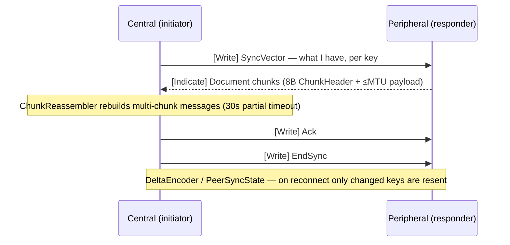

# Module 4 — The Edge: `peat-btle` & `peat-lite`

**Goal:** understand how Peat reaches the *smallest* and *most disconnected* devices — phones and
watches with no network, and microcontrollers running bare-metal with no operating system. Two
crates: [`peat-btle/`](../peat-btle/) (Bluetooth LE mesh transport) and
[`peat-lite/`](../peat-lite/) (`no_std` CRDT primitives + a tiny wire protocol).

> **How to read the status labels.** Every capability in this module carries one of four tags so a
> reader always knows what is real:
> **[Shipped]** in code and tested · **[In-flight]** an open issue/PR is tracking it ·
> **[Proposed]** an ADR exists but there is no implementation · **[Speculative]** a teaching design
> that is not in any repo. When code and a README disagree, the code wins, and this module cites
> `path:line` so you can check.

> **Mental model:** these are the two ends of "any device joins." `peat-btle` is a *transport* — it
> moves bytes over the Bluetooth radio when there is no Wi-Fi, cell, or satellite link.
> `peat-lite` is a *data-format and primitives* library small enough to run on bare metal. Both are
> **standalone leaf crates**: they depend on nothing else in Peat (beyond `peat-btle`'s one optional
> link to `peat-lite`), and `peat-mesh` pulls them in only through opt-in Cargo features.

**Audited against:** peat-btle `3d70f48` / 0.4.0, peat-lite `7a8a8fb` / 0.2.5, peat-mesh `c863d16` /
0.9.0-rc.43.

---

# Part A — `peat-btle` (BLE mesh transport) **[Shipped, opt-in]**

When there is no infrastructure at all, the Bluetooth radio already in every phone, watch, and MCU
becomes the network. An Android phone, a WearOS watch, and an ESP32 sensor can discover each other
and sync state over BLE with nothing else present. `peat-btle` is the transport that makes that
work, and it is **Shipped** — bridged into the wider mesh behind peat-mesh's opt-in `bluetooth`
feature (`peat-btle/src/transport.rs:159-324`; `peat-mesh/src/transport/btle.rs:208`; ADR-039,
*Proposed* — the ADR is still formally Proposed even though the crate ships).

The design obsession is battery. Power savings come from the **`PowerProfile`** scan/advertise/
connection timing, which exposes four variants — `Aggressive`, `Balanced` (the default), `LowPower`,
and `Custom { scan_interval_ms, scan_window_ms, adv_interval_ms, conn_interval_ms }` for hand-tuned
timings (`peat-btle/src/config.rs:73-87`). A lower duty cycle means the radio sleeps more between
sync windows. Two cautions for the skeptical reader:

- The often-quoted "watch lasts 18–24 hours vs. 3–4 hours for traditional BLE-mesh SDKs, <5% vs.
  20%+ radio duty cycle" figures are **uncited vendor-comparison marketing** from the README
  (`README.md:28-31`) — **[Unverifiable]**. There is no measurement harness output in the repo to
  back them. The defensible statement is narrower: the duty cycle a given profile produces is
  *computable* from the timing constants in `power/profile.rs:98-122`, but it has not been measured
  on hardware in-repo. The per-profile estimates that *do* live in code — `Aggressive` ~20% duty /
  ~6 h, `Balanced` ~10% / ~12 h, `LowPower` ~2% / ~20+ h watch battery (`config.rs:73-87`
  doc-comments) — are likewise design estimates, not measured field results.
- An "UltraLow / 36-hour" profile is sometimes cited; it has **no code path** — the `PowerProfile`
  enum's variants are `Aggressive`, `Balanced`, `LowPower`, and `Custom` (`config.rs:73-87`).
  `UltraLow` is not among them.

## 4A.1 Entry points

[`peat-btle/src/lib.rs`](../peat-btle/src/lib.rs) re-exports the developer-facing types:

- **`BluetoothLETransport`** — the pluggable transport. It implements the `MeshTransport` contract
  (ADR-032, *Proposed* — the trait seam ships) covering discovery, GATT exchange, PHY selection,
  and connection lifecycle (`src/transport.rs:159-324`). **[Shipped]**
- **`BleConfig`** — configuration. The real API is a `peat_lite(node_id)` preset constructor
  (`config.rs:428`), a public `power_profile` field (`config.rs:398`), and an
  `apply_power_profile()` method that pushes the chosen profile's timings into the discovery and
  mesh settings (`config.rs:439`). There are **no** `with_power_profile()` or `with_phy()` builder
  methods — set the `power_profile` field and call `apply_power_profile()`; select the PHY via
  `BlePhy` / the `coded-phy` feature. **[Shipped]**
- **`PeatMesh`** — the high-level mesh-management facade (ADR-039): peers, document sync, observer
  notifications (`src/peat_mesh.rs:162-256`). **[Shipped]**
- **`MeshManager`** — topology, parent selection, failover (`src/lib.rs:248`). **[Shipped]**
- **`NodeId`** — a **32-bit** node id (`u32`, `src/lib.rs:367-371`), often derived from the BLE MAC
  (`NodeId::from_mac_address`, `src/lib.rs:408,446`). Note this is peat-btle's *own* identity type;
  it is **not** the SHA-256-of-Ed25519 scheme used in the core mesh. Peat runs **four different
  identity derivations** across the stack — see the cross-cutting note at the end of Part A.
  **[Shipped]**
- **`BleAdapter` trait** — the platform abstraction every OS implements. **[Shipped]**

## 4A.2 The cross-platform trick

The crate is organized around one trait so the *same* mesh logic runs across platforms
([`peat-btle/src/platform/mod.rs`](../peat-btle/src/platform/mod.rs)):

```rust
pub trait BleAdapter: Send + Sync {
    async fn init(&mut self, config: &BleConfig) -> Result<()>;
    async fn scan(&self, config: &DiscoveryConfig, cb: DiscoveryCallback) -> Result<()>;
    async fn advertise(&self, beacon: &PeatBeacon) -> Result<AdvertisementHandle>;
    async fn connect(&self, peer: &DiscoveredDevice) -> Result<Arc<dyn BleConnection>>;
    // ...
}
```

Each platform provides an implementation, selected by a Cargo feature. The status column is the
honest part — not every adapter is finished:

| Platform | Adapter | Backed by | Status |
|----------|---------|-----------|--------|
| Linux | `BluerAdapter` | `bluer` (BlueZ D-Bus) | **[Shipped]** Stable |
| macOS / iOS | `CoreBluetoothAdapter` | `objc2` + CoreBluetooth | **[Shipped]** macOS; **[In-flight]** iOS — central callbacks incomplete (`apple/central.rs:209`) |
| Android | `AndroidAdapter` (+ Kotlin) | UniFFI bindings → Kotlin BLE APIs | **[Shipped]** (incl. WearOS) |
| Windows | `WinRtBleAdapter` | `windows` crate (WinRT) | **[In-flight]** adapter exists, GATT-server write path not real (`windows/gatt_server.rs:227`), not yet tested (`README.md:44`) |
| ESP32 | (esp32 module) | `esp-idf` / NimBLE | **[Shipped]** Stable |
| (tests) | `MockBleAdapter` | in-memory | — test fixture |

Android is **Kotlin-first**: the real BLE calls live in `peat-btle/android/.../PeatBtle.kt`, with
UniFFI generating the Rust↔Kotlin glue, so the Rust `AndroidAdapter` is a thin shim.

## 4A.3 Sync over GATT (delta-based, chunked) **[Shipped]**

BLE has tiny MTUs — the BLE spec's default ATT MTU is 23 bytes, leaving ~20 bytes of payload per
write after the 3-byte ATT header (a BLE-spec default, not a Peat constant). So documents are
**chunked** and reassembled.

- **`ChunkHeader`** — 8 bytes: `[message_id:4][chunk_index:2][total_chunks:2]`
  (`src/sync/protocol.rs:38-68`, `CHUNK_HEADER_SIZE = 8`).
- **`ChunkReassembler::process(chunk, now)`** — accumulates chunks per `message_id` and returns the
  full message once all arrive; partial reassembly times out after 30 s
  (`src/sync/protocol.rs:152`, `partial_timeout_ms: 30_000` at `:145`).
- **`SyncMessageType`** — `SyncVector`, `Document`, `Ack`, `EndSync`, `Error`. This enum lives in
  **`src/gatt/protocol.rs:68-77`**, not in `sync/protocol.rs` (which instead defines the
  `SyncState { Idle, Sending, Receiving, WaitingAck }` machine at `:256`).
- **`DeltaEncoder` / `PeerSyncState`** (`sync/delta.rs:32,69,84`) — track *per-peer* what has
  already been sent (`needs_send(key, timestamp)`), so on reconnect only the **changed** keys go
  over the air. **Caveat:** re-delivery of *pending* CRDT state queued during a long outage is
  **[In-flight]** (peat-btle#73) — the encoder tracks per-peer sent state, but full reconnect
  re-delivery is not finished. The robust reconnect path today is the QUIC/peat-node path
  (Module 3), not the BLE leg.

The GATT sync flow as a sequence:



**Diagram legend.** Solid arrow `->>` = a GATT *Write* (Central→Peripheral). Dashed arrow `-->>` =
a GATT *Indicate* (Peripheral→Central). `Note` = local processing, not a message on the wire. The
exchange order is the `SyncMessageType` sequence: `SyncVector` → `Document` chunks → `Ack` →
`EndSync` (`gatt/protocol.rs:68-77`).

### Discovery beacons

Discovery uses a compact **16-byte `PeatBeacon` body** (`discovery/beacon.rs`, `BEACON_SIZE = 16`)
carrying version, capability flags, node id, hierarchy level, a **24-bit geohash** (~600 m
precision), battery %, and a sequence number for dedup. Be precise about framing: the 16-byte figure
is the beacon *body*, and `beacon.rs:36-49` documents **two distinct advertising layouts** for it.
Wrapped as **Manufacturer Data**, the complete frame is `3 + 18 + (3 + 16) = 40` bytes and
**requires extended advertising** — too big for the legacy 31-byte limit. Wrapped as **Service
Data**, the same body fits: `3 + 18 = 21` bytes, comfortably **inside the legacy 31-byte
advertising limit** as a single frame (`beacon.rs:42-49`). So whether extended advertising is
required depends on the layout chosen, not on the body itself. **[Shipped]**

### Security — FIPS-clean in code

Security is two-phase (`security/`):

- **Phase 1** is a mesh-wide **AES-256-GCM** key derived via **HKDF-SHA-256** from a shared secret
  (`mesh_key.rs:23-25,124-128`).
- **Phase 2** adds per-peer end-to-end encryption via **ECDH P-256** key agreement
  (`peer_key.rs:33`), with **Ed25519** device identities (`security/identity.rs`).

Every one of these is a **FIPS-approved** primitive (ADR-060, *Proposed* — but §5 of the ADR is
already implemented in code; the crate migrated off ChaCha20-Poly1305 / X25519 to AES-256-GCM /
ECDH-P256 on 2026-05-18, commit `c8b013e`). This module reflects the **source reality**; the
peat-btle **README is stale** and still advertises ChaCha20/X25519 (`README.md:196,218,242,282`).
Two honest caveats for a defense-prime auditor:

- **Published-vs-source split — the shipped crate is not yet FIPS-clean.** The FIPS-clean code above
  is the *source* at HEAD `3d70f48` (`Cargo.toml:106,116`; `src/security/mesh_key.rs:23-25`,
  `peer_key.rs:33,93`). The peat-btle 0.4.0 **published to crates.io** (checksum `a57dd351`) — the
  one a downstream consumer like peat-flutter actually builds — still depends on `chacha20poly1305`
  + `x25519-dalek` (`peat-flutter/rust/Cargo.lock:3542-3575,630-631,6451-52`). Same version string,
  same `0.4.0`: the FIPS migration landed in git but was **never re-published**. So a build that
  pulls peat-btle 0.4.0 from the registry today gets the non-FIPS BLE crypto.
- **The algorithms are FIPS-approved; the modules are not CMVP-validated.** `aes-gcm` and `p256` are
  pure-Rust RustCrypto crates, not a certified FIPS 140-3 cryptographic module. For a real FIPS 140
  boundary today, the path is the KMS/Vault HSM backends in peat-gateway (Module 5), not this local
  software AES.
- peat-btle's `NodeId` derivation hashes the Ed25519 public key with **BLAKE3**, which is **not a
  FIPS algorithm**. This is addressing-only (it picks a `u32` id, `src/security/identity.rs:141`),
  **not** a security boundary, so it does not affect the FIPS posture of the encrypted channel.

> **Cross-cutting — the four identity schemes.** A common over-simplification is "NodeId = SHA-256 of
> an Ed25519 key, everywhere." That is false across the stack. peat-btle uses a `u32` from
> BLAKE3(pubkey)[..4]; peat-lite uses a bare `u32` with no key derivation (Part B); peat-mesh's
> crypto identity is `DeviceId = SHA-256(Ed25519 key)[..16]` (128 bits, *16* bytes — not the
> "256-bit" or "32-byte" figure some specs state); peat-node uses the raw iroh `EndpointId`. The
> cross-transport identity bridge (the `u32 ↔ DeviceId` hop) lives behind peat-mesh's `Translator` /
> `BleTranslator` (ADR-059, *Proposed*; codec **[Shipped]**), and a function literally named
> `btle_to_peat_node_id` is **not** present in the source — do not cite it.

---

# Part B — `peat-lite` (`no_std` embedded primitives)

Not every device runs Linux. A wrist device, an ESP32 sensor, a microcontroller node — kilobytes of
memory, often no heap allocator. `peat-lite` provides bounded, `no_std` CRDT primitives and a tiny
wire protocol. Its *only* runtime dependency is `heapless` 0.8 (fixed-capacity collections, no heap;
`Cargo.toml:38`). **[Shipped]**

> **On "256 KB of RAM."** peat-lite is often described as fitting in 256 KB. That number is a
> **design target** (ADR-035, *Proposed*; `README.md:7,13`, `lib.rs:21`), **not** an enforced or
> measured budget — there is no allocator cap and no static-RAM assertion in the code
> (**[Unverifiable]** as a guarantee). Treat "fits a small MCU" as the claim, and "256 KB" as the
> stated design ceiling.

## 4B.1 The primitives (and their memory budgets)

A crucial honesty point: of the wire types peat-lite *names*, only a subset are real CRDT structs in
the **published library**. A consumer who depends on the `peat-lite` crate gets `LwwRegister`,
`GCounter`, and the canned-message hybrid CRDTs — and nothing else.

| Type | File | Memory | Status | Purpose |
|------|------|--------|--------|---------|
| `NodeId` | `node_id.rs` | 4 bytes | **[Shipped]** | 32-bit node id (`#[repr(transparent)]` over `u32`; bare integer, no key derivation) |
| `CannedMessage` | `canned.rs` | 1 byte | **[Shipped]** | Predefined tactical message codes (see below) |
| `CannedMessageEvent` | `canned.rs` | 22 B unsigned / 86 B signed *on the wire* | **[Shipped]** | Message + src/target NodeId + timestamp + seq; signed form adds a 64-byte signature (`wire.rs:21-27`) |
| `LwwRegister<T>` | `lww.rs` | `sizeof(T)` + 12 | **[Shipped]** | Last-writer-wins register (12 = 8-byte timestamp + 4-byte node id) |
| `GCounter<const N=32>` | `counter.rs` | ~260 bytes | **[Shipped]** | Grow-only counter, one slot per node |
| `CannedMessageStore` | `canned.rs:750` | — | **[Shipped]** | LWW store over canned-message state |
| `CannedMessageAckEvent` | `canned.rs:432` | 24 B base + 12 B/ACK (max ~792 B) | **[Shipped]** | OR-set + LWW hybrid for acknowledgement tracking |
| `PnCounter<const N=32>` | `firmware/src/crdt/pn_counter.rs` | ~520 bytes | **[Proposed for core]** | Increment/decrement counter (two G-Counters). **Not in the published library** — it exists only as a wire-type byte (`CrdtType::PnCounter = 0x03`) and a separate **firmware-only** struct a library consumer does *not* receive |
| `OrSet` | — | — | **[Speculative]** | A reserved wire-type byte (`CrdtType::OrSet = 0x04`) with **no struct anywhere** in the crate |

**Canned messages** are how a 1-byte payload says something tactically meaningful — no strings, no
allocation (`canned.rs:26,44-46`). The byte ranges and sample labels:

```
0x00–0x0F  Acknowledgments   ACK, WILCO, NEGATIVE, SAY AGAIN
0x10–0x1F  Status            CHECK IN, MOVING, HOLDING, ON STATION, RTB, COMPLETE
0x20–0x2F  Alerts            EMERGENCY, ALERT, ALL CLEAR, CONTACT, UNDER FIRE
0x30–0x3F  Requests          NEED EXTRACT, NEED SUPPORT, MEDIC, RESUPPLY
0xF0–0xFF  Reserved          custom / application-specific
```

(Exact enum spellings differ — e.g. the `AckWilco` variant's `name()` returns `"WILCO"`,
`canned.rs:143`; `"RTB"` at `:150` — but the ranges are exact.)

The CRDT merge rules are worth reading because they are small enough to be obvious. Both snippets
below are copied to match the shipped signatures (`lww.rs:89-99`, `counter.rs:92-104`):

```rust
// peat-lite/src/lww.rs — last-writer-wins with a deterministic tiebreaker
pub fn merge(&mut self, other: Self) {
    if self.should_accept(other.timestamp, other.node_id) {
        *self = other;
    }
}

fn should_accept(&self, timestamp: u64, node_id: NodeId) -> bool {
    timestamp > self.timestamp
        || (timestamp == self.timestamp && node_id.as_u32() > self.node_id.as_u32())
}

// peat-lite/src/counter.rs — grow-only counter merge = max per node (idempotent, commutative)
pub fn merge(&mut self, other: &Self) {
    for (&node, &other_count) in other.counts.iter() {
        match self.counts.get_mut(&node) {
            Some(count) => *count = (*count).max(other_count),
            None => {
                let _ = self.counts.insert(node, other_count); // ignore if full
            }
        }
    }
}
```

That is the essence of a CRDT in a dozen lines: order does not matter, duplicates do not matter, and
every node that sees the same set of updates lands in the same state. **What these types do *not*
cover is just as important:** none of them is safe for *orders*. peat-lite is built for facts and
counts (a position, a reading, an event tally), not for causally-ordered tasking. There is no
`command_log` CRDT anywhere in Peat — see the cross-cutting note at the end of Part B.

## 4B.2 The wire protocol (ADR-035, *Proposed*) **[Shipped]**

Under `peat-lite/src/protocol/`. A fixed **16-byte header**, then a payload
(`peat-lite.md` ground truth §6; `constants.rs`):

```
0–3   MAGIC bytes 0x50 0x45 0x41 0x54 (ASCII "PEAT", per constants.rs:3-4)
4     PROTOCOL_VERSION (0x01)
5     MESSAGE_TYPE
6–7   flags (u16 LE)        // FLAG_HAS_TTL = 0x0001 appends a 4-byte TTL
8–11  node_id (u32 LE)
12–15 seq_num (u32 LE)
```

- **`MessageType`** (`protocol/message_type.rs:13-49`): `Announce 0x01`, `Heartbeat 0x02`,
  `Data 0x03`, `Query 0x04`, `Ack 0x05`, `Leave 0x06`, **`Document 0x07`**, and OTA types
  `0x10–0x16`. (The `Document 0x07` type is omitted from the peat-lite README — this module is more
  accurate than the README here.)
- **`CrdtType`** (`protocol/crdt_type.rs:6-11`): `LwwRegister 0x01`, `GCounter 0x02`,
  `PnCounter 0x03`, `OrSet 0x04`. These are **wire-type bytes only**. As the table in §4B.1 shows,
  `PnCounter` has no struct in the core library and `OrSet` has no struct at all — a reserved byte
  is not an implementation.
- Default UDP gossip port is **5555**, multicast group `239.255.72.76`; `MAX_PACKET_SIZE = 512`
  (`MAX_PAYLOAD = 496`) (`constants.rs:13,22`).

The **`Document 0x07`** type carries a *universal* document envelope. The envelope body (after the
16-byte header) leads with a **1-byte flags field**, then `collection_len(1) | collection | doc_id`
and on through timestamp and the length-prefixed opaque body
(`flags(1) | collection_len(1) | collection | doc_id_len(2 LE) | doc_id | timestamp_ms(8 LE) | body_len(2 LE) | body`,
`protocol/document.rs:23-34`). The flags carry `bit0 = tombstone (0x01)`, `bit1 = encrypted (0x02)`,
with bits 2–7 reserved and rejected by the encoder (`document.rs:75-96`). Be precise about
ownership: the **envelope codec is peat-lite's own** (`protocol/document.rs:1-47`) — peat-lite
defines, owns, and tests it (this is the
"universal half" of ADR-059 Amendment 4). Only the **body** is a `peat_mesh::Document`'s fields,
postcard-encoded (`document.rs:47`), opaque to peat-lite and interpreted by the publisher/consumer.
That envelope is what lets a tiny sensor participate in the same document model as a server.

## 4B.3 Beyond the core crate

- **`android-ffi/`** — UniFFI wrappers so the `no_std` types are usable from Kotlin. **[Shipped]**
- **`firmware/`** — a *separate* `no_std` crate for ESP32 / bare-metal (built with the xtensa
  toolchain, **excluded from the main workspace**). It contains its own CRDT implementations
  (including the `PnCounter` from §4B.1), the protocol, a gossip state machine, and OTA; targets
  include M5Stack Core2 and ESP32-S3. A library consumer who depends on `peat-lite` does **not** get
  this crate's types. **[Shipped]**
- **`fuzz/`** — five cargo-fuzz targets for the decoders (e.g. `fuzz_decode_header`,
  `fuzz_canned_message_ack_decode`) — a reminder that wire parsers must survive hostile input.
  **[Shipped]**

> **Cross-cutting — what peat-lite deliberately does *not* have.** No sync engine, no anti-entropy,
> no leader election, no `command_log`. peat-lite is data types plus a codec; reconciliation,
> election, and the negentropy set-reconciliation that the core mesh uses (Module 3) all live
> upstream in peat-mesh. The version-vector "reading logs," snapshot-since-T, and IBLT digest
> schemes that appear in the constrained-networking track are **[Speculative]** teaching designs —
> they are not implemented in peat-lite or anywhere else.

---

# Part C — How the three connect

> **The modularity model — the one thing to remember about these two crates.** `peat-lite` and
> `peat-btle` are **standalone leaf crates**: the rest of Peat depends on *them*, but they depend on
> *nothing* in Peat (beyond `peat-btle`'s one *optional* link to `peat-lite`). Dependencies flow
> **down into** the edge crates, never out of them. This is deliberate. Keeping these as pure leaves
> means they can be reused on their own — a `no_std` CRDT library, a cross-platform BLE-mesh
> transport — by projects that do not want the whole Peat stack; they can be versioned and published
> independently; and they can compile for microcontrollers and mobile targets the heavier core
> cannot reach. It is also what keeps the dependency graph acyclic (Module 1, §1.6; ADR-059). Every
> Peat arrow into `peat-btle` / `peat-lite` is marked `optional = true`.

- **`peat-btle` → `peat-lite`:** optional, behind the **`peat-lite-frame`** feature
  (`peat-btle/Cargo.toml:47,174`). It lets BLE carry the universal `Document` envelope
  (`MessageType::Document = 0x07`) so the BLE leg and the rest of the mesh share one document format.
  **[Shipped]**
- **`peat-mesh` → both:** optional. peat-mesh's `bluetooth` feature integrates `peat-btle`
  (delegating to it as a transport, `peat-mesh/src/transport/btle.rs:208`); its `lite-bridge`
  feature bridges `peat-lite` UDP devices via `LiteMeshTransport`
  (`peat-mesh/src/transport/lite.rs:841`). **[Shipped, opt-in]**
- **No cycles.** `peat-btle` deliberately does **not** depend on `peat-mesh` anymore. It originally
  did (a `mesh-translator` feature), creating a `peat-btle ↔ peat-mesh` cycle that broke cargo's
  resolver. **ADR-059 Amendment 4** (Slice 4.b) deleted that back-edge: peat-btle 0.4.0 exposes only
  codec primitives (behind `translator-codec`) and has **zero** peat-mesh dependency; peat-mesh
  implements the `Translator` / `BleTranslator` *on top of* those primitives. (The cycle-break is
  tracked by peat#828, **[In-flight]**.) This is the same saga referenced by the long comment block
  in `peat/Cargo.toml` (Module 1, §1.5). **[Shipped]**

```
peat-mesh ──(bluetooth feat)──▶ peat-btle ──(peat-lite-frame feat)──▶ peat-lite
     └──────(lite-bridge feat)───────────────────────────────────────────▲
                                                                          │
                                          (peat-lite has NO peat deps — it's the leaf)
```

**Diagram legend.** `──▶` = a Cargo dependency edge. The labels in parentheses are the **opt-in
Cargo features** that gate each edge — none is on by default. The bottom edge shows peat-mesh
bridging peat-lite UDP devices directly (`lite-bridge`), independent of the BLE path. peat-lite is
the leaf: no arrow leaves it.

---

## A worked edge example — a remote sensor over a constrained link

To see both crates in one path (and the honest boundaries), follow a reading from an ESP32 sensor
into the wider mesh. This is **use case 5** from the curriculum's use-case set, grounded leg by leg.

1. **Sensor → bridge (peat-lite UDP).** An ESP32 running peat-lite firmware encodes a reading as a
   single frame: the 16-byte header + a small payload, well under the 496-byte payload limit. A
   position is ~12 bytes (fixed-point lat/lon in microdegrees + altitude in cm); a `GCounter` over
   32 nodes is ~260 bytes — both *design-budget* figures consistent with the types, not measured RAM
   usage. The reading rides the `MessageType::Document (0x07)` envelope. **[Shipped]** (codec in
   peat-lite; sockets in `peat-lite/firmware/`; bridged by `LiteMeshTransport`, feature
   `lite-bridge`).
2. **Bridge node ingests it.** The bridge runs peat-mesh with `lite-bridge`; its `LiteMeshTransport`
   feeds the frame into the document store, where the Automerge backend wraps it as a CRDT document
   and observers fire. **[Shipped]**
3. **Bridge → mesh (QUIC/Iroh).** Negentropy set reconciliation + Automerge sync carry the document
   upstream over QUIC (Module 3). **[Shipped]**
4. **OTA back down.** Firmware updates push to the sensors via the peat-lite OTA path (ADR-047):
   protocol/offer types in `peat-lite/src/protocol/ota.rs`, the firmware applier in
   `peat-lite/firmware/src/ota.rs:8-10` — stop-and-wait (one chunk, ACK before next), streaming
   SHA-256 verified before commit, optional Ed25519 signature verification. (There is no
   `lite_ota.rs`.) **[Shipped]**
5. **A long-range variant of leg 1 (LoRa)** would let the sensor field span 7–87 km at 1.5–9.1 kB/s
   — but those are **external LoRa hardware specs, not Peat measurements**, and `peat-lora` is
   **[Proposed]** only (ADR-052, which also still references ChaCha20-Poly1305 — a FIPS conflict to
   resolve before any implementation). There is no LoRa crate, module, or Cargo entry; the
   `TransportType::LoRa` enum variant resolves to "no transport registered."

The honest summary: the **embedded → bridge → mesh** path is **Shipped** end to end; the long-range
radio leg and any single-burst digest scheme to make a constrained link reconcile efficiently are
**Proposed / Speculative**.

---

## Try it

1. Open `peat-lite/src/lww.rs` and `peat-lite/src/counter.rs`. They are short — read every line.
   This is CRDTs without the jargon. Match the `merge` signatures against the snippets above
   (`merge(&mut self, other: Self)` for LWW; `merge(&mut self, other: &Self)` for the counter).
2. Read `peat-lite/src/protocol/header.rs` and hand-decode the 16-byte header of a `Heartbeat`
   (type `0x02`).
3. In `peat-btle/src/sync/protocol.rs`, follow `ChunkReassembler::process` for a 3-chunk message,
   then find the `SyncMessageType` enum — note it is actually in `src/gatt/protocol.rs`, not this
   file.
4. Browse `peat-btle/examples/` (`linux_scanner`, `canned_message_sync`, `peer_e2ee`) and
   `peat-btle/docs/platforms/ESP32.md`.

## Checkpoint

- Why does `peat-lite` forbid the heap, and what does it use instead of `Vec` / `HashMap`?
- Explain in one sentence why the `GCounter` merge is safe to apply in any order, twice.
- Which CRDT types does a `peat-lite` *library* consumer actually get, and which named types
  (`PnCounter`, `OrSet`) are wire-bytes or firmware-only rather than core structs?
- The peat-btle README says ChaCha20/X25519; the code says AES-256-GCM/ECDH-P256. Which is
  authoritative, and what is the residual FIPS caveat (algorithm-approved vs. CMVP-validated)?
- What dependency cycle did ADR-059 Amendment 4 break, and how?
- Why is battery life a *first-class* design constraint for `peat-btle`, and which figures about it
  are uncited marketing?

---

Next: [Module 5 — The Control Plane: `peat-gateway` »](05-peat-gateway.md)
