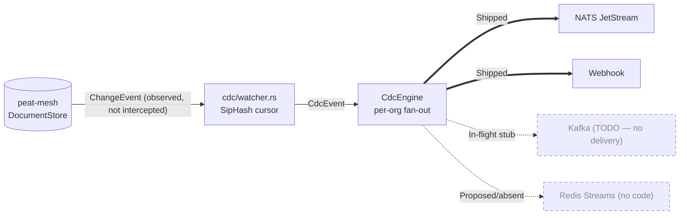

# Module 5 — The Control Plane: `peat-gateway`

**Goal:** understand the *enterprise* side of Peat. The mesh itself is decentralized and needs no
server. But an organization that fields meshes still has to onboard teams, plug into its own identity
system, manage cryptographic material, and feed mesh events into its analytics and audit pipelines.
That work happens in the gateway. Repo path: [`peat-gateway/`](../peat-gateway/) (crate `0.1.0`,
audited at HEAD `1da5002`).

> **Mental model — the gateway watches and manages; it does not relay.** CRDT sync, blob transfer,
> and peer-to-peer routing all live in `peat-mesh` and never pass through the gateway. The gateway is
> optional: meshes converge and operate with no gateway present. It adds enterprise manageability
> *beside* the data plane, not inside it.

This is an important distinction the rest of the curriculum (and the constrained-networking track)
leans on. When other material says "a gateway forwards the summary upstream," it means a **peat-mesh
relay node** — a node in the data plane — not this control-plane service. The two are different things
that happen to share a word. This module is about the control plane only.

**A note on status labels.** Every capability below is tagged **Shipped** (in code, tested),
**In-flight** (an open issue or PR is tracking it), **Proposed** (an ADR exists but no implementation),
or **Speculative** (a teaching idea with neither code nor ADR). The gateway is a young crate (`0.1.0`),
and `src/lib.rs` opens with `#![allow(dead_code)]` and the comment *"Scaffolding — stubs will be wired
incrementally."* That candor is worth honoring: several advertised features are real, a couple are
stubs that do not yet do anything, and a couple do not exist at all. Knowing which is which is the
point of this module.

## 5.1 What it is, and what it is not

**Shipped capabilities:**

- **Multi-org tenancy** — isolated trust boundaries, one per organization.
- **Envelope encryption of authority keys** — the gateway holds each formation's root-of-trust
  material encrypted at rest. This is the best-tested subsystem in the crate.
- **Change Data Capture (CDC) streaming** — observes mesh document changes and emits flat events to
  enterprise sinks, without being in the sync path.
- **Identity federation via OIDC token introspection (RFC 7662)** — enrollment can validate a token
  against any OIDC-compliant identity provider (feature `oidc`,
  [`src/api/enroll.rs:300-392`](../peat-gateway/src/api/enroll.rs)). The gateway does **not** bundle a
  specific IdP; it speaks the standard introspection flow against whatever the operator configures.
- **Admin REST API + Prometheus metrics** (Axum 0.7) and a **SvelteKit admin UI**.
- **Helm / Zarf / UDS packaging** for Kubernetes and air-gapped deployment.

**Not in the box (be precise with a skeptical reader):**

- SAML / CAC enrollment — **not implemented** (no code path; treat any such claim as Proposed).
- Kafka CDC sink — **In-flight stub** (the dispatch branch is a `// TODO`; it does not deliver).
- Redis Streams CDC sink — **does not exist** (no enum variant, no feature, no code).

**It is not:** a mesh node (it does not replace a data-plane node), a data plane (it never touches
CRDT sync), or a requirement (meshes run without it).

## 5.2 Entry point

[`peat-gateway/src/main.rs`](../peat-gateway/src/main.rs) is a `clap` CLI with three subcommands
(**Shipped**):

- `serve` (default) — start the Axum HTTP API server.
- `migrate-keys { dry_run }` — re-seal any plaintext genesis records under the configured KEK
  ([`src/cli.rs`](../peat-gateway/src/cli.rs)). Useful when promoting a dev instance that started with
  the plaintext key provider to a real KMS/Vault backend.
- `load-test { … }` — a built-in load tester behind the `loadtest` feature
  ([`src/loadtest.rs`](../peat-gateway/src/loadtest.rs)).

The `serve` path is the spine of the service:

```rust
// peat-gateway/src/main.rs  (serve)
let tenant_mgr  = tenant::TenantManager::new(config).await?;
let cdc_engine  = cdc::CdcEngine::new(config, tenant_mgr.clone()).await?;
let app = api::router(tenant_mgr, cdc_engine, config.ui_dir.as_deref(), config.admin_token.clone());
// ... serve `app` (an axum::Router) on config.bind_addr
```

Three objects get built and wired: the **tenant manager**, the **CDC engine**, and the **router**
(which also serves the UI and applies the admin-token gate).

## 5.3 The module map

[`src/lib.rs`](../peat-gateway/src/lib.rs) declares: `api`, `cdc`, `cli`, `config`, `crypto`,
`ingress` (NATS, feature-gated), `storage`, `tenant`.

### Tenant manager — `src/tenant/`

The core domain. `TenantManager` (`manager.rs`) owns orgs, formations, peers, tokens, and the
certificate authority. Its models (`models.rs`) are the vocabulary of the control plane:
`Organization`, `FormationConfig`, `EnrollmentPolicy`, `OrgQuotas`, `EnrollmentToken`,
`CdcSinkConfig`, `PeerInfo`, `IdpConfig`, `MeshTier`, `PolicyRule`, `EnrollmentDecision`.

The crucial link to the mesh: the gateway creates and stores a **`MeshGenesis`** per formation —
`peat-mesh`'s root-of-trust authority object (**Shipped**):

```rust
// peat-gateway/src/tenant/manager.rs
use peat_mesh::security::{MembershipPolicy, MeshGenesis};
// create a formation's genesis (authority keys + membership policy):
let genesis = MeshGenesis::create(&app_id, mesh_policy);   // manager.rs:234-237
// later, load + decrypt it on demand:
pub async fn load_genesis(&self, org_id: &str, app_id: &str) -> Result<MeshGenesis> { /* ... */ }
```

That is the whole "control plane manages the mesh without being in it" idea in one place: the gateway
manufactures the trust material — the genesis, membership certificates carrying a tier — that
autonomous nodes then carry and verify on their own, with no further gateway involvement.

#### Trust tiers and how they map (Shipped)

The gateway maps its own enterprise role concept onto a mesh trust tier ([`models.rs:181-188`](../peat-gateway/src/tenant/models.rs)):

```rust
pub fn to_mesh_tier(self) -> peat_mesh::security::MeshTier {
    match self {
        MeshTier::Authority      => peat_mesh::security::MeshTier::Enterprise,
        MeshTier::Infrastructure => peat_mesh::security::MeshTier::Regional,
        MeshTier::Endpoint       => peat_mesh::security::MeshTier::Tactical,
    }
}
```

Two things a careful reader must take away:

1. **These tiers are *not* the formation hierarchy.** The gateway's `MeshTier`
   (`Authority/Infrastructure/Endpoint`) is a role/trust concept, and the mesh-wire `MeshTier`
   (`Enterprise/Regional/Tactical/Edge`) is a distribution-tier concept. **Neither is the ADR-066
   hierarchy** (Platform/Cell/Cohort/Federation/Coalition) that adjacent modules use. Do not conflate
   them — they are three different vocabularies. (And note: ADR-066 is itself **Proposed**, and the
   shipped hierarchy leaf is still named `Node`, not `Platform` — see Module 2b.)
2. **The gateway issues only 3 of the 4 mesh-wire tiers.** The mesh enum has a fourth value, `Edge`,
   that the gateway never produces. A node provisioned by this gateway can be `Enterprise`, `Regional`,
   or `Tactical`; `Edge` is reachable only by other means.

RBAC at the gateway is **a `u32` permission bitmask**, not a set of named roles —
`RELAY=0x01, EMERGENCY=0x02, ENROLL=0x04, ADMIN=0x08`
([`models.rs:190-216`](../peat-gateway/src/tenant/models.rs)), narrowed to the mesh's own bitmask when a
node is enrolled (gateway `ADMIN=0x08` maps to mesh `ADMIN=0x80`; the rest are identical bits). If you
have seen "five named roles" elsewhere in the curriculum, that is a *different* axis (the
`peat-protocol` RBAC `Role` enum, Module 2); the gateway's authorization is the bitmask above.

### Envelope encryption — `src/crypto/` (Shipped)

The `MeshGenesis` authority keys are sensitive, so they are encrypted at rest using **envelope
encryption**: a per-record Data Encryption Key (DEK) is wrapped by a Key Encryption Key (KEK). The KEK
lives behind a pluggable trait ([`src/crypto/mod.rs:37-41`](../peat-gateway/src/crypto/mod.rs)), and
the on-disk format is a versioned envelope (PENV v1):

```rust
#[async_trait]
pub trait KeyProvider: Send + Sync {
    async fn wrap_dek(&self, dek: &[u8]) -> Result<Vec<u8>>;
    async fn unwrap_dek(&self, wrapped: &[u8]) -> Result<Vec<u8>>;
}
```

Four backends implement it:

| Backend | File | Use | Status |
|---------|------|-----|--------|
| `PlaintextProvider` | `crypto/mod.rs` | dev/test only — errors on `wrap` | **Shipped** |
| `LocalKeyProvider` | `crypto/local.rs` | local **AES-256-GCM** KEK | **Shipped** |
| `AwsKmsProvider` | `crypto/kms.rs` | AWS KMS (`aws-sdk-kms`, feature `aws-kms`) | **Shipped** |
| `VaultTransitProvider` | `crypto/vault.rs` | HashiCorp Vault Transit (feature `vault`) | **Shipped** |

The rest of the code calls `wrap_dek` / `unwrap_dek` and never knows whether the key lives in memory,
in a cloud KMS, or in a Vault HSM — the strategy pattern, applied to key custody.

**FIPS posture (read this carefully — it differs from the rest of the stack).** This crate is
FIPS-clean: it uses **AES-256-GCM** (SP 800-38D) for the local KEK and carries **zero ChaCha20**. (The
ChaCha20 FIPS conflict you may have read about lives only in the *proposed* peat-lora transport,
ADR-052 — it is not here and must not be attributed here.) The important caveat for a defense-prime
auditor: the **local-KEK path uses software AES from a pure-Rust crate (`aes-gcm 0.10`), which is not a
CMVP-validated cryptographic module.** AES-256-GCM is a FIPS-*approved algorithm*, but "approved
algorithm" is not "validated module." For an actual FIPS 140 boundary, use the **AWS KMS or Vault
Transit** backends, whose key operations run inside a validated HSM; the local KEK is for development
and non-accredited deployments. (One known cleanup: decrypted genesis bytes are not yet zeroized after
use — peat-gateway#55, **In-flight**.)

### CDC engine — `src/cdc/`

Change Data Capture streams CRDT document mutations out to enterprise systems for analytics, audit, and
integration — without the gateway being in the sync path. It works by **observing** the mesh's document
store rather than intercepting it (**Shipped**):

```rust
// peat-gateway/src/cdc/watcher.rs
use peat_mesh::sync::traits::DocumentStore;
use peat_mesh::sync::types::{ChangeEvent, Query};
// the watcher subscribes via DocumentStore::observe() and consumes
// ChangeEvent::{Initial, Updated, Removed}, emitting a flat CdcEvent.
```

The watcher tracks position with a `change_hash` SipHash cursor
([`watcher.rs:238-258`](../peat-gateway/src/cdc/watcher.rs)) so that a restart can de-duplicate already-seen
changes. The `CdcEngine` (`engine.rs`) fans the resulting `CdcEvent`s out per-org to configured sinks,
chosen via `CdcSinkType` / `CdcSinkConfig`.

**Sinks — exactly two work today.** The `CdcSinkType` enum has three variants
([`models.rs:80-84`](../peat-gateway/src/tenant/models.rs)): `Nats`, `Kafka`, `Webhook`.

| Sink | Status | Note |
|------|--------|------|
| **NATS JetStream** (`nats_sink.rs`, feature `nats`) | **Shipped** | delivers |
| **HTTP webhook** (`webhook_sink.rs`, feature `webhook`) | **Shipped** | delivers |
| **Kafka** | **In-flight (stub)** | dispatch branch is `// TODO: Kafka delivery` ([`engine.rs:78-80`](../peat-gateway/src/cdc/engine.rs)) — does **not** deliver |
| **Redis Streams** | **does not exist** | no enum variant, no feature, no code |

Be exact with a customer: only **NATS JetStream** and **Webhook** are shipped delivery paths. The
README's mention of Kafka/Redis over-advertises both. As for delivery *semantics* — the engine has no
documented at-least-once guarantee in code; the `change_hash` cursor supports restart de-duplication,
which is adjacent to but not the same as a retry-until-acked guarantee. **Treat CDC delivery semantics
as unverified** until a retry/cursor path is cited.



### Enrollment & identity — `src/api/enroll.rs`, `src/api/identity.rs`, `IdpConfig`

Enrollment is how a node onboards. A formation's `EnrollmentPolicy` governs it, and there are exactly
three modes ([`src/api/enroll.rs:89-164`](../peat-gateway/src/api/enroll.rs)):

- **`Open`** (**Shipped**) — admits the node and grants the `Endpoint` tier with zero permissions.
- **`Controlled`** (**Shipped**) — accepts either a static enrollment token *or* an OIDC token, which
  the gateway validates by **RFC 7662 introspection** against the org's configured IdP
  (`introspect_oidc_token`, [`enroll.rs:300-392`](../peat-gateway/src/api/enroll.rs)); `PolicyRule`s then
  map the authenticated identity onto a `MeshTier`, producing an `EnrollmentDecision`.
- **`Strict`** (**In-flight / unimplemented**) — intended to require explicit admin approval, but the
  handler **always returns 403** ([`enroll.rs:89-93`](../peat-gateway/src/api/enroll.rs)). It is a
  placeholder, not a working approval workflow. A reader who configures `Strict` today simply locks
  enrollment closed.

Two security gaps that a defense-prime reviewer must know about up front:

1. **No proof-of-possession at enrollment (In-flight).** The submitted Ed25519 public key is validated
   for **length only** — exactly 32 bytes
   ([`enroll.rs:237-285`](../peat-gateway/src/api/enroll.rs)) — and the `node_id` is an opaque
   client-supplied string. There is no signature challenge proving the client holds the matching
   private key. A node can today enroll a public key it does not own. This is a known gap (see the
   gaps map below; no dedicated issue yet — a good first one to open).
2. **The admin API is fully open when `PEAT_ADMIN_TOKEN` is unset.** The admin routes are bearer-token
   protected *when the token is set* ([`src/api/mod.rs:76-85`](../peat-gateway/src/api/mod.rs)); when it
   is **unset, they are wide open** — a deployment hazard, not merely a "warning." Set the token in any
   environment that is not a throwaway dev box.

(Note: SAML / CAC enrollment is sometimes described in the wild as supported. It is **not** in the
code — only OIDC introspection is. Treat SAML/CAC as **Proposed/unverified**.)

### Storage — `src/storage/` (Shipped)

A `StorageBackend` trait with two implementations: `redb_backend.rs` (embedded, the **default** for
single-node and air-gapped deployments) and `postgres.rs` (via `sqlx`, feature `postgres`). Orgs,
formations, peers, tokens, certs, and the *encrypted* genesis records all persist here. The Postgres
backend's integration tests are not yet wired into CI (peat-gateway#53, **In-flight**).

### Admin API — `src/api/` (Shipped)

Axum routers, composed in [`api/mod.rs`](../peat-gateway/src/api/mod.rs):

```
/orgs            → orgs, tokens, sinks, identity, formations  (admin-token gated)
/orgs/.../enroll → enrollment (POST, PUBLIC — no admin auth; the node-onboarding entrypoint)
/health, /metrics → health check + Prometheus
/_/              → the SvelteKit admin UI (static files; served only when PEAT_UI_DIR is set)
```

Two details worth pinning down because they are easy to get wrong: the health route is **`/health`**
(not `/healthz`), per [`src/api/health.rs:24`](../peat-gateway/src/api/health.rs); and the enrollment
endpoint is deliberately **public** ([`enroll.rs:466-470`](../peat-gateway/src/api/enroll.rs)) — it is
the door nodes knock on to join, gated by the formation's `EnrollmentPolicy`, not by the admin token.

### Control-plane ingress — `src/ingress/` (NATS, feature-gated)

The gateway can also *ingest* control-plane traffic over NATS (the `ingress` module). It is
feature-rich, but **not yet production-secure**, and an enterprise reader should treat it that way:
ingress **AuthZ is a permissive stub** (peat-gateway#99), there are **no NATS broker ACLs**
(peat-gateway#97), and **NATS auth/TLS are absent** (peat-gateway#124, #125) — all **In-flight**. The
ingress path works for development and demos; hardening it is tracked, open work.

## 5.4 The admin UI — `ui/`

A **SvelteKit** app (`ui/src/routes/`, `ui/src/lib/`) served at `/_/` when `PEAT_UI_DIR` points at the
built assets ([`src/api/mod.rs:48-56`](../peat-gateway/src/api/mod.rs)). Built with `vite`; uses `pnpm`.
The exact set of screens is not enumerated in the auditable ground truth, so treat any specific
screen-by-screen list as **descriptive, not verified** — what is verified is that a static SvelteKit
UI exists, is served at `/_/`, and is backed by the admin API surface above (orgs, formations, tokens,
sinks, identity).

## 5.5 Packaging — `chart/` & `bundle/` (Shipped)

- `chart/peat-gateway/` — a **Helm** chart for Kubernetes deployment.
- `zarf.yaml` + `bundle/` — a **Zarf / UDS** bundle for air-gapped deployment. This is how the gateway
  ships into disconnected enterprise environments (ADR-045, peat#547).

A precision note for the skeptical reader: Zarf and UDS are **packaging and delivery** targets, not a
security guarantee the gateway code enforces. SSO integration, network policy, and the like are
provided by the **UDS platform** the bundle deploys into; the gateway code does not itself enforce
them. The bundle gets the artifact into the air-gap; the platform supplies the surrounding controls.

## 5.6 How it depends on the mesh

[`peat-gateway/Cargo.toml`](../peat-gateway/Cargo.toml) pins `peat-mesh` to an **exact** version
(`=0.9.0-rc.40`) with features `["automerge-backend", "broker"]`, and uses it purely as a **library**:
`MeshGenesis` / `MembershipPolicy` / `MeshTier` for trust material, and `DocumentStore` / `ChangeEvent`
for CDC watching. It never starts a mesh node and never routes mesh data.

That `=` pin moved a long way this cycle. It sat on `=0.9.0-rc.1` for months — a deliberately frozen
pin that lagged the live mesh by ~40 release candidates — but a Dependabot bump (peat-gateway#144)
fast-forwarded it to `=0.9.0-rc.40`, so the gateway now lags the ecosystem (`rc.47`) by ~7 RCs.
That bump was **not** a one-line version change: the same PR adapted the CDC watcher to `peat-mesh`'s
newer `ChangeEvent` surface — the `Updated`/`Removed`/`Initial` variants now carry an `origin` field
(and `Initial` a `collection`), with a catch-all arm added (`src/cdc/watcher.rs:81,154,202`) — and rode
a `redb` 2→4 major bump (the new `ReadableDatabase` trait import in `src/storage/redb_backend.rs`). In
other words, tracking the mesh is real integration
work, exactly as the old "frozen" framing warned; it just happens to be getting done now. Still read
"shipped" for this crate as "shipped against an exact-pinned mesh," and budget integration time when
the next mesh surface change lands.

The last substantive change to the gateway was a **security dependency bump** (`bece4d6 → 4d82282`):
`async-nats` `0.38 → 0.49` to clear the `rustls-webpki` CVEs in the transitive TLS stack
(peat-gateway#151, `Cargo.toml:57,96`). Since then (`4d82282 → 1da5002`) it has moved only on
CI/toolchain — QA-review workflow tweaks, a `rust-analyzer` toolchain component, and an ignore for
the quick-xml `RUSTSEC-2026-0194/0195` advisory — no source change. The `peat-mesh` pin is untouched
at `=0.9.0-rc.40`, and the CDC sink set (NATS JetStream + Webhook shipped; Kafka still a `// TODO`
stub) is unchanged. Worth noting because the NATS control-plane ingress is still the weakest surface here — AuthZ is a
permissive stub and broker ACLs/auth/TLS are absent (the §5.5 In-flight gaps) — so the bump hardens
the library, not the missing ingress controls.

---

## Where to contribute (control-plane gaps)

If you want to make the gateway production-ready, the highest-leverage work is exactly the gaps flagged
above:

- **Enrollment proof-of-possession** — add a signature challenge so a client must prove it holds the
  private key for the public key it enrolls (no issue yet; open one). *Medium.*
- **Control-plane authentication** — NATS ingress AuthZ (peat-gateway#99), broker ACLs (#97), NATS
  auth/TLS (#124/#125). Turn the feature-rich ingress into a secured one. *Medium each.*
- **Kafka CDC sink** — fill in the `// TODO` at `engine.rs:78-80` so the third sink actually delivers.
  *Small–medium.*
- **FIPS module path** — the local KEK uses non-validated software AES; the validated path is KMS/Vault.
  Documenting and defaulting accredited deployments to the HSM backends is enterprise-readiness work
  (related: peat-gateway#55 zeroize). *Medium.*
- **Postgres CI** (peat-gateway#53) and **DLQ replay API** (peat-gateway#119). *Small.*

---

## Try it

1. Read `src/main.rs` `serve()` — watch the three objects (tenant manager, CDC engine, router) come
   together.
2. Open `src/crypto/mod.rs` and the four `crypto/*.rs` files. Every backend implements the *same*
   two-method `KeyProvider` trait — and notice the local backend is AES-256-GCM, software, not a
   validated module.
3. Follow a CDC event: `cdc/watcher.rs` (observe via `DocumentStore::observe()`) → `cdc/engine.rs`
   (fan-out; spot the Kafka `// TODO`) → a working sink (`nats_sink.rs` / `webhook_sink.rs`).
4. Read `src/api/enroll.rs` — find the length-only public-key check (`:237-285`), the three policy
   modes (`:89-164`), and confirm `Strict` returns 403.
5. Skim `chart/peat-gateway/` and `zarf.yaml` / `bundle/` to see how it deploys air-gapped.

## Checkpoint

- Why is the gateway *not* in the data path, and why does that matter for a partition-tolerant mesh?
- What is `MeshGenesis`, which crate defines it, and how is it protected at rest?
- Explain envelope encryption (DEK vs KEK), name the four `KeyProvider` backends, and say which path is
  a FIPS-validated boundary and which is not.
- How does CDC *observe* changes without being part of sync — and which two sinks actually deliver?
- What maps a gateway trust tier to a mesh trust tier, and why are those tiers *not* the ADR-066
  formation hierarchy?
- Name two ways the gateway is not production-secure as shipped (enrollment PoP; admin token unset;
  NATS ingress AuthZ stub).

---

Next: [Module 6 — Cross-Cutting Data Flows »](06-data-flows.md)
