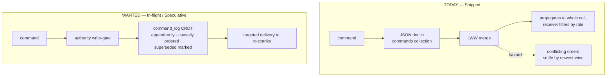

# Module 6 — Cross-Cutting Data Flows

**Goal:** tie the repos together by tracing real data end-to-end. Concepts only stick once you can
follow a byte across crate boundaries. Three traces: a track update climbing from a sensor to a
command post, cell formation with leader election, and hierarchical aggregation with a command
coming back down.

**Status labels used throughout** (every capability gets one): **Shipped** — in code, tested ·
**In-flight** — open issue/PR/epic · **Proposed** — an ADR exists but no implementation ·
**Speculative** — teaching-only design, not in any repo. Every flow in this module is **Shipped**
unless a step is tagged otherwise; the tags below mark the few legs that are not yet real, so you
always know what you can deploy today versus what is still a design.

> **Diagram legend (applies to every diagram in this module).**
> `│ ─▶` = data movement; **boxes** = a crate or subsystem; **numbered steps** = ordering.
> A leg tagged **[In-flight]**, **[Proposed]**, or **[Speculative]** is not Shipped yet — an
> untagged leg is Shipped. ADR references point to `peat/docs/adr/`; issue numbers (`#NNN`) point
> to the repo named with them.

---

## 6.1 Trace A — a sensor's track update reaches the command post

**Scenario:** an ESP32 sensor detects a moving target and reports its position. That report has to
climb from a `no_std` microcontroller all the way to a CoT consumer screen at a command post —
across three different crates and at least two transports. Every leg below is **Shipped**.

```
ESP32 sensor                 Cell leader (phone)            Zone / command post
 (peat-lite)                 (peat-protocol + peat-mesh)    (peat-transport CoT/TAK bridge)
     │                              │                               │
 1. Position encoded as a           │                               │
    peat-lite wire frame            │                               │
    (16B header + payload,          │                               │
     MessageType::Document 0x07)    │                               │
     │  ── UDP / BLE ──▶            │                               │
     │                         2. lite-bridge / btle ingests        │
     │                            into the DocumentStore            │
     │                            (collection "tracks")             │
     │                            — identity re-derived here (*)     │
     │                              │                               │
     │                         3. AutomergeBackend wraps it as a    │
     │                            CRDT doc; observers fire          │
     │                              │                               │
     │                         4. peat-mesh syncs the doc to the    │
     │                            parent via Iroh/QUIC              │
     │                            (negentropy reconcile → delta) ─▶ │
     │                              │                          5. parent aggregates
     │                              │                             cell summaries
     │                              │                             (hierarchy/aggregation)
     │                              │                               │
     │                              │                          6. peat-transport CoT bridge
     │                              │                             encodes CoT XML (MIL-STD-2525
     │                              │                             type mapping + _peat_ ext.)
     │                              │                             → CoT consumer / TAK Server
```
*(\*) Identity is **re-derived at the bridge**, not carried unchanged — see the "Identity does not
travel intact" note at the end of this trace.*

The same trace as a sequence diagram (all legs Shipped):

```mermaid
sequenceDiagram
    %% Legend: solid arrow = data hop; Note = where the work happens.
    %% Every leg in this diagram is Shipped.
    participant S as ESP32 sensor (peat-lite)
    participant L as Cell leader (peat-protocol + peat-mesh)
    participant Z as Zone / parent node
    participant T as CoT bridge (peat-transport)
    S->>L: 16-byte wire frame, MessageType::Document (0x07) — over UDP or BLE
    Note over L: lite-bridge ingests -> Document in "tracks"<br/>AutomergeBackend commits LOCALLY first (offline-safe)
    L->>Z: negentropy reconcile + delta sync (Iroh QUIC)
    Note over L,Z: P1 Critical is ordered ahead of P3/P4 at congested hops<br/>(ordering Shipped; cross-class wire preemption In-flight)
    Note over Z: HierarchicalAggregator folds CellDelta into the cohort summary
    Z->>T: aggregated picture
    T->>T: encode CoT XML (MIL-STD-2525 type mapping + _peat_ extension, ADR-028)
    Note over T: -> CoT consumer / TAK Server display
```

**Where each step lives:**

1. `peat-lite/src/protocol/` — encode the frame. Tiny, `no_std`, no allocation. A sensor reading
   rides the universal `Document` envelope (`MessageType::Document = 0x07`), the message type that
   carries `collection + doc_id + timestamp + opaque body`. The whole frame is a 16-byte fixed
   header plus payload, capped at `MAX_PACKET_SIZE = 512` (`MAX_PAYLOAD = 496`).
2. `peat-mesh/src/transport/lite.rs` (the `LiteMeshTransport`, feature `lite-bridge`) or
   `transport/btle.rs` (feature `bluetooth`) — bridge the embedded frame into the mesh; it becomes a
   `peat_mesh::Document` in the `"tracks"` collection. (Collection name is illustrative.)
3. `peat-protocol/src/sync/automerge.rs` → `AutomergeBackend` — the doc becomes an Automerge CRDT;
   observer channels notify subscribers (your `store.subscribe("tracks")` loop from Module 2).
   Automerge is the single document-CRDT family in the mesh — RGA lists/text plus observed-remove
   maps.
4. `peat-mesh/src/storage/automerge_sync.rs` + `negentropy_sync.rs` — **negentropy set
   reconciliation** finds which documents differ, then only the deltas sync over the QUIC connection
   to the parent; persisted to redb. (Negentropy is re-exported through
   `peat-protocol/src/storage/negentropy_sync.rs` → `peat_mesh::storage::negentropy_sync`;
   ADR-040 applied the lesson, tracked by peat-mesh #435.) Note: negentropy's "O(log n) rounds" is
   an **algorithmic claim from the paper, not a Peat benchmark**.
5. `peat-protocol/src/hierarchy/` — the parent's `HierarchicalAggregator` (in
   `hierarchy/aggregation_coordinator.rs`, surfaced via `update_cell_summary`) folds this cell's
   `CellDelta` in with its siblings; the `HierarchicalRouter` (`hierarchy/router.rs`) enforces that
   the update went *up through the leader*, not sideways across cells.
6. `peat-transport/src/tak/` + `peat-protocol/src/cot/` — the aggregated picture is encoded as
   Cursor-on-Target XML (MIL-STD-2525 *type-code mapping*, not full symbology rendering, plus the
   `<_peat_>` extension from ADR-028) and pushed over the TAK/CoT TCP bridge (TLS) to a CoT consumer.
   (Runnable example: the standalone [`peat-tak`](https://github.com/defenseunicorns/peat-tak) repo —
   moved out of `peat/examples/` in peat#1020.)

**QoS along the way (ordering Shipped, enforcement In-flight).** A contact report is classified P1
Critical, so at every bandwidth-constrained hop (`peat-protocol/src/qos/`, `peat-mesh/src/qos/`) it
is ordered ahead of P3 health-status and P4 telemetry traffic — peat-node, for instance, drains
Critical first in its relay fanout. What is **not** yet enforced in v1 is *cross-class wire-level
preemption*: a Critical bundle does not yet pause an in-flight Bulk transfer, and the "<5 s P1"
latency is a **configured target, not a validated SLA** (enforcement is In-flight; see
`peat-node/proto/sidecar.proto` v1 caveats). The five classes and their policy targets are P1
~500 ms/40% bandwidth, P2 ~5 s/30%, P3 ~60 s/20%, P4 ~300 s/8%, P5 none/2%
(`peat-protocol/src/qos/mod.rs:41-45`).

**If the network partitions** between steps 4 and 5, the core mesh path does not break: the
Automerge change is already committed locally, and it syncs whenever the link returns — that is the
offline-first guarantee. One honest caveat on the embedded leg: **BLE-path reconnect re-delivery of
pending CRDT state is In-flight** (peat-btle #73), so a node that was offline on the BLE leg for a
long window may not re-deliver everything it queued. The QUIC/peat-node path is the robust one.

**At the mobile-client edge (peat-ffi `0.2.10`, peat#1000) [Shipped].** Two pieces make a phone a
better citizen of this flow when links flap. First, change notifications are **origin-tagged**: the
UniFFI `DocumentChange` now carries an `origin: ChangeOrigin` field — `Local` (the app's own
publish) or `Remote { peer_id }` (a sync from a peer) — so a consumer can refresh its UI on remote
deltas without echoing its own writes. Second, a **per-peer reconnect supervisor** re-dials known
peers from a persistent roster (`roster.json`, plain non-secret reachability hints — no FIPS
concern) with an `Idle → Connecting → Connected → Backoff` state machine, exponential backoff
(2 s base, 5 min cap) plus deterministic per-peer jitter, and at most 8 concurrent dials. Its
connected set is the **union across transports**, so a peer already reachable over BLE is not
also dialed over iroh/relay. `wake_reconnect` clears backoffs on a foreground/network-up event;
`reconnect_known_peers` honours them. This is dial resilience at the binding layer — it does not
change the wire protocol or the negentropy reconciliation above.

**Blobs from the phone (peat-ffi `0.2.10`, peat#1017) [Shipped].** rc.29 also UniFFI-exports the blob
surface so a mobile app can move large attachments directly, not only through document sync. The new
methods (`peat-ffi/src/lib.rs:3358` onward, `#[cfg(feature = "sync")]`) are `enable_blob_transfer`,
`blob_add_peer` / `blob_add_peer_id` (the latter wraps peat-mesh's `add_peer_from_hex_id`), `blob_put`,
`blob_exists_locally`, `blob_endpoint_id`, `blob_bound_addr`, and — the interesting one —
**`blob_fetch_start(hash_hex, size_bytes, peer_id_hex?)`**, which is *non-blocking*: it spawns a tokio
task and immediately returns an `Arc<BlobFetchHandle>` you poll via `status() -> BlobFetchStatus`
(`Pending → Started → Downloading → Completed | Failed`) and cancel via `dispose()`. When
`peer_id_hex` is supplied it routes to peat-mesh's direct `fetch_blob_from_peer` (Module 3 §3.4b);
when omitted it falls back to mesh-sync `fetch_blob`. This is a UniFFI-liftable, poll-based facade
over the same mesh blob store — no new wire format. (Handle/poll semantics are code-confirmed; live
transfer behaviour on a device is not benchmarked here.)

**Identity does not travel intact across the bridge.** Trace A reads as one continuous climb, but
the identity attached to the report is *re-derived* at step 2, because the stack uses four different
identity schemes. peat-lite's `NodeId` is a bare 32-bit integer (`peat-lite/src/node_id.rs:9-34`,
no key derivation); peat-btle's `NodeId` is the first 4 bytes of BLAKE3 over the Ed25519 public key
(`peat-btle/src/security/identity.rs:139-148`); the mesh identity is a `security::DeviceId` =
**first 16 bytes of SHA-256 over the Ed25519 verifying key** (`peat-mesh/src/security/device_id.rs`),
surfaced on the transport as a string `NodeId`. The cross-crate hop (a 32-bit id ↔ a `DeviceId`) is
non-trivial and partly unverified — there is no single `btle_to_peat_node_id` function; bridging
lives behind the `Translator` trait / `BleTranslator` (ADR-059, **codec Shipped, ADR Proposed**).
Module 4 and Module 9 carry the full identity story; the takeaway here is just that "the sensor's id
climbs unchanged to the command post" is a simplification.

---

## 6.2 Trace B — discovery to a formed, led cell

**Scenario:** three freshly powered-on nodes (a phone, a sensor, a vehicle) become a coordinated
cell with an elected leader. All Shipped.

```
Phase 1: DISCOVERY                                                    [legend: ─▶ event/dial]
  peat-mesh/discovery (mDNS / static / k8s EndpointSlice)  →  PeerFound  →  PeerConnector dials (Iroh QUIC)
  peat-protocol/discovery                                  →  domain-level candidate pool
        │
        ▼
Phase 2: CELL FORMATION   (peat-protocol/cell/)
  a. Each node broadcasts CellMessage::CapabilityAnnounce on the CellMessageBus
     (reliable: sequence numbers, ACK/NACK, up to 3 retries — max_retries: 3)
  b. Every node computes a LeadershipScore for every candidate — the SAME formula at the cell layer:
        0.30*compute + 0.25*comms + 0.20*sensors + 0.15*power + 0.10*reliability
     Highest score wins; ties broken lexicographically by node id  →  all converge on one leader
  c. CapabilityAggregator + CompositionEngine fold member capabilities together and detect
     EMERGENT ones (camera + comms + range → an ISR chain)
  d. CellCoordinator::check_formation_complete():  min size? leader? roles assigned?
        capability coverage? readiness ≥ 0.7?  human approval if mission-critical?
        │  all true ▼
        FormationStatus::Ready  →  transition to Phase 3
```

**The numbers above are real.** `CellMessageType::CapabilityAnnounce`, the `CellMessageBus`,
sequence numbers, and `Ack`/`Nack` are in `peat-protocol/src/cell/messaging.rs`; the retry bound is
a literal `max_retries: 3` (`messaging.rs:366`, distinct from the unrelated "3 missed heartbeats" in
the election doc-comment). The leadership formula is quoted **verbatim** from
`cell/leader_election.rs:101-106` (`compute*0.30 + communication*0.25 + sensors*0.20 + power*0.15 +
reliability*0.10`) with a lexicographic node-id tiebreak at `:118-124`. The readiness threshold
default `0.7` is in `cell/coordinator.rs`. "Human approval if mission-critical" is the
**autonomy-under-human-authority** invariant: the cell does not declare itself mission-ready on a
mission-critical capability without a human in the loop.

**One layer, one formula — but not the only election in the stack.** The weights above are the
**peat-protocol cell-formation** election. peat-mesh runs a *second*, differently-weighted
deterministic election in `DynamicHierarchyStrategy::determine_role`
(`peat-mesh/src/hierarchy/dynamic_strategy.rs:190-224`): it scores mobility, (1 − CPU%),
(1 − mem%), and battery%, with multipliers for `can_parent` and parent priority, and a hysteresis
band so a node only flips to `Leader` when its score clears the best peer's by a margin. Do not
present a single global algorithm: the cell layer uses the capability weights, the mesh layer uses
the resource/mobility weights, and they are different functions over different inputs.

**Why no vote-counting round?** Because election is *deterministic* (the named high-risk claim —
**confirmed correct in code**). Scoring depends only on advertised capabilities, which every node
receives over the reliable message bus. Given the same inputs, every node independently computes the
same winner — no Raft, no Paxos, no quorum, no leader-election chatter — which is exactly what you
want on a flaky network where you cannot count on a quorum being reachable
(`peat-protocol/src/cell/leader_election.rs`).

*Full code-level walkthrough of every step here — the formation HMAC-SHA-256 handshake, the election
state machine and its defaults, role assignment, and partition-merge — is in
[Module 2·5](02b-formation-and-leadership.md).*

---

## 6.3 Trace C — aggregation up, command down

**Scenario:** a zone commander needs the big picture, then issues an order to a specific cell. The
aggregation and command-routing plumbing is **Shipped**; the targeting and tasking-type details
carry the labels noted inline.

```
UP  (state → summaries)                                              [legend: ─▶ rolls up one tier]
  node capability/track  →  CellDelta  →  HierarchicalAggregator.update_cell_summary()
        →  SummaryStorage (CRDT-backed)  →  cohort aggregator rolls N cells into a CohortSummary
        →  federation / coalition tiers  →  command post sees the full-spectrum picture
        (every hop respects FlowController bandwidth permits per RoutingLevel)

DOWN (command → execution)
  CommandCoordinator.issue_command(HierarchicalCommand { target_scope, conflict_policy })
        →  CommandRouter::resolve_target()  →  TargetResolution (Self_ / Subordinates / AllCellMembers)
        →  cell leader receives, forwards to its members
        →  members execute, return ACKs  →  TimeoutManager tracks them (retry / escalate on timeout)
        →  if two zones command the same resource: ConflictResolver applies a ConflictPolicy
           (LAST_WRITE_WINS / HIGHEST_PRIORITY_WINS / HIGHEST_AUTHORITY_WINS /
            MERGE_COMPATIBLE / REJECT_CONFLICT)  →  loser gets a ConflictResult explanation
```

**Vocabulary note (so a reader greps the right thing).** The roll-up tiers Cohort / Federation /
Coalition match the **ADR-066** abstract vocabulary and are already in code as
`CohortSummary` / `FederationSummary` / `CoalitionSummary` (with matching `CohortDelta`, etc.). But
ADR-066 is formally **Proposed** and the rename is mid-flight (epics #904 / #968): the **leaf tier
in the shipped enums is `Node`, not `Platform`** (`peat-mesh/src/beacon/types.rs:56-67`;
`peat-protocol/src/security/authorization.rs:331-343`), and peat-btle still ships the legacy
`Platform/Squad/Platoon/Company` enum. If you grep `HierarchyLevel`, expect `Node` at the leaf.

**The command-routing details are quoted from code — including two names the previous draft got
wrong:**

- The router method is `CommandRouter::resolve_target` (**singular**), returning a `TargetResolution`
  (`peat-protocol/src/command/routing.rs:80`), with a separate `get_routing_targets()` at `:197`.
  There is **no `resolve_targets()` method** — a skeptical reader greps the plural and finds nothing.
- The conflict variants are the real `ConflictPolicy` enum
  (`peat-schema/proto/command.proto:91-99`): `LAST_WRITE_WINS`, `HIGHEST_PRIORITY_WINS`,
  `HIGHEST_AUTHORITY_WINS`, `MERGE_COMPATIBLE`, `REJECT_CONFLICT`. The earlier "HighestAttributeWins"
  was invented; it does not exist. `ConflictResolver` and `ConflictResult` are real
  (`peat-protocol/src/command/conflict_resolver.rs`, re-exported from `command/mod.rs`).

The rest is verified: `CommandCoordinator::issue_command(HierarchicalCommand)`
(`command/coordinator.rs:68`), the `TimeoutManager` (`command/timeout_manager.rs`), the
leader-mediated forwarding invariant (`hierarchy/router.rs`), and `FlowController` permits per
`RoutingLevel` (`hierarchy/flow_control.rs`).

**Tasking honesty (autonomy under human authority).** A command today is an **ordinary JSON document**
in a `commands` collection (`peat-node/proto/sidecar.proto:342-373`) — there is **no `command_log`
CRDT** anywhere in the stack (**Speculative**: the append-only, causally-ordered, authority-gated
tasking primitive still has to be designed). *Targeted* delivery — sending a command only to a
specific node or role rather than to the whole cell — is **ADR-046 (Proposed)**, with epic #853
**In-flight**; `CapableScope` distribution is reserved-but-rejected in peat-node v1. So the command
machinery above ships, but "tell only `role:strike`" does not yet: today a command propagates to the
cell and the receiver filters. Human authority remains in the loop at formation (the mission-critical
approval gate in Trace B) regardless of how tasking evolves.



*Today's path is **Shipped** (`peat-node/proto/sidecar.proto:342-373`): a command is an ordinary
JSON document, merged last-writer-wins, delivered cell-wide and filtered at the receiver. The safer
path needs two things that do not ship: a **`command_log` CRDT** (append-only, causally ordered,
authority-gated — **Speculative**, has to be designed) and **targeted delivery** to a specific role
(**In-flight**, ADR-046 / epic #853). Human authority stays in the loop at formation either way.*

**The invariant that makes this scale.** The `HierarchicalRouter` only ever allows same-cell
messaging or leader-mediated up/down routing — never cross-cell direct messages
(`peat-protocol/src/hierarchy/router.rs`). Adding more nodes does not create more direct links;
traffic is always funneled through the tier structure, which keeps the connection count growing far
slower than a full mesh. The architecture for that is real and Shipped. **Scale claim, labeled:**
Peat has been exercised to **~1,000 nodes in single-machine simulation** (a 1023 hard ceiling on a
Linux-bridge harness), **not** a fielded 1,000-node deployment; the largest code-side lab on record
is a 7-node failover lab (CHANGELOG rc.37), and open epics **#724–#727** still *target*
900 / 1.2K / 10K validation. So the routing invariant that lets 5 nodes scale to many is genuine;
"validated at 1,000+ in the field" is not yet a fact.

Files: `peat-protocol/src/hierarchy/` (aggregation, routing, flow control),
`peat-protocol/src/command/` (coordinator, routing, conflict_resolver, timeout_manager),
`peat-protocol/src/event/` (priority queues for the events that ride these paths).

---

## 6.4 The whole picture on one page

```
   Legend:  ─▶ control/observation   │ dependency (re-export or feature)
            "control plane" = manages, never carries mesh data
            "data plane"    = the peer-to-peer sync path
            peat-lite/peat-btle/SBD/LoRa statuses tagged below

            ┌───────────────────────────── peat-gateway (optional control plane) ──────────────┐
            │  mints MeshGenesis / membership certs · streams CDC out · federates identity (OIDC)│
            │  [Shipped: REST admin, NATS/Webhook CDC, KMS/Vault/local AES-256-GCM envelope]      │
            └───────────────▲───────────────────────────────────────────────┬──────────────────┘
            manages (NOT in the data path)                                   observes changes (CDC)
                            │                                                 │
   ┌────────────────────────┴─────────────────── MESH (data plane) ──────────┴──────────────────┐
   │                                                                                             │
   │   peat-protocol  (cells · hierarchy · QoS · security policy · CoT)   ← you program here      │
   │        │ re-exports                                                                          │
   │        ├── peat-schema   (Protobuf wire types)                                               │
   │        └── peat-mesh     (Iroh/QUIC transport · Automerge sync · discovery · topology)        │
   │                  │ optional features                                                          │
   │                  ├── peat-btle   (BLE mesh: phones, watches, MCUs)  — feature "bluetooth"     │
   │                  └── peat-lite   (no_std CRDT primitives; ~256 KB design target, not enforced)│
   │                                                                       — feature "lite-bridge" │
   │                                                                                             │
   │   peat-transport (HTTP/REST + TAK/CoT bridge)      peat-ffi (Kotlin/Swift bindings)          │
   │                                                                                             │
   │   [Proposed, NOT built]  peat-sbd (Iridium SBD, ADR-051) · peat-lora (LoRa, ADR-052)         │
   └─────────────────────────────────────────────────────────────────────────────────────────────┘
```

**Reading the diagram.** Everything inside the MESH box and the gateway box is **Shipped** except
where tagged. Two clarifications a skeptical reader will check:

- **peat-gateway is a control plane, not a node and not a data plane.** It implements zero mesh
  transports, does not sync CRDTs, and never sits in the peer-to-peer path. It *observes and
  manages* — mesh nodes register read-only broker handles into its API, and it emits CDC and mints
  genesis/certificates. (Honest gaps for an enterprise reviewer: ingress AuthZ is a permissive stub,
  peat-gateway #99; the admin API is fully open when `PEAT_ADMIN_TOKEN` is unset — In-flight.)
- **`peat-sbd` and `peat-lora` do not exist** — they are **Proposed** ADRs (051 / 052) with no
  crate, no module, no Cargo entry. `TransportType::{Satellite, LoRa}` are enum *taxonomy* variants
  that resolve to "no transport registered." Note that ADR-052 currently specifies ChaCha20-Poly1305,
  which is **not FIPS-approved** and must be replaced (e.g. with an AES-CCM object-security profile)
  before any LoRa transport is built — flagged here, not propagated. The Shipped transports are
  QUIC/Iroh, BLE, the peat-lite UDP bridge, HTTP/REST, and the TAK/CoT TCP bridge.

The `~256 KB` next to peat-lite is a **design target** (ADR-035), not an allocator cap or a measured
RAM ceiling — there is no static-RAM assertion in code.

## Checkpoint (synthesis)

- In Trace A, name the crate responsible for each of the six steps.
- Why does a partition between steps 4 and 5 not lose the track on the QUIC path — and which
  embedded leg has an In-flight gap (and its issue number)?
- In Trace B, give the one-sentence reason leader election needs no consensus round, and name the
  *two* layers that each run a different deterministic election.
- In Trace C, what single routing rule lets the topology scale — and what is the honest status of
  the "1,000+ node" claim?
- Where does the gateway touch these flows, and where does it deliberately *not*?
- Name two things that look continuous in Trace A but are actually re-derived or unbuilt (identity
  at the bridge; the `command_log` CRDT in Trace C).

---

Next: [Module 7 — Repo Map, Gaps & Links to Add »](07-repo-links-and-gaps.md)
