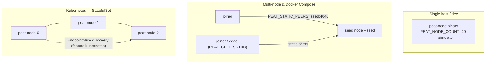
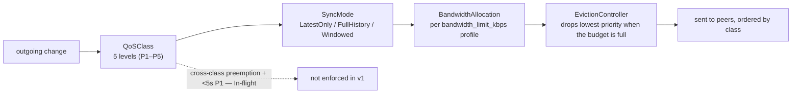

# Module 8 — Running, Deploying & Operating PEAT

**Goal:** get hands-on. Build and run a real mesh, then learn how PEAT is configured, deployed,
secured, monitored, and troubleshot. Primary sources: the repo's
[`QUICKSTART.md`](../peat/docs/guides/QUICKSTART.md) and
[`OPERATOR_GUIDE.md`](../peat/docs/guides/operator/OPERATOR_GUIDE.md), cross-checked against the
actual binaries in the workspace.

> **How to read the status tags.** Every capability below is tagged **[Shipped]** (in code,
> tested), **[In-flight]** (open issue/PR), **[Proposed]** (ADR with no implementation), or
> **[Documented]** (described in an operator guide whose binary is not in this checkout — true
> as written, but verify against the binary you actually run). The tags are not decoration: an
> operator who treats a Documented or In-flight item as Shipped will be surprised in the field.

> **Want to *see* it work before reading more theory?** Do §8.1 first — it builds a real 3-node
> mesh on your laptop in about 20 minutes. Everything after that is the operator's reference.

---

## 8.1 The Quickstart — a real mesh in ~20 minutes **[Shipped]**

The quickstart uses one small, readable example crate — `examples/quickstart` — that produces the
binary `peat-quickstart` (`peat/examples/quickstart/Cargo.toml`, a member of the `peat` workspace).
It deliberately ships with **no formation key and no enrollment**: just the core property
(multi-transport eventual consistency) made visible. There is also **no MLS group-key agreement —
but that is not a feature the demo merely turns off. MLS is not implemented anywhere in PEAT yet**
([Proposed], ADR-044; see Module 9). The demo is honest precisely because it shows you only what
exists.

```bash
git clone https://github.com/defenseunicorns/peat.git && cd peat
cargo build -p peat-quickstart --release        # binary: target/release/peat-quickstart
./target/release/peat-quickstart --help          # flags: --name --bind --peer --mdns --storage
```

Prereqs: **Rust 1.70+** and **`protoc`** (`apt install protobuf-compiler` / `brew install protobuf`).
The 20-minute estimate is laptop-only; budget closer to 45 minutes if you also do Scenario 4's
Raspberry Pi cross-compile.

### Reading the logs — three event prefixes

Once running, you watch for three log prefixes. Learn these — they are how you reason about the mesh:

- `discovery: …` — a peer was *configured* (`--peer`) or *found* (`--mdns`). Not yet reached.
- `connection: peer X connected / reconnected / lost` — transport-level QUIC connection state.
- `sync: NAME (new)` / `sync: NAME (updated) M → N` — **a remote document arrived or changed. This
  is the proof that state is actually replicating.**

A periodic `[peers=N] me:alpha=99 | bravo=98 | …` line is a 2-second heartbeat snapshot (your own
state to the left of `me:`, remote nodes after). The binary defaults to a *quiet* log filter; set
`RUST_LOG=debug` for the full firehose.

### The four scenarios (each builds on the last)

1. **Two nodes, one host, static peers** — the fastest proof of sync. Start `alpha`
   (`--bind 127.0.0.1:39001`), copy its node id from the log, then start `bravo` with
   `--peer <ALPHA_ID>@127.0.0.1:39001`. Within seconds both show `sync:` lines.
2. **Three nodes, static peers — transitive gossip.** `charlie` connects only to `alpha`, yet sees
   `bravo`'s state *via* `alpha` (`sync: bravo (new)` even though bravo is not a direct peer).
   `alpha` shows `peers=2`. This is the gossip relay from Module 3 §3.4:

   ```mermaid
   flowchart TD
       B["bravo<br/>:39002"] -->|"--peer alpha"| A["alpha (hub)<br/>:39001 · peers=2"]
       C["charlie<br/>:39003"] -->|"--peer alpha"| A
       B <-.->|no direct link · gossip via alpha| C
   ```

   **Legend.** Solid arrow = a configured `--peer` link (a direct QUIC connection). Dashed line =
   *no* direct connection: `bravo` and `charlie` never link, yet each one's state reaches the other
   by gossip relay through `alpha`. The hub (`alpha`) shows `peers=2`; the two leaf nodes show
   `peers=1`.
3. **Three nodes, mDNS — zero config.** Drop `--peer` entirely and add `--mdns`; the nodes advertise
   over multicast and find each other. The quickstart binary uses the mesh's default mDNS service
   type **`_peat._udp.local`** (`peat-mesh/src/discovery/mdns.rs:23`; the binary logs
   `discovery: mDNS enabled (service _peat._udp.local)` at `examples/quickstart/src/main.rs:368`).
   *This will not work where multicast is blocked — enterprise Wi-Fi, across subnets, or over most
   VPNs — so fall back to `--peer`.*
4. **Three nodes across two Raspberry Pis + a laptop** — cross-compile with `cross build -p
   peat-quickstart --release --target aarch64-unknown-linux-gnu`, `scp` the binary to the Pis, and
   run. The repo's `Cross.toml` already configures the `aarch64-unknown-linux-gnu` target (protoc +
   arm64 libdbus pre-build steps).

> The NodeId is **deterministic from `--name`** *in this example binary* — `--name` seeds the key
> derivation, so the same name always yields the same id and you only copy it once. This is the
> demo's convenience, not a protocol-wide guarantee; production identity is covered in §8.5 and
> Module 2.

### Two gotchas worth pre-loading

- **`PEAT_CONNECTION_RECYCLE_SECS`** — there is an iroh memory-growth workaround that recycles every
  QUIC connection on a fixed interval (compile-time default **60 s**,
  `peat-protocol::network::iroh_transport::CONNECTION_RECYCLE_INTERVAL_SECS`). For a low-traffic
  workload that turns continuous sync into a roughly 4–6 s outage every minute. For demos and light
  workloads set `PEAT_CONNECTION_RECYCLE_SECS=0` to disable it (or e.g. `600` for ~10-minute
  sessions); the QUICKSTART sets it to `0` on all three nodes in Scenario 4. The runtime override
  itself is issue **#892**; the recycler exists to bound an upstream iroh pattern (iroh#3565) and was
  later largely superseded by a circuit-breaker fix at the discovery layer (**#873 / #874**)
  (`peat/CHANGELOG.md`). *(The recycler is sometimes labeled "#435" in older notes; #435 is actually
  the negentropy set-reconciliation issue — a different subsystem.)*
- **Stale processes on the Pis** — peers launched over SSH with `nohup … &` survive your
  disconnect, and a local `pkill` will not reach them. As a field tip, pre-flight with
  `ssh pi-a 'pgrep -af peat-quickstart || echo CLEAN'` before relaunching, or a leftover process
  holds the port and the new one never syncs. *(This is generic Unix behavior, not a documented PEAT
  failure mode.)*

---

## 8.2 The binaries (don't mix them up)

| Binary | Where | Status | Purpose |
|--------|-------|--------|---------|
| `peat-quickstart` | `examples/quickstart` (this workspace) | **[Shipped]** | the minimal learning binary above |
| `peat-mesh-node` | `peat-mesh`, binary `src/bin/peat-mesh-node.rs`, requires feature `node` | **[Shipped]** | the all-in-one production mesh node you can build from a checkout (Module 3 §3.1) |
| `peat-node` | the `peat-node` repo (gRPC/Connect sidecar) | **[Shipped]** | the production node sidecar most deployments run (Module 3 §3.1, Module 6) |
| `peat-sim` | the operator guide's binary (network simulator) | **[Documented]** | run/simulate multi-node deployments — **not in this `peat` workspace** |

> **Heads-up — three different runtimes, three different config surfaces.**
> The **operator guide (§8.3–8.8) leans on `peat-sim`**, which is **not in this checkout** and not a
> member of the `peat` workspace (`grep peat-sim peat/Cargo.toml` is empty). Like `peat-inference`
> (Module 7), it lives in its own repo. So the operator-guide commands are the **documented operator
> workflow**, accurate as written, but they drive a binary you may not have. For a node you can build
> *from this checkout*, `peat-mesh-node` is the concrete one (`peat-mesh/Cargo.toml`:
> `[[bin]] name = "peat-mesh-node"`, `required-features = ["node"]`). For the production sidecar most
> real deployments run, that is `peat-node` (its own repo).
>
> **The env-var and port conventions differ per binary** — this trips people up. `peat-mesh-node`
> reads `PEAT_FORMATION_SECRET` (required) and `PEAT_BROKER_PORT`
> (`peat-mesh/src/bin/peat-mesh-node.rs:47,54`), while the operator guide uses `PEAT_FORMATION_KEY`,
> `PEAT_BIND_PORT`, and `PEAT_HTTP_PORT` (the set in §8.3). The quickstart binary uses neither —
> it takes `--bind` / `--name` CLI flags. When something does not pick up an env var, first confirm
> which binary you are actually running.

### What the production sidecar (`peat-node`) gained recently — v0.4.7 **[Shipped]**

If you run `peat-node` (the sidecar most deployments use), three operability changes in the
`v0.4.4 → v0.4.7` line are worth knowing, all confirmed in `peat-node` at `bbe3b68`:

- **Attachment auto-sync via an outbox watcher (off by default).** Set
  `PEAT_NODE_ATTACHMENT_OUTBOX_WATCH` and the node polls each configured `--attachment-root`; a file
  that is *stable* across a poll and not yet sent is auto-distributed by synthesising the same
  `SendAttachments` request an application would send (`src/attachments/outbox.rs`, PRD-006 v1.1).
  Dropping a file in the outbox lands it in every peer's inbox with no gRPC call — the symmetric
  counterpart to the receive-side inbox watcher. It **polls** (not inotify) so it stays reliable
  across container bind mounts; the explicit RPC remains the safe default, which is why the watcher
  is opt-in.
- **A 30 s peer-status heartbeat.** The node logs `connected_peers` (live CRDT-sync connections)
  versus `known_peers` (peers it has dialed) every 30 s (`PEER_STATUS_LOG_INTERVAL`,
  `src/node.rs:207`). This is the single most useful line when diagnosing "the doc synced but the
  file never arrived": delivery targeting and `fetch_blob` both key off `known_peers`, so a receiver
  missing from a sender's `known` set is exactly why a synced distribution doc never becomes a
  delivered file. A related rc.43 mesh fix now **registers inbound-accepted peers into `known_peers`**
  (peat-mesh#261), so a node you only *accepted* a dial from becomes targetable, not just one you
  dialed.
- **The default log filter now covers the whole sync stack** (`peat_protocol=info`, `iroh=warn`), so
  attachment send/receive failures are no longer silent under the default `RUST_LOG` (peat-node#169).
  Multi-host setups still need a two-way dial — the example compose docs were widened to say so.

---

## 8.3 Configuration (operator guide) **[Documented — `peat-sim` surface]**

> **These env vars, ports, and metrics are the operator-guide (`peat-sim`) surface.** The quickstart
> binary in §8.1 uses CLI flags instead; `peat-mesh-node` uses the `PEAT_FORMATION_SECRET` /
> `PEAT_BROKER_PORT` pair from §8.2. Read this section as the documented operator workflow, then map
> it to whichever binary you run.

PEAT (in the operator guide) is configured by **environment variables** or a **`peat.toml`** file.
The must-set trio:

```bash
export PEAT_APP_ID="your-app-id"           # distinguishes logical deployments
export PEAT_SECRET_KEY="your-secret-key"   # shared secret for formation auth
export PEAT_FORMATION_KEY="$(openssl rand -base64 32)"
```

`PEAT_APP_ID` and `PEAT_SECRET_KEY` are marked Required in the guide; `PEAT_FORMATION_KEY` is the
cell-admission secret (§8.5). Common variables and their operator-guide defaults:

| Variable | Default | Purpose |
|----------|---------|---------|
| `PEAT_PERSISTENCE_DIR` | `./peat_data` | where CRDT state is persisted |
| `PEAT_NODE_ID` | auto UUID | node identity label |
| `PEAT_CELL_SIZE` | `5` | target cell size |
| `PEAT_DISCOVERY_MODE` | `mdns` | `mdns` / `static` / `hybrid` |
| `PEAT_BIND_ADDRESS` / `PEAT_BIND_PORT` | `0.0.0.0` / `4040` | P2P |
| `PEAT_HTTP_PORT` | `8080` | HTTP API |
| `RUST_LOG` | `info` | log level (`RUST_LOG=peat_protocol::cell=debug` for per-module) |

A `peat.toml` mirrors these with `[node] [network] [discovery] [cell] [hierarchy] [security]
[storage] [logging] [capabilities]` sections (the operator guide has a full annotated example). For
non-mDNS environments, a `peers.toml` lists `[[peers]]` blocks with `id` / `address` / `port` /
`role`.

---

## 8.4 Deployment patterns **[Documented — `peat-sim` workflow]**

- **Single host / dev** — just run the binary (optionally `PEAT_NODE_COUNT=20` for the simulator).
- **Multi-node** — one seed node (`--seed`), others join via `PEAT_STATIC_PEERS=seed-ip:4040`.
- **Edge devices** (Jetson, Pi) — cross-compile, `scp`, run with a reduced `PEAT_CELL_SIZE=3`.
- **Containers** — a multi-stage `Dockerfile` (rust builder → debian-slim runtime); a
  `docker-compose` with a seed + N nodes on one bridge network.
- **Kubernetes** — a `StatefulSet` (stable pod identities) with `PEAT_DISCOVERY_MODE=static` pointed
  at the headless-service DNS (`peat-node-0.peat:4040`), a `volumeClaimTemplate` for state, and a
  headless `Service`. peat-mesh also supports native Kubernetes **`EndpointSlice` discovery**
  (feature `kubernetes`) — **[Shipped]**, used because multicast mDNS is unavailable inside most
  clusters (Module 3).



*All patterns expose the same ports (below) and keep the n0 hosted relay **off by default**
(air-gap posture). Single-host/multi-node/Docker/edge are **[Documented]** (peat-sim workflow);
in-cluster `EndpointSlice` discovery is **[Shipped]** because multicast mDNS is unavailable inside
most clusters.*

### Ports & networking

| Port | Proto | Purpose |
|------|-------|---------|
| 4040 | UDP/TCP | P2P mesh |
| 8080 | TCP | HTTP API |
| 5353 | UDP | mDNS (multicast) — note mDNS is UDP, matching the `_peat._udp.local` service type |

Open these in `iptables` / `firewalld`. PEAT uses **Iroh for NAT traversal** with optional STUN/relay
configuration — but read this carefully for the defense-prime case: **the n0 hosted relay is OFF by
default** (`relay-n0-hosted` feature off; the endpoint is built with no n0 DNS/pkarr), which is the
correct posture for air-gapped and tactical builds. A runtime toggle to re-enable it was added in
peat-mesh rc.42; making the default explicit is tracked by **#833**. **[Shipped, off by default]**

It is built for constrained links — the guide documents bandwidth **profiles** from
`minimal` 9.6 kbps (tactical radio) → `low` 64 kbps (satellite) → `medium` 256 kbps (cellular) →
`standard` 1 Mbps (Wi-Fi) → `high` 10+ Mbps, set via `bandwidth_limit_kbps` plus
`qos_enabled = true`. A caveat the audience will want: setting `qos_enabled` activates QoS *classes
and bandwidth allocation*, and these primitives are **[Shipped]** (`peat-protocol/src/qos/`,
`peat-mesh/src/qos/`). But priority *enforcement* — cross-class wire-level preemption so a Critical
bundle pauses an in-flight Bulk transfer, and the "<5 s P1 latency" target — is **[In-flight]**, not
a validated SLA. Treat QoS today as ordering and budgeting, not a hard latency guarantee.



*The pipeline — classes, sync-mode override, bandwidth allocation, eviction/GC — is **[Shipped]**
(`peat-protocol/src/qos/`, `peat-mesh/src/qos/`). Cross-class wire-level **preemption** (a Critical
bundle pausing an in-flight Bulk transfer) and the "<5 s P1" latency target are **[In-flight]**: QoS
today orders and budgets, it does not preempt.*

Partitions are handled automatically: heartbeat-timeout detection → exponential-backoff reconnection
→ CRDT auto-merge on heal (`peat-mesh/src/topology/`; peat-node's reconnect watchdog runs a 5 s
interval with 5 s→120 s exponential backoff). **[Shipped]** — and because leader election is
deterministic scoring rather than a quorum vote (Module 2b), a partitioned cell elects locally with
no split-brain stall, and two independently-elected leaders converge deterministically on heal.

---

## 8.5 Security configuration

- **Formation key** **[Shipped]** — `openssl rand -base64 32`; set via `PEAT_FORMATION_KEY` or
  `[security] formation_key`. This is the cell-admission secret (Module 2b §2·5.4). The handshake is
  an **HMAC-SHA-256 challenge-response** over ALPN `peat/formation-auth/1` (30 s timeout); the key is
  proven by the HMAC and **never crosses the wire**, with a constant-time compare
  (`peat-protocol/src/network/formation_handshake.rs`).
- **PKI** **[Documented — guide config, not verified in code]** — the operator guide shows optional
  X.509 device certs (`[security.pki]` with `ca_cert` / `node_cert` / `node_key`,
  `verify_peer = true`, `OPERATOR_GUIDE.md:722`). This is operator-guide configuration; PEAT's
  *implemented* identity is Ed25519 + a derived DeviceId plus the formation HMAC (Module 2), and the
  control-plane gateway issues mesh membership certificates (Module 5) — not the `[security.pki]`
  X.509 device-cert flow shown here. Treat `[security.pki]` as documented config until you confirm it
  against the binary you run.
- **Encryption — what actually ships vs. what the guide says.** This is the single most important
  correction in this module, because the operator guide is stale here. The **2025-12-08 operator
  guide names ChaCha20-Poly1305** (`OPERATOR_GUIDE.md`, Last Updated 2025-12-08). **That is the
  pre-FIPS cipher and is not what the code does.** As of peat-mesh rc.12 (2026-05-18) the shipped
  crypto migrated to **AES-256-GCM** (SP 800-38D) for symmetric AEAD and **ECDH P-256** (SP 800-56A)
  for key agreement, with TLS/QUIC handshakes run under the **`aws-lc-rs`** FIPS-mode rustls provider
  rather than `ring` (`peat-mesh/src/security/encryption.rs`; CHANGELOG #923; spec 005 was amended
  2026-05-18 to match). When the guide and the code disagree, **the code wins** (Module 9 §005).
  **[Shipped]** for the FIPS-*approved algorithms*.

  Two honest caveats for a procurement auditor:
  - **Approved algorithm ≠ validated module.** AES-256-GCM and ECDH-P256 are FIPS-approved
    *algorithms*, but they run in pure-Rust RustCrypto crates that are **not CMVP-validated
    cryptographic modules**. For a real FIPS 140-3 boundary the path is the gateway's KMS / Vault HSM
    backends (Module 5); migrating peat-btle's local crypto to `aws-lc-rs` is **[In-flight]**
    (peat-btle#75). Residual `ring` symbols also remain transitively linked and are tracked for
    removal under #923.
  - **P-384 is not in code.** Only ECDH **P-256** is implemented; any "P-256/P-384" claim is
    aspirational. And note **ADR-060 (the FIPS-posture ADR) is formally [Proposed]** even though its
    §5 algorithm choices are already implemented — the code is ahead of the ADR's status.
- **Best practices the guide stresses** — always use formation keys in production, enable TLS for the
  HTTP API, rotate credentials (and rotate the formation key on member departure), use PKI in secure
  environments, keep audit logs, and segment PEAT traffic. These are operational recommendations, not
  code-enforced behavior.

---

## 8.6 Monitoring & observability **[Documented — `peat-sim` surface]**

PEAT (operator guide) exposes an **HTTP API** and **Prometheus metrics**:

| Endpoint | Purpose |
|----------|---------|
| `GET /health` | liveness (`{"status":"healthy",…}`) |
| `GET /ready` | readiness (`cell_joined`, `peers_connected`) |
| `GET /metrics` | Prometheus metrics |
| `GET /api/v1/status` · `/peers` · `/cell` · `/capabilities` | node / peer / cell introspection |
| `GET /api/v1/network/partitions` | partition status |

Key metrics: `peat_peers_connected`, `peat_cell_size`, `peat_sync_latency_seconds`,
`peat_messages_{sent,received}_total`, `peat_bandwidth_bytes_total`, `peat_leader_elections_total`.
JSON structured logging (`PEAT_LOG_FORMAT=json`) is documented, as is OTLP/OpenTelemetry tracing via
an `otlp_endpoint` config (`OPERATOR_GUIDE.md:840`). Recommended alerts (advisory, not code-enforced
thresholds): 0 peers for 5 min (critical), 3× failed leader elections (high), sync latency > 10 s
(medium), partition detected (high).

One nuance for the `peat_leader_elections_total` counter: leader election is **deterministic
capability scoring**, not a consensus vote (Module 2b), so a re-election simply increments the
counter when scores shift — the metric is coherent, but "failed leader election" means disagreeing or
stale beacon views, not a stalled ballot.

---

## 8.7 CoT / TAK integration (operator view) **[Shipped subsystem; config values guide-documented]**

PEAT bridges to a CoT consumer via Cursor-on-Target translation. The bridge code is **[Shipped]** —
the TAK/CoT TCP path lives in `peat-transport/src/tak/` and the CoT encoding in
`peat-protocol/src/cot/` (ADR-020/028/029, Modules 2 §2.8 and 5). The operator guide documents the
configuration: a `[cot]` block (`bind_port` 8087, tcp/udp/multicast), configurable capability→CoT
type mappings (e.g. `platform_uav = "a-f-A-M-F-Q"`), a `<peat:capability>` / `<__peat>` CoT detail
extension, and the ability to *receive* waypoints/targets/chat from a CoT consumer gated by a
`command_authority` setting (`C2_ONLY` vs `ANY_TAK_USER`, `OPERATOR_GUIDE.md:931`).

The `command_authority` gate is the operative control for **autonomy under human authority**: it
decides whether inbound tasking from a CoT consumer is accepted only from a command-and-control
source (`C2_ONLY`) or from any operator on the network. The subsystem and file paths are verified;
the specific `bind_port`, CoT type strings, and enum values are documented configuration — confirm
them against the `cot` module if a deployment depends on an exact value.

---

## 8.8 Backup, recovery & troubleshooting

- **State persistence** **[Shipped property; config guide-documented]** — `[storage] persistence_dir`
  with periodic snapshots (`snapshot_interval_seconds`, `max_snapshots`). Back up by SIGTERM → `tar`
  the data dir → restart.
- **Recovery** — restore the tarball, *or* wipe the data dir entirely: a clean node **rejoins and
  re-syncs from peers**, because the shipped sync stack guarantees convergence — Automerge CRDT merge
  reconciled by **negentropy set reconciliation** over QUIC (Module 3). Disaster recovery = redeploy
  with the same config + formation key. One caveat: **tombstone retention** (default 168 h / 7-day,
  300 s GC interval on peat-node) governs what survives a long offline window — after an outage
  longer than the retention horizon, GC'd deletions will not re-propagate. Per-collection
  deletion-policy enforcement and the related tombstone-GC knobs are **[In-flight]** (peat-node#136;
  sync-reliability bugs #850/#829/#873). *(This is the GC work the curriculum elsewhere mis-cited as
  "#857" — #857 is actually ADR-046 Phase-4 selectors.)*
- **Troubleshooting greatest hits** (from both guides):
  - *0 peers / `[peers=0]`* → wrong node id or address, UDP blocked by firewall, or mDNS blocked on
    the LAN (fall back to `--peer`).
  - *Leader election not settling* → because election is **deterministic capability scoring over
    beacons** (not a time-quorum vote), the real failure mode is stale or disagreeing beacon views,
    not a stalled ballot. Clock skew matters only insofar as it ages beacons; run NTP, and if needed
    raise the election timeout or shrink the cell.
  - *`connected` but no `sync:` for a few seconds* → normal (1–2 round trips after the QUIC
    handshake); investigate only past ~5 s.
  - *Reconnect every ~60 s* → the connection-recycle workaround; set `PEAT_CONNECTION_RECYCLE_SECS=0`
    (§8.1).
  - *Persistence / backend errors at startup* → confirm `PEAT_APP_ID` / `PEAT_SECRET_KEY` are set and
    the dir is writable and not full; if corrupted, archive + clear the dir and let it re-sync.

---

## Try it

1. Run Quickstart Scenarios 1–3 on your laptop. Watch for the `sync:` lines — that is convergence.
2. `curl localhost:8080/health` and `…/api/v1/peers` against a running node.
3. Deliberately kill one node mid-run and watch the others' `connection: … lost` then reconnect.

## Checkpoint

- What do the three log prefixes (`discovery:` / `connection:` / `sync:`) each mean, and which one
  proves replication?
- In Scenario 2, how does `charlie` see `bravo` without a direct connection?
- Which three env vars are mandatory in the operator guide, and what does the formation key gate?
- Which cipher does the operator guide name, why is it stale vs. the code, and what does the code
  actually ship? (Bonus: why is "FIPS-approved algorithm" not the same as "FIPS-validated module"?)
- After wiping a node's data dir, how does it recover, why is that safe, and what does tombstone
  retention have to do with a *long* outage?

---

Next: [Module 9 — The Protocol Specifications »](09-protocol-specs.md)
