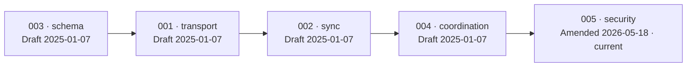

# Module 9 — The Protocol Specifications

**Goal:** read the **normative** layer — the IETF-RFC-style specs that describe Peat precisely enough
for an independent implementation. Source: [`peat/docs/spec/`](../peat/docs/spec/) (five per-layer
specs `001`–`005` plus a README, written in RFC-2119 MUST/SHOULD/MAY language, positioned toward an
IETF Informational RFC).

> **How to read this module.** Status labels appear on every capability:
> **[Shipped]** (in code, tested) · **[In-flight]** (open issue/PR/epic) · **[Proposed]** (an ADR in
> `Proposed` status, no implementation) · **[Speculative]** (described for teaching, not in any repo).
> A spec value is just text in a `.md` file; whether the **code** honors it is a separate question,
> and this module flags every place the two disagree.

> ⚠️ **Read this before you trust a spec value.** All five specs carry a draft date of **2025-01-07**,
> *except* `005-security`, which was **amended 2026-05-18 (rev 0.2.0)** to the FIPS-approved cipher
> suite — so `005` is current and the others are older drafts. More importantly, the shipped code
> diverges from the draft specs on at least four concrete contracts: **Device ID width** (code uses
> 16 bytes, spec says 32), the **RBAC role enum** (code and spec list different names), the
> **peat-lite and BLE wire formats**, and the **leader-election scoring formula**. **When a spec
> disagrees with shipped code, the code is the contract.** The specs remain the best single
> description of the protocol's *shape*; this module tells you where to trust the spec and where to
> trust the source. Recommended reading order (per the spec README): **003 schema → 001 transport →
> 002 sync → 004 coordination → 005 security**.

### The five specs at a glance — reading order & freshness

*Arrows are the recommended reading order (per the spec README). All five are drafts dated
**2025-01-07** except `005-security`, **amended 2026-05-18** to the FIPS-approved suite — so `005` is
current and the rest are older. The specs describe the protocol's **shape**; where they disagree with
shipped code, the code is the contract.*

### Spec vs. shipped reality — the divergences to know before you trust a value

| Contract | The spec says | Shipped code | Trust |
|---|---|---|---|
| **Device-ID width** | 32 bytes — first 32 B of `SHA-256(Ed25519 pubkey)` (`001-transport.md:95-101`) | **16 bytes** — `DeviceId = [u8; 16]` from `SHA-256(key)[0..16]` (`device_id.rs:39-47`) | code |
| **RBAC role enum** | one set of names | code and spec list **different** names (Module 5) | code |
| **peat-lite & BLE wire formats** | spec framing | shipped framing **differs** | code |
| **Leader-election scoring** | spec formula | runtime uses a **different** formula (Module 2b) | code |
| **Cipher suite** | `005` (amended) = AES-256-GCM · ECDH-P256 · Ed25519 · HKDF/HMAC-SHA-256 | matches (peat-mesh rc.12) | **[Shipped]** |

---

## 9.1 `001-transport` — wire formats & connection lifecycle [Shipped, with spec/code drift noted]

`001-transport` defines a `Transport` trait, the connection lifecycle, and four link types. Two
conventions show up everywhere: wire byte order is **big-endian** (network byte order), and timestamps
are **Unix epoch milliseconds (`u64`)** — both verified in the spec (`001-transport.md:428,434`).

**The identity caveat that catches a code reader first.** The spec calls the device identity `PeerId`
and defines it as "the first **32 bytes** of `SHA-256(Ed25519 public key)`, hex-serialized"
(`001-transport.md:95-101`). The **shipped code truncates to 16 bytes**: `DeviceId` is a `[u8; 16]`
formed from `SHA-256(verifying_key)[0..16]` (peat-mesh `src/security/device_id.rs:39-47`, re-exported
by peat-protocol). Read the spec's number, then grep the code, and you will find half the width. Lead
with the shipped value: **`DeviceId` is the first 16 bytes**; the spec is wider. (And note this is only
*one* of four identity schemes in the stack — see §9.5.)

- **QUIC / Iroh (primary, [Shipped]).** TLS 1.3 is built in. The spec's handshake message carries
  Version, Type (`0x01` Handshake / `0x02` Ack / `0x03` ChallengeResponse), Device ID (32 B in the
  spec — 16 B in code), Formation ID (16 B UUID), Nonce (32 B), and Public Key (32 B). **Stream-ID
  ranges (spec-defined):** `0` control, `1–15` reserved, `16–255` CRDT sync, `256–511` app data,
  `512+` user. Keepalive every ~30 s; idle > 120 s MAY close (`001-transport.md:198`). The QUIC/Iroh
  transport and TLS 1.3 are shipped (peat-mesh); the stream-ID partitioning is a spec contract — treat
  it as the intended wire layout, and confirm enforcement against `iroh_mesh.rs` before asserting the
  ranges are policed at runtime.
- **UDP bypass (latency-critical, skips the CRDT layer — [Shipped] as a primitive).** Magic `0x48 0x56`
  ("HV"), flags for Signed / Encrypted, priority (`0` Low → `3` Critical), TTL, sender ID, and an
  optional 64-byte Ed25519 signature; multicast groups `239.255.72.86–88` (`001-transport.md:273-285`).
  In code this is a low-level `UdpBypassChannel`, **not** a registered `MeshTransport`
  (peat-mesh `src/transport/bypass.rs`, ADR-042) — a send/recv channel, not a transport you select.
  **The channel is unauthenticated by default; a node MUST use Signed mode on any untrusted link**
  — a deliberate footgun the spec calls out, and the right default to question in review.
- **Peat-Lite (constrained devices) — spec ≠ shipped.** Spec `001 §6` describes a toy framing: magic
  `0xCAFE`, a 4-byte truncated device ID, message types Register/Ack/Heartbeat/Data, CRC-16, sequence
  wraparound, a 100 ms ack timeout, 3 retries. **The shipped peat-lite 0.2.5 wire format is different**
  and is the one to implement against: magic is the 4-byte ASCII `"Peat"`, a fixed **16-byte header**,
  default port **5555**, `MAX_PACKET_SIZE = 512` (`MAX_PAYLOAD = 496`), message types including
  `Announce / Heartbeat / Data / Query / Ack / Leave / Document (0x07) / OTA`, and a NodeId that is a
  **bare `u32`** (peat-lite `src/protocol/*`, `src/node_id.rs`). Read the peat-lite source, not
  spec `001 §6` — the spec section here is early/aspirational. (Module 4 covers the shipped format.)
- **BLE mesh — spec ≠ shipped (most-drifted value in the project).** Spec `001 §7` names GATT service
  `0x1826`, data characteristic `0x2A6E`, control `0x2A6F`, plus a 3-byte fragment header. **Three
  different service UUIDs float around the project, and none is the spec's `0x1826`** (which is, in
  fact, the standard Bluetooth SIG *Fitness Machine* UUID). The **code of record** in peat-btle 0.4.0
  is the 16-bit alias **`0xA1B2`** (from `a1b2c3d4-…`, pinned by a known-answer test in `src/lib.rs`);
  the README's `0xF47A` and a `gatt/mod.rs` `f47ac10b…` value are stale. Cite the code: **`0xA1B2`**.

**Reconnect backoff (spec):** 100 ms → max 30 s, ±10 % jitter (`001-transport.md:417-420`). Note this
is the *transport-layer* value; the peat-node sidecar's own reconnect watchdog uses a different
schedule (5 s → 120 s exponential backoff), so don't conflate the two layers (Module 8 §8.4). The
spec's example ports (4433 QUIC / 4434 bypass / 4435 Peat-Lite) also differ from the operator guide's
4040 — defaults vary by binary.

## 9.2 `002-sync` — CRDT semantics & reconciliation [Shipped]

The state layer is **exclusively Automerge** (a normative choice in spec 002), reconciled by two
distinct mechanisms: Automerge's own sync protocol and **negentropy** set reconciliation. Both ship
(peat-mesh `src/storage/{automerge_sync,negentropy_sync}.rs`, ADR-040 / issue #435, re-exported as
`peat-protocol`'s `NegentropySync`).

- **CRDT semantics (Automerge-internal):** Map = LWW per key; List = RGA (insertion order); Text =
  Peritext; Counter = PN-Counter; primitives = registers (`002-sync.md:78-80`). These are *Automerge's*
  internal semantics. Keep them separate from peat-lite's four **wire** CRDTs (`LwwRegister`,
  `GCounter`, plus reserved bytes for `PnCounter`/`OrSet`) — a different, embedded type set covered in
  Module 4. **Operations (spec):** Put / Delete / Insert / Remove / Increment / SetRoot.
- **Identity (spec):** Document ID = UUIDv4; Actor ID = `DeviceId[0:8] ‖ session counter` (128-bit,
  `002-sync.md:144-151`). **This is spec-only — the code does NOT build the ActorId this way.** The
  shipped code uses Automerge's **default random ActorId** (`Automerge::new()` / `fork()`); there is no
  `DeviceId` derivation of the actor id. Trust the random-ActorId reality, not the spec construction.
- **Automerge sync flow (spec):** `SyncRequest { have: heads, want: bloom_filter }` →
  `SyncResponse { changes, heads, synced }`, repeated until `synced = true` (`002-sync.md:164-186`).
  Each Change carries a SHA-256 hash, parent `deps`, an actor, a per-actor `seq`, a timestamp, and
  compressed operations.
- **Conflict resolution (deterministic, [Shipped]):** maps compare **Lamport timestamps** with a
  lexicographic actor-id tie-break; lists order by `(Lamport ts, actor id)`; counters take
  `sum(inc) − sum(dec)`. Deletes are **tombstones**, garbage-collected after all peers ack plus a
  retention period (default **7 days**, `002-sync.md:295-297,348-350`; corroborated by peat-node's
  168 h tombstone TTL). The determinism here is what makes offline-first convergence safe — see
  Use case 4 below.
- **Negentropy ([Shipped]):** range-fingerprint set reconciliation using `XOR(SHA256(item)[0:16])`,
  with an Init → Response → Finalize message exchange (`002-sync.md:364,389-393`). The code's
  doc-comment claims **O(log n) rounds** — an *algorithmic property of the algorithm*, not a number
  benchmarked in Peat. This is the basis of the wire types discussed in Module 3 §3.4.

**Tuning knobs:** zstd level 3 compression is confirmed in the spec (`002-sync.md:482`). The spec also
mentions change bundling (e.g. 100 ms / 1 KB) and a subscription model. One label to fix: the shipped
peat-node `Subscribe` predicate language is a simple set of top-level `eq/lt/gt/and/or/not` predicates,
**not** a named "DQL" with geo-bbox filtering — describe what ships, and confirm any richer bundling
thresholds against spec 002 plus the code before quoting them. Note one further distinction landing
now: **ADR-071 ([Proposed])** introduces a separate, *durable* "subscription" — a node's registered
interest in a collection that drives blob convergence whether or not anyone is watching a change
stream (Module 3 §3.4b). Don't conflate it with this `Subscribe` change-stream predicate; the seam is
present in code but inert by default.

## 9.3 `003-schema` — the data model (Protobuf) [Shipped]

`003-schema` defines tactical entities as Protocol Buffers, organized into versioned packages. The spec
enumerates `peat.common.v1`, `peat.beacon.v1`, `peat.mission.v1`, `peat.capability.v1`,
`peat.security.v1`, and `peat.ai.v1`, plus a `cot.proto` for CoT/TAK interop (`003-schema.md:107-679`).
Field-number ranges are reserved (`003-schema.md:93-97`): **1–99** core, **100–199** standard
extensions, **200–299** organization-specific, **1000+** application-defined. The shipped peat-schema
crate compiles these protos via `prost`.

> **Vocabulary caution [In-flight].** The hierarchy proto has already been **renamed to the abstract
> vocabulary** — `hierarchy.proto` ships `CellSummary` / `CohortSummary` / `FederationSummary` /
> `CoalitionSummary` with no `Squad` / `squad_id` left (`peat-schema/proto/hierarchy.proto:24,71,72,122,172`).
> The rename is *not* uniform across the workspace, though: **peat-btle still ships fully legacy
> military terms** (`Platform` / `Squad`, `peat-btle/src/lib.rs`). So which vocabulary you find depends
> on which crate you grep; the migration is still mid-flight (epics #904 / #968).

Highlights, verified against `003-schema.md`:

- **Beacon** (a track / position report): `track_id`, `device_id`, `callsign`, `position` (WGS84 plus
  CEP accuracy), `affiliation` (`MEMBER` / `EXTERNAL` / `NEUTRAL` / `PENDING`, `003-schema.md:168-171`),
  `dimension` (`GROUND` / `AIR` / `SURFACE` / `SUBSURFACE` / `SPACE`, `:177-180`), `platform_type`,
  `status`, `power_level`, `ttl_seconds`, `confidence`.
- **Mission / Objective:** objective types (OBSERVATION / ACTION / PATROL / NEUTRALIZE / …), a priority
  ladder (ROUTINE → FLASH), an area of operations, assigned cells, and a status lifecycle.
- **Capability advertisement:** sensors (EO / IR / RADAR / LIDAR / ACOUSTIC / RF / CBRN / GPS / IMU),
  actuators, comms link types (MESH / SATCOM / HF / VHF / UHF / LTE / WIFI / BLE), compute, and power.
- **Schema-evolution rules (MUST, `003-schema.md:820-836`):** new fields use new field numbers; existing
  field semantics and types never change; required fields are not removed; deprecations span two major
  versions. Reserved range 200–299 is for organization-specific fields.
- **CoT / TAK mapping ([Shipped] at the transport layer):** `track_id` → CoT `uid`; `position` → `point`;
  `affiliation` → the `@type` prefix (`a-f` friendly / `a-h` hostile / `a-n` neutral / `a-u` unknown);
  affiliation + dimension compose to a CoT type (e.g. `MEMBER + GROUND → a-f-G`, `003-schema.md:789-795`);
  Peat-specific fields ride in a **`<__peat>`** CoT detail extension (double underscore,
  `003-schema.md:804-809` — *not* the `<_peat_>` form some prose uses). The bridge itself is real and
  shipped in peat-transport (`src/tak/`, ADR-020/028/029); confirm any specific field mapping against
  that code plus spec 003 §9 before quoting it as exact.

> **New at rc.30: richer motion and error fields on tracks [Shipped].** `peat-schema/proto/common.proto`
> gained two message types: **`Kinematics`** (`velocity` m/s, `heading` 0–360°, `acceleration` m/s²,
> `vertical_speed` m/s, `common.proto:37`) and **`PositionError`** (`circular_error` = CEP m,
> `linear_error` = LEP m, `vertical_error` m, `common.proto:45`). Both are wired onto `Track`
> (`kinematics = 12`, `position_error = 13`) and `NodeState` (fields 8/9, LWW-register merge in
> `peat-protocol/src/models/node.rs`), and `peat-schema/src/validation/track.rs:123,159` enforces finite
> (non-NaN) values, non-negative errors, and heading in range. The older `Track.velocity`, `cep_m`,
> and `vertical_error_m` fields are now marked **`[deprecated]`** in favour of these — but read carefully:
> consumers such as the SAPIENT bridge **dual-write** old and new fields for backward compatibility
> (Module 7), so the deprecated fields are still populated, not gone. Note also the proto **schema
> version** is a separate track from the crate version: every `.proto` header now reads `Version: 0.5.0`
> (pre-1.0, signalling the wire schema is not yet frozen) while the `peat-schema` *crate* is `0.9.0-rc.30`.

## 9.4 `004-coordination` — cells, election, hierarchy [spec is normative; mesh runtime differs]

`004-coordination` is the normative version of Module 2·5. It defines the cell state machine
(Forming → Active ↔ Degraded → Dissolved, `004-coordination.md:108`), the formation handshake
(`FormationRequest → FormationChallenge → FormationResponse → FormationAccept`, `:149-159`), and leader
election.

**Leader election: same idea, two different scoring functions — know which layer you're reading.**
The high-level property is solid and shipped: **election is deterministic, with no consensus round**
(no Raft, no Paxos, no votes) — each node independently computes the same ordering from observed
beacons. But the *formula* differs by layer, and a reader who checks the code against the spec will hit
this immediately:

- The **spec / peat-protocol cell-formation** election uses a technical score with weights **compute
  0.30, comms 0.25, sensors 0.20, power 0.15, reliability 0.10** (`004-coordination.md:262-272`;
  matches `peat-protocol src/cell/leader_election.rs`), with a lexicographic node-id tie-break.
- The **shipped peat-mesh runtime** (`src/hierarchy/dynamic_strategy.rs`) uses a *different* function —
  a weighted blend of mobility, `(1 − CPU%)`, `(1 − mem%)`, battery %, a `×1.1` `can_parent` boost, and
  parent priority — and elects a `Leader` when `my_score ≥ best_peer_score × (1 + hysteresis)`. There is
  **no rank / authority / cognitive-load term** in this mesh-layer score.

So: don't present a single global election algorithm. The 0.30/0.25/… split is the spec and
`peat-protocol` model; the mesh layer computes something else.

The spec layer additionally defines a **human-machine authority score** (`rank·0.6 + authority·0.3 +
(1 − cognitive_load)·0.1`, `004-coordination.md:275-279`), combined via a `LeadershipPolicy` enum
(`RankDominant` / `TechnicalDominant` / `Hybrid { authority_weight, technical_weight }` / `Contextual`,
`:97-104`). **This human-authority weighting is a spec-layer model and is *not* present in the shipped
mesh election score** — treat pattern-driven, authority-weighted election as **[Proposed / spec-layer]**,
not a shipped runtime behavior. The shipped mesh strategy enum is the simpler `Static / Dynamic / Hybrid`.
Tie-break (spec): authority rank → membership duration → device id; election timeout 5 s, emergency 2 s
(`004-coordination.md:308-317`).

The spec also formalizes **emergent-capability patterns** as an enum — `WideAreaObservation`,
`SenseAndAct`, `CoordinatedResponse`, `ExtendedRange`, `MultiSpectralFusion` (`004-coordination.md:408-434`)
— and the **three inter-cell flows** (upward reports / downward commands / horizontal handoffs) with a
partition-handling rule (both sides elect; the original-leader side keeps the Cell ID; merge-negotiate
on heal, `004-coordination.md §10`). The patterns are a formal **vocabulary**; whether matching a pattern
**drives capability-based tasking** at runtime is **[In-flight]** — capability-gated *delivery* is the
ADR-046 epic (#853), and `CapableScope` distribution is reserved-but-rejected in peat-node v1. Partition
**detection** is shipped (peat-mesh `src/topology/`), but the partition-handling *rule itself* is
**spec-only — NOT implemented**: the cell-split, the "original-leader side keeps the Cell ID," and the
minority-side new-Cell-ID generation (`004-coordination.md:902-906`) are described in the spec, but
peat-mesh only detects partitions — none of that splitting/ID-retention logic is in code.

> **Vocabulary caution [In-flight, mid-rename].** Spec 004 (2025-01-07) uses *older* level names
> (Node / Team / Group / Formation / Cluster / Root). The intended abstract vocabulary is
> **Platform / Cell / Cohort / Federation / Coalition** under **ADR-066 — which is `Status: Proposed`,
> not a ratified "current" enum.** And the rename is *not uniform across the workspace*: shipped
> peat-mesh and peat-protocol use **`Node` as the leaf tier** (`Node / Cell / Cohort / Federation /
> Coalition` — *not* `Platform`); peat-btle still ships fully **legacy** `Platform / Squad / Platoon /
> Company`; the peat-schema hierarchy proto has already been **renamed** to `CellSummary / CohortSummary /
> FederationSummary / CoalitionSummary` with no `Squad` / `squad_id` left. So a reader who greps
> `HierarchyLevel` finds `Node`, not `Platform`, and the leaf name is itself contested (ADR-068, also
> Proposed). Don't call any single vocabulary "the current enum" — it is mid-flight (epics #904 / #968).

## 9.5 `005-security` — auth, authz, encryption, audit [Shipped, FIPS-clean since the 2026-05-18 amendment]

`005-security` is the normative security model. It is the **one current spec** in the set: rev 0.2.0,
amended **2026-05-18** to the FIPS-approved cipher suite (`005-security.md:728` changelog).

- **Identity (spec says 32 B; code is 16 B — and there are four schemes).** Spec 005 §4 says
  "Device ID = `SHA-256(public key)` (32 bytes)" with platform-specific key storage (Android Keystore,
  iOS Secure Enclave, TPM, ESP32 eFuse, `005-security.md:61,151-154`). **The shipped `DeviceId` is the
  first 16 bytes** (peat-mesh). More important for a skeptical reader: **the identity derivation is
  *not* uniform across the stack.** The four schemes are:
  - peat-mesh `DeviceId` = `SHA-256(Ed25519 pubkey)[0..16]` (16 bytes);
  - peat-mesh transport `NodeId` = a transport-assigned *string* (an iroh endpoint string, or the hex of
    a DeviceId) — not itself a hash;
  - peat-node network identity = the raw iroh `EndpointId` (the Ed25519 public key, **no SHA-256 wrap**);
  - peat-btle `NodeId` = first 4 bytes of **BLAKE3**(pubkey) as a `u32`; peat-lite `NodeId` = a bare
    `u32` with no key derivation.

  A reader who greps for one identity derivation finds four. Cross-transport identity bridging lives
  behind the `Translator` trait, and the cross-crate hop (`u32` ↔ `DeviceId`) is non-trivial and only
  partly verified.
- **Authentication ([Shipped]):** challenge-response with a 32-byte nonce, signed with Ed25519, rejecting
  challenges older than 30 s (`005-security.md` challenge section, freshness at `:234`). This matches the
  shipped formation handshake's 30 s timeout.
- **Version-negotiated signing (ADR-065) — [Proposed].** The spec / ADR design embeds `protocol_version`
  into the signed bytes and computes `negotiated = min(peer_version, current)`, so a v1 node falls back
  cleanly when talking to a v0 node (`adr/065:31-72`). **ADR-065 is `Status: Proposed`** and is not
  confirmed implemented in the security code — treat version-negotiated signing as proposed, not a
  shipped property.
- **Formation-key auth ([Shipped]):** `HMAC-SHA-256(formation_key, nonce)` with a constant-time compare
  (`005-security.md:284`). Shipped exactly: ALPN `peat/formation-auth/1`, the key never crosses the wire,
  and the comparison uses the `subtle` crate. This is FIPS 198-1 and is separate from the Ed25519 device
  challenge.
- **Authorization — spec and code list *different* role names.** Spec 005 §6.1 defines
  `Role { Observer, Member, Operator, Leader, Supervisor }` (`005-security.md:305-315`). **The shipped
  RBAC enum is `Role { Leader, Member, Observer, Commander, Admin }`** (peat-protocol
  `src/security/authorization.rs:50-64`). `Operator` and `Supervisor` **do not exist** in the RBAC enum;
  `Commander` and `Admin` do. (The "Operator/Supervisor" names appear to have leaked in from a different
  axis — the `AuthorityLevel` ladder: `UNSPECIFIED / OBSERVER / ADVISOR / SUPERVISOR / COMMANDER`,
  `peat-schema/proto/node.proto:61-66` — which is the human-machine teaming ladder, not RBAC.) A reader
  who greps `enum Role` finds the code's five names; use those. The spec / README role list is a known
  documentation error. The access-level ladder Public(0) / Internal(1) / Restricted(2) / Sensitive(3) /
  Critical(4) is **documentation-only — there is no Rust code for it** (a grep of all `*.rs` finds no
  access-level enum). Likewise, **`command_authority` is not a Rust enum** — it is a TOML operator-config
  *string* (`C2_ONLY` / `ANY_TAK_USER`, `OPERATOR_GUIDE.md:931`); there is no `CommandAuthority` enum in
  code. The authorization model itself is partly deferred pending Layer-1 device identity
  (peat#941, **[In-flight]**).
- **Encryption (FIPS-approved algorithms, ADR-060 §5, amended 2026-05-18) — [Shipped], with one
  important caveat.** The shipped suite is **AES-256-GCM** (SP 800-38D), **ECDH P-256** (SP 800-56A;
  swapped from X25519 in peat-mesh rc.12), **Ed25519** signatures, **SHA-256** (FIPS 180-4),
  **HKDF-SHA-256**, and **HMAC-SHA-256**, with TLS/QUIC running under the **`aws-lc-rs`** provider —
  not `ring`, which is not FIPS-validated (peat-mesh `Cargo.toml`; spec `005-security.md:402-411,701`).
  This is verified against shipped code.
  > **Algorithm vs. module — the distinction an auditor will press.** The *algorithms* are FIPS-approved,
  > but the `aes-gcm` / `p256` crates are pure-Rust RustCrypto implementations, **not CMVP-validated
  > cryptographic modules**. For a real FIPS 140 boundary the path is the KMS / Vault HSM backends in
  > peat-gateway; the local-key path uses non-validated software AES. **One published-vs-source split to
  > flag:** peat-btle *source* (HEAD `bcfa954`) is already FIPS-clean — `aes-gcm` + `p256` (AES-256-GCM,
  > ECDH P-256), migrated in commit `c8b013e` (`peat-btle/Cargo.toml:106,116`). But the crates.io-published
  > peat-btle 0.4.0 (checksum `a57dd351`) that downstream binaries like peat-flutter build against still
  > depends on `chacha20poly1305` + `x25519-dalek` — same version string, the FIPS migration was never
  > re-published. There is **no `aws-lc-rs` migration and no `peat-btle#75`** in the repo. Also note the
  > spec mentions **P-384** and lists X25519
  > as "marginal, pending FIPS review" — **only ECDH P-256 is in the code**, so "P-256/384" overstates
  > what ships. ADR-060 is itself formally `Status: Proposed` even though its §5 is implemented.
  > This **supersedes** the ChaCha20-Poly1305 named in older prose (see §9.6 fact 8 for which docs are
  > actually stale).
- **Key management — group forward secrecy is [Proposed], not shipped.** Formation-key rotation on
  member departure with a 5-minute grace is real (`005-security.md:513`). But the spec's group-key
  forward-secrecy mechanism — **MLS (RFC 9420) tree ratcheting** — is **not implemented anywhere**: there
  is no `openmls` / `mls-rs` in any Cargo.lock, and a grep for `rfc.?9420` is empty. **MLS
  is [Proposed] (ADR-044)**, though ADR-044 was FIPS-amended 2026-05-18 (PR #870): its MLS ciphersuite now
  reads `MLS_128_DHKEMP256_AES128GCM_SHA256_P256` (ChaCha20-Poly1305 superseded by AES-256-GCM, X25519
  key-exchange flagged for FIPS review). Today's group rekey is **leader-distribution**, not ratcheting; MLS is the proposed future. Do not present MLS as a
  shipped forward-secrecy property — it is the single most serious overclaim a security reviewer would
  catch.
- **Audit — [spec-defined; documentation-only]:** a hash-chained, signed `AuditLogEntry`
  ledger (tamper-evident) with tiered retention (auth 90 d, violations 1 y, key management 2 y,
  `005-security.md §9`). These retention tiers are **documentation-only — no code implements them**;
  confirm whether `AuditLogEntry` is implemented before implying it ships.

---

## 9.6 Eight facts to carry from the specs (with their real status)

1. **`DeviceId` is *not* one derivation used everywhere [Shipped reality].** The code's `DeviceId` is
   `SHA-256(Ed25519 pubkey)[0..16]` (16 bytes), but peat-node uses the raw iroh `EndpointId`, peat-btle
   uses `BLAKE3[0..4]` as a `u32`, and peat-lite uses a bare `u32`. Four schemes, not one. (The spec's
   "32 bytes, everywhere" framing is wrong on both width and uniformity.)
2. **Automerge + negentropy is the sync stack [Shipped].** Conflict resolution is deterministic —
   LWW with Lamport timestamps and an actor-id tie-break, tombstones GC'd after a retention window.
3. **QUIC/Iroh is the primary transport [Shipped]; stream-id ranges partition control / CRDT / app
   traffic [spec-defined].**
4. **UDP bypass is unauthenticated by default [Shipped primitive].** Signed mode is mandatory on
   untrusted links. (It's a low-level channel, not a selectable transport.)
5. **Formation-key auth = `HMAC-SHA-256` proof-of-knowledge [Shipped]**, separate from the Ed25519
   device challenge; the key never crosses the wire.
6. **Leader election is deterministic with no consensus round [Shipped]** — but the *scoring formula*
   differs by layer (mesh uses mobility/resource/battery; spec/peat-protocol uses
   0.30/0.25/0.20/0.15/0.10). The human-authority-weighted variant is **[Proposed / spec-layer]**, not in
   the shipped mesh score.
7. **Emergent capabilities are a formal spec vocabulary [spec-defined].** Pattern-driven *tasking* is
   largely **[In-flight]** (ADR-046 epic #853); it is not a shipped runtime mechanism yet.
8. **Crypto uses FIPS-approved algorithms (AES-256-GCM / ECDH P-256 / Ed25519) under `aws-lc-rs`
   [Shipped]** — but the modules are not CMVP-validated, and only P-256 ships (not P-384). One
   published-vs-source split: peat-btle *source* (`bcfa954`) is FIPS-clean (`aes-gcm` + `p256`, commit
   `c8b013e`), but the crates.io-published peat-btle 0.4.0 still ships ChaCha20/X25519 — never re-published.
   The docs that *still* advertise ChaCha20-Poly1305 / X25519 are the **peat-mesh and peat-btle READMEs**
   and **pre-FIPS ADRs 048/049** (plus **ADR-052 for LoRa, which carries a live ChaCha20 FIPS conflict**)
   — **not** spec 005, which was already corrected on 2026-05-18, and **not** ADRs 006/044, which were
   FIPS-amended on the same date.

## 9.7 Where these specs land in real deployments (worked use cases)

The specs describe a protocol; here is how three of them map onto end-to-end scenarios, with each leg
labeled by status so you know what actually runs. (Full set in the curriculum's use-case appendix.)

- **TAK/CoT operator picture — mostly [Shipped].** Phones sync over **BLE** within a `Cell`; the cell
  leader's vehicle node bridges to the mesh over **QUIC/Iroh**; the command post bridges to a CoT/TAK
  consumer over **TAK/CoT TCP** (peat-transport, ADR-028). A position is a small Automerge change
  reconciled by negentropy, then encoded as Cursor-on-Target XML via the §9.3 mapping (`track_id → uid`,
  affiliation → `a-f/a-h/a-n/a-u`, `<__peat>` extension). Contact reports are Critical QoS and are
  *ordered* ahead of position updates — but **cross-class wire-level preemption is not enforced in v1
  [In-flight]**, and "<5 s P1 latency" is a *target*, not a validated SLA.
- **UGV joining a cell and being tasked — join [Shipped], tasking [In-flight/Proposed].** The robot
  discovers peers (mDNS / static peering / Kubernetes EndpointSlice), connects over QUIC, and proves the
  pre-shared formation key via the **HMAC-SHA-256 handshake** (§9.5) — all shipped. It then becomes a
  `Member` (or `Leader` if its deterministic score wins) and is assigned a `CellRole` from the shipped
  enum `Leader / Sensor / Compute / Relay / Strike / Support / Follower` (peat-protocol
  `src/models/role.rs`). Tasking is where it gets honest: a command today is an **ordinary JSON document**
  in the `commands` collection — **there is no `command_log` CRDT [Speculative]** — and *targeted*
  delivery to a specific role is **ADR-046 [Proposed], epic #853 [In-flight]**. **Autonomy under human
  authority** is preserved at formation: a mission-critical capability requires human approval (the
  `CellCoordinator` readiness gate), and command conflicts resolve through the real `ConflictPolicy` enum
  (`LAST_WRITE_WINS / HIGHEST_PRIORITY_WINS / HIGHEST_AUTHORITY_WINS / MERGE_COMPATIBLE / REJECT_CONFLICT`).
- **Disconnected cell reconciling on reconnect — [Shipped], the strongest story.** A comms-denied team
  forms a partitioned `Cell`, elects a `Leader` locally (deterministic scoring needs no quorum, so there
  is no split-brain stall), and commits Automerge changes **locally first**. On reconnect, the watchdog
  re-establishes QUIC, **negentropy reconciles the document sets and transfers only the missing deltas**,
  and Automerge merges deterministically. Two independently-elected leaders converge by Automerge's
  last-writer semantics — no special reconciliation code. One caveat: **peat-btle reconnect re-delivery
  of pending CRDT state is [In-flight] (#73)**, so the QUIC/peat-node path is the robust one. (A
  satellite/SBD or LoRa fallback for beyond-line-of-sight is **[Proposed] — ADR-051 / ADR-052, no
  crate, no code**; the figures you may see, e.g. ~1,960 B Iridium SBD frames or 7–87 km LoRa, are
  external *hardware* specs, not Peat measurements.)

## 9.8 Spec ↔ ADR traceability (where to go deeper)

The spec README's own reference table maps the first three specs to ADRs (`docs/spec/README.md:61-65`).
The rows below add the post-amendment ADRs (060/065/066) as *related* — but those are all
**`Status: Proposed`** and post-date the spec README's table, so they are editorial cross-references,
not part of the README's mapping.

| Spec | Backing ADRs | Notes |
|------|--------------|-------|
| 001 transport | ADR-010, ADR-030, ADR-032, ADR-042/043 | ADR-032 (pluggable transport) is Proposed; the trait seam ships |
| 002 sync | ADR-005, ADR-007, ADR-011, ADR-016, ADR-040 | ADR-040 is the negentropy lesson (issue #435); ADR-011 is Proposed |
| 003 schema | ADR-012, ADR-020, ADR-028 | CoT/TAK bridge |
| 004 coordination | ADR-004, ADR-014, ADR-024, ADR-027, **ADR-066 (Proposed)**, **ADR-068 (Proposed)** | hierarchy-vocabulary rename, mid-flight |
| 005 security | ADR-006, ADR-044 (MLS, **Proposed, not implemented**), **ADR-060 (FIPS, Proposed; §5 shipped)**, **ADR-065 (version negotiation, Proposed)** | |

> There is also an **IRTF DINRG submission set** under `peat/spec/` (`draft-peat-protocol-00.md`) — a
> single-document version targeting the research-group track. The `docs/spec/` files are the detailed
> per-layer working specs. **All five `docs/spec/` files are `Status: Draft`** (005 amended 2026-05-18);
> where they diverge from shipped code, the code is the contract.

## Try it

1. Read `docs/spec/README.md`, then skim each spec in the recommended order, matching sections to the
   modules they formalize (002 → Modules 2/3 sync, 004 → Module 2·5, 005 → Module 2 §2.7).
2. Pick one wire format (e.g. the UDP bypass header in 001 §5) and lay out the bytes on paper, then
   compare against the shipped `UdpBypassChannel` (peat-mesh `src/transport/bypass.rs`) to see what the
   code actually frames.
3. **Verify a spec-vs-code divergence yourself.** Grep `peat-mesh/src/security/device_id.rs` for the
   `DeviceId` width — you will find **16 bytes**, while spec 001/005 say 32. Then grep `enum Role` in
   `peat-protocol/src/security/authorization.rs` and compare its five names to spec 005 §6.1's list.
   These are the contracts the code honors over the draft specs.
4. **Trace the FIPS cipher [updated].** The genuinely-stale ChaCha20-Poly1305 references live in the
   **peat-mesh / peat-btle READMEs** and in ADR-052 (LoRa) — *not* in spec 005, which was corrected on
   2026-05-18. Confirm the shipped suite is AES-256-GCM by reading peat-mesh `encryption.rs` / its crypto
   deps (Module 3 §3.6).

## Checkpoint

- How is `DeviceId` derived in shipped code (and why are there *four* identity schemes across the stack,
  not one)?
- Which CRDT semantics back maps vs. lists vs. counters, and how are map conflicts resolved
  deterministically?
- Why is the UDP bypass channel's unauthenticated default a footgun, and what's the fix?
- What does ADR-065 version negotiation protect against — and is it shipped or proposed?
- Name the shipped FIPS-approved cipher suite, the auditor's "algorithm vs. validated module" caveat,
  and which docs (not spec 005) still contradict it.
- Why can't you describe leader election with a single scoring formula, and which formula belongs to
  which layer?

---

Back to [Module 0 — Start Here](00-START-HERE.md) · or the interactive
[`index.html`](index.html).
