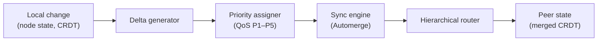
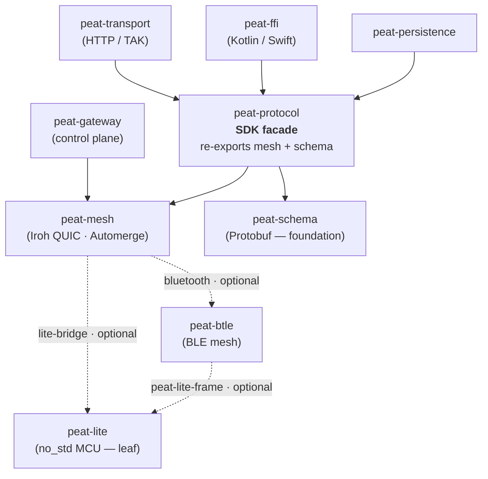

# Module 1 — Architecture Overview

**Goal:** understand the shape of PEAT before touching any code. The five-layer model,
the five repos, and — most importantly — how they depend on each other.

---

## 1.1 The problem PEAT solves

Tactical and edge environments are *heterogeneous*. A squad leader carries a phone running
ATAK. Sensors run on ESP32 microcontrollers with 256 KB of RAM. AI inference runs on edge
servers. Robots carry embedded computers. These systems speak different protocols, use
different radios, and often can't reach each other directly. The network is frequently
**degraded, disrupted, intermittent, or limited (DDIL)** — there may be no WiFi, no cell, no
satellite.

PEAT gives all of them a common coordination layer with four properties:

- **Any device joins** — servers, phones, ESP32 sensors, Raspberry Pis, AI platforms; each
  contributes what it can.
- **Any transport works** — QUIC, BLE mesh, UDP, HTTP, simultaneously, with automatic failover.
- **Works disconnected** — state is CRDT-based (via Automerge), so there is no central server
  and the mesh keeps operating through network partitions.
- **Scales** — hierarchical aggregation means the protocol that works for 5 nodes also works
  for 1,000+.

## 1.2 The three phases (the runtime mental model)

Everything PEAT does happens in three phases. Hold onto these names — the code is literally
organized around them.

1. **Discovery** — nodes find each other (mDNS, BLE advertisements, static config, Kubernetes,
   or geographic clustering). *A phone discovers a nearby sensor; a server discovers edge nodes.*
2. **Cell Formation** — discovered nodes form **cells** based on capabilities. A cell might be a
   squad leader's phone, two sensors, and a ground vehicle. Each node advertises what it can do;
   the cell composes those capabilities and elects a leader.
3. **Coordination (Hierarchy)** — cells self-organize into a hierarchy for efficient state
   sharing. A sensor's reading flows up to its cell leader, aggregates with other cells at the
   zone level, and reaches the command post — without flooding the network. Commands flow back
   down.

A **cell** is the fundamental unit of organization. Cells elect leaders, form parent/child
relationships (cell → cohort → federation → coalition in the current vocabulary), and keep
operating autonomously when cut off from higher echelons.

## 1.3 The architecture, through two lenses

There is **no single "official layer count"** for PEAT — the repo documents the architecture two
different (complementary) ways, and you'll see both. Knowing they're two *lenses* on the same system,
not a contradiction, will save you confusion.

### Lens A — the crate/packaging layering (5 layers)

Source: [`peat/docs/ARCHITECTURE.md`](../peat/docs/ARCHITECTURE.md) (2025-01-07). This organizes the
system by **which crate owns what**, bottom-up:

```
┌───────────────────────────────────────────────────────────────┐
│ APPLICATION   TAK bridge · edge inference · your app           │
├───────────────────────────────────────────────────────────────┤
│ BINDING       peat-ffi  (Kotlin/Swift via UniFFI + JNI)        │
├───────────────────────────────────────────────────────────────┤
│ TRANSPORT     peat-mesh (QUIC/Iroh, discovery, topology)       │
│               peat-transport (HTTP/TAK)   peat-lite (MCU UDP)   │
│               peat-btle (BLE mesh)                              │
├───────────────────────────────────────────────────────────────┤
│ PROTOCOL      peat-protocol — DocumentStore · Security · etc.   │
├───────────────────────────────────────────────────────────────┤
│ SCHEMA        peat-schema  (Protobuf wire definitions)         │
└───────────────────────────────────────────────────────────────┘
```

- **Schema** (`peat-schema`) — the wire format (Protobuf). No PEAT deps; the foundation.
- **Protocol** (`peat-protocol`) — the SDK core you program against (CRDT sync, auth, cells, hierarchy, QoS).
- **Transport** — `peat-mesh` (P2P QUIC/Iroh), `peat-transport` (HTTP + TAK/CoT), `peat-lite` (MCU UDP), `peat-btle` (BLE).
- **Binding** (`peat-ffi`) — Kotlin/Swift bindings for mobile.
- **Application** — TAK bridge, edge ML, simulators, your apps.

The **whitepaper** (`peat/docs/whitepaper/05-technical-architecture.md` §4.3) presents this same
5-layer model, numbered bottom-up (Layer 1 Schema → Layer 5 Application) — so the whitepaper and
`ARCHITECTURE.md` are both expressions of **Lens A**. (One tiny inconsistency to not trip on: the
whitepaper files `peat-lite` under the *Binding* layer, while `ARCHITECTURE.md` files it under
*Transport*. It's the same crate; the layer label is just an editorial choice.)

### Lens B — the runtime data-flow stack (4 layers)

Source: [`peat/docs/guides/developer/DEVELOPER_GUIDE.md`](../peat/docs/guides/developer/DEVELOPER_GUIDE.md)
§3.1 (2025-12-08 — **newer, and the strongest practical onboarding doc in the repo**). This organizes
the system by **how a change flows at runtime**:

```
┌─────────────────────────────────────────────────────────────┐
│ APPLICATION         peat-sim · peat-transport · peat-inference│
├─────────────────────────────────────────────────────────────┤
│ PROTOCOL            peat-protocol                            │
│   Discovery(P1) → Cell(P2) → Hierarchy(P3) · Composition     │
│   Security · Policy · QoS · Command                          │
├─────────────────────────────────────────────────────────────┤
│ STORAGE ABSTRACTION   Automerge + Iroh backend (pure OSS)    │
├─────────────────────────────────────────────────────────────┤
│ NETWORK             P2P Mesh (Iroh QUIC)                     │
└─────────────────────────────────────────────────────────────┘
```

This view collapses "binding/transport/schema" and instead foregrounds the **storage abstraction**
(the pluggable CRDT backend) sitting between the protocol logic and the raw network — which is
arguably the more useful mental model once you're writing code, because it's the path a local change
actually takes (see Module 6).

The developer guide (§3.2) also draws the **runtime data flow** — what happens to a single local
change. This is the diagram to internalize for Lens B:



> **Which should you hold in your head?** Use **Lens B** as your working model — it matches the
> code's runtime flow and is the newer, maintained doc. Use **Lens A** when you're reasoning about
> *crates and packaging* (what depends on what, what to add to `Cargo.toml`). They don't conflict;
> they're answering different questions.

> **Heads-up on the dependency direction.** Both diagrams draw "transport/network" below or beside
> "protocol," but in today's code the **crate dependency** runs from the facade downward:
> `peat-protocol` *pulls in* `peat-mesh`. The diagrams map responsibilities; §1.5 is the literal
> truth of what compiles against what.

> **Name trivia worth knowing.** The developer guide expands the name as *"Peat (Hierarchical
> Intelligence for Versatile Entities)"* — which actually spells **HIVE**, the project's former
> name. You'll see "HIVE" all over the history: ADR-049 is "HIVE mesh extraction," peat-lite's
> ADR-001 is "hive-lite-primitives." PEAT is the rename; HIVE is the legacy term for the same thing.

## 1.4 The five repositories (what's in this folder)

| Repo / dir | One-liner | Language | Key crate(s) |
|------------|-----------|----------|--------------|
| `peat/` | The umbrella workspace: the SDK facade + schema + adapters + examples + spec | Rust | `peat-protocol`, `peat-schema`, `peat-transport`, `peat-persistence`, `peat-ffi` |
| `peat-mesh/` | The networking layer: QUIC/Iroh P2P, Automerge CRDT sync, discovery, topology | Rust | `peat-mesh` (+ `peat-mesh-node` binary) |
| `peat-btle/` | BLE mesh transport for phones, watches, sensors, MCUs | Rust (+ Kotlin/Swift) | `peat-btle` |
| `peat-lite/` | `no_std` CRDT primitives + wire protocol for 256 KB microcontrollers | Rust (`no_std`) | `peat-lite` |
| `peat-gateway/` | Enterprise control plane: multi-tenant enrollment, CDC, identity federation | Rust + SvelteKit | `peat-gateway` |

Inside `peat/` the most important sub-crates are:

- **`peat-protocol`** — the SDK facade. *This is where you start as an app developer.*
- **`peat-schema`** — Protobuf wire types (`.proto` files under `peat/peat-schema/proto/`).
- **`peat-transport`** — HTTP server + the **TAK/CoT bridge** (`src/tak/`).
- **`peat-persistence`** — storage adapters (e.g. beacon persistence) and an external store server.
- **`peat-ffi`** — UniFFI + JNI bindings for Android/iOS.
- **`peat/examples/`** — runnable examples: `quickstart`, `peat-tak-bridge`, `android-peat-demo`,
  `ios-demo`, `m5stack-core2-peat`, etc.
- **`peat/spec/`** — an IETF-style protocol draft (`draft-peat-protocol-00.md`) and `.proto` specs.
- **`peat/docs/adr/`** — ~60 Architecture Decision Records. These are gold for understanding *why*.

## 1.5 The dependency graph (the literal truth)

This is what the `Cargo.toml` files actually declare. Arrows mean "depends on." Read it top-down.

```
                    peat-gateway ───────────────┐
                  (control plane)               │
                                                 ▼
   peat-transport ──┐                       peat-mesh ◀── peat-persistence
   (HTTP / TAK)     │                    (P2P, QUIC/Iroh,        │
                    ▼                     Automerge CRDT)         │
   peat-ffi ───▶ peat-protocol ──────────────┤                  │
  (mobile)       (SDK FACADE)                 │  (optional)      │
                    │   │                     ├──▶ peat-btle ──┐ │
                    │   └──── re-exports ──────┤   (BLE mesh)   │ │
                    │        peat-mesh +       └──▶ peat-lite ◀─┘ │
                    ▼        peat-schema           (no_std MCU)   │
              peat-schema ◀──────────────────────────────────────┘
              (Protobuf, foundation — no PEAT deps)
```

Concretely, verified from the manifests:

- `peat-schema` → *(nothing)* — the foundation.
- `peat-protocol` → `peat-schema`, `peat-mesh`, and `peat-btle` *(optional, `bluetooth` feature)*.
  Its `lib.rs` does `pub use peat_mesh;` and `pub use peat_schema;` — that's the facade.
- `peat-transport` → `peat-schema`, `peat-protocol`, `peat-mesh` *(optional)*.
- `peat-persistence` → `peat-schema`, `peat-protocol`, `peat-mesh`.
- `peat-ffi` → `peat-protocol`, `peat-mesh` *(optional)*, `peat-btle` *(optional, per platform)*.
- `peat-mesh` → `peat-lite` *(optional)*, `peat-btle` *(optional, `bluetooth` feature)*.
- `peat-btle` → `peat-lite` *(optional, `peat-lite-frame` feature)*.
- `peat-lite` → *(nothing PEAT)* — `no_std`, standalone, only `heapless`.
- `peat-gateway` → `peat-mesh` (pinned to an exact version — an `=`-pin — with features `automerge-backend` + `broker`).

Rendered as a diagram (solid = required dependency, dashed = optional feature):



### Why the arrows changed direction (history worth knowing)

The architecture started with `peat-mesh` *inside* `peat-protocol` as a transport module. Over a
series of ADRs (notably **ADR-049 "HIVE mesh extraction"** and **peat-mesh ADR-0002
"peat-mesh-extraction"**) the networking layer was **extracted into its own repo** so it could be
versioned and published independently. After extraction, `peat-protocol` became a thin **facade**
that depends on and re-exports `peat-mesh`. That's why:

- The old `peat/docs/ARCHITECTURE.md` (2025-01-07) still draws `peat-mesh → peat-protocol`.
- The current README and the `Cargo.toml` files show `peat-protocol → peat-mesh`.

If you ever see the two disagree, **trust the manifests.** This kind of "doc lags the code"
situation is normal in a fast-moving project — learning to spot it is part of the job.

### A second subtlety: the version pinning dance

Because `peat-mesh` and `peat-btle` are now separate published crates, the `peat` workspace has to
pin their versions carefully. If you open `peat/Cargo.toml` you'll find a long, heavily-commented
`[patch.crates-io]` / floor-version history (a long succession of release-candidate floors) explaining a cargo
**cycle-detection** problem that arose when `peat-btle` and `peat-mesh` each optionally depended on
the other. The fix (ADR-059 Amendment 4) **broke the back-edge**: `peat-btle` no longer depends on
`peat-mesh`; instead `peat-mesh`'s `bluetooth` feature implements the bridge on top of primitives
`peat-btle` exposes. You don't need to memorize this, but knowing it exists will save you confusion
the first time a build fails on a version mismatch.

## 1.6 The modularity model (read this twice)

This is the single most important architectural property to internalize, and it's easy to miss:

> **`peat-lite` and `peat-btle` are standalone leaf crates. The rest of PEAT depends on *them*;
> they depend on *nothing* in PEAT.** Dependencies flow *down into* the edge crates, never *out of*
> them.

Concretely, from the manifests:

- **`peat-lite` is a pure leaf** — it has **no PEAT dependencies at all** (its only dependency is
  `heapless`). It's a self-contained `no_std` CRDT library.
- **`peat-btle` is almost a leaf** — its only PEAT dependency is an **optional** `peat-lite`
  (the `peat-lite-frame` feature). It does **not** depend on `peat-mesh`, `peat-protocol`, or
  `peat-schema`.
- **The "core" reaches outward to consume them, optionally:** `peat-mesh` pulls in `peat-btle`
  (the `bluetooth` feature) and `peat-lite` (the `lite-bridge` feature); `peat-protocol` and
  `peat-ffi` pull in `peat-btle` per platform. None of that coupling runs the other way.

```
        peat-protocol / peat-ffi / peat-mesh   ← the "core" stack
                        │  (optional features point DOWN)
                        ▼
                   peat-btle      ← standalone BLE transport; only optional dep is peat-lite
                        │  (optional)
                        ▼
                   peat-lite      ← pure leaf: zero PEAT deps, no_std, reusable anywhere
```

**Why this modularity matters** (this is the framing the team captured during the IWRP proposal
work):

1. **Independent reuse.** Because they carry no upward dependencies, `peat-lite` and `peat-btle`
   can be adopted *on their own*, by projects that don't want the whole PEAT stack — e.g. someone who
   just needs a tiny `no_std` CRDT library, or just a cross-platform BLE-mesh transport. The value
   of each edge crate is not locked behind adopting `peat-protocol`.
2. **Independent versioning & publishing.** Each is its own crate on crates.io (and Maven Central),
   released on its own cadence.
3. **Reaches targets the core can't.** `peat-lite` compiles for bare-metal microcontrollers and
   `peat-btle` for mobile/embedded platforms precisely *because* they don't drag in the heavier
   core. If they depended upward, they couldn't build for those targets.
4. **It's what keeps the graph acyclic.** The cycle described in §1.5 appeared the moment an edge
   crate pointed back *up* at `peat-mesh`. Keeping the edge crates as leaves (ADR-059 Amendment 4)
   is the structural rule that prevents that class of problem.

So the mental model is **"core depends on edge, edge depends on nothing"** — a stable-dependencies,
leaf-reusability design. When you read `Cargo.toml`s, notice that every PEAT arrow into `peat-btle`
or `peat-lite` is marked `optional = true`. That's the modularity model in one keyword.

---

## Try it

1. **Read the developer guide.** [`peat/docs/guides/developer/DEVELOPER_GUIDE.md`](../peat/docs/guides/developer/DEVELOPER_GUIDE.md)
   is the single strongest onboarding doc in the repo — getting-started toolchain, the runtime
   architecture (Lens B), core concepts, a crate reference, testing, and "Extending Peat." This
   learning track is a guided path *through* it and the code; the guide is your canonical companion.
2. Open [`peat/docs/ARCHITECTURE.md`](../peat/docs/ARCHITECTURE.md) and find the "Crate Dependency
   Graph" section. Compare it to §1.5 above and spot the inverted arrow yourself.
2. Run `grep -rn "pub use peat_mesh" peat/peat-protocol/src/lib.rs` — that single line is the whole
   "facade" idea.
3. Skim the file names under `peat/docs/adr/`. You don't need to read them yet; just notice how
   many decisions are recorded and that they're numbered.

## Checkpoint

- The repo documents the architecture two ways — name the two lenses (and how many layers each has)
  and say which question each answers.
- What are the three runtime phases, in order?
- Which single crate does an application developer add to `Cargo.toml`, and what does it re-export?
- Which crate is the foundation with no PEAT dependencies?
- Why does the dependency graph contradict the old architecture diagram?
- Which two crates are standalone *leaves*, and which direction do dependencies flow relative to
  them? Give two reasons that modularity matters.

---

Next: [Module 2 — The SDK Facade: `peat-protocol` »](02-peat-protocol.md)
