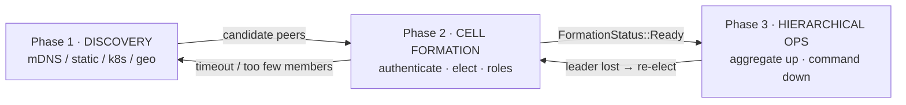

# Module 2 — The SDK Facade: `peat-protocol`

**Goal:** understand the crate you actually program against. This is the biggest, richest
module — take your time. Repo path: [`peat/peat-protocol/`](../peat/peat-protocol/).

> **Mental model:** `peat-protocol` is a *facade*. It owns the high-level concepts — cells,
> hierarchy, security, QoS, the three phases — and re-exports the lower layers (`peat-mesh`,
> `peat-schema`) so downstream consumers depend on **one crate**.

---

## 2.1 The entry point

Open [`peat/peat-protocol/src/lib.rs`](../peat/peat-protocol/src/lib.rs). Two things matter most:

**The facade re-exports** (around line 104):

```rust
// Facade re-exports: downstream consumers depend on peat-protocol alone.
pub use peat_mesh;     // P2P plumbing: transport, topology, CRDT sync
pub use peat_schema;   // wire types (Protobuf)
```

**The module map** (the public surface). Each `pub mod` is a subsystem; the ones in **bold** are
the ones to learn first:

| Module | What it does |
|--------|--------------|
| **`cell`** | Phase 2: cell formation, leader election, capability aggregation |
| **`hierarchy`** | Phase 3: zone coordination, state aggregation, flow control, routing rules |
| **`discovery`** | Phase 1: node discovery strategies (mDNS, geographic, directed, capability query) |
| **`security`** | Device authentication, PKI, membership certificates, user auth (ADR-006, ADR-048) |
| **`sync`** | Data-sync abstraction (traits) + the Automerge backend |
| **`qos`** | Quality-of-Service framework: 5-level priority, TTL, eviction, bandwidth (ADR-019) |
| `command` | Bidirectional command coordination (zone → node), conflict resolution, ACK timeouts |
| `composition` | Capability composition engine: additive / emergent / redundant / constraint rules |
| `cot` | Cursor-on-Target translation (TAK interop), MIL-STD-2525 symbols (ADR-020, ADR-028) |
| `event` | Event routing & aggregation with priority queues (ADR-027) |
| `distribution` | AI model distribution: deployment directives, manifests (ADR-012, ADR-026) |
| `mesh_integration` | Adapters bridging generic `peat-mesh` interfaces to PEAT domain types |
| `policy` | Generic conflict-resolution engine (`Conflictable` trait, LWW / highest-attribute) |
| `transport`, `network` | Re-export shims over `peat_mesh::transport` / `peat_mesh::network` |
| `geohash` | Vendored geohash algorithm (supply-chain audit; deterministic geo-encoding) |
| `traits` | Core abstractions: `Platform`, `CapabilityProvider`, `MessageRouter`, `PhaseTransition` |
| `models` | Domain data models: `Capability`, `Node`, `Cell`, `Zone`, `Operator`, `Domain` |

A few constants in `lib.rs` tell you the defaults of the system:

```rust
pub const DEFAULT_CELL_SIZE: usize = 5;            // nominal cell size
pub const DEFAULT_DISCOVERY_TIMEOUT_SECS: u64 = 60;
pub const DEFAULT_HIERARCHY_DEPTH: usize = 4;      // Node → Cell → Zone → Network
```

**"Hello world" shape.** The architecture doc shows an idealized `peat_protocol::prelude::*` import:

```rust
// Illustrative only — see the accuracy note below.
use peat_protocol::prelude::*;
let store = DocumentStore::new(Config::default()).await?;
let mut tracks = store.subscribe("tracks").await?;
```

> **Accuracy note:** there is **no `prelude` module** in the current code — that snippet is
> aspirational documentation. The *real* imports are explicit module paths. Here's what the actual
> runnable example uses ([`peat/examples/quickstart/src/`](../peat/examples/quickstart/)):
>
> ```rust
> use peat_mesh::discovery::{DiscoveryStrategy as MeshDiscoveryStrategy, MdnsDiscovery};
> use peat_protocol::network::{EndpointId, IrohTransport, PeerInfo};
> use peat_protocol::storage::{AutomergeBackend, AutomergeStore};
> use peat_protocol::storage::capabilities::{CrdtCapable, SyncCapable, TypedCollection};
> ```
>
> This is another "doc lags code" case (see Module 1) — when in doubt, open the example and copy its
> imports. Start with `peat/examples/quickstart/` once you've read this module.

---

## The three phases as a flow



## 2.2 Phase 1 — Discovery (`src/discovery/`)

Nodes have to find each other before anything else happens. The `discovery` module offers several
*strategies*:

- `peer.rs` — Automerge+Iroh peer discovery.
- `geographic.rs` / `geo.rs` — geographic clustering (`GeoCoordinate`, `OperationalBox`).
- `directed.rs` — static peer lists.
- `capability_query.rs` — "find me nodes that can do X."
- `coordinator.rs` — ties the strategies together.

Discovered nodes sit in a candidate pool for up to `DEFAULT_DISCOVERY_TIMEOUT_SECS` (60s), then
transition into cell formation. The *actual radio/transport-level* discovery (mDNS sockets, k8s
API) lives one layer down in `peat-mesh` — see Module 3. `peat-protocol`'s discovery is the
domain-level "who should I form a cell with."

---

## 2.3 Phase 2 — Cells & leader election (`src/cell/`)

This is the conceptual heart of PEAT. **For the full code-level walkthrough — the formation
authentication handshake, the election state machine with its exact defaults, role assignment,
the 6-gate readiness check, and partition-merge semantics — see [Module 2·5](02b-formation-and-leadership.md).**
The essentials below; the deep dive there. Key files:

- `leader_election.rs` — deterministic, capability-weighted election.
- `coordinator.rs` — detects when a cell is "formed" and gates phase transitions.
- `capability_aggregation.rs` / `aggregation.rs` — merge member capabilities.
- `messaging.rs` — reliable intra-cell pub/sub (`CellMessageBus`, ACK/NACK, retransmission).
- `election_policy.rs` — election strategy configuration.

### Leader election is deterministic

Every node computes the *same* score for every candidate from its capabilities, so they all
independently converge on the same leader (ties broken lexicographically by node id). The weighting
reflects mission priorities:

```rust
// peat/peat-protocol/src/cell/leader_election.rs  (~line 78)
let total = (compute * 0.30)        // inference / processing power
          + (communication * 0.25)  // bandwidth, link diversity
          + (sensors * 0.20)        // sensor diversity
          + (power * 0.15)          // battery
          + (reliability * 0.10);   // historical uptime
```

### A cell is "ready" only when criteria are met

`CellCoordinator::check_formation_complete()` validates: minimum cell size, a leader is elected,
all members have roles, required capability coverage (e.g. Communication + Sensor present),
readiness score ≥ 0.7, and — for mission-critical formations — **human approval**. Until then the
cell sits in `Forming` or `AwaitingApproval`; only then does it move to `Ready` and Phase 3.

### Emergent capabilities (`src/composition/`)

A founding idea: a cell can do more than the sum of its members. The `CompositionEngine` runs rules:

- **additive** — coverage areas and lift capacities sum.
- **emergent** — *camera + comms + range* → an ISR (intelligence/surveillance/recon) capability that
  no single node had.
- **redundant** — two of the same sensor → a reliability flag.
- **constraint** — team speed = the slowest member.

### Capability types & cell roles (DEVELOPER_GUIDE §4.2–4.3)

A node advertises **capabilities**, and each type composes differently:

| Capability | Composes by |
|------------|-------------|
| `Sensor` | additive (ranges combine) |
| `Compute` | additive (compute sums) |
| `Communication` | aggregated (best wins) |
| `Payload` | additive |
| `Mobility` | constraint (slowest wins) |
| `Weapon` | not composed |

Within a formed cell, members take **roles**: `Leader` (one per cell — coordinates and aggregates to
the zone), plus zero-or-more `Sensor`, `Compute`, `Relay`, `Strike`, `Support`, and `Follower`. Roles
are what the formation completeness check (above) verifies coverage of.

---

## 2.4 Phase 3 — Hierarchy (`src/hierarchy/`)

Once cells exist they self-organize into tiers and share state efficiently. Files:

- `aggregation_coordinator.rs` — `HierarchicalAggregator`: create a cell summary once, update it
  many times via deltas.
- `state_aggregation.rs` — roll cell summaries up into cohort/federation summaries.
- `router.rs` + `routing_table.rs` — `HierarchicalRouter` enforces *who may message whom*.
- `flow_control.rs` — bandwidth permits per `RoutingLevel` (IntraCell, CellToZone, …).
- `deltas.rs` — `CellDelta`, `CohortDelta`, `FederationDelta`, `CoalitionDelta`.
- `storage_trait.rs` — `SummaryStorage`, the backend-agnostic storage interface.

### The routing rule that defines the topology

```rust
// peat/peat-protocol/src/hierarchy/router.rs  (~line 86)
// Same cell → always allowed.
if from_cell == to_cell { return true; }
// Cross-cell direct messaging → always rejected.
//   (You must route up through your cell leader instead.)
return false;
```

That single rule is what prevents the mesh from degenerating into an everyone-talks-to-everyone
flood. State flows **up** (node → cell → cohort → federation → coalition, aggregating at each tier);
commands flow **down**; peers handle handoffs **horizontally**.

### Aggregation is backend-agnostic

```rust
// peat/peat-protocol/src/hierarchy/aggregation_coordinator.rs  (~line 61)
pub struct HierarchicalAggregator {
    storage: Arc<dyn SummaryStorage>,   // backend-agnostic: Automerge, or a mock for tests
}
```

The whole subsystem is written against a `trait`, not a concrete database. This "traits over
implementations" pattern shows up everywhere in PEAT — get comfortable with it.

---

## 2.5 State & sync (`src/sync/`)

PEAT state is a set of **CRDT documents** grouped into named **collections** (e.g. `"tracks"`,
`"missions"`). CRDTs (Conflict-free Replicated Data Types) merge automatically, so every node
converges to the same state without a coordinator — and operations succeed locally first, syncing
when connectivity returns (offline-first).

The `sync` module defines the abstraction and an Automerge implementation:

- Traits (re-exported from `peat-mesh`): `DocumentStore`, `PeerDiscovery`, `SyncEngine`,
  `DataSyncBackend`.
- `automerge.rs` — `AutomergeBackend`: documents indexed by `collection:id`, per-peer sync state,
  observer channels for change notifications, and **tombstones** (ADR-034) for conflict-free
  deletion ordered by a Lamport counter.

```rust
// peat/peat-protocol/src/sync/automerge.rs  (~line 44)
pub struct AutomergeBackend {
    documents: Arc<Mutex<HashMap<String, Automerge>>>,        // collection:id → CRDT doc
    sync_states: Arc<Mutex<HashMap<String, sync::State>>>,    // peer:document → sync state
    observers: Arc<Mutex<Vec<mpsc::UnboundedSender<ChangeEvent>>>>,
    tombstones: Arc<Mutex<HashMap<String, Tombstone>>>,       // ADR-034 deletions
    lamport_counter: Arc<AtomicU64>,                          // deterministic ordering
    // ...
}
```

The *actual wire sync* (negentropy reconciliation, Iroh streams, redb persistence) happens in
`peat-mesh` — Module 3. `peat-protocol` gives you the document model and the observer API.

### Which CRDT for which data (DEVELOPER_GUIDE §3.4)

PEAT doesn't use one CRDT for everything — it picks the *right* CRDT per data type, which is a great
window into the design:

| Data | CRDT | Why |
|------|------|-----|
| Node capabilities | G-Set (grow-only set) | capabilities only get added, never silently removed |
| Cell membership | OR-Set | members can both join and leave |
| Leader identity | LWW-Register | latest elected leader wins |
| Node position | LWW-Register | latest position is truth |
| Fuel / resources | PN-Counter | can go up *and* down |
| Message history | G-Set | append-only |
| Configuration | LWW-Map | latest value wins per key |

> **Backend note (accuracy):** the storage layer is written against a trait so backends are
> swappable, but **only one ships today: Automerge + Iroh** (100% OSS). An earlier Ditto-SDK backend
> was **removed** from the workspace (DEVELOPER_GUIDE §9.3, ADR-011). If you see "Ditto" in older
> docs, treat it as historical.

---

## 2.6 Quality of Service (`src/qos/`)

Bandwidth in the field is scarce, so PEAT classifies every piece of data and lets high-priority
traffic preempt low-priority traffic. Five classes (ADR-019):

| Class | Priority | Latency target | Bandwidth share | Example |
|-------|----------|----------------|-----------------|---------|
| P1 Critical | highest | ~500 ms | 40% | contact reports |
| P2 High | | ~5 s | 30% | mission imagery |
| P3 Normal | | ~60 s | 20% | health status |
| P4 Low | | ~300 s | 8% | routine telemetry |
| P5 Bulk | lowest | no limit | 2% | archival |

`QoSRegistry::default_military()` ships sensible defaults. The same module also owns TTL, retention,
eviction, and garbage collection — when storage is under pressure, the *oldest, lowest-QoS*
documents get evicted first (`qos/eviction.rs`, `qos/garbage_collection.rs`).

---

## 2.7 Security (`src/security/`)

Layered, and partly delegated to `peat-mesh` for the low-level primitives:

- **Device identity** — Ed25519 keypairs; challenge-response authentication (`authenticator.rs`,
  `device_id.rs`).
- **Formation keys** — a pre-shared secret that gates which nodes may even connect
  (`formation_key.rs`). The actual admission is an HKDF-derived `FormationKey` + an HMAC-SHA-256
  challenge/response handshake over a dedicated ALPN — walked through step-by-step in **Module 2·5
  §2·5.4**.
- **Membership certificates** — tactical trust with hierarchy levels (`membership.rs`, ADR-048).
- **User auth & RBAC** — `user_auth.rs`, `authorization.rs` (roles, authority levels).
- **Encryption** — AES-256-GCM AEAD with ECDH key exchange; the project is moving toward a
  FIPS 140-3 posture (ADR-060).

The generic crypto types (`DeviceKeypair`, `EncryptionKeypair`, `FormationKey`) actually live in
`peat-mesh::security` and are re-exported; `peat-protocol` adds the PEAT-specific policy layer on top.

### Human-machine authority — "trust as data"

The whitepaper (Module 1·5 §5) frames the *why* behind this code: PEAT keeps humans in the loop by
placing them **within** the hierarchy at the right level. Three properties to recognize when reading
`security` + `command`:

- **Configurable authority boundaries** — each level defines what runs autonomously vs. what needs
  approval (the cell-formation gate in §2.3 that requires human approval for mission-critical
  formations is exactly this).
- **Graceful degradation** — a disconnected node operates within its *last-known* authority until
  reconnect or timeout (this is what makes offline-first safe, not just possible).
- **Trust as data** — authority is **replicated CRDT state**, not a static config. Delegation and
  revocation propagate through the hierarchy like any other document, so the membership certs
  (`membership.rs`, ADR-048) and authorization context travel with the mesh.

The whitepaper's six-level authority model (Root → Cluster → Formation → Group → Team → Node) maps to
the membership-certificate hierarchy levels here. **Note the vocabulary drift:** that whitepaper level
naming is older; the **canonical current enum** is `peat_mesh::beacon::HierarchyLevel` =
Platform / Cell / Cohort / Federation / Coalition (ADR-066). See **Module 2·5** for the full
authoritative table and the formation-authentication handshake that gates membership.

---

## 2.8 Talking to the outside world: CoT / TAK (`src/cot/`)

PEAT bridges to existing tactical systems rather than replacing them. The `cot` module translates
PEAT domain messages (e.g. `TrackUpdate`, `CapabilityAdvertisement`) into **Cursor-on-Target** XML
with MIL-STD-2525 military symbols, plus a custom `<_peat_>` detail extension. That XML is what
ATAK / WebTAK / a TAK Server consume. (The HTTP/socket plumbing for an actual TAK Server bridge is
in `peat-transport/src/tak/` — see Module 5's neighbor, and the runnable
[`peat/examples/peat-tak-bridge/`](../peat/examples/peat-tak-bridge/).)

---

## Putting it together — what each phase touches

```
Phase 1 Discovery   → src/discovery/        (who's out there?)
Phase 2 Cells       → src/cell/ + composition/   (form a team, elect a leader, compose capabilities)
Phase 3 Hierarchy   → src/hierarchy/ + command/ + event/   (aggregate up, command down)
Always-on          → src/sync/ (state), src/qos/ (priorities), src/security/ (trust)
Interop            → src/cot/ (TAK), src/distribution/ (AI models)
```

## Try it

1. Open `lib.rs` and read the doc comment at the top — it states the facade idea in the authors'
   own words.
2. Read `cell/leader_election.rs` top to bottom. It's self-contained and shows the
   "everyone-computes-the-same-answer" idea clearly.
3. Trace one routing decision: open `hierarchy/router.rs` and find `is_route_valid`. Convince
   yourself why cross-cell direct messages are rejected.
4. Build and run [`peat/examples/quickstart/`](../peat/examples/quickstart/).

## Checkpoint

- Why can leader election be decided locally without a vote-counting round?
- What's the difference between a *collection* and a *document*?
- Name the five QoS classes and one example of each.
- Where does the *generic* crypto live vs. the PEAT-specific *policy*?
- What does the `cot` module produce, and who consumes it?

---

Next: [Module 3 — The Network Layer: `peat-mesh` »](03-peat-mesh.md)
