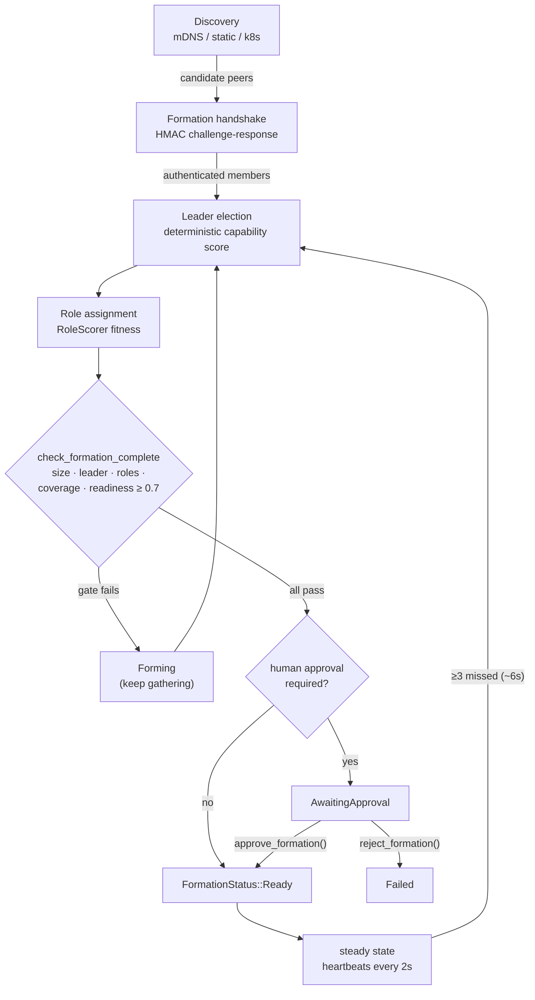
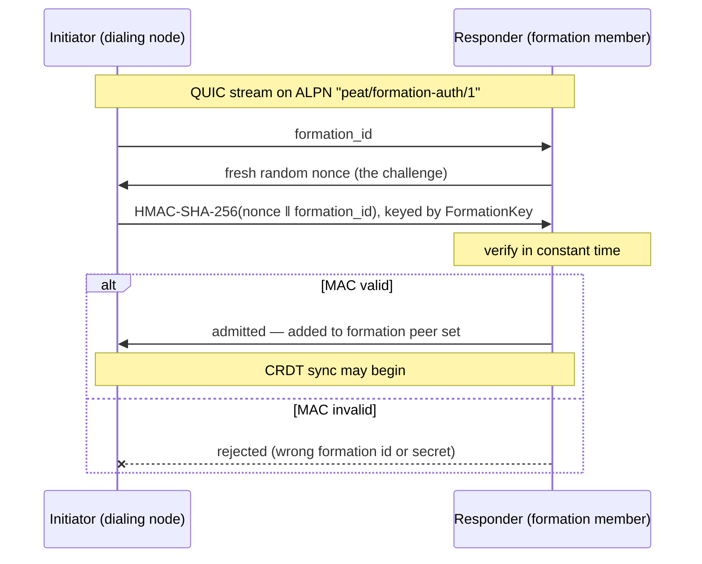
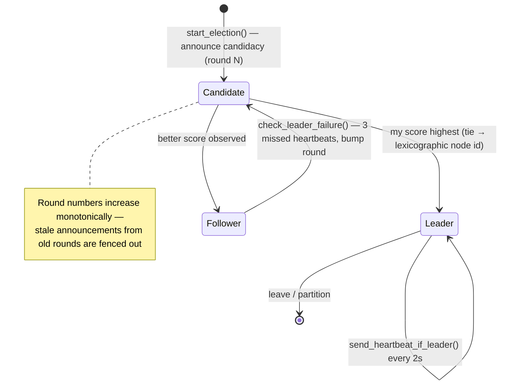

# Module 2·5 — Forming a Cell & Electing Leaders

**Goal:** a precise, code-level walkthrough of how independent nodes discover each other,
authenticate into a **formation**, elect a leader, take roles, confirm readiness, and recover when
the leader is lost. This is the deep-dive companion to Module 2 §2.2–2.4, mirroring the repo's own
guide [`peat/docs/guides/developer/FORMATION_AND_LEADERSHIP.md`](../peat/docs/guides/developer/FORMATION_AND_LEADERSHIP.md)
(the normative version is `peat/docs/spec/004-coordination.md`).

> **Why a whole module on this?** Formation + leader election is the single most important runtime
> behavior in PEAT, and it's the part most likely to confuse newcomers (membership ≠ reachability;
> election needs no consensus round). The repo gives it a dedicated guide; so do we.

---

## 2·5.1 Vocabulary — the canonical hierarchy enum

State aggregates through a fixed set of tiers above a single node. The **authoritative, current**
enum is `peat_mesh::beacon::HierarchyLevel` (post-ADR-066):

| Tier | `HierarchyLevel` | Meaning |
|------|------------------|---------|
| Platform | `Platform` (0) | a single node — vehicle, sensor, handset, container |
| Cell | `Cell` (1) | smallest aggregation unit; **one leader + N members** |
| Cohort | `Cohort` (2) | a set of cells sharing a mission, role, region, or time window |
| Federation | `Federation` (3) | an alliance of cohorts coordinating without central authority |
| Coalition | `Coalition` (4) | top tier; an alliance of federations |

> **⚠️ Vocabulary drift — you WILL see other names.** This Cell/Cohort/Federation/Coalition naming
> is current (ADR-066). Older docs use different words for the same tiers:
> - The **whitepaper** and the older **spec `004-coordination.md`** (2025-01-07) use
>   **Node / Team / Group / Formation / Cluster / Root**.
> - Some **older code/docs** use **Squad / Platoon / Company**.
>
> They all describe the same hierarchical idea. **Use Cell/Cohort/Federation/Coalition in new code.**
> Formation and leader election happen at the **cell** tier — that's our focus here.

The primitives live in `peat-protocol`:

```rust
use peat_protocol::cell::{
    CellCoordinator, FormationStatus, LeaderElectionManager, LeadershipScore, CellMessageBus,
};
use peat_protocol::models::{CellConfig, CellState, CellStateExt, CellRole, RoleScorer};
```

---

## 2·5.2 The lifecycle: discover → form → elect → assign → confirm

```
node (Platform) ──discovery──▶ candidate peers ──formation handshake──▶ member of formation
                  mDNS/static                      HMAC challenge/resp
        │
        ├─ leader election (capability score + tie-break id) ──▶ leader_id set on Cell
        ├─ role assignment (RoleScorer) ──▶ members take Sensor/Compute/Relay/…
        └─ CellCoordinator: size + leader + roles + readiness (+ optional human approval)
                                        │
                                        ▼  FormationStatus
                                   Ready ──▶ (heartbeats) ──leader lost──▶ re-election
```

Five steps, then a steady state maintained by heartbeats with automatic re-election on leader loss.

The same lifecycle with its decision gates:



---

## 2·5.3 Step 1 — Discovery (candidates only)

Discovery (`peat_mesh::discovery`) yields **candidate addresses** — it does **not** grant
membership. Strategies: `MdnsDiscovery` (zero-config LAN), static peer lists, and Kubernetes
EndpointSlices. A `DiscoveryEvent::PeerFound` becomes a *formation-authenticated* connection only
after the handshake below.

## 2·5.4 Step 2 — Formation & authentication (the handshake)

**Membership is proven by a shared formation key, never by mere reachability.** This is the security
crux of the whole system.

`FormationKey` (`peat_mesh::security::FormationKey`) is derived from the `formation_id` + a 32-byte
shared secret via **HKDF-SHA-256** (FIPS-aligned, ADR-060):

```rust
use peat_mesh::security::FormationKey;
let key = FormationKey::from_base64(formation_id, base64_shared_key)?;  // from operator creds
// or: FormationKey::new(formation_id, &shared_secret_32);
```

The handshake runs over a dedicated ALPN **before any state is exchanged**
(`peat_protocol::network::formation_handshake`, ALPN `b"peat/formation-auth/1"`):

1. Initiator opens a stream on the handshake ALPN and sends its `formation_id`.
2. Responder replies with a fresh random **nonce** (the challenge).
3. Initiator returns `HMAC-SHA-256(nonce ‖ formation_id)` using the formation key.
4. Responder verifies in **constant time**. Match ⇒ admitted; mismatch ⇒ rejected.

As a sequence diagram:



Because the nonce is fresh per handshake and the `formation_id` is mixed into the MAC, the exchange
is **non-replayable**, and a node in a different formation (different id or secret) is rejected. Only
after success is the peer added to the formation's peer set and allowed to sync.

> Most apps get this for free: standing up `peat_mesh::AutomergeBackend` with a `FormationKey`
> performs the handshake on every connection. Call `perform_initiator_handshake` /
> `perform_responder_handshake` directly only when building a custom transport.

The authenticated member set is recorded in the cell document via `CellStateExt`:

```rust
let mut cell = CellState::new(CellConfig::default());
cell.add_member("node-a".to_string());   // returns true if newly added
```

## 2·5.5 Step 3 — Leader election (deterministic, no consensus)

`LeadershipScore::from_capabilities` reduces a node's capabilities to a single weighted score:

```rust
let score = LeadershipScore::from_capabilities(&capabilities);
// total = compute·0.30 + communication·0.25 + sensors·0.20 + power·0.15 + reliability·0.10
```

Ties break by **lexicographic node id**, so every node independently computes the *same* winner
without exchanging votes — this is what makes it split-brain safe:

```rust
let winner_is_me = my_score.compare(&their_score, my_id, their_id) == std::cmp::Ordering::Greater;
```

`LeaderElectionManager` runs the state machine (`Candidate → Leader | Follower`) over the
`CellMessageBus`:

```rust
let election = LeaderElectionManager::new(cell_id, my_node_id, bus, my_capabilities);
election.start_election()?;                 // announce candidacy (round 1)
election.process_election_message(&msg)?;   // compare scores, converge
election.get_state();  election.get_leader();  election.get_round();
```

Defaults: **election timeout 5s**, **heartbeat interval 2s**, **3 missed heartbeats** tolerated
(~6s to detect failure).

The election state machine:



> **The spec adds a human-in-the-loop dimension** (`004-coordination.md` §5). The full leadership
> score can be a *hybrid* of the technical score above and an **authority score** built from human
> operator rank, authority level, and cognitive load — combined per a `LeadershipPolicy`
> (`RankDominant` / `TechnicalDominant` / `Hybrid { authority_weight, technical_weight }` /
> `Contextual`). Tie-break order in the spec: human authority rank → longer membership → higher
> device id. Emergency elections use a **2s** timeout.

## 2·5.6 Step 4 — Role assignment (everything except Leader)

The **Leader is elected**; every *other* role is **assigned** by fitness scoring. `CellRole`:

| Role | Assigned? | Purpose |
|------|-----------|---------|
| `Leader` | elected | coordinates the cell |
| `Sensor` | assigned | detection / reconnaissance |
| `Compute` | assigned | processes data, runs analysis |
| `Relay` | assigned | extends network range |
| `Strike` | assigned | engages targets (effectors) |
| `Support` | assigned | logistics / medical / maintenance |
| `Follower` | assigned (default) | general member |

```rust
if let Some((role, fitness)) = RoleScorer::best_role_for_platform(&node_config, &node_state) {
    tracing::info!(?role, fitness, "assigned role");
}
```

Required capabilities are **blocking** — a missing required capability disqualifies the role.
(The spec also defines a `Deputy` = second-highest leadership score, used for fast failover.)

## 2·5.7 Step 5 — Confirming the formation

A cell isn't "ready" just because a leader exists. `CellCoordinator::check_formation_complete()` is
the single gate, checking **in order**:

1. **Minimum size** (default 3).
2. **A confirmed leader** (`leader_id` is `Some`).
3. **Every member has an assigned role.**
4. **Required capability coverage** (default: Communication + Sensor present).
5. **Readiness ≥ threshold** (default 0.7).
6. **Human approval**, *if* any present capability requires oversight.

The result is a `FormationStatus`:

```rust
match &coordinator.status {
    FormationStatus::Forming          => { /* still gathering members/roles */ }
    FormationStatus::AwaitingApproval => { coordinator.approve_formation()?; /* or reject_formation(reason) */ }
    FormationStatus::Ready            => { /* operational; may aggregate upward */ }
    FormationStatus::Failed(reason)   => { tracing::warn!(%reason, "formation failed"); }
}
// can_transition_to_hierarchical() == matches!(status, Ready)
```

## 2·5.8 Failover, re-election & partitions

The leader proves liveness with heartbeats; followers re-elect when they stop.

```rust
election.send_heartbeat_if_leader()?;        // leader side, every ~2s
if election.check_leader_failure()? { /* ≥3 missed (~6s): reset to Candidate, bump round, re-announce */ }
```

Re-election reuses the same deterministic scoring, so the cell converges on the next-best node —
again without a vote. **Round numbers** increase monotonically so late messages from a prior round
are ignored. **Under partition**, each side elects locally (liveness over global agreement); on heal,
the conflict resolves deterministically through CRDT merge (next section).

## 2·5.9 State, sync & conflict resolution

Membership and leadership aren't RPC state — they're fields of the `CellState` **CRDT document**,
synced through the formation's Automerge backend. The per-field merge rules are what make concurrent
edits safe:

| Field | CRDT type | Merge rule |
|-------|-----------|------------|
| `members` | OR-Set | union (add/remove converge) |
| `leader_id` | LWW-Register | latest timestamp wins |
| capabilities | G-Set | union |

```rust
cell.set_leader("node-a".to_string()).expect("leader must be a current member");
cell.remove_member("node-a");   // also clears leader_id
cell.merge(&other_replica);     // OR-Set / LWW / G-Set per field
```

Because `leader_id` is **LWW**, two partitions that elected different leaders converge to one
deterministically on merge — no special reconciliation code path.

## 2·5.10 Scaling above the cell

Cells don't talk to every node in a federation — they **aggregate**. A cell leader publishes a
`CellSummary`; a cohort coordinator reduces many `CellSummary`s into a `CohortSummary`; that rolls up
to `FederationSummary` and `CoalitionSummary` (`peat-schema/proto/hierarchy.proto`). Key points:

- **Each tier elects/assigns its own coordinator** — a cohort coordinator is *not* a cell leader.
- **Summaries are LatestOnly** collections (only the newest matters), so they sync cheaply.
- **Commands flow down, state flows up;** message priority escalates at tier boundaries
  (`RoutingContext` in `cell/messaging.rs`).

For *how* nodes are grouped into tiers (static / dynamic / hybrid), see ADR-024.

---

## API quick reference

| Concern | Type / fn | File |
|---------|-----------|------|
| Formation key | `peat_mesh::security::FormationKey` (`from_base64`, `new`) | `peat-mesh/src/security/formation_key.rs` |
| Handshake | `network::formation_handshake::{FORMATION_HANDSHAKE_ALPN, perform_initiator_handshake, perform_responder_handshake}` | `peat-protocol/src/network/formation_handshake.rs` |
| Leadership score | `cell::LeadershipScore::{from_capabilities, compare}` | `peat-protocol/src/cell/leader_election.rs` |
| Election state machine | `cell::LeaderElectionManager` | `peat-protocol/src/cell/leader_election.rs` |
| Formation completion | `cell::CellCoordinator`, `cell::FormationStatus` | `peat-protocol/src/cell/coordinator.rs` |
| Roles | `models::CellRole`, `models::RoleScorer` | `peat-protocol/src/models/role.rs` |
| Cell document | `models::{CellState, CellStateExt, CellConfig}` | `peat-protocol/src/models/cell/mod.rs` |
| Hierarchy levels | `peat_mesh::beacon::HierarchyLevel` | `peat-mesh/src/beacon/types.rs` |

## Try it

1. Read [`FORMATION_AND_LEADERSHIP.md`](../peat/docs/guides/developer/FORMATION_AND_LEADERSHIP.md)
   end-to-end (it's the source for this module), then the normative `docs/spec/004-coordination.md`.
2. In `peat-protocol/src/cell/leader_election.rs`, confirm the score weights and the `compare`
   tie-break by node id.
3. In `peat-protocol/src/network/formation_handshake.rs`, find `FORMATION_HANDSHAKE_ALPN` and trace
   the 4-step challenge/response.

## Checkpoint

- Why is membership "not the same as reachability," and what exactly proves membership?
- Walk the 4-step handshake. Why is it non-replayable?
- Why does deterministic scoring make leader election split-brain safe?
- Which role is elected vs. assigned, and what's the `Deputy` for?
- List the 6 gates in `check_formation_complete`.
- After a partition heals, how do two different `leader_id`s reconcile, and why is no special code needed?

---

Next: [Module 3 — The Network Layer: `peat-mesh` »](03-peat-mesh.md)
