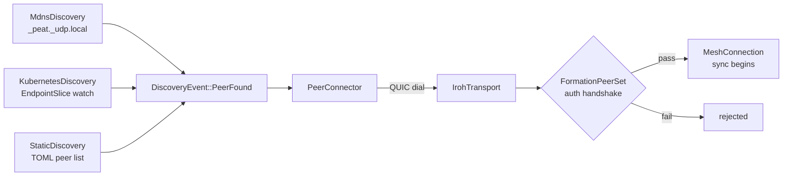
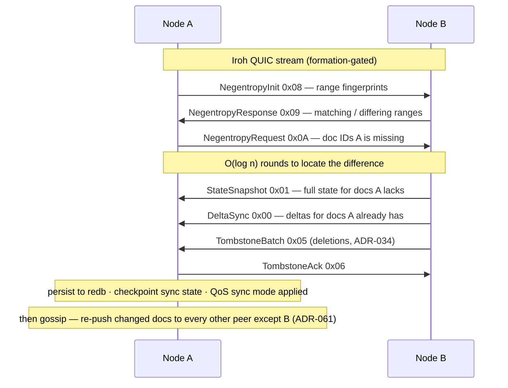

# Module 3 — The Network Layer: `peat-mesh`

**Goal:** understand how bytes actually move between nodes. `peat-mesh` is the P2P networking
library: pluggable transports, Automerge CRDT sync over QUIC, peer discovery, and topology
formation. Repo path: [`peat-mesh/`](../peat-mesh/).

> **Mental model:** if `peat-protocol` is the "what" (cells, hierarchy, policy), `peat-mesh` is
> the "how" (connections, sync messages, persistence). `peat-protocol` re-exports it, so an app
> developer rarely calls it directly — but everything they do bottoms out here.

---

## 3.1 Two entry points

### (a) As a library — the builder

You assemble a `PeatMesh` with a fluent **builder** that injects each subsystem.
([`peat-mesh/src/mesh.rs`](../peat-mesh/src/mesh.rs), ~line 575.)

```rust
let mesh = PeatMeshBuilder::new(MeshConfig::default())
    .with_transport(iroh_transport)         // Arc<dyn MeshTransport>
    .with_hierarchy(hierarchy_strategy)      // Arc<dyn HierarchyStrategy>
    .with_discovery(discovery_strategy)      // Box<dyn DiscoveryStrategy>
    .build();
mesh.start().await?;
```

`MeshConfig` ([`src/config.rs`](../peat-mesh/src/config.rs)) composes the sub-configs: `topology`,
`discovery`, `security`, `iroh`, `compaction`, and an optional `transport_manager`. Each subsystem
is optional and injected before `.build()` — a clean example of the builder pattern.

### (b) As a binary — `peat-mesh-node`

[`peat-mesh/src/bin/peat-mesh-node.rs`](../peat-mesh/src/bin/peat-mesh-node.rs) (requires
`--features node`) is the all-in-one node. Reading it top-to-bottom is the single best way to see
how the pieces wire together. It:

1. Reads env vars (formation secret, Iroh bind port, discovery mode, broker port).
2. Derives Ed25519 device keys + the Iroh secret key from `PEAT_FORMATION_SECRET` via **HKDF-SHA-256**
   (ADR-062).
3. Picks a discovery strategy (`KubernetesDiscovery` or `MdnsDiscovery`) from `PEAT_DISCOVERY`.
4. Builds an Iroh endpoint gated by a `FormationPeerSet` (only formation members may connect).
5. Opens the `AutomergeStore` (backed by **redb**) + TTL manager, GC, eviction services.
6. Starts the `AutomergeSyncCoordinator` + `SyncChannelManager` to drive CRDT sync.
7. Builds the mesh and calls `mesh.start()`.
8. Spawns a `PeerConnector` to dial discovered peers.
9. Launches an Axum **broker** HTTP/WS server for introspection.
10. Waits for SIGTERM/SIGINT and shuts everything down cleanly.

---

## 3.2 Source layout (the modules that matter)

| Module | Central types | Responsibility |
|--------|---------------|----------------|
| `transport/` | `MeshTransport`, `MeshConnection`, `NodeId`, `PeerEvent`, `Translator`, `TransportManager` | Pluggable transport backends (Iroh QUIC, peat-lite UDP, BLE) + cross-transport bridging |
| `storage/` | `AutomergeStore`, `AutomergeSyncCoordinator`, `NegentropySync`, `SyncTransport`, `TtlManager` | CRDT persistence (redb + Automerge), the sync protocol, set reconciliation, TTL/GC |
| `discovery/` | `DiscoveryStrategy`, `PeerInfo`, `DiscoveryEvent` | mDNS, Kubernetes, static-config, hybrid peer discovery |
| `topology/` | `TopologyManager`, `TopologyBuilder`, `PeerSelector`, `PartitionDetector` | Hierarchy/leader formation from beacon metrics; partition detection; autonomous mode |
| `routing/` | `MeshRouter`, `SelectiveRouter`, `DataPacket`, `DataDirection` | Upward telemetry aggregation vs. downward command dissemination (anti-flood) |
| `security/` | `DeviceKeypair`, `DeviceId`, `EncryptionKeypair`, `FormationKey`, `MeshCertificate`, `EnrollmentService`, `MeshGenesis` | Ed25519 identity, P-256/AES-GCM encryption, formation-key auth, X.509 enrollment |
| `beacon/` | `GeographicBeacon`, `BeaconBroadcaster`, `BeaconObserver`, `BeaconJanitor` | Geographic beaconing for proximity-based topology |
| `qos/` | `QoSClass`, `SyncMode`, `BandwidthAllocation`, `EvictionController` | 5-level priority, sync-mode override, bandwidth, eviction/GC |
| `broker/` | `Broker`, `BrokerConfig`, `MeshBrokerState`, `MeshEvent` | Axum HTTP/WS facade for mesh introspection + OTA |
| `network/` | `IrohTransport` | Iroh QUIC endpoint wrapper, local mDNS discovery, peer state |
| `sync/` | `DocumentStore`, `SyncEngine`, `DataSyncBackend` | The abstract sync traits (these are what `peat-protocol` re-exports) |
| `hierarchy/` | `HierarchyStrategy`, `NodeRole`, `HierarchyLevel` | Static / dynamic (election) / hybrid hierarchy assignment |

---

## 3.3 Key data flow #1 — discovery → connection

```
DiscoveryStrategy::start()
   ├─ MdnsDiscovery       → broadcasts _peat._udp.local on the LAN
   ├─ KubernetesDiscovery → watches the EndpointSlice API
   └─ StaticDiscovery     → loads a TOML peer list
            │  emits DiscoveryEvent::PeerFound(PeerInfo { node_id, addresses, relay_url })
            ▼
PeerConnector  (subscribes to the event stream)
            │  on PeerFound:
            ▼
IrohTransport::connect(peer)  → QUIC dial → MeshConnection
            │
            ▼
FormationPeerSet gate  → TLS + formation-key auth (only formation members admitted)
```

Files: `discovery/mdns.rs`, `discovery/kubernetes.rs`, `peer_connector.rs`,
`network/iroh_transport.rs`.



---

## 3.4 Key data flow #2 — CRDT sync (Automerge + negentropy)

This is the crown jewel. When two nodes connect, they reconcile their document sets, then exchange
deltas, persisting as they go. The wire protocol is a one-byte-tagged message type
([`src/storage/automerge_sync.rs`](../peat-mesh/src/storage/automerge_sync.rs), ~line 71):

```rust
#[repr(u8)]
pub enum SyncMessageType {
    DeltaSync          = 0x00,  // standard Automerge sync protocol
    StateSnapshot      = 0x01,  // full doc.save() bytes (LatestOnly mode)
    WindowedHistory    = 0x02,
    Tombstone          = 0x04,  // ADR-034 deletion
    TombstoneBatch     = 0x05,
    TombstoneAck       = 0x06,
    SyncBatch          = 0x07,  // multiple docs in one message
    NegentropyInit     = 0x08,  // set reconciliation, ADR-040
    NegentropyResponse = 0x09,
    NegentropyRequest  = 0x0A,
}
```

Why **negentropy**? A naive Automerge sync can be O(n) in the number of documents. Negentropy is a
**set-reconciliation** protocol that finds the difference between two sets in *O(log n)* rounds by
exchanging fingerprints — so two nodes quickly figure out *which* documents differ before sending
any heavy data (ADR-040). After reconciliation, only the genuinely-missing docs/deltas are sent.

The flow per peer connection:

```
1. Accept Iroh stream (QUIC)
2. Negentropy: exchange fingerprints → learn which doc IDs differ      (0x08/0x09/0x0A)
3. Delta sync: send full state for missing docs, deltas for known docs (0x00/0x01)
4. Flow control: token bucket per peer, cooldown on errors
5. Persist to redb (AutomergeStore); checkpoint sync state
6. Apply QoS sync mode: LatestOnly (compact), FullHistory, or Windowed
```

Files: `storage/automerge_sync.rs` (coordinator), `storage/automerge_store.rs` (redb persistence),
`storage/negentropy_sync.rs` (reconciliation), `storage/sync_transport.rs` (wire),
`storage/sync_channel.rs` (per-peer channels), `qos/sync_mode.rs`.

The full exchange as a sequence diagram (message-type bytes from the enum above):



### Transitive gossip — how hub-and-spoke meshes converge (ADR-061)

There's one behavior that surprises people and is worth knowing early (DEVELOPER_GUIDE §6.4.1):
in current peat-mesh, when a node receives a remote change it **re-pushes that document to
every connected peer except the source**. This *transitive gossip* is what lets a hub-and-spoke
topology converge — if `bravo` and `charlie` are each wired only to `alpha`, they still see each
other's state because `alpha` relays it.

The catch: the fan-out fires in **all** topologies, and on constrained links the per-peer
sync-state handshake overhead adds up. ADR-061 records the operational **bandwidth envelope** — a few
load-bearing rows:

| Topology | Stays within ~20% bandwidth baseline if… |
|----------|------------------------------------------|
| Hub-and-spoke (any N) | always — gossip *is* the intent |
| Fully-connected LAN (≥256 kbps) | N ≤ 4 at ≤2 Hz writes, or N ≤ 7 at ≤0.5 Hz |
| Fully-connected **BLE-class** (30 kbps) | **N = 3 only**, ≤0.5 Hz; N ≥ 4 is out of envelope before any app data flows |
| Partial mesh (non-BLE), diameter > 3 | out of envelope — multi-hop gossip compounds at each hop |

Out-of-envelope deployments have three levers: lower `max_connections` (default 7), lower the app
write rate (batch telemetry), or choose a partial topology (designate a hub, drop leaf-to-leaf
edges). A future release may add runtime topology detection to suppress the redundant relay
automatically; until then this envelope is the contract.

### Why sync *cadence* — not bandwidth — is often the real limit (ADR-063)

A subtlety that trips up performance debugging: under a sustained stream of small writes on a
*high-latency* link, delivery can plateau well below the link's raw capacity. The cause isn't
bandwidth — it's the **sync-round cadence**. The Automerge sync coordinator advances one round at a
time per peer, and each round currently opens a fresh QUIC stream, writes the message, and closes
it. On a link with ~200 ms round-trip time that caps throughput at roughly **5 sync rounds per
second per peer**, regardless of how much headroom the pipe has. Push more writes per second than
`rounds/sec × writes_per_round` can drain, and a backlog forms that a short post-burst window never
clears. Bulk transfers (which stream continuously) barely notice the same shaped link, which is the
tell that the bottleneck is round overhead rather than capacity.

ADR-063 ("Persistent Multiplexed Sync Streams") records this constraint and proposes keeping a
long-lived multiplexed stream open per peer instead of one-stream-per-message. The lesson to carry
even before any fix lands: on a degraded, high-latency link, *latency and write cadence* — not just
throughput — shape how fast a mesh converges.

---

## 3.5 Key data flow #3 — the pluggable transport abstraction

Everything that moves bytes implements one trait. ([`src/transport/mod.rs`](../peat-mesh/src/transport/mod.rs).)

```rust
#[derive(Debug, Clone, PartialEq, Eq, Hash)]
pub struct NodeId(String);

#[derive(Debug, Clone, Copy, PartialEq, Eq)]
pub enum ConnectionState {
    Healthy,   // RTT < 100ms, 0% loss
    Degraded,  // RTT >= 100ms OR loss > 5%
    Suspect,   // missed 2+ heartbeats
    Dead,      // connection confirmed closed
}
```

Three implementations plug into the same interface:

1. **Iroh QUIC** (`transport/iroh_mesh.rs`) — the default. Wraps `iroh::Endpoint`. *By default it
   uses no relay servers* (tactical builds must not "phone home" through third-party infra); the
   opt-in `relay-n0-hosted` feature enables n0's hosted relay pool for NAT traversal.
2. **peat-lite UDP** (`transport/lite.rs`) — bridges embedded, non-QUIC devices; supports OTA.
3. **Bluetooth LE** (`transport/btle.rs`) — integrates `peat-btle` behind the `bluetooth` feature.

Cross-transport document bridging (ADR-059) goes through a `Translator` trait
(`transport/translator.rs`): a document arriving over BLE can be re-encoded and forwarded over QUIC,
and vice-versa, so the mesh spans radios transparently.

---

## 3.6 Feature flags (read these before you build)

| Feature | Default | Gates |
|---------|---------|-------|
| `automerge-backend` | **on** | Automerge CRDT storage + Iroh sync + redb (the whole `storage/` stack) |
| `bluetooth` | off | BLE transport via `peat-btle` |
| `broker` | off | Axum HTTP/WS introspection server (`broker/`) |
| `kubernetes` | off | K8s `EndpointSlice` discovery (pulls `kube` + a FIPS crypto provider) |
| `node` | off | All-in-one: `automerge-backend` + `broker` + `kubernetes` + `lite-bridge`; needed by the `peat-mesh-node` binary |
| `lite-bridge` | off | UDP bridge for peat-lite devices |
| `relay-n0-hosted` | **off** | Opt-in to n0's hosted Iroh relay pool + DNS pkarr discovery (off by default for tactical no-phone-home) |

**Crypto / FIPS posture (ADR-060):** the project moved toward FIPS-validated crypto —
`aes-gcm` (AES-256-GCM), `p256` (ECDH on NIST P-256), and `rustls` backed by `aws-lc-rs`
(replacing `ring`).

---

## 3.7 Code snippet to study — the sync coordinator's own diagram

The file's module doc draws the handshake; it's the clearest one-screen explanation in the repo:

```text
// peat-mesh/src/storage/automerge_sync.rs (top of file)
Node A                          Node B
  ├─ Document updated             │
  ├─ generate_sync_message() ────→│
  │                               ├─ receive_sync_message()
  │                               ├─ apply changes
  │                               ├─ generate_sync_message()
  │←────────────────────────────┤
  ├─ receive_sync_message()       │
  ├─ apply changes                │
  ├─ Synced! ✅                   ├─ Synced! ✅
```

It implements the Automerge sync protocol (paper: https://arxiv.org/abs/2012.00472) over Iroh
P2P connections.

---

## Try it

1. Read `src/bin/peat-mesh-node.rs` end-to-end. It's long but it's the assembly manual.
2. Open `src/transport/mod.rs` and find the transport trait + `ConnectionState`. Notice how health
   is just RTT/loss thresholds.
3. In `src/storage/automerge_sync.rs`, find the `SyncMessageType` enum and match each variant to a
   step in §3.4.
4. Run the bundled example: [`peat-mesh/examples/basic_mesh`](../peat-mesh/examples/) (also
   `document_sync`, `broker_service`).

## Checkpoint

- What does the builder pattern buy you here vs. a giant constructor?
- Why use negentropy *before* exchanging Automerge deltas?
- What's the default relay behavior, and why is it off?
- Which feature flag does the `peat-mesh-node` binary require, and what does it pull in?
- Where is data actually persisted to disk?

---

Next: [Module 4 — The Edge: `peat-btle` & `peat-lite` »](04-peat-btle-and-lite.md)
