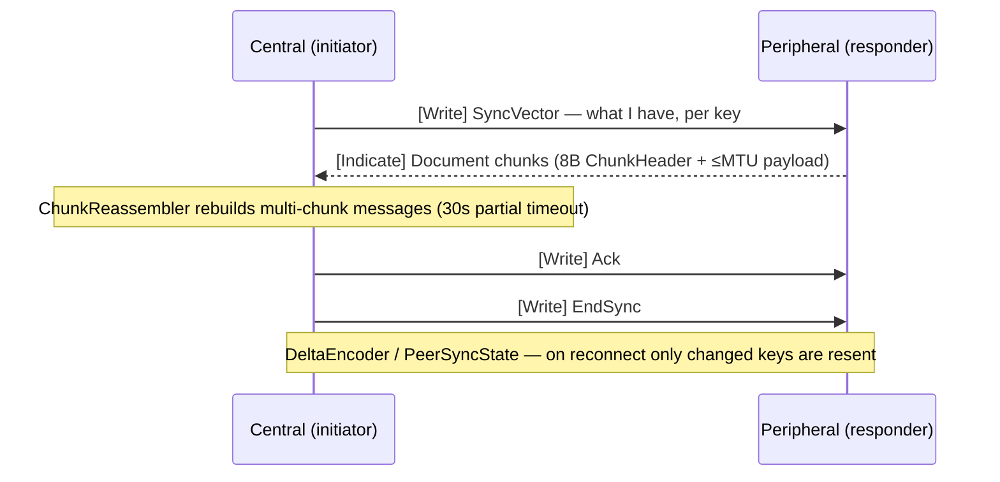

# Module 4 — The Edge: `peat-btle` & `peat-lite`

**Goal:** understand how PEAT reaches the *smallest* and *most disconnected* devices — phones and
watches with no network, and microcontrollers with 256 KB of RAM and no operating system. Two
crates: [`peat-btle/`](../peat-btle/) (Bluetooth LE mesh) and [`peat-lite/`](../peat-lite/)
(`no_std` CRDT primitives + a tiny wire protocol).

> **Mental model:** these are the two ends of "any device joins." `peat-btle` is a *transport*
> (it moves bytes over Bluetooth when there's no WiFi/cell/satellite). `peat-lite` is a
> *data-format + primitives* library tiny enough to run on bare metal. They are independent of
> `peat-protocol`; `peat-mesh` pulls them in optionally.

---

# Part A — `peat-btle` (BLE mesh transport)

When there's no infrastructure at all, the Bluetooth radio in every phone, watch, and MCU becomes
the network. An Android phone running ATAK, a WearOS watch, and an ESP32 sensor can discover each
other and sync state over BLE. The design obsession is **battery**: traditional BLE-mesh SDKs burn
20%+ radio duty cycle and give a watch 3–4 hours; `peat-btle` targets <5% and **18–24 hours** via
batched sync windows and a hierarchical "leaf nodes don't scan" topology.

## 4A.1 Entry points

[`peat-btle/src/lib.rs`](../peat-btle/src/lib.rs) re-exports the developer-facing types:

- **`BluetoothLETransport`** — the pluggable transport (implements the ADR-032 transport contract):
  discovery, GATT exchange, PHY selection, connection lifecycle.
- **`BleConfig`** — configuration (`peat_lite()`, `with_power_profile()`, `with_phy()`).
- **`PeatMesh`** — the mesh-management facade (ADR-039): peers, doc sync, observer notifications.
- **`MeshManager`** — topology, parent selection, failover.
- **`NodeId`** — a 32-bit node id, often derived from the BLE MAC (`NodeId::from_mac_address`).
- **`BleAdapter` trait** — the platform abstraction every OS implements.

## 4A.2 The cross-platform trick

The whole crate is organized around one trait so the *same* mesh logic runs on six platforms.
([`peat-btle/src/platform/mod.rs`](../peat-btle/src/platform/mod.rs).)

```rust
pub trait BleAdapter: Send + Sync {
    async fn init(&mut self, config: &BleConfig) -> Result<()>;
    async fn scan(&self, config: &DiscoveryConfig, cb: DiscoveryCallback) -> Result<()>;
    async fn advertise(&self, beacon: &PeatBeacon) -> Result<AdvertisementHandle>;
    async fn connect(&self, peer: &DiscoveredDevice) -> Result<Arc<dyn BleConnection>>;
    // ...
}
```

Each platform provides an implementation, selected by a Cargo feature:

| Platform | Adapter | Backed by | Status |
|----------|---------|-----------|--------|
| Linux | `BluerAdapter` | `bluer` (BlueZ D-Bus) | Stable |
| macOS / iOS | `CoreBluetoothAdapter` | `objc2` + CoreBluetooth | macOS stable, iOS beta |
| Android | `AndroidAdapter` (+ Kotlin) | UniFFI bindings → Kotlin BLE APIs | Stable (incl. WearOS) |
| Windows | `WinRtBleAdapter` | `windows` crate (WinRT) | Planned |
| ESP32 | (esp32 module) | `esp-idf` / NimBLE | Stable |
| (tests) | `MockBleAdapter` | in-memory | — |

Android is **Kotlin-first**: the real BLE calls live in
`peat-btle/android/.../PeatBtle.kt`, with UniFFI generating the Rust↔Kotlin glue. The Rust
`AndroidAdapter` is a thin shim.

## 4A.3 Sync over GATT (delta-based, chunked)

BLE has tiny MTUs (often 23 bytes → ~15 bytes of payload per write), so documents are **chunked**
and reassembled. ([`peat-btle/src/sync/protocol.rs`](../peat-btle/src/sync/protocol.rs).)

- `ChunkHeader` — 8 bytes: `[message_id:4][chunk_index:2][total_chunks:2]`.
- `ChunkReassembler::process(chunk, now)` — accumulates chunks per `message_id`, returns the full
  message once all arrive (30 s partial-timeout).
- `SyncMessageType` — `SyncVector`, `Document`, `Ack`, `EndSync`, `Error`.
- `DeltaEncoder` / `PeerSyncState` (`sync/delta.rs`) — tracks *per-peer* what we've already sent
  (`needs_send(key, timestamp)`), so on reconnect only **changed** keys go over the air.

The sync protocol over GATT, as a sequence:



Discovery uses a compact **16-byte `PeatBeacon`** (`discovery/beacon.rs`) that fits in a legacy
31-byte BLE advertisement: version, capability flags, node id, hierarchy level, a 24-bit geohash
(~600 m), battery %, and a sequence number for dedup.

Security is two-phase (`security/`): Phase 1 is a mesh-wide AES-256-GCM key derived via HKDF from a
shared secret; Phase 2 adds per-peer end-to-end encryption via ECDH-P256, with Ed25519 device
identities. All FIPS-approved primitives (ADR-060).

---

# Part B — `peat-lite` (`no_std` embedded primitives)

Not every device runs Linux. A WearTAK watch, an ESP32 sensor, a LoRa node — kilobytes of memory,
no allocator. `peat-lite` provides bounded, `no_std` CRDT primitives and a wire protocol that fits
in 256 KB. Its *only* dependency is `heapless` (fixed-capacity collections — no heap).

## 4B.1 The primitives (and their memory budgets)

| Type | File | Memory | Purpose |
|------|------|--------|---------|
| `NodeId` | `node_id.rs` | 4 bytes | 32-bit node id (`#[repr(transparent)]` over `u32`) |
| `CannedMessage` | `canned.rs` | 1 byte | Predefined tactical message codes (see below) |
| `CannedMessageEvent` | `canned.rs` | ~24 bytes | Message + src/target NodeId + timestamp + seq |
| `LwwRegister<T>` | `lww.rs` | `sizeof(T)` + 12 | Last-writer-wins register |
| `GCounter<const N=32>` | `counter.rs` | ~260 bytes | Grow-only counter, one slot per node |
| `PnCounter<const N=32>` | `counter.rs` | ~520 bytes | Increment/decrement counter (two GCounters) |

**Canned messages** are how a 1-byte payload says something tactically meaningful — no strings, no
allocation:

```
0x00–0x0F  Acknowledgments   ACK, WILCO, NEGATIVE, SAY AGAIN
0x10–0x1F  Status            CHECK IN, MOVING, HOLDING, ON STATION, RTB, COMPLETE
0x20–0x2F  Alerts            EMERGENCY, ALERT, ALL CLEAR, CONTACT, UNDER FIRE
0x30–0x3F  Requests          NEED EXTRACT, NEED SUPPORT, MEDIC, RESUPPLY
0xF0–0xFF  Reserved          custom / application-specific
```

The CRDT merge rules are worth reading because they're so small they're *obvious*:

```rust
// peat-lite/src/lww.rs  — last-writer-wins with a deterministic tiebreaker
fn should_accept(&self, timestamp: u64, node_id: NodeId) -> bool {
    timestamp > self.timestamp
        || (timestamp == self.timestamp && node_id.as_u32() > self.node_id.as_u32())
}

// peat-lite/src/counter.rs — grow-only counter merge = max per node (idempotent, commutative)
pub fn merge(&mut self, other: &Self) {
    for (&node, &other_count) in other.counts.iter() {
        let e = self.counts.entry(node).or_insert(0);
        *e = (*e).max(other_count);
    }
}
```

This is the *essence* of a CRDT in ten lines: order doesn't matter, duplicates don't matter, and
every node that sees the same set of updates ends up in the same state.

## 4B.2 The wire protocol (ADR-035)

Under `peat-lite/src/protocol/`. A fixed **16-byte header** then a payload:

```
0–3   MAGIC "PEAT" (0x50 0x45 0x41 0x54)
4     PROTOCOL_VERSION (0x01)
5     MESSAGE_TYPE
6–7   flags (u16 LE)        // FLAG_HAS_TTL = 0x0001 appends a 4-byte TTL
8–11  node_id (u32 LE)
12–15 seq_num (u32 LE)
```

`MessageType` (`protocol/message_type.rs`): `Announce 0x01`, `Heartbeat 0x02`, `Data 0x03`,
`Query 0x04`, `Ack 0x05`, `Leave 0x06`, `Document 0x07`, and OTA types `0x10–0x16`.
`CrdtType` (`protocol/crdt_type.rs`): `LwwRegister 0x01`, `GCounter 0x02`, `PnCounter 0x03`,
`OrSet 0x04`. Default UDP gossip port is 5555; max packet 512 bytes.

The `Document 0x07` type carries a *universal* `peat_mesh::Document` envelope (collection + id +
length-prefixed body) — opaque to peat-lite, interpreted by peat-mesh. That's what lets a tiny
sensor participate in the same document model as a server.

## 4B.3 Beyond the core crate

- `android-ffi/` — UniFFI wrappers so the `no_std` types are usable from Kotlin.
- `firmware/` — a separate `no_std` crate for ESP32 / bare-metal (built with the xtensa toolchain,
  excluded from the main workspace). Contains the CRDT impls, protocol, a gossip state machine, and
  OTA. Targets like M5Stack Core2 and ESP32-S3.
- `fuzz/` — fuzz targets for the decoders (e.g. `fuzz_decode_header`,
  `fuzz_canned_message_ack_decode`) — a good reminder that wire parsers must survive hostile input.

---

# Part C — How the three connect

> **The modularity model — the thing to remember about these two crates.** `peat-lite` and
> `peat-btle` are **standalone leaf crates**: the rest of PEAT depends on *them*, but they depend on
> *nothing* in PEAT (beyond `peat-btle`'s one *optional* link to `peat-lite`). Dependencies flow
> **down into** the edge crates, never out of them. This is deliberate, and it's the framing the
> team captured during the IWRP proposal work: keeping these as pure leaves means they can be reused
> on their own (a `no_std` CRDT library; a cross-platform BLE-mesh transport) by projects that don't
> want the whole PEAT stack, can be versioned/published independently, can compile for
> microcontrollers and mobile targets the heavier core can't reach — and it's what keeps the
> dependency graph acyclic (§1.6, and ADR-059 below). Every PEAT arrow into `peat-btle`/`peat-lite`
> is marked `optional = true`.

- `peat-btle` → `peat-lite`: optional, behind the **`peat-lite-frame`** feature. It lets BLE carry
  the universal `Document` envelope (`MessageType::Document = 0x07`) so BLE and the rest of the mesh
  share one document format.
- `peat-mesh` → both: optional. `peat-mesh`'s `bluetooth` feature integrates `peat-btle`; its
  `lite-bridge` feature bridges `peat-lite` UDP devices.
- **No cycles.** `peat-btle` deliberately does **not** depend on `peat-mesh` anymore. Originally it
  did (a `mesh-translator` feature), which created a `peat-btle ↔ peat-mesh` dependency cycle that
  broke cargo's resolver. **ADR-059 Amendment 4** deleted that back-edge: `peat-btle` now exposes
  codec primitives (behind `translator-codec`), and `peat-mesh` implements the `Translator` *on top
  of* them. This is the same saga referenced by the long comment block in `peat/Cargo.toml`
  (Module 1, §1.5).

```
peat-mesh ──(bluetooth feat)──▶ peat-btle ──(peat-lite-frame feat)──▶ peat-lite
     └──────(lite-bridge feat)───────────────────────────────────────────▲
                                                                          │
                                          (peat-lite has NO peat deps — it's the leaf)
```

---

## Try it

1. Open `peat-lite/src/lww.rs` and `counter.rs`. They're short — read every line. This is CRDTs
   without the jargon.
2. Look at `peat-lite/src/protocol/header.rs` and hand-decode the 16-byte header of a `Heartbeat`.
3. In `peat-btle/src/sync/protocol.rs`, follow `ChunkReassembler::process` for a 3-chunk message.
4. Browse `peat-btle/examples/` (e.g. `linux_scanner`, `canned_message_sync`, `peer_e2ee`) and
   `peat-btle/docs/platforms/ESP32.md`.

## Checkpoint

- Why does `peat-lite` forbid the heap, and what does it use instead of `Vec`/`HashMap`?
- Explain in one sentence why the GCounter merge is safe to apply in any order, twice.
- What does the `peat-lite-frame` feature enable, and why does it matter for a unified mesh?
- What dependency cycle was broken, and how?
- Why is battery life a *first-class* design constraint for `peat-btle`?

---

Next: [Module 5 — The Control Plane: `peat-gateway` »](05-peat-gateway.md)
