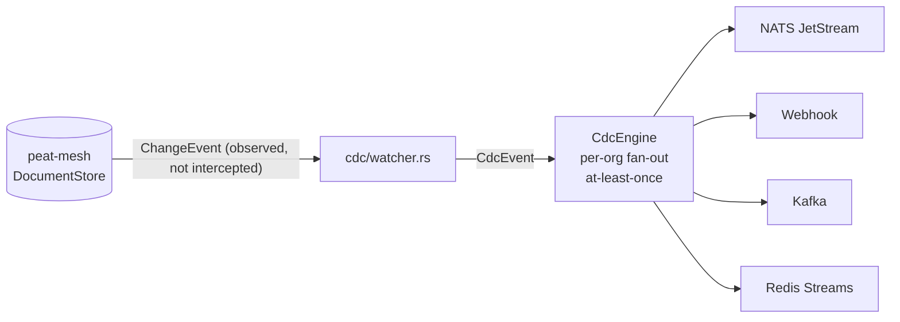

# Module 5 — The Control Plane: `peat-gateway`

**Goal:** understand the *enterprise* side of PEAT. The mesh itself is decentralized and needs no
server — but organizations that deploy meshes need to onboard teams, federate with their identity
providers, manage cryptographic material, and stream mesh events into their analytics. That's the
gateway. Repo path: [`peat-gateway/`](../peat-gateway/).

> **Mental model:** the gateway **observes and manages**; it does **not** sit in the data path.
> CRDT sync, blob transfer, and peer routing all stay in `peat-mesh`. The gateway is optional —
> meshes work without it — and it adds enterprise manageability on top.

## 5.1 What it is and isn't

**Provides:** multi-org tenancy (isolated trust boundaries), envelope encryption of authority keys,
Change Data Capture (CDC) streaming, identity federation (Keycloak / Okta / Azure AD / CAC-SAML),
an admin REST API + Prometheus metrics, a SvelteKit admin UI, and Zarf/UDS packaging for air-gapped
deployment.

**Is not:** a mesh node (doesn't replace `peat-mesh-node`), a data plane (never touches CRDT sync),
or required.

## 5.2 Entry point

[`peat-gateway/src/main.rs`](../peat-gateway/src/main.rs) is a `clap` CLI with three subcommands:

- `Serve` (default) — start the Axum HTTP API server.
- `MigrateKeys { dry_run }` — encrypt all plaintext genesis records with the configured KEK.
- `LoadTest { … }` — built-in load tester (behind the `loadtest` feature).

The `serve` path is the spine of the whole service:

```rust
// peat-gateway/src/main.rs  (serve)
let tenant_mgr  = tenant::TenantManager::new(config).await?;
let cdc_engine  = cdc::CdcEngine::new(config, tenant_mgr.clone()).await?;
let app = api::router(tenant_mgr, cdc_engine, config.ui_dir.as_deref(), config.admin_token.clone());
// ... serve `app` (an axum::Router) on config.bind_addr
```

Three things get built and wired: the **tenant manager**, the **CDC engine**, and the **router**
(which also serves the UI and the admin token gate).

## 5.3 The module map

[`src/lib.rs`](../peat-gateway/src/lib.rs) declares: `api`, `cdc`, `cli`, `config`, `crypto`,
`ingress` (NATS feature), `storage`, `tenant`.

### Tenant manager — `src/tenant/`

The core domain. `TenantManager` (`manager.rs`) owns orgs, formations, peers, tokens, and the
certificate authority. Its models (`models.rs`) are the vocabulary of the control plane:
`Organization`, `FormationConfig`, `EnrollmentPolicy`, `OrgQuotas`, `EnrollmentToken`,
`CdcSinkConfig`, `PeerInfo`, `IdpConfig`, `MeshTier`, `PolicyRule`, `EnrollmentDecision`.

The crucial link to the mesh: the gateway creates and stores a **`MeshGenesis`** per formation —
this is `peat-mesh`'s root-of-trust authority object.

```rust
// peat-gateway/src/tenant/manager.rs
use peat_mesh::security::{MembershipPolicy, MeshGenesis};
// create a formation's genesis (authority keys + membership policy):
let genesis = MeshGenesis::create(&app_id, mesh_policy);
// later, load + decrypt it on demand:
pub async fn load_genesis(&self, org_id: &str, app_id: &str) -> Result<MeshGenesis> { /* ... */ }
```

And the gateway maps its own enterprise roles onto mesh trust tiers (`models.rs`):

```rust
pub fn to_mesh_tier(self) -> peat_mesh::security::MeshTier {
    match self {
        MeshTier::Authority      => peat_mesh::security::MeshTier::Enterprise,
        MeshTier::Infrastructure => peat_mesh::security::MeshTier::Regional,
        MeshTier::Endpoint       => peat_mesh::security::MeshTier::Tactical,
    }
}
```

That's the whole "control plane manages the mesh without being in it" idea in code: it manufactures
the trust material (`MeshGenesis`, membership certs with tiers) that autonomous nodes then use on
their own.

### Envelope encryption — `src/crypto/`

The `MeshGenesis` authority keys are sensitive, so they're encrypted at rest using **envelope
encryption**: a per-record Data Encryption Key (DEK) is wrapped by a Key Encryption Key (KEK). The
KEK lives behind a pluggable trait ([`src/crypto/mod.rs`](../peat-gateway/src/crypto/mod.rs)):

```rust
#[async_trait]
pub trait KeyProvider: Send + Sync {
    async fn wrap_dek(&self, dek: &[u8]) -> Result<Vec<u8>>;
    async fn unwrap_dek(&self, wrapped: &[u8]) -> Result<Vec<u8>>;
}
```

Four backends implement it:

| Backend | File | Use |
|---------|------|-----|
| `PlaintextProvider` | `crypto/mod.rs` | dev/test only — no wrapping |
| `LocalKeyProvider` | `crypto/local.rs` | local AES-256-GCM KEK |
| `AwsKmsProvider` | `crypto/kms.rs` | AWS KMS (`aws-sdk-kms`, feature-gated) |
| `VaultTransitProvider` | `crypto/vault.rs` | HashiCorp Vault Transit |

This is a textbook example of the strategy pattern: the rest of the code calls
`wrap_dek`/`unwrap_dek` and never knows whether the key lives in memory, AWS, or Vault.

### CDC engine — `src/cdc/`

Change Data Capture streams CRDT document mutations out to enterprise systems for analytics, audit,
and integration — *without* the gateway being in the sync path. It works by **watching** the mesh's
document store:

```rust
// peat-gateway/src/cdc/watcher.rs
use peat_mesh::sync::traits::DocumentStore;
use peat_mesh::sync::types::{ChangeEvent, Query};
```

The `CdcEngine` (`engine.rs`) fans `CdcEvent`s out per-org to configured **sinks**:

- `nats_sink.rs` — NATS JetStream (feature `nats`).
- `webhook_sink.rs` — HTTP webhooks.
- Kafka and Redis Streams are supported via optional deps (`rdkafka`, feature-gated).

Delivery is at-least-once. Sink type is chosen per-org via `CdcSinkType` / `CdcSinkConfig`.



### AuthZ / identity — `src/api/auth.rs`, `src/api/identity.rs`, `IdpConfig`

Enrollment can delegate to an enterprise IdP (OIDC via `openidconnect`, or SAML/CAC) instead of
static bootstrap tokens. Per-org `IdpConfig` holds the provider settings; a `PolicyRule` /
`EnrollmentPolicy` engine maps an authenticated identity's role onto a `MeshTier`, producing an
`EnrollmentDecision`. The admin API is gated by `PEAT_ADMIN_TOKEN` (and warns loudly if unset).

### Storage — `src/storage/`

A `StorageBackend` trait with two implementations: `postgres.rs` (via `sqlx`, feature-gated) and
`redb_backend.rs` (embedded, the default for single-node / air-gapped). Orgs, formations, peers,
tokens, certs, and the *encrypted* genesis records all persist here.

### Admin API — `src/api/`

Axum routers, composed in `api/mod.rs`:

```
/orgs            → orgs, tokens, sinks, identity, formations  (admin-token gated)
/orgs/.../enroll → enrollment (delegates to IdP / token policy)
/healthz, /metrics → health + Prometheus
/_/              → the SvelteKit admin UI (served as static files)
```

## 5.4 The admin UI — `ui/`

A **SvelteKit** app (`ui/src/routes/`, `ui/src/lib/`) served at `/_/`. It manages orgs and
formations (`routes/orgs/[org_id]`), CDC sink config, enrollment tokens, IdP provider config, a peer
health dashboard, a document browser, and the certificate lifecycle. Built with `vite`; uses
`pnpm`.

## 5.5 Packaging — `chart/` & `bundle/`

- `chart/peat-gateway/` — a **Helm** chart for Kubernetes deployment.
- `bundle/uds-bundle.yaml` — a **Zarf/UDS** bundle for air-gapped, SSO-integrated, network-policied
  deployment (Defense Unicorns' UDS platform). This is how the gateway ships into disconnected
  enterprise environments.

## 5.6 How it depends on the mesh

`peat-gateway/Cargo.toml` pins `peat-mesh` to an exact version (an `=`-pin) with features
`["automerge-backend", "broker"]`. It uses `peat-mesh` purely as a **library**: `MeshGenesis` /
`MembershipPolicy` / `MeshTier` for trust material, and `DocumentStore` / `ChangeEvent` for CDC
watching. It never starts a mesh node or routes mesh data.

---

## Try it

1. Read `src/main.rs` `serve()` — see the three objects (tenant mgr, CDC engine, router) come together.
2. Open `src/crypto/mod.rs` and the four `crypto/*.rs` files. Notice every backend implements the
   *same* two-method trait.
3. Follow a CDC event: `cdc/watcher.rs` (watch) → `cdc/engine.rs` (`publish`) → a sink
   (`nats_sink.rs` / `webhook_sink.rs`).
4. Skim `chart/peat-gateway/` and `bundle/uds-bundle.yaml` to see how it deploys.

## Checkpoint

- Why is the gateway *not* in the data path, and why does that matter for a partition-tolerant mesh?
- What is `MeshGenesis` and which crate defines it?
- Explain envelope encryption (DEK vs KEK) and name the four `KeyProvider` backends.
- How does CDC observe changes without being part of sync?
- What maps an enterprise role to a mesh trust tier?

---

Next: [Module 6 — Cross-Cutting Data Flows »](06-data-flows.md)
