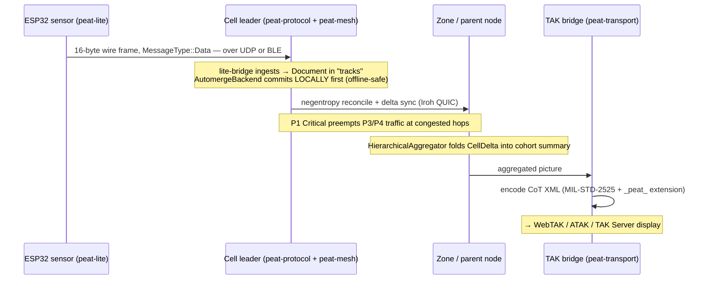

# Module 6 — Cross-Cutting Data Flows

**Goal:** tie the repos together by tracing real data end-to-end. Concepts only stick once you can
follow a byte across crate boundaries. Three traces: a track update, cell formation + leader
election, and hierarchical aggregation with a command coming back down.

---

## 6.1 Trace A — a sensor's track update reaches the command post

**Scenario:** an ESP32 sensor detects a moving target and reports its position. That report has to
climb from a `no_std` microcontroller all the way to a WebTAK screen at a command post — across
three different crates and at least two transports.

```
ESP32 sensor                 Cell leader (phone)            Zone / command post
 (peat-lite)                 (peat-protocol + peat-mesh)    (peat-transport TAK bridge)
     │                              │                               │
 1. Position encoded as a           │                               │
    peat-lite wire frame            │                               │
    (16B header + payload,          │                               │
     MessageType::Data/Document)    │                               │
     │  ── UDP / BLE ──▶            │                               │
     │                         2. lite-bridge / btle ingests        │
     │                            into the DocumentStore            │
     │                            (collection "tracks")             │
     │                              │                               │
     │                         3. AutomergeBackend wraps it as a    │
     │                            CRDT doc; observers fire          │
     │                              │                               │
     │                         4. peat-mesh syncs the doc to the    │
     │                            parent via Iroh/QUIC              │
     │                            (negentropy → delta) ──────────▶  │
     │                              │                          5. parent aggregates
     │                              │                             cell summaries
     │                              │                             (hierarchy/state_aggregation)
     │                              │                               │
     │                              │                          6. peat-transport TAK bridge
     │                              │                             encodes CoT XML (MIL-STD-2525)
     │                              │                             → WebTAK / TAK Server
```

The same trace as a sequence diagram:



**Where each step lives:**

1. `peat-lite/src/protocol/` — encode the frame. Tiny, `no_std`, no allocation.
2. `peat-mesh/src/transport/lite.rs` (or `btle.rs`) — bridge the embedded frame into the mesh; it
   becomes a `peat_mesh::Document` in the `"tracks"` collection.
3. `peat-protocol/src/sync/automerge.rs` → `AutomergeBackend` — the doc becomes a CRDT; observer
   channels notify subscribers (your `store.subscribe("tracks")` loop from Module 2).
4. `peat-mesh/src/storage/automerge_sync.rs` — negentropy reconciliation then delta sync over the
   QUIC connection to the parent; persisted to redb.
5. `peat-protocol/src/hierarchy/` — the parent's `HierarchicalAggregator` folds this cell's summary
   in with its siblings; the `HierarchicalRouter` ensures the update went *up through the leader*,
   not sideways across cells.
6. `peat-transport/src/tak/` + `peat-protocol/src/cot/` — the aggregated picture is encoded as
   Cursor-on-Target XML and pushed to a TAK Server / WebTAK. (Runnable:
   [`peat/examples/peat-tak-bridge/`](../peat/examples/peat-tak-bridge/).)

**QoS along the way:** a contact report is P1 Critical, so at every bandwidth-constrained hop
(`peat-protocol/src/qos/`, `peat-mesh/src/qos/`) it preempts P3 health-status and P4 telemetry
traffic. If the link is congested, the *low*-priority data is what gets dropped or delayed.

**If the network partitions** between steps 4 and 5, nothing breaks: the CRDT update is already
committed locally, and it syncs whenever the link returns. That's the offline-first guarantee.

---

## 6.2 Trace B — discovery to a formed, led cell

**Scenario:** three freshly powered-on nodes (a phone, a sensor, a vehicle) become a coordinated
cell with an elected leader.

```
Phase 1: DISCOVERY
  peat-mesh/discovery (mDNS / static / k8s)  →  PeerFound events  →  PeerConnector dials (Iroh QUIC)
  peat-protocol/discovery                    →  domain-level candidate pool (60s timeout)
        │
        ▼
Phase 2: CELL FORMATION   (peat-protocol/cell/)
  a. Each node broadcasts CellMessage::CapabilityAnnounce on the CellMessageBus
     (reliable: sequence numbers, ACK/NACK, up to 3 retransmits)
  b. Every node computes LeadershipScore for every candidate — the SAME formula everywhere:
        0.30*compute + 0.25*comms + 0.20*sensors + 0.15*power + 0.10*reliability
     Highest score wins; ties broken lexicographically by node id  →  all converge on one leader
  c. CapabilityAggregator + CompositionEngine fold member capabilities together and detect
     EMERGENT ones (camera + comms + range → ISR)
  d. CellCoordinator::check_formation_complete():  min size? leader? roles assigned?
        capability coverage? readiness ≥ 0.7?  human approval if mission-critical?
        │  all true ▼
        FormationStatus::Ready  →  transition to Phase 3
```

**Why no vote-counting round?** Because election is *deterministic*: scoring depends only on
advertised capabilities, which every node receives via the reliable message bus. Given the same
inputs, every node independently computes the same winner. No consensus protocol, no leader-election
chatter — which is exactly what you want on a flaky network. (`peat-protocol/src/cell/leader_election.rs`.)

*Full code-level walkthrough of every step here — the formation handshake, the election state
machine and its defaults, role assignment, and partition-merge — is [Module 2·5](02b-formation-and-leadership.md).*

---

## 6.3 Trace C — aggregation up, command down

**Scenario:** a zone commander needs the big picture, then issues an order to a specific cell.

```
UP  (state → summaries)
  node capability/track  →  CellDelta  →  HierarchicalAggregator.update_cell_summary()
        →  SummaryStorage (CRDT-backed)  →  cohort aggregator rolls N cells into a CohortSummary
        →  federation / coalition tiers  →  command post sees full-spectrum picture
        (every hop respects FlowController bandwidth permits per RoutingLevel)

DOWN (command → execution)
  CommandCoordinator.issue_command(HierarchicalCommand { target_scope, policy })
        →  CommandRouter.resolve_targets()  (expands to cell leaders / nodes)
        →  cell leader receives, forwards to its members
        →  members execute, return ACKs  →  TimeoutManager tracks them (retry/escalate on timeout)
        →  if two zones command the same resource: ConflictResolver applies a policy
           (LastWriteWins / HighestAttributeWins)  →  loser gets a ConflictResult explanation
```

**The invariant that makes this scale:** the `HierarchicalRouter` only ever allows same-cell
messaging or leader-mediated up/down routing — never cross-cell direct messages
(`peat-protocol/src/hierarchy/router.rs`). So adding more nodes doesn't create more direct links;
traffic is always funneled through the tier structure. The protocol that works for 5 nodes works
for 1,000+ for exactly this reason.

Files: `peat-protocol/src/hierarchy/` (aggregation, routing, flow control),
`peat-protocol/src/command/` (coordinator, routing, conflict_resolver, timeout_manager),
`peat-protocol/src/event/` (priority queues for the events that ride these paths).

---

## 6.4 The whole picture on one page

```
            ┌───────────────────────────── peat-gateway (optional control plane) ──────────────┐
            │  mints MeshGenesis / membership certs · streams CDC out · federates identity      │
            └───────────────▲───────────────────────────────────────────────┬──────────────────┘
            manages (not in data path)                                       observes changes
                            │                                                 │
   ┌────────────────────────┴─────────────────── MESH (data plane) ──────────┴──────────────────┐
   │                                                                                             │
   │   peat-protocol  (cells · hierarchy · QoS · security policy · CoT)   ← you program here      │
   │        │ re-exports                                                                          │
   │        ├── peat-schema   (Protobuf wire types)                                               │
   │        └── peat-mesh     (Iroh/QUIC transport · Automerge sync · discovery · topology)        │
   │                  │ optional features                                                          │
   │                  ├── peat-btle   (BLE mesh: phones, watches, MCUs)                            │
   │                  └── peat-lite   (no_std CRDT primitives for 256KB devices)                   │
   │                                                                                             │
   │   peat-transport (HTTP + TAK/CoT bridge)      peat-ffi (Kotlin/Swift bindings)               │
   └─────────────────────────────────────────────────────────────────────────────────────────────┘
```

## Checkpoint (synthesis)

- In Trace A, name the crate responsible for each of the six steps.
- Why does a partition between steps 4 and 5 not lose the track?
- In Trace B, give the one-sentence reason leader election needs no consensus round.
- In Trace C, what single routing rule lets the topology scale to thousands of nodes?
- Where does the gateway touch these flows, and where does it deliberately *not*?

---

Next: [Module 7 — Repo Map, Gaps & Links to Add »](07-repo-links-and-gaps.md)
